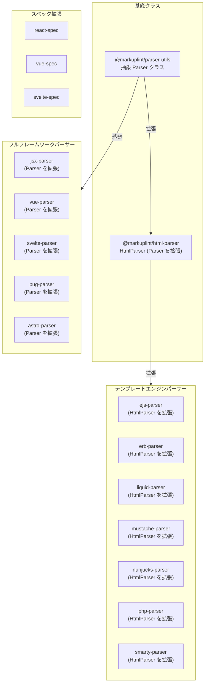
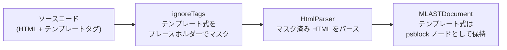
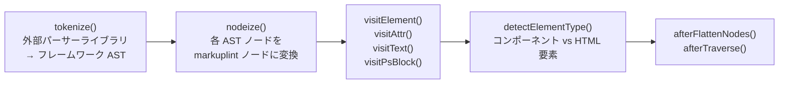
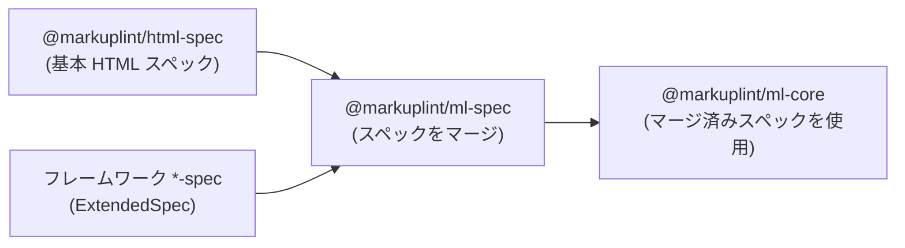

# フレームワークパーサー & スペック アーキテクチャ

## 概要

markuplint は2つの拡張メカニズムを通じて様々なフレームワークをサポートしています:

1. **パーサー** -- フレームワーク固有の構文を markuplint の統一 AST（`MLASTDocument`）に変換
2. **スペック** -- `ExtendedSpec` を通じて HTML 仕様をフレームワーク固有の属性・要素定義で拡張

このドキュメントでは、すべてのフレームワークパーサーおよびスペックパッケージに共通する横断的な設計判断、パターン、関係性について説明します。

## パーサー階層



## 設計判断: スペックのみ vs パーサー+スペック

フレームワークサポートを追加する際の最初の判断は、カスタムパーサーが必要かどうかです:

| シナリオ | アプローチ | 例 |
| --- | --- | --- |
| フレームワークが追加属性付きの有効な HTML を使用 | スペックのみ | React（JSX 属性は jsx-parser が処理するが、`key` のような React 固有属性は react-spec で定義） |
| フレームワークが HTML にテンプレート式を埋め込む | テンプレートパーサー（HtmlParser を拡張） | EJS, ERB, Liquid, Mustache, Nunjucks, PHP, Smarty |
| フレームワークが html-parser で処理できない独自構文を持つ | フルパーサー（Parser を拡張） | JSX, Vue SFC, Svelte, Pug, Astro |

### 主要な原則

- **可能な限り html-parser を再利用**: テンプレートエンジンパーサーは `HtmlParser` を拡張し、HTML パース前にテンプレート式をマスクする `ignoreTags` の設定のみを行う
- **外部パーサーライブラリを使用**: フルパーサーはトークン化を確立された外部パーサー（例: `vue-eslint-parser`、`svelte/compiler`）に委譲し、パース処理をゼロから実装しない
- **Parser vs HtmlParser の継承**: テンプレートパーサーは基盤構文が埋め込み式付きの HTML であるため `HtmlParser` を拡張する。フルパーサーはドキュメント構造全体が標準 HTML と異なるため `Parser` を直接拡張する

## テンプレートエンジンパーサーパターン

7つのテンプレートエンジンパーサーはすべて同一のアーキテクチャを共有しています:



### 動作の仕組み

1. パーサーがコンストラクタで `ignoreTags` パターンを定義 -- 各パターンは `type`、開始デリミタ `start`、終了デリミタ `end` を指定
2. HTML パース前に、`HtmlParser` 基底クラスがソースをスキャンし、マッチした領域をプレースホルダー文字で置換
3. `parse5` がマスク済み HTML を標準 HTML として処理
4. マスクされた領域は最終 AST で `psblock`（プリプロセッサ固有ブロック）ノードとして復元

### 実装

各テンプレートパーサーは3つのソースファイルのみで構成されます:

| ファイル | 用途 |
| --- | --- |
| `src/index.ts` | パーサーインスタンスを再エクスポート |
| `src/parser.ts` | `HtmlParser` を拡張し、`ignoreTags` を設定 |
| `src/index.spec.ts` | パーサー統合テスト |

外部パースライブラリは不要 -- `ignoreTags` が唯一の設定です。

## フルフレームワークパーサーパターン

フルパーサーは抽象 `Parser` クラスを直接拡張し、完全なパースパイプラインを実装します:



### オーバーライドメソッド

| メソッド | 用途 |
| --- | --- |
| `tokenize()` | 外部パーサーライブラリを呼び出してフレームワーク固有の AST を生成 |
| `nodeize()` | 各フレームワーク AST ノードを markuplint ノード型（element, text, comment, psblock）にマッピング |
| `visitElement()` | フレームワーク固有のオプション（名前空間、フラグメント）で要素ノードを処理 |
| `visitAttr()` | フレームワーク固有の属性構文（ディレクティブ、ショートハンド、動的値）を処理 |
| `visitChildren()` | 子ノードをトラバース |
| `detectElementType()` | コンポーネントとネイティブ HTML 要素を区別（通常は命名規則による） |
| `afterFlattenNodes()` | 後処理オプション（ホワイトスペースの公開、無効ノードの公開） |

## スペック拡張パターン

スペックパッケージは基本 HTML 仕様を拡張する `ExtendedSpec` オブジェクトをエクスポートします:

```typescript
const spec: ExtendedSpec = {
  def: {
    '#globalAttrs': {
      '#extends': {
        // すべての要素で利用可能な属性
        key: { type: 'Any' },
        ref: { type: 'Any' },
      },
    },
  },
  specs: [
    {
      name: 'element-name',
      attributes: {
        // 要素固有の属性オーバーライド
        value: { type: 'Any' },
      },
      // または動的プロパティを許可
      possibleToAddProperties: true,
    },
  ],
};
```

### 統合フロー



## パーサーとスペックの対応関係

| パーサー | スペック | 外部ライブラリ | 継承元 |
| --- | --- | --- | --- |
| `@markuplint/jsx-parser` | `@markuplint/react-spec` | `@typescript-eslint/typescript-estree` | Parser |
| `@markuplint/vue-parser` | `@markuplint/vue-spec` | `vue-eslint-parser` | Parser |
| `@markuplint/svelte-parser` | `@markuplint/svelte-spec` | `svelte/compiler` | Parser |
| `@markuplint/astro-parser` | -- | `astro-eslint-parser` | Parser |
| `@markuplint/pug-parser` | -- | `pug-lexer` + `pug-parser` | Parser |
| `@markuplint/ejs-parser` | -- | --（ignoreTags のみ） | HtmlParser |
| `@markuplint/erb-parser` | -- | --（ignoreTags のみ） | HtmlParser |
| `@markuplint/liquid-parser` | -- | --（ignoreTags のみ） | HtmlParser |
| `@markuplint/mustache-parser` | -- | --（ignoreTags のみ） | HtmlParser |
| `@markuplint/nunjucks-parser` | -- | --（ignoreTags のみ） | HtmlParser |
| `@markuplint/php-parser` | -- | --（ignoreTags のみ） | HtmlParser |
| `@markuplint/smarty-parser` | -- | --（ignoreTags のみ） | HtmlParser |

## バージョン互換性

外部パーサーライブラリは各フレームワークの複数メジャーバージョンをサポートするよう選定されています:

- **vue-eslint-parser** -- Vue 2 と Vue 3 の両方のテンプレート構文をサポート
- **svelte/compiler** -- Svelte 5 機能（Snippets, RenderTag, SvelteBoundary）のために `{ modern: true }` モードを使用
- **@typescript-eslint/typescript-estree** -- TypeScript と JSX の複数バージョンをサポート
- **astro-eslint-parser** -- Astro コンポーネントのパースに `@astrojs/compiler` に依存
- **pug-lexer + pug-parser** -- Pug 3 の構文に対応

フレームワークパーサーは特定のフレームワークバージョンに固定せず、頻繁な更新なしでバージョン範囲にわたって動作できるようにしています。
