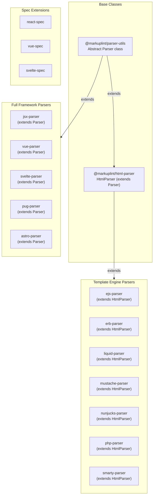
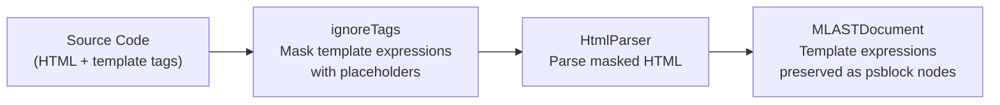
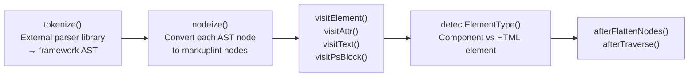
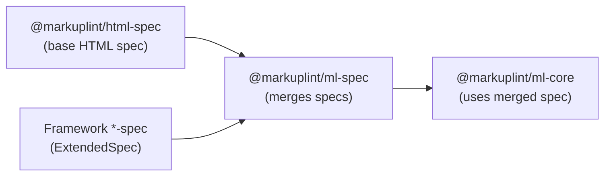

# Framework Parsers & Specs Architecture

## Overview

markuplint supports various frameworks through two extension mechanisms:

1. **Parsers** -- Convert framework-specific syntax into markuplint's unified AST (`MLASTDocument`)
2. **Specs** -- Extend the HTML specification with framework-specific attributes and element definitions via `ExtendedSpec`

This document describes the cross-cutting design decisions, patterns, and relationships across all framework parser and spec packages.

## Parser Hierarchy



## Design Decision: Spec-Only vs Parser+Spec

When adding framework support, the first question is whether a custom parser is needed:

| Scenario | Approach | Example |
| --- | --- | --- |
| Framework uses valid HTML with extra attributes | Spec only | React (JSX attributes are handled by jsx-parser, but React-specific attributes like `key` are defined in react-spec) |
| Framework embeds template expressions in HTML | Template Parser (extends HtmlParser) | EJS, ERB, Liquid, Mustache, Nunjucks, PHP, Smarty |
| Framework has its own syntax that html-parser cannot handle | Full Parser (extends Parser) | JSX, Vue SFC, Svelte, Pug, Astro |

### Key Principles

- **Reuse html-parser when possible**: Template engine parsers extend `HtmlParser` and only configure `ignoreTags` to mask template expressions before HTML parsing
- **Use external parser libraries**: Full parsers delegate tokenization to established external parsers (e.g., `vue-eslint-parser`, `svelte/compiler`) rather than implementing parsing from scratch
- **Parser vs HtmlParser inheritance**: Template parsers extend `HtmlParser` because the underlying syntax is HTML with embedded expressions. Full parsers extend `Parser` directly because the entire document structure differs from standard HTML

## Template Engine Parser Pattern

All 7 template engine parsers share an identical architecture:



### How It Works

1. The parser defines `ignoreTags` patterns in the constructor -- each pattern specifies a `type`, `start` delimiter, and `end` delimiter
2. Before HTML parsing, the `HtmlParser` base class scans the source and replaces matched regions with placeholder characters
3. `parse5` processes the masked HTML as standard HTML
4. The masked regions are restored in the final AST as `psblock` (preprocessor-specific block) nodes

### Implementation

Each template parser consists of only 3 source files:

| File | Purpose |
| --- | --- |
| `src/index.ts` | Re-exports the parser instance |
| `src/parser.ts` | Extends `HtmlParser`, configures `ignoreTags` |
| `src/index.spec.ts` | Parser integration tests |

No external parsing library is needed -- `ignoreTags` is the only configuration.

## Full Framework Parser Pattern

Full parsers extend the abstract `Parser` class directly and implement the complete parsing pipeline:



### Override Methods

| Method | Purpose |
| --- | --- |
| `tokenize()` | Invokes the external parser library to produce a framework-specific AST |
| `nodeize()` | Maps each framework AST node to markuplint node types (element, text, comment, psblock) |
| `visitElement()` | Processes element nodes with framework-specific options (namespace, fragments) |
| `visitAttr()` | Handles framework-specific attribute syntax (directives, shorthands, dynamic values) |
| `visitChildren()` | Traverses child nodes |
| `detectElementType()` | Distinguishes components from native HTML elements (typically by naming convention) |
| `afterFlattenNodes()` | Post-processing options (expose whitespace, expose invalid nodes) |

## Spec Extension Pattern

Spec packages export an `ExtendedSpec` object that extends the base HTML specification:

```typescript
const spec: ExtendedSpec = {
  def: {
    '#globalAttrs': {
      '#extends': {
        // Attributes available on every element
        key: { type: 'Any' },
        ref: { type: 'Any' },
      },
    },
  },
  specs: [
    {
      name: 'element-name',
      attributes: {
        // Element-specific attribute overrides
        value: { type: 'Any' },
      },
      // Or allow dynamic properties
      possibleToAddProperties: true,
    },
  ],
};
```

### Integration Flow



## Parser-Spec Pairs

| Parser | Spec | External Library | Inheritance |
| --- | --- | --- | --- |
| `@markuplint/jsx-parser` | `@markuplint/react-spec` | `@typescript-eslint/typescript-estree` | Parser |
| `@markuplint/vue-parser` | `@markuplint/vue-spec` | `vue-eslint-parser` | Parser |
| `@markuplint/svelte-parser` | `@markuplint/svelte-spec` | `svelte/compiler` | Parser |
| `@markuplint/astro-parser` | -- | `astro-eslint-parser` | Parser |
| `@markuplint/pug-parser` | -- | `pug-lexer` + `pug-parser` | Parser |
| `@markuplint/ejs-parser` | -- | -- (ignoreTags only) | HtmlParser |
| `@markuplint/erb-parser` | -- | -- (ignoreTags only) | HtmlParser |
| `@markuplint/liquid-parser` | -- | -- (ignoreTags only) | HtmlParser |
| `@markuplint/mustache-parser` | -- | -- (ignoreTags only) | HtmlParser |
| `@markuplint/nunjucks-parser` | -- | -- (ignoreTags only) | HtmlParser |
| `@markuplint/php-parser` | -- | -- (ignoreTags only) | HtmlParser |
| `@markuplint/smarty-parser` | -- | -- (ignoreTags only) | HtmlParser |

## Version Compatibility

External parser libraries are chosen to support multiple major versions of each framework:

- **vue-eslint-parser** -- Supports both Vue 2 and Vue 3 template syntax
- **svelte/compiler** -- Uses `{ modern: true }` mode for Svelte 5 features (Snippets, RenderTag, SvelteBoundary)
- **@typescript-eslint/typescript-estree** -- Supports multiple TypeScript and JSX versions
- **astro-eslint-parser** -- Depends on `@astrojs/compiler` for Astro component parsing
- **pug-lexer + pug-parser** -- Supports Pug 3 syntax

Framework parsers avoid pinning to specific framework versions, allowing them to work across version ranges without frequent updates.
