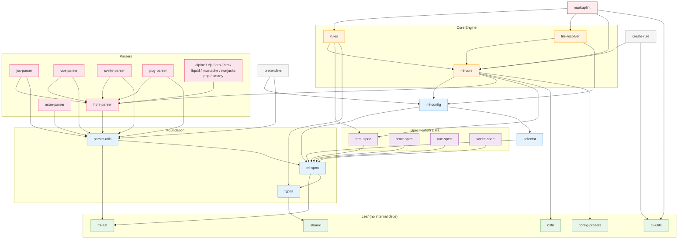

# Markuplint Architecture: Package Design Strategy

## Executive Summary

This document outlines the design strategy and role division between core packages in the Markuplint ecosystem, focusing on the relationship between `@markuplint/ml-spec` and `@markuplint/html-spec`.

**Key Principle**: The current architecture follows a foundation-data separation pattern that optimizes for performance, maintainability, and W3C specification compliance.

## Architecture Analysis Results

### Current Package Ecosystem

The Markuplint ecosystem consists of **19 packages** that depend on `@markuplint/ml-spec` and **9 packages** that depend on `@markuplint/html-spec`, forming a healthy dependency graph with no circular dependencies.

### Package Dependency Tree

The following diagram shows the internal runtime dependency graph. Arrows point from a package to its dependency. Dev-only dependencies and transitive edges are omitted for clarity.



All package names omit the `@markuplint/` prefix. The 9 simple template-engine parsers (alpine, ejs, erb, htmx, liquid, mustache, nunjucks, php, smarty) are grouped into a single node since they all share the same dependency pattern: `html-parser` only.

**Legend**:

- **Green (Leaf)**: No internal dependencies -- `shared`, `ml-ast`, `i18n`, `cli-utils`, `config-presets`
- **Blue (Foundation)**: Type system, spec algorithms, parsing -- `types`, `ml-spec`, `parser-utils`, `ml-config`, `selector`
- **Orange (Core)**: Lint engine, rules, file resolution -- `ml-core`, `rules`, `file-resolver`
- **Purple (Spec Data)**: HTML/framework specification datasets -- `html-spec`, `react-spec`, `vue-spec`, `svelte-spec`
- **Pink (Parsers)**: `html-parser` + 14 framework parsers
- **Red (Main)**: Entry point -- `markuplint`
- **Gray (Tools)**: Development utilities -- `pretenders`, `create-rule`

### Package Role Definition

#### @markuplint/ml-spec (Foundation Package)

**Primary Role**: Foundation layer providing type definitions, W3C specification algorithms, and unified API

**Contains**:

- **Type Definitions**: `ElementSpec`, `ExtendedSpec`, `MLMLSpec`, ARIA types
- **W3C Specification Algorithms** (95% of algorithmic code):
  - HTML Standard algorithms: Focusable Area Algorithm, Interactive Content classification
  - WAI-ARIA 1.1/1.2/1.3 algorithms: Accessible Name Computation, Role Computation, Accessibility Tree computation
  - Integration algorithms: Specification resolution, schema merging
- **JSON Schemas**: Structure definitions for element specifications
- **Runtime Utilities**: Spec resolution, attribute validation, content model checking

**Dependencies**:

- `@markuplint/ml-ast`: AST type definitions
- `@markuplint/types`: Attribute value types
- (No external dependencies for AccName — algorithm is implemented in-house)

**Update Triggers**:

- W3C specification changes (HTML Standard, WAI-ARIA updates)
- Browser behavior changes requiring algorithm adjustments
- Type system improvements

#### @markuplint/html-spec (Data Package)

**Primary Role**: Canonical HTML Living Standard dataset provider

**Contains**:

- **Generated Data**: Single consolidated `index.json` (48K+ lines)
- **Source Files**: Individual element specifications (`src/spec.*.jsonc`)
- **Build Process**: Automated generation with external data fetching

**Data Structure**:

```typescript
{
  cites: Cites;           // Reference citations
  def: SpecDefs;         // Global definitions (#globalAttrs, #aria, #contentModels)
  specs: ElementSpec[];  // Individual element specifications
}
```

**Data Sources**:

- Individual JSON specifications for each HTML element
- MDN Web Docs (descriptions, compatibility, attribute metadata)
- W3C ARIA specifications (role mappings, property definitions)
- HTML Living Standard (obsolete elements, semantic definitions)

**Update Triggers**:

- HTML Living Standard updates
- WAI-ARIA specification updates
- MDN documentation changes
- New HTML elements or attributes

### Generation Workflow

The data generation process is a key architectural decision that influences the overall design:

```
Individual JSONC Sources (spec.table.jsonc, spec.tr.jsonc...)
    ↓ generator/ scripts processing
External Data Enrichment (MDN, W3C ARIA, HTML Standard)
    ↓ Consolidation and validation
Single JSON Output (index.json, 48K+ lines)
    ↓ Package distribution
@markuplint/html-spec consumption by dependent packages
```

**Key Characteristics**:

- **Single Source of Truth**: All HTML specification data consolidated into one file
- **External Data Integration**: Automatic enrichment from authoritative sources
- **Performance Optimization**: Single import reduces module resolution overhead
- **Consistency Guarantee**: All elements follow the same enrichment process

### Specification-Algorithm Coupling

A critical finding of this analysis is the tight coupling between specifications and algorithms, which validates the current unified approach:

**HTML Standard Embedded Algorithms**:

- Focusable Area Algorithm
- Interactive Content classification
- Content Model validation

**WAI-ARIA Embedded Algorithms**:

- Accessible Name Computation (W3C AccName 1.2)
- Role Computation with conflict resolution
- Accessibility Tree inclusion/exclusion
- Allowed Accessibility Child Roles validation

**Implementation Fidelity**:

- Direct references to W3C specification sections
- Implementation of exact specification procedures
- Compliance with official test cases
- Tracking of specification issues and updates

This tight coupling means that separating "static schemas" from "computing algorithms" would be artificial and counterproductive, as the algorithms are integral parts of the specifications themselves.

## Architectural Decisions

### Decision 1: Maintain Current Package Structure

**Rationale**: The analysis revealed that the current structure is well-optimized:

- Clear separation of concerns (foundation vs. data)
- Efficient dependency graph
- Optimal performance characteristics
- Strong specification compliance

**Alternative Considered**: Package separation or consolidation
**Rejected Because**:

- Would create artificial boundaries between coupled specifications and algorithms
- No runtime benefits due to generation workflow
- High migration cost (19 dependent packages)
- Loss of performance optimizations

### Decision 2: Unified Specification Approach

**Rationale**: HTML Standard and WAI-ARIA specifications are inherently coupled:

- HTML elements have implicit ARIA roles
- ARIA algorithms reference HTML semantics
- Specification updates often affect both domains
- Test cases validate cross-specification behavior

**Alternative Considered**: Pure ARIA vs HTML-ARIA separation
**Rejected Because**:

- Final output is consolidated regardless of internal structure
- Specification coupling makes separation artificial
- Current generation workflow is optimized
- No significant maintenance or performance benefits

### Decision 3: Documentation-First Approach

**Rationale**: Clear documentation is essential for maintaining architectural understanding

- Current architecture serves its purpose well
- Dependency relationships are healthy
- Performance is optimized
- Specification compliance is strong

**Solution**: Comprehensive documentation of:

- Package responsibilities and boundaries
- API usage patterns
- Development workflows
- Architectural reasoning

## Framework Extension Pattern

The architecture supports framework-specific extensions through the `ExtendedSpec` pattern:

```typescript
// Framework-specific packages extend HTML specifications
import type { ExtendedSpec } from '@markuplint/ml-spec';

const vueSpec: ExtendedSpec = {
  def: {
    '#globalAttrs': {
      '#extends': {
        'v-model': { type: 'NoEmptyAny' },
        ':class': { type: 'Any' },
      },
    },
  },
  specs: [
    /* Vue-specific element overrides */
  ],
};
```

This pattern allows:

- Framework-specific attribute validation
- Custom element definitions
- Context-aware rule application
- Maintainable extension points

## Performance Characteristics

The current architecture is optimized for performance:

**Single JSON Consolidation**:

- Reduces module resolution overhead
- Enables efficient caching
- Minimizes network requests
- Supports tree-shaking at the data level

**Algorithm Co-location**:

- Reduces inter-package communication
- Enables optimization across specification boundaries
- Supports comprehensive testing
- Maintains specification integrity

## Maintenance Strategy

### Package Maintenance Responsibilities

**@markuplint/ml-spec**:

- W3C specification algorithm updates
- Type definition improvements
- API surface management
- Cross-specification integration

**@markuplint/html-spec**:

- HTML element specification updates
- External data source integration
- Generation workflow maintenance
- Data consistency validation

### Update Coordination

The packages require coordinated updates when:

- W3C specifications change affecting both data and algorithms
- New HTML elements require both data definitions and algorithmic support
- ARIA specification updates affect role computation and element mappings

## Current Architecture Implementation

### Directory Structure Organization

The ml-spec package follows a taxonomy-based organization that improves code clarity and maintainability:

**Current Structure**:

- **ARIA algorithms**: `algorithm/aria/` - W3C ARIA specification implementations
- **HTML algorithms**: `algorithm/html/` - HTML Living Standard algorithms
- **Utilities**: `utils/` - Shared utilities and helper functions

**Benefits**:

- Clear separation of specification domains
- Logical grouping by functionality
- Enhanced maintainability and discoverability
- Preserved performance characteristics

### Generation Workflow

**Current Generation Process**:

```
@markuplint/types (gen/types.ts) → types.schema.json
  ↓
@markuplint/ml-spec (gen/gen.ts) → schemas/*.json
  ↓
@markuplint/html-spec (build.ts + generator/) → index.json
  ↓
Framework-specific specs (extend base data)
```

**Responsibility Boundaries**:

- **@markuplint/html-spec/generator/**: External data fetching and enrichment (MDN scraping, W3C ARIA downloading)
- **@markuplint/ml-spec/gen/**: Schema structure generation and type-to-schema transformations
- **Package build scripts**: Local data processing and file operations

## Architectural Principles

### Design Guidelines

1. **Specification Fidelity**: Maintain close alignment with W3C specifications
2. **Performance Optimization**: Prioritize runtime efficiency and development workflow speed
3. **Clear Boundaries**: Separate foundation logic from data while preserving necessary coupling
4. **Extensibility**: Support framework-specific extensions through well-defined patterns

### Non-Recommended Changes

1. **Package Separation**: Would create artificial boundaries and reduce performance
2. **Algorithm Extraction to Separate Package**: Would break specification coupling and reduce maintainability
3. **Data Structure Changes**: Would require extensive migration with minimal benefits
4. **Generator Responsibility Mixing**: Moving schema operations to the generator would muddy architectural boundaries

## Package Operation Order

When performing cross-package operations (commits, builds, releases, migrations, refactoring), always process packages **from leaves to root** -- that is, dependencies before dependents. This ensures each package is in a consistent state before anything that relies on it is modified.

### Canonical Order

Process packages in the following tier order. Within the same tier, order does not matter.

| Tier                  | Packages                                                                                                                                                                                                                    | Rationale                                           |
| --------------------- | --------------------------------------------------------------------------------------------------------------------------------------------------------------------------------------------------------------------------- | --------------------------------------------------- |
| 0 (Leaf)              | `shared`, `ml-ast`, `i18n`, `cli-utils`, `config-presets`                                                                                                                                                                   | No internal dependencies                            |
| 1 (Types)             | `types`                                                                                                                                                                                                                     | Depends only on `shared`                            |
| 2 (Spec Foundation)   | `ml-spec`                                                                                                                                                                                                                   | Depends on `ml-ast`, `types`                        |
| 3 (Spec Data)         | `html-spec`, `react-spec`, `vue-spec`, `svelte-spec`, `alpine-spec`, `htmx-spec`                                                                                                                                            | Depend on `ml-spec`                                 |
| 4 (Parser Foundation) | `parser-utils`, `selector`                                                                                                                                                                                                  | Depend on `ml-spec`                                 |
| 5 (Config)            | `ml-config`                                                                                                                                                                                                                 | Depends on `ml-spec`, `selector`                    |
| 6 (HTML Parser)       | `html-parser`                                                                                                                                                                                                               | Depends on `parser-utils`                           |
| 7 (Framework Parsers) | `jsx-parser`, `vue-parser`, `svelte-parser`, `pug-parser`, `astro-parser`, `alpine-parser`, `ejs-parser`, `erb-parser`, `liquid-parser`, `mustache-parser`, `nunjucks-parser`, `php-parser`, `smarty-parser` | Depend on `html-parser` and/or `parser-utils`       |
| 8 (Core)              | `ml-core`                                                                                                                                                                                                                   | Depends on many foundation + parser packages        |
| 9 (Rules & Resolver)  | `rules`, `file-resolver`                                                                                                                                                                                                    | Depend on `ml-core`                                 |
| 10 (Tools)            | `pretenders`, `create-rule`                                                                                                                                                                                                 | Depend on core/config packages                      |
| 11 (Main)             | `markuplint`                                                                                                                                                                                                                | Top-level entry point; depends on almost everything |

### When to Apply This Order

- **Committing**: Stage and commit packages from lower tiers first
- **Building**: Build leaf packages before dependents (`yarn build` with lerna handles this automatically, but manual builds should follow this order)
- **Releasing**: Publish lower-tier packages first to avoid broken peer dependencies
- **Refactoring type signatures**: Change the source of truth (lower tier) first, then propagate to consumers (higher tiers)
- **Adding JSDoc / documentation**: Process in any order (no runtime impact), but commit in this order
- **Reviewing PRs**: Check lower-tier changes first to understand the foundation before reviewing consumers

### Exceptions

- **Test-only changes**: No ordering constraint since tests do not affect other packages at build time
- **Documentation-only changes** (README, comments): Can be batched freely, but prefer committing per-package
- **Single-package changes**: Skip ordering -- just commit the affected package
- **Root config changes** (`.oxlintrc.json`, `.oxfmtrc.json`, `tsconfig.base.json`, CI): Commit independently before any package changes

## Conclusion

The current architecture represents a mature, well-optimized design that effectively balances:

- **Specification Compliance**: Faithful implementation of W3C standards
- **Performance**: Optimized for runtime efficiency and development workflow
- **Maintainability**: Clear separation of concerns with appropriate coupling
- **Extensibility**: Framework extension points and customization capabilities

The primary recommendation is to enhance documentation and clarify package roles rather than make architectural changes. This approach maintains architectural clarity while preserving the significant architectural investments and optimizations already in place.

## References

- [HTML Living Standard](https://html.spec.whatwg.org/)
- [WAI-ARIA 1.1](https://www.w3.org/TR/wai-aria-1.1/)
- [WAI-ARIA 1.2](https://www.w3.org/TR/wai-aria-1.2/)
- [WAI-ARIA 1.3](https://w3c.github.io/aria/)
- [Accessible Name and Description Computation 1.2](https://www.w3.org/TR/accname-1.2/)
