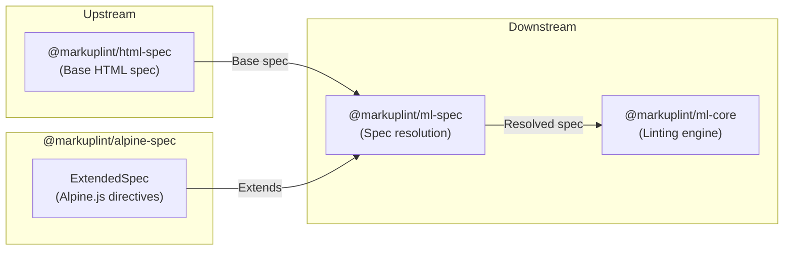

# @markuplint/alpine-spec

## Overview

`@markuplint/alpine-spec` is a spec extension package that provides Alpine.js-specific directive definitions for markuplint. It exports a single `ExtendedSpec` object that registers global Alpine.js directives (such as `x-data`, `x-show`, `x-bind`, `x-on`, `x-model`, `x-text`, `x-html`, `x-ref`, `x-if`, `x-for`, `x-transition`, `x-effect`, `x-ignore`, `x-cloak`, etc.) available on every HTML element.

This package contains no parsing logic -- it is purely a data definition consumed by `@markuplint/ml-spec` to extend the base HTML specification with Alpine.js-specific attributes.

## ExtendedSpec Content

### Global Attributes

Global attributes are defined under `def['#globalAttrs']['#extends']` and are available on every HTML element:

#### Component Initialization

| Attribute | Type  | Description                                                      |
| --------- | ----- | ---------------------------------------------------------------- |
| `x-data`  | `Any` | Declares an Alpine component and defines its reactive data scope |
| `x-init`  | `Any` | Hooks into the initialization phase                              |

#### Rendering & Visibility

| Attribute | Type  | Description                                         |
| --------- | ----- | --------------------------------------------------- |
| `x-show`  | `Any` | Toggles element visibility via CSS display property |
| `x-if`    | `Any` | Conditionally adds/removes elements from the DOM    |
| `x-for`   | `Any` | Renders elements by iterating over collections      |

#### Content Binding

| Attribute | Type  | Description                         |
| --------- | ----- | ----------------------------------- |
| `x-text`  | `Any` | Sets the textContent of the element |
| `x-html`  | `Any` | Sets the innerHTML of the element   |

#### Data Binding

| Attribute     | Type  | Description                                                 |
| ------------- | ----- | ----------------------------------------------------------- |
| `x-model`     | `Any` | Creates two-way data binding between form elements and data |
| `x-modelable` | `Any` | Exposes a property as the target of an outer x-model        |

#### Reactivity

| Attribute  | Type  | Description                                                    |
| ---------- | ----- | -------------------------------------------------------------- |
| `x-effect` | `Any` | Reactively re-evaluates an expression when dependencies change |

#### DOM Manipulation & References

| Attribute    | Type  | Description                                       |
| ------------ | ----- | ------------------------------------------------- |
| `x-ref`      | `Any` | Marks an element for access via $refs             |
| `x-teleport` | `Any` | Moves DOM content to another location in the page |
| `x-id`       | `Any` | Declares a scope for auto-generated IDs via $id() |

#### Transitions

| Attribute                  | Type  | Description                           |
| -------------------------- | ----- | ------------------------------------- |
| `x-transition`             | `Any` | Applies CSS transition animations     |
| `x-transition:enter`       | `Any` | CSS classes for the entering phase    |
| `x-transition:enter-start` | `Any` | CSS classes before element insertion  |
| `x-transition:enter-end`   | `Any` | CSS classes after element insertion   |
| `x-transition:leave`       | `Any` | CSS classes for the leaving phase     |
| `x-transition:leave-start` | `Any` | CSS classes when leaving is triggered |
| `x-transition:leave-end`   | `Any` | CSS classes after leave starts        |

#### Processing Control

| Attribute  | Type      | Description                                                         |
| ---------- | --------- | ------------------------------------------------------------------- |
| `x-ignore` | `Boolean` | Prevents Alpine from initializing the element                       |
| `x-cloak`  | `Boolean` | Hidden until Alpine initializes; prevents flash of unstyled content |

## Directory Structure

```
src/
└── index.ts    — Exports the ExtendedSpec object with Alpine.js-specific attributes
```

## Key Source Files

| File       | Purpose                                                             |
| ---------- | ------------------------------------------------------------------- |
| `index.ts` | Defines and exports the `ExtendedSpec` object as the default export |

## Integration Points



### Upstream

- **`@markuplint/ml-spec`** -- Provides the `ExtendedSpec` type that this package implements

### Downstream

- **`@markuplint/ml-spec`** -- Consumes the `ExtendedSpec` object to merge Alpine.js-specific attributes into the resolved specification
- **`@markuplint/ml-core`** -- Uses the resolved spec (including Alpine.js extensions) during linting

## Documentation Map

- [Maintenance Guide](docs/maintenance.md) -- Commands, recipes, and ExtendedSpec type reference
