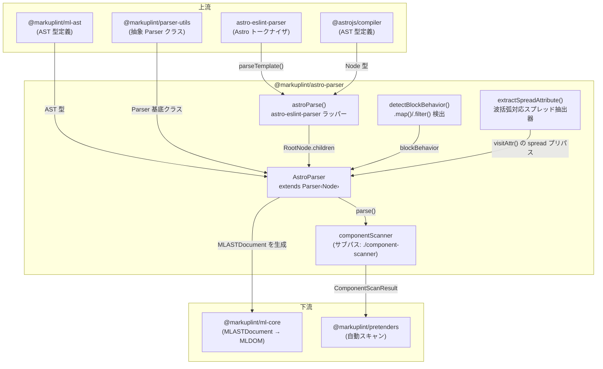

# @markuplint/astro-parser

## 概要

`@markuplint/astro-parser` は markuplint における Astro コンポーネントファイル（`.astro`）のパーサーです。`astro-eslint-parser`（`@astrojs/compiler` をラップ）を使用して Astro ソースコードをトークン化し、その結果の AST を markuplint の統一 AST 形式（`MLASTDocument`）に変換します。フロントマターブロック（`---...---`）、式コンテナ（`{expression}`）、テンプレートディレクティブ（例: `class:list`、`set:html`、`client:load`）、ショートハンド属性（`{prop}`）など、Astro 固有の構文を処理します。

## ディレクトリ構成

```
src/
├── index.ts                    — parser インスタンスを再エクスポート
├── parser.ts                   — Parser<Node> を拡張する AstroParser クラス
├── astro-parser.ts             — astro-eslint-parser ラッパーと型の再エクスポート
├── detect-block-behavior.ts    — .map()/.filter() のブロック動作検出
├── component-scanner.ts        — pretenders 自動スキャン用コンポーネントスキャナー（サブパスエクスポート）
├── parser.spec.ts              — AstroParser 統合テスト
├── astro-parser.spec.ts        — astro-eslint-parser ラッパーテスト
└── component-scanner.spec.ts   — コンポーネントスキャナーのテスト
```

## アーキテクチャ図



## AstroParser クラス

### 継承関係

```
Parser<Node>  (@markuplint/parser-utils)
    └── AstroParser  (このパッケージ)
```

### コンストラクタ

コンストラクタは Astro 固有のオプションで基底 `Parser` を設定します:

| オプション             | 値           | 用途                                                                         |
| ---------------------- | ------------ | ---------------------------------------------------------------------------- |
| `endTagType`           | `'xml'`      | Astro は XML のように明示的な閉じタグを使用                                  |
| `selfCloseType`        | `'html+xml'` | HTML void 要素と XML スタイルの自己閉じ（`<Component />`）の両方を受け入れる |
| `tagNameCaseSensitive` | `true`       | コンポーネント（`<MyComp>`）と HTML 要素（`<div>`）を区別                    |

### オーバーライドメソッド

| メソッド              | 用途                                                                                                                           |
| --------------------- | ------------------------------------------------------------------------------------------------------------------------------ |
| `tokenize()`          | `astroParse()` を呼び出して Astro AST を取得し、`{ ast: rootNode.children, isFragment: true }` を返す                          |
| `nodeize()`           | Astro AST ノードを markuplint ノードに変換。ノードタイプ（frontmatter, doctype, text, comment, element, expression）で振り分け |
| `afterFlattenNodes()` | `{ exposeInvalidNode: false }` で親に委譲                                                                                      |
| `visitElement()`      | `parseCodeFragment()` で `namelessFragment: true` として生の HTML フラグメントをパースし、終了タグ処理で親に委譲               |
| `visitChildren()`     | 親に委譲した後、予期しない兄弟ノードが残っていないことをアサート                                                               |
| `visitAttr()`         | 波括弧式の値、ショートハンド属性、テンプレートディレクティブを処理                                                             |
| `detectElementType()` | `/^[A-Z]/` パターンでコンポーネントと HTML 要素を検出（大文字始まりの名前はコンポーネント）                                    |

## フロントマター処理

Astro コンポーネントは `---` で区切られたフロントマターブロックを含むことができます:

```astro
---
const name = "World";
---
<div>{name}</div>
```

`astro-eslint-parser` は `type: 'frontmatter'` のノードを生成します。パーサーはこれを `nodeName: 'Frontmatter'` かつ `isFragment: false` の **psblock**（疑似ブロック）に変換します。区切り文字 `---` を含むブロック全体が単一の不透明ノードとしてキャプチャされます。フロントマター内のコンテンツは HTML としてパースされません。

## 式の処理

Astro の式（`{expression}`）は Astro AST で `type: 'expression'` ノードとして表現されます。パーサーはこれらを **MustacheTag** psblock ノードに変換します。

### 単純な式

`{name}` のような単純な式は単一のテキスト子ノードを持ちます。式全体が `isFragment: true` の1つの MustacheTag psblock として出力されます。

### HTML を含むネストされた式

式が HTML 要素を含む場合（例: `{list.map(item => <li>{item}</li>)}`）、パーサーは複数のノードに分割します:

1. **開始式フラグメント**: `{list.map(item => ` — 子ノードを含む MustacheTag psblock。式が `.map()` または `.filter()` 呼び出しを含む場合（`detectBlockBehavior()` で検出）、開始フラグメントにはそれぞれ `blockBehavior: { type: 'each' }` または `{ type: 'if' }` が設定される
2. **ネストされた HTML 要素**: `<li>{item}</li>` — 通常の要素として処理
3. **終了式フラグメント**: `)}` — `isFragment: false` の別の MustacheTag psblock。開始フラグメントに `blockBehavior` がある場合、終了フラグメントには `blockBehavior: { type: 'end' }` が設定される

分割ロジックは式の children 配列で `firstChild !== lastChild` かどうかを確認します。該当する場合:

- 式の開始から最初の子の終了までの領域が開始フラグメントになる
- 最後の子の開始から式の終了までの領域が終了フラグメントになる
- 間の子は開始フラグメントの psblock 内で通常通り訪問される

## 属性処理

### クォートセット

`visitAttr()` メソッドは式の値用に波括弧を含むカスタムクォートセットを使用します:

| 開始 | 終了 | タイプ   |
| ---- | ---- | -------- |
| `"`  | `"`  | `string` |
| `'`  | `'`  | `string` |
| `{`  | `}`  | `script` |

### ショートハンド属性

属性トークンが `{` で始まる場合（例: `{prop}`）、パーサーは `startState: AttrState.BeforeValue` を設定し、名前のパースをスキップして直接値の抽出に進みます。結果の属性は:

- `name.raw` = `''`（空）
- `value.raw` = `prop`
- `potentialName` = `prop`（値から推論）
- `isDynamicValue` = `true`

### テンプレートディレクティブ

Astro テンプレートディレクティブは `name:modifier` 構文を使用します。パーサーは正規表現 `/^([^:]+):([^:]+)$/` でこれらを検出します:

| ディレクティブプレフィックス | `potentialName` | `isDirective` | 動作                                                  |
| ---------------------------- | --------------- | ------------- | ----------------------------------------------------- |
| `class:`                     | `'class'`       | `false`       | 標準の `class` 属性にマッピング                       |
| `client:`                    | —               | `true`        | Astro クライアントディレクティブ（load, idle 等）     |
| `server:`                    | —               | `true`        | Astro サーバーディレクティブ（defer）                 |
| `set:`                       | —               | `true`        | コンテンツディレクティブ（html, text）                |
| `is:`                        | —               | `true`        | プロパティディレクティブ（inline, raw）               |
| `define:`                    | —               | `true`        | スタイルディレクティブ（vars）                        |
| `transition:`                | —               | `true`        | View Transition ディレクティブ（animate, name）       |
| _（その他すべて）_           | —               | `true`        | キャッチオール: すべての `prefix:name` パターンに適用 |

`class:` プレフィックスは特別扱いで、`potentialName: 'class'` を取得するため、`class` 属性に対する markuplint ルールが適用されます。その他のコロン区切りプレフィックスは `default` ケースに該当し `isDirective: true` を取得します。これはフレームワーク固有であり標準 HTML 属性として検証すべきでないことを markuplint に伝えます。

### 動的な値

開始クォートが `{` の属性はすべて `isDynamicValue: true` を取得します。以下に適用されます:

- 明示的な動的値: `prop={value}`
- ショートハンド属性: `{prop}`
- ネストされた式: `style={{ a: b }}`

### スプレッド属性

スプレッド属性（`{...EXPR}`）は、基底の `Parser.visitAttr()` に委譲する **前**に、`visitAttr()` 内の波括弧対応プリパス（`src/spread-attr.ts` 参照）で抽出されます。プリパスは生のトークンを 1 文字ずつ走査し、以下を考慮します:

- 文字列リテラル（`'`、`"`）
- `${}` 補間付きテンプレートリテラル
- 行コメント（`//`）とブロックコメント（`/* */`）
- バックスラッシュでエスケープされたクォート（連続するバックスラッシュの偶奇判定）

スプレッドトークンに対しては上流の `safeScriptParser`（espree ベース）を意図的に回避します。理由:

1. espree は `{...x as any}` のような TypeScript 構文を理解せず、`as` の手前でスプレッドを誤って終端させる。
2. espree は「valid な JS プレフィックス」をスプレッドの閉じ `}` を超えて貪欲に伸ばすことがあり、例えば `{...props}>{label}` を二項 `>` 式として解釈してしまい、次の兄弟ノードを呑み込み `Invalid tag syntax` エラーになる。

両方とも v4 では [#3824](https://github.com/markuplint/markuplint/issues/3824) として、dev では [#3856](https://github.com/markuplint/markuplint/issues/3856) として追跡されています。プリパスは `{...}` 境界を純粋な波括弧マッチング問題として扱うことで両方を解消します。

**波括弧マッチャの既知の制限**:

- 波括弧を含む正規表現リテラル（例: `{...x.match(/}/) ? a : b}`）は認識しません。`/` は常に除算演算子として扱われます。遭遇した場合は変数に切り出して回避してください。

**撤去条件**: `parser-utils/script-parser.ts` が TypeScript 構文を理解し、かつスプレッドの `}` を超えて伸びないように改善された場合、本パッケージの `src/spread-attr.ts` と `visitAttr()` のプリパスは削除し、基底パーサーのパスに戻すことが可能です。

**`detectBlockBehavior()` との独立性**: スプレッドのプリパスは属性トークンに対して動作し、`detectBlockBehavior()` は `expression` AST ノードに対して走るため、両者は状態を共有しません。両者の相互作用は `parser.spec.ts` の `<Comp {...rest}>{list.map(...)}</Comp>` リグレッションテストで保証されています。

## jsx-parser との比較

| 機能                           | `astro-parser`                                  | `jsx-parser`                                      |
| ------------------------------ | ----------------------------------------------- | ------------------------------------------------- |
| **トークナイザ**               | `astro-eslint-parser`                           | TypeScript ESTree（`@typescript-eslint/parser`）  |
| **フロントマター**             | サポート（`---...---` psblock）                 | 該当なし                                          |
| **式の構文**                   | `{expr}` を MustacheTag psblock として          | `{expr}` を JSXExpressionContainer psblock として |
| **テンプレートディレクティブ** | `class:list`、`set:html` 等                     | 該当なし                                          |
| **名前空間管理**               | 基底 `Parser` に委譲                            | html-parser の `getNamespace()` に委譲            |
| **コンポーネント検出**         | `/^[A-Z]/` パターン                             | `/^[A-Z]/` パターン                               |
| **自己閉じタイプ**             | `html+xml`                                      | デフォルト（XML のみ）                            |
| **booleanish 属性**            | 未設定                                          | `booleanish: true`                                |
| **名前なしフラグメント**       | `<>...</>` サポート                             | `<>...</>` サポート                               |
| **スプレッド属性**             | `visitAttr()` 内の波括弧対応プリパス（TS 対応） | カスタム `visitSpreadAttr()` で IDL ルックアップ  |

## バージョン互換性

パースチェーンは以下に依存します:

```
astro-eslint-parser → @astrojs/compiler → Astro 構文サポート
```

`astro-eslint-parser` は `parseTemplate()` を提供するランタイム依存です。`@astrojs/compiler` は AST 型定義（`Node`、`RootNode`、`ElementNode` 等）にのみ使用される開発依存です。`astro-eslint-parser` を更新する際は、`@astrojs/compiler` 開発依存も `astro-eslint-parser` が内部で使用するバージョンに合わせて更新する必要があります。

## 主要ソースファイル

| ファイル               | 用途                                                                                                          |
| ---------------------- | ------------------------------------------------------------------------------------------------------------- |
| `parser.ts`            | `AstroParser` クラス — 全オーバーライドメソッドと名前空間スコーピング                                         |
| `astro-parser.ts`      | `astroParse()` ラッパー — `astro-eslint-parser` に委譲し、診断を `ParserError` に変換                         |
| `spread-attr.ts`       | `visitAttr()` が使用する波括弧対応スプレッド属性抽出器（上記「スプレッド属性」を参照）                        |
| `index.ts`             | 公開 API — シングルトン `parser` インスタンスを再エクスポート                                                 |
| `component-scanner.ts` | `@markuplint/pretenders` 自動スキャン用コンポーネントスキャナー（サブパスエクスポート `./component-scanner`） |

## ドキュメントマップ

- [メンテナンスガイド](docs/maintenance.ja.md) -- コマンド、レシピ、トラブルシューティング
