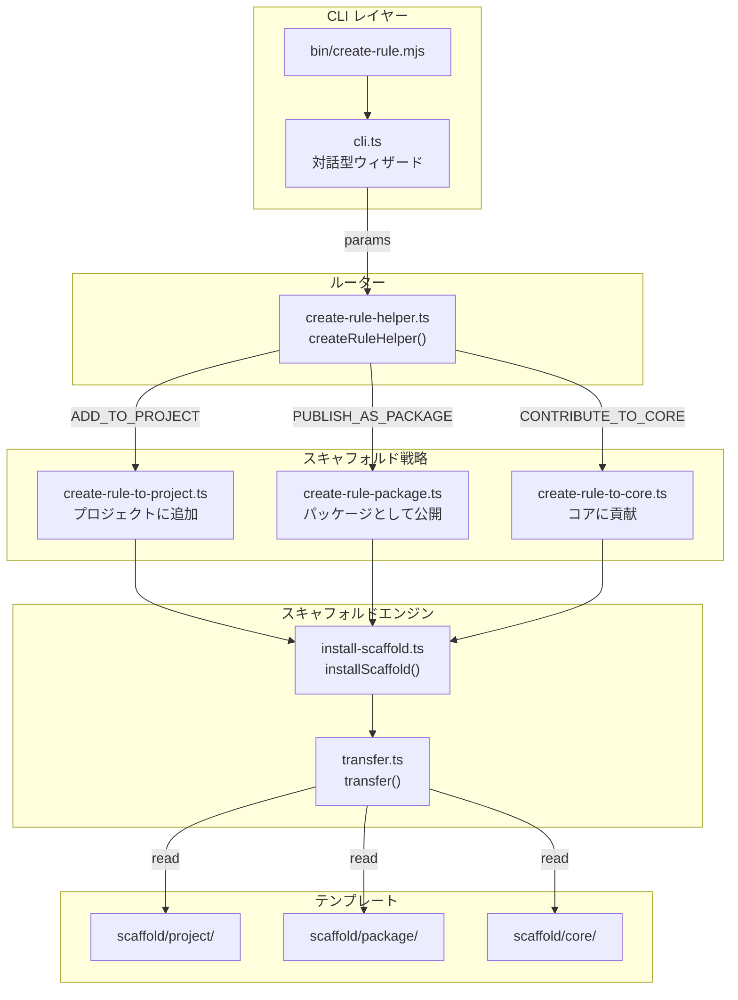

# @markuplint/create-rule

## 概要

`@markuplint/create-rule` は markuplint ルールのスキャフォルディング CLI です。対話型ウィザードでユーザーからパラメータを収集し、3つのスキャフォルド戦略のいずれかにディスパッチして、ルール開発に必要なボイラープレートファイルを生成します。また、非対話的に使用するためのプログラマティック API（`createRuleHelper()`）も公開しています。

## ディレクトリ構成

```
src/
├── cli.ts                        — 対話型 CLI ウィザード（bin のエントリポイント）
├── types.ts                      — 型定義（Purpose, Params, Result, File）
├── create-rule-helper.ts         — 目的ベースルーター（戦略にディスパッチ）
├── create-rule-to-project.ts     — 戦略: 現在のプロジェクトにルールを追加
├── create-rule-package.ts        — 戦略: スタンドアロン npm パッケージを作成
├── create-rule-to-core.ts        — 戦略: コアルールに貢献
├── install-scaffold.ts           — 低レベルスキャフォルドインストーラー
├── transfer.ts                   — テンプレートの転送、置換、トランスパイル、フォーマット
├── is-markuplint-repo.ts         — cwd が markuplint モノレポ内かを検出
├── search-core-repository.ts     — モノレポルートを上方向に検索
├── read-package-json.ts          — package.json の読み取りとパース
├── fs-exists.ts                  — ファイル存在チェックユーティリティ
├── glob.ts                       — Glob ラッパー
└── create-rule-helper-error.ts   — カスタムエラークラス
bin/
└── create-rule.mjs               — Node.js 実行ファイル（cli.ts を呼び出す）
scaffold/
├── core/                         — コアルール貢献用テンプレート
│   ├── index.ts                  — ルール実装テンプレート
│   ├── index.spec.ts             — テストテンプレート
│   ├── meta.ts                   — ルールメタデータテンプレート
│   ├── schema.json               — JSON Schema テンプレート
│   ├── README.md                 — 英語ドキュメントテンプレート
│   └── README.ja.md              — 日本語ドキュメントテンプレート
├── project/                      — プロジェクトローカルプラグイン用テンプレート
│   ├── index.ts                  — プラグインエントリポイントテンプレート
│   └── rules/
│       ├── __ruleName__.ts       — ルール実装テンプレート
│       └── __ruleName__.spec.ts  — テストテンプレート
└── package/                      — 公開パッケージ用テンプレート
    ├── README.md                 — パッケージ README テンプレート
    ├── tsconfig.json             — TypeScript 設定テンプレート
    └── src/
        ├── index.ts              — プラグインエントリポイントテンプレート
        └── rules/
            └── __ruleName__.ts   — ルール実装テンプレート
```

## アーキテクチャ図



## CLI フロー

CLI バイナリ（`bin/create-rule.mjs`）は `cli.ts` の `createRule()` を呼び出し、`@markuplint/cli-utils` を使用して対話型の質問シーケンスを実行します:

1. **目的の選択** — `ADD_TO_PROJECT`、`PUBLISH_AS_PACKAGE`、`CONTRIBUTE_TO_CORE` のいずれか（コアオプションは markuplint モノレポ内でのみ表示）
2. **プラグイン/ディレクトリ名** — ケバブケースの識別子（コアの場合はスキップ）
3. **ルール名** — ケバブケースの識別子
4. **コア固有の質問** — 説明、カテゴリ、重大度（`CONTRIBUTE_TO_CORE` の場合のみ）
5. **言語** — TypeScript または JavaScript（コアは常に TypeScript）
6. **テスト生成** — 真偽値（コアは常にテストを含む）

収集されたパラメータは `createRuleHelper()` に渡され、適切な戦略にルーティングされます。

## スキャフォルド戦略

### `createRuleToProject()`

`<cwd>/<pluginName>/` にプラグインディレクトリを作成します。ディレクトリが既に存在する場合は失敗します。`scaffold/project/` テンプレートを使用します。

### `createRulePackage()`

現在の作業ディレクトリにスキャフォルドします。ディレクトリが空である必要があります。`scaffold/package/` テンプレートを使用し、ビルド/テストスクリプトと依存関係の宣言を含む `package.json` を追加で生成します。

### `createRuleToCore()`

markuplint モノレポ内の `packages/@markuplint/rules/src/<ruleName>/` にルールディレクトリを作成します。`searchCoreRepository()` で cwd から上方向にリポジトリルートを検索します。ルールディレクトリが既に存在する場合、またはモノレポルートが見つからない場合は失敗します。TypeScript とテストが常に有効な状態で `scaffold/core/` テンプレートを使用します。

## テンプレートシステム

スキャフォルドエンジンは3つのステージでテンプレートファイルを処理します:

### 1. プレースホルダー置換

テンプレートファイルにはダブルアンダースコアのプレースホルダーが含まれ、ユーザー指定の値に置換されます:

| プレースホルダー  | 置換内容                       | 例                              |
| ----------------- | ------------------------------ | ------------------------------- |
| `__pluginName__`  | プラグイン名（そのまま）       | `my-plugin`                     |
| `__pluginName__c` | プラグイン名（キャメルケース） | `myPlugin`                      |
| `__ruleName__`    | ルール名（そのまま）           | `no-empty-alt`                  |
| `__ruleName__c`   | ルール名（キャメルケース）     | `noEmptyAlt`                    |
| `__description__` | ルールの説明（コアのみ）       | `Disallow empty alt attributes` |
| `__category__`    | ルールカテゴリ（コアのみ）     | `validation`                    |
| `__severity__`    | デフォルト重大度（コアのみ）   | `error`                         |

`__<name>__c` サフィックスはキャメルケース変換をトリガーします。ハイフンが除去され、次の文字が大文字化されます（例: `my-rule` → `myRule`）。

`__ruleName__` を含むファイル名も実際のルール名にリネームされます。

### 2. TypeScript から JavaScript へのトランスパイル（オプション）

ユーザーが JavaScript を選択した場合、`.ts` ファイルは TypeScript コンパイラ API（`tsc.transpile()`）を使用して ESNext ターゲットでトランスパイルされます。生成された `.js` ファイルでは、可読性のためにコメントと `export` キーワードの前に空行が挿入されます。

### 3. Prettier フォーマット

すべての出力ファイルは Prettier でフォーマットされます。テンプレート内の `// prettier-ignore` コメントはフォーマット前に自動的に削除されます。

## スキャフォルドテンプレート

### コアテンプレート（`scaffold/core/`）

| テンプレート    | 生成ファイル    | 内容                                                  |
| --------------- | --------------- | ----------------------------------------------------- |
| `index.ts`      | `index.ts`      | Element/Attr ウォーカーを使った `createRule()` ルール |
| `index.spec.ts` | `index.spec.ts` | markuplint の `mlRuleTest()` を使ったテスト           |
| `meta.ts`       | `meta.ts`       | ルールメタデータ（カテゴリ）                          |
| `schema.json`   | `schema.json`   | ルール値/オプションの JSON Schema                     |
| `README.md`     | `README.md`     | 例付き英語ドキュメント                                |
| `README.ja.md`  | `README.ja.md`  | 例付き日本語ドキュメント                              |

### プロジェクトテンプレート（`scaffold/project/`）

| テンプレート                 | 生成ファイル               | 内容                                        |
| ---------------------------- | -------------------------- | ------------------------------------------- |
| `index.ts`                   | `index.ts`                 | `createPlugin()` を使ったプラグインエントリ |
| `rules/__ruleName__.ts`      | `rules/<ruleName>.ts`      | コメントチェックの例を含むルール            |
| `rules/__ruleName__.spec.ts` | `rules/<ruleName>.spec.ts` | 期待される違反アサーション付きテスト        |

### パッケージテンプレート（`scaffold/package/`）

| テンプレート                | 生成ファイル              | 内容                                        |
| --------------------------- | ------------------------- | ------------------------------------------- |
| `README.md`                 | `README.md`               | インストール/設定付きパッケージドキュメント |
| `tsconfig.json`             | `tsconfig.json`           | TypeScript 設定                             |
| `src/index.ts`              | `src/index.ts`            | `createPlugin()` を使ったプラグインエントリ |
| `src/rules/__ruleName__.ts` | `src/rules/<ruleName>.ts` | コメントチェックの例を含むルール            |

加えて、`installScaffold()` は適切なスクリプトと依存関係を含む `package.json` をプログラム的に（テンプレートからではなく）生成します。

## 主要ソースファイル

| ファイル                        | 役割                                                                          |
| ------------------------------- | ----------------------------------------------------------------------------- |
| `bin/create-rule.mjs`           | CLI 実行ファイルエントリポイント                                              |
| `src/cli.ts`                    | 対話型質問ウィザード                                                          |
| `src/types.ts`                  | 型定義（`CreateRulePurpose`、`CreateRuleHelperParams`、`File`）               |
| `src/create-rule-helper.ts`     | スキャフォルド戦略にディスパッチする目的ベースルーター                        |
| `src/create-rule-to-project.ts` | プロジェクトローカルプラグインのスキャフォルド戦略                            |
| `src/create-rule-package.ts`    | 公開可能な npm パッケージのスキャフォルド戦略                                 |
| `src/create-rule-to-core.ts`    | コアルール貢献のスキャフォルド戦略                                            |
| `src/install-scaffold.ts`       | 低レベルスキャフォルドインストーラー（テンプレートコピー、package.json 生成） |
| `src/transfer.ts`               | テンプレート処理（置換、トランスパイル、Prettier フォーマット）               |
