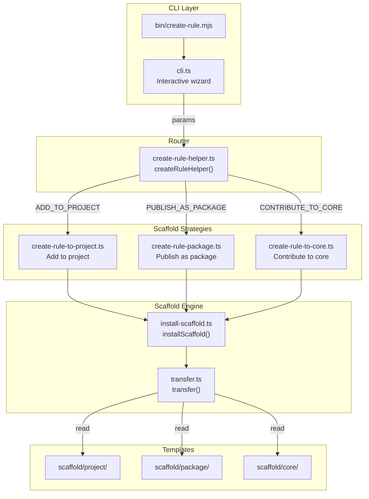

# @markuplint/create-rule

## Overview

`@markuplint/create-rule` is the scaffolding CLI for markuplint rules. It provides an interactive wizard that collects parameters from the user and dispatches to one of three scaffold strategies, each generating the boilerplate files needed for rule development. The package also exposes a programmatic API (`createRuleHelper()`) for non-interactive use.

## Directory Structure

```
src/
├── cli.ts                        — Interactive CLI wizard (entry point for bin)
├── types.ts                      — Type definitions (Purpose, Params, Result, File)
├── create-rule-helper.ts         — Purpose-based router (dispatches to strategies)
├── create-rule-to-project.ts     — Strategy: add rule to current project
├── create-rule-package.ts        — Strategy: create standalone npm package
├── create-rule-to-core.ts        — Strategy: contribute to core rules
├── install-scaffold.ts           — Low-level scaffold installer
├── transfer.ts                   — Template transfer, replacement, transpile, format
├── is-markuplint-repo.ts         — Detects if cwd is inside the markuplint monorepo
├── search-core-repository.ts     — Searches upward for the monorepo root
├── read-package-json.ts          — Reads and parses package.json
├── fs-exists.ts                  — File existence check utility
├── glob.ts                       — Glob wrapper
└── create-rule-helper-error.ts   — Custom error class
bin/
└── create-rule.mjs               — Node.js executable (calls cli.ts)
scaffold/
├── core/                         — Templates for core rule contribution
│   ├── index.ts                  — Rule implementation template
│   ├── index.spec.ts             — Test template
│   ├── meta.ts                   — Rule metadata template
│   ├── schema.json               — JSON Schema template
│   ├── README.md                 — English docs template
│   └── README.ja.md              — Japanese docs template
├── project/                      — Templates for project-local plugin
│   ├── index.ts                  — Plugin entry point template
│   └── rules/
│       ├── __ruleName__.ts       — Rule implementation template
│       └── __ruleName__.spec.ts  — Test template
└── package/                      — Templates for publishable package
    ├── README.md                 — Package README template
    ├── tsconfig.json             — TypeScript config template
    └── src/
        ├── index.ts              — Plugin entry point template
        └── rules/
            └── __ruleName__.ts   — Rule implementation template
```

## Architecture Diagram



## CLI Flow

The CLI binary (`bin/create-rule.mjs`) calls `createRule()` from `cli.ts`, which runs an interactive question sequence using `@markuplint/cli-utils`:

1. **Purpose selection** — One of: `ADD_TO_PROJECT`, `PUBLISH_AS_PACKAGE`, `CONTRIBUTE_TO_CORE` (core option only appears inside the markuplint monorepo)
2. **Plugin/directory name** — Kebab-case identifier (skipped for core)
3. **Rule name** — Kebab-case identifier
4. **Core-specific questions** — Description, category, severity (only for `CONTRIBUTE_TO_CORE`)
5. **Language** — TypeScript or JavaScript (core always uses TypeScript)
6. **Test generation** — Boolean (core always includes tests)

The collected parameters are passed to `createRuleHelper()`, which routes to the appropriate strategy.

## Scaffold Strategies

### `createRuleToProject()`

Creates a plugin directory at `<cwd>/<pluginName>/`. Fails if the directory already exists. Uses the `scaffold/project/` templates.

### `createRulePackage()`

Scaffolds in the current working directory. Requires the directory to be empty. Uses the `scaffold/package/` templates and generates an additional `package.json` with build/test scripts and dependency declarations.

### `createRuleToCore()`

Creates a rule directory at `packages/@markuplint/rules/src/<ruleName>/` within the markuplint monorepo. Searches upward from the cwd to find the repository root via `searchCoreRepository()`. Fails if the rule directory already exists or if the monorepo root is not found. Uses the `scaffold/core/` templates with TypeScript and tests always enabled.

## Template System

The scaffold engine processes template files through three stages:

### 1. Placeholder Replacement

Template files contain double-underscore placeholders that are replaced with user-provided values:

| Placeholder       | Replaced with                | Example                         |
| ----------------- | ---------------------------- | ------------------------------- |
| `__pluginName__`  | Plugin name (as-is)          | `my-plugin`                     |
| `__pluginName__c` | Plugin name (camelCase)      | `myPlugin`                      |
| `__ruleName__`    | Rule name (as-is)            | `no-empty-alt`                  |
| `__ruleName__c`   | Rule name (camelCase)        | `noEmptyAlt`                    |
| `__description__` | Rule description (core only) | `Disallow empty alt attributes` |
| `__category__`    | Rule category (core only)    | `validation`                    |
| `__severity__`    | Default severity (core only) | `error`                         |

The `__<name>__c` suffix triggers camelCase conversion: hyphens are removed and the following letter is uppercased (e.g., `my-rule` becomes `myRule`).

File names containing `__ruleName__` are also renamed to the actual rule name.

### 2. TypeScript-to-JavaScript Transpilation (optional)

When the user selects JavaScript, `.ts` files are transpiled using the TypeScript compiler API (`tsc.transpile()`) targeting ESNext. The resulting `.js` files have blank lines inserted before comments and `export` keywords for readability.

### 3. Prettier Formatting

All output files are formatted with Prettier. Any `// prettier-ignore` comments in templates are automatically stripped before formatting.

## Scaffold Templates

### Core templates (`scaffold/core/`)

| Template        | Generated file  | Content                                             |
| --------------- | --------------- | --------------------------------------------------- |
| `index.ts`      | `index.ts`      | Rule using `createRule()` with Element/Attr walkers |
| `index.spec.ts` | `index.spec.ts` | Test using `mlRuleTest()` from markuplint           |
| `meta.ts`       | `meta.ts`       | Rule metadata (category)                            |
| `schema.json`   | `schema.json`   | JSON Schema for rule value/options                  |
| `README.md`     | `README.md`     | English documentation with examples                 |
| `README.ja.md`  | `README.ja.md`  | Japanese documentation with examples                |

### Project templates (`scaffold/project/`)

| Template                     | Generated file             | Content                                 |
| ---------------------------- | -------------------------- | --------------------------------------- |
| `index.ts`                   | `index.ts`                 | Plugin entry using `createPlugin()`     |
| `rules/__ruleName__.ts`      | `rules/<ruleName>.ts`      | Rule with comment-checking example      |
| `rules/__ruleName__.spec.ts` | `rules/<ruleName>.spec.ts` | Test with expected violation assertions |

### Package templates (`scaffold/package/`)

| Template                    | Generated file            | Content                                   |
| --------------------------- | ------------------------- | ----------------------------------------- |
| `README.md`                 | `README.md`               | Package documentation with install/config |
| `tsconfig.json`             | `tsconfig.json`           | TypeScript configuration                  |
| `src/index.ts`              | `src/index.ts`            | Plugin entry using `createPlugin()`       |
| `src/rules/__ruleName__.ts` | `src/rules/<ruleName>.ts` | Rule with comment-checking example        |

Additionally, `installScaffold()` generates a `package.json` programmatically (not from a template) with appropriate scripts and dependencies.

## Key Source Files

| File                            | Role                                                                     |
| ------------------------------- | ------------------------------------------------------------------------ |
| `bin/create-rule.mjs`           | CLI executable entry point                                               |
| `src/cli.ts`                    | Interactive question wizard                                              |
| `src/types.ts`                  | Type definitions (`CreateRulePurpose`, `CreateRuleHelperParams`, `File`) |
| `src/create-rule-helper.ts`     | Purpose-based router dispatching to scaffold strategies                  |
| `src/create-rule-to-project.ts` | Scaffold strategy for project-local plugins                              |
| `src/create-rule-package.ts`    | Scaffold strategy for publishable npm packages                           |
| `src/create-rule-to-core.ts`    | Scaffold strategy for core rule contributions                            |
| `src/install-scaffold.ts`       | Low-level scaffold installer (copies templates, generates package.json)  |
| `src/transfer.ts`               | Template processing (replacement, transpile, Prettier format)            |
