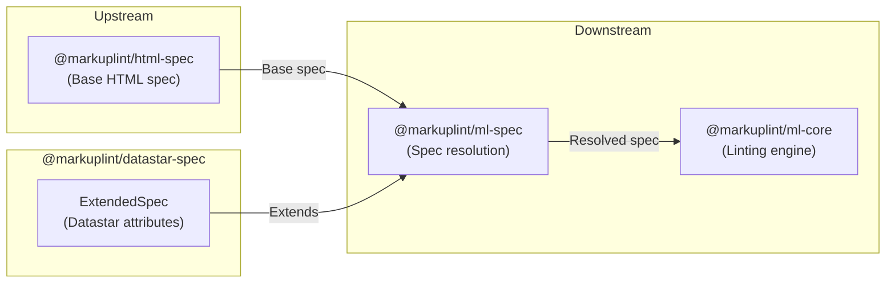

# @markuplint/datastar-spec

## Overview

`@markuplint/datastar-spec` is a spec extension package that provides Datastar-specific attribute definitions for markuplint. It exports a single `ExtendedSpec` object that registers global Datastar attributes (such as `data-signals`, `data-bind`, `data-on`, `data-text`, `data-show`, and many more) available on every HTML element.

This package contains no parsing logic -- it is purely a data definition consumed by `@markuplint/ml-spec` to extend the base HTML specification with Datastar-specific attributes.

## ExtendedSpec Content

### Directive Patterns

Directive patterns handle Datastar's dynamic attribute naming conventions:

| Pattern                                                                    | Purpose                                | Example                                            |
| -------------------------------------------------------------------------- | -------------------------------------- | -------------------------------------------------- |
| `^data-on[-:]([a-z]+)(?:__.*)?$`                                           | Event handlers with optional modifiers | `data-on:click`, `data-on-keydown__debounce.500ms` |
| `^data-attr[-:]([^_]+)(?:__.*)?$`                                          | Attribute binding                      | `data-attr:class`, `data-attr-href`                |
| `^data-(?:class\|style)[-:].+$`                                            | Class/style with suffix                | `data-class:active`, `data-style:color`            |
| `^data-(?:signals\|computed\|bind\|indicator\|ref\|persist)[-:].+$`        | Signal/binding with key                | `data-signals:foo`, `data-bind:name`               |
| `^data-on[-:](?:intersect\|interval\|signal-patch\|raf\|resize)(?:__.*)?$` | Browser event handlers                 | `data-on-intersect__once`                          |
| `^data-(?:init\|ignore\|...)__.+$`                                         | Static directives with modifiers       | `data-init__delay.500ms`                           |

### Global Attributes

Global attributes are defined under `def['#globalAttrs']['#extends']` and are available on every HTML element:

#### Core Plugin Attributes

| Attribute       | Type  | Description                      |
| --------------- | ----- | -------------------------------- |
| `data-signals`  | `Any` | Defines reactive signals (state) |
| `data-computed` | `Any` | Read-only computed signals       |
| `data-init`     | `Any` | Initialization expression        |
| `data-effect`   | `Any` | Reactive side effects            |

#### DOM Plugin Attributes

| Attribute           | Type      | Description                         |
| ------------------- | --------- | ----------------------------------- |
| `data-attr`         | `Any`     | Sets HTML attributes via expression |
| `data-bind`         | `Any`     | Two-way data binding                |
| `data-class`        | `Any`     | Conditional CSS classes             |
| `data-style`        | `Any`     | Reactive inline styles              |
| `data-text`         | `Any`     | Text content binding                |
| `data-show`         | `Any`     | Conditional visibility              |
| `data-ignore`       | `Boolean` | Prevents Datastar processing        |
| `data-ignore-morph` | `Boolean` | Skips DOM morphing                  |
| `data-ref`          | `Any`     | Element reference signal            |

#### Browser Plugin Attributes

| Attribute                     | Type  | Description                       |
| ----------------------------- | ----- | --------------------------------- |
| `data-indicator`              | `Any` | Fetch status tracking signal      |
| `data-on-intersect`           | `Any` | Viewport intersection handler     |
| `data-on-interval`            | `Any` | Interval execution                |
| `data-on-signal-patch`        | `Any` | Signal change handler             |
| `data-on-signal-patch-filter` | `Any` | Signal change filter              |
| `data-preserve-attr`          | `Any` | Preserves attributes during morph |
| `data-json-signals`           | `Any` | Debug signal display              |

#### Pro Plugin Attributes

| Attribute               | Type      | Description                   |
| ----------------------- | --------- | ----------------------------- |
| `data-animate`          | `Any`     | Element animation             |
| `data-custom-validity`  | `Any`     | Custom form validation        |
| `data-on-raf`           | `Any`     | requestAnimationFrame handler |
| `data-on-resize`        | `Any`     | Resize observer handler       |
| `data-persist`          | `Any`     | Signal persistence            |
| `data-query-string`     | `Any`     | Query parameter sync          |
| `data-replace-url`      | `Any`     | URL replacement               |
| `data-rocket`           | `Any`     | Rocket web component          |
| `data-scroll-into-view` | `Boolean` | Scroll into viewport          |
| `data-view-transition`  | `Any`     | View transition name          |

## Directory Structure

```
src/
└── index.ts    — Exports the ExtendedSpec object with Datastar-specific attributes
```

## Key Source Files

| File       | Purpose                                                             |
| ---------- | ------------------------------------------------------------------- |
| `index.ts` | Defines and exports the `ExtendedSpec` object as the default export |

## Integration Points



### Upstream

- **`@markuplint/ml-spec`** -- Provides the `ExtendedSpec` type that this package implements

### Downstream

- **`@markuplint/ml-spec`** -- Consumes the `ExtendedSpec` object to merge Datastar-specific attributes into the resolved specification
- **`@markuplint/ml-core`** -- Uses the resolved spec (including Datastar extensions) during linting

## Documentation Map

- [Maintenance Guide](docs/maintenance.md) -- Commands, recipes, and ExtendedSpec type reference
