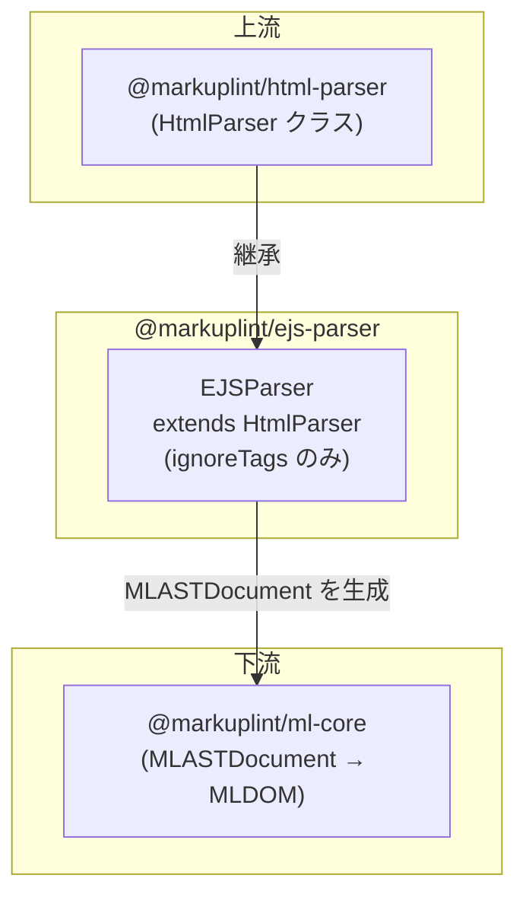

# @markuplint/ejs-parser

## 概要

`@markuplint/ejs-parser` は `HtmlParser` を拡張し、EJS（Embedded JavaScript）テンプレート式を含む HTML のリントを可能にします。

## 動作の仕組み

このパーサーは基底の `HtmlParser` が提供する `ignoreTags` メカニズムを使用します:

1. **マスク** — パース前に、すべての EJS テンプレート式（`<% ... %>` およびそのバリアント）が開始/終了デリミタにより識別され、プレースホルダーテキストに置換される
2. **パース** — マスクされた HTML は、テンプレート式が存在しないかのように標準 HTML パーサー（parse5）によってパースされる
3. **保持** — 元の EJS 式は AST 内に `#ps:*`（PreprocessorSpecificBlock）ノードとして保持され、ソース位置も維持される

このアプローチにより、markuplint は EJS 構文に影響されることなく HTML 構造をリントできます。

## ignoreTags 設定

`EJSParser` コンストラクタは、正しいマッチングを保証するために、最も具体的なものから順に5つのパターンを定義しています:

| タイプ                    | 開始        | 終了 | 説明                                           |
| ------------------------- | ----------- | ---- | ---------------------------------------------- |
| `ejs-whitespace-slurping` | `<%_`       | `%>` | 空白除去スクリプトレット（前方の空白をトリム） |
| `ejs-output-value`        | `<%=`       | `%>` | エスケープ済み出力（HTML セーフ）              |
| `ejs-output-unescaped`    | `<%-`       | `%>` | エスケープなし出力（生 HTML）                  |
| `ejs-comment`             | `<%#`       | `%>` | EJS コメント（レンダリングされない）           |
| `ejs-scriptlet`           | `/<%(?!%)/` | `%>` | プレーンスクリプトレット（制御フロー等）       |

`ejs-scriptlet` パターンは否定先読み `(?!%)` を持つ正規表現を使用し、リテラルエスケープシーケンス `<%%` とのマッチを回避しています。

## サポートされない構文

**引用符なしの属性値**内のテンプレート式はサポートされていません。これはすべてのテンプレートエンジンパーサーに共通する既知の制限です（[#240](https://github.com/markuplint/markuplint/issues/240)）。[ウェブサイトのドキュメント](https://markuplint.dev/docs/guides/besides-html)も参照してください。

使用可能:

```html
<div attr="<%= value %>"></div>
<div attr="<%= value %>"></div>
<div attr="<%= value %>-<%= value2 %>-<%= value3 %>"></div>
```

使用不可（引用符なし）:

```html
<div attr=<%= value %>></div>
```

## ディレクトリ構成

```
src/
├── index.ts        — parser を再エクスポート
├── parser.ts       — HtmlParser を拡張する EJSParser クラス
└── index.spec.ts   — パーサー統合テスト
```

## 主要ソースファイル

| ファイル        | 用途                                                             |
| --------------- | ---------------------------------------------------------------- |
| `src/parser.ts` | `EJSParser` クラスを定義し、シングルトン `parser` をエクスポート |
| `src/index.ts`  | パッケージエントリーポイント。`parser` を再エクスポート          |

## 統合ポイント



## ドキュメントマップ

- [メンテナンスガイド](docs/maintenance.ja.md) — コマンド、レシピ、テスト
