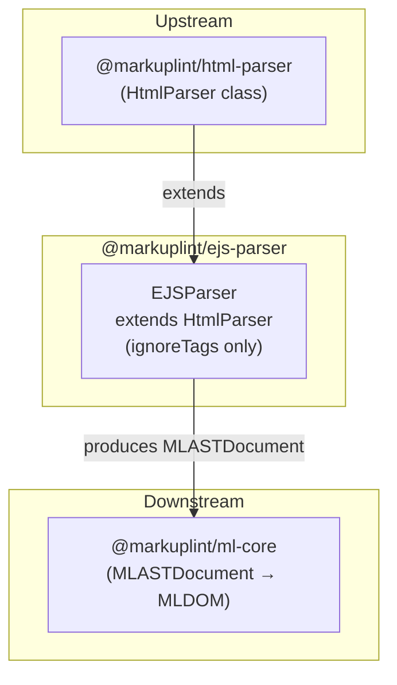

# @markuplint/ejs-parser

## Overview

`@markuplint/ejs-parser` extends `HtmlParser` to lint HTML containing EJS (Embedded JavaScript) template expressions.

## How It Works

The parser uses the `ignoreTags` mechanism provided by the base `HtmlParser`:

1. **Mask** — Before parsing, all EJS template expressions (`<% ... %>` and variants) are identified by their start/end delimiters and replaced with placeholder text
2. **Parse** — The masked HTML is parsed by the standard HTML parser (parse5) as if the template expressions did not exist
3. **Preserve** — The original EJS expressions are preserved in the AST as `#ps:*` (PreprocessorSpecificBlock) nodes, maintaining their source positions

This approach allows markuplint to lint the HTML structure without being confused by EJS syntax.

## ignoreTags Configuration

The `EJSParser` constructor defines five ignore patterns, ordered from most specific to least specific to ensure correct matching:

| Type                      | Start       | End  | Description                                            |
| ------------------------- | ----------- | ---- | ------------------------------------------------------ |
| `ejs-whitespace-slurping` | `<%_`       | `%>` | Whitespace-slurping scriptlets (trims preceding space) |
| `ejs-output-value`        | `<%=`       | `%>` | Escaped output (HTML-safe)                             |
| `ejs-output-unescaped`    | `<%-`       | `%>` | Unescaped output (raw HTML)                            |
| `ejs-comment`             | `<%#`       | `%>` | EJS comments (not rendered)                            |
| `ejs-scriptlet`           | `/<%(?!%)/` | `%>` | Plain scriptlets (control flow, etc.)                  |

The `ejs-scriptlet` pattern uses a regex with a negative lookahead `(?!%)` to avoid matching the literal escape sequence `<%%`.

## Unsupported Syntaxes

Template expressions inside **unquoted attribute values** are not supported. This is a known limitation shared by all template engine parsers ([#240](https://github.com/markuplint/markuplint/issues/240)). See also the [website documentation](https://markuplint.dev/docs/guides/besides-html).

Available:

```html
<div attr="<%= value %>"></div>
<div attr="<%= value %>"></div>
<div attr="<%= value %>-<%= value2 %>-<%= value3 %>"></div>
```

Unavailable (unquoted):

```html
<div attr=<%= value %>></div>
```

## Directory Structure

```
src/
├── index.ts        — Re-exports parser
├── parser.ts       — EJSParser class extending HtmlParser
└── index.spec.ts   — Parser integration tests
```

## Key Source Files

| File            | Purpose                                                           |
| --------------- | ----------------------------------------------------------------- |
| `src/parser.ts` | Defines `EJSParser` class and exports singleton `parser` instance |
| `src/index.ts`  | Package entry point; re-exports `parser`                          |

## Integration Points



## Documentation Map

- [Maintenance Guide](docs/maintenance.md) — Commands, recipes, and testing
