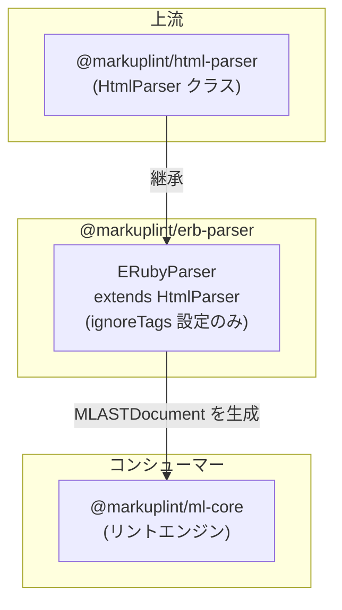

# @markuplint/erb-parser

## 概要

`@markuplint/erb-parser` は、ERB（Embedded Ruby）テンプレート式を含む HTML をリントするために `HtmlParser` を拡張したテンプレートエンジンパーサーです。`ignoreTags` メカニズムを使用して ERB タグ（`<%= %>`、`<%# %>`、`<% %>`）を不透明なブロックとして扱い、Ruby コードを解釈せずに周囲の HTML 構造を検証できるようにします。

## 動作の仕組み

このパーサーは `HtmlParser`（`@markuplint/html-parser`）を継承し、親のコンストラクタに `ignoreTags` 設定を渡します。これにより、HTML パーサーが ERB タグパターンを認識し、HTML としてパースを試みる代わりに AST 内のプレースホルダーノード（`#ps:*`）に置換します。ERB 式はソースマッピングのためにノードの生コンテンツとしてそのまま保持されます。

`ignoreTags` パターンは順番にマッチングされるため、より具体的なパターン（例: 式用の `<%=`）が汎用的な `<%`（Ruby コードブロック用）よりも先にチェックされます。`erb-ruby-code` パターンの否定先読み `(?!%)` により、`<%%`（エスケープされた ERB デリミタ）がマッチしないようになっています。

## ignoreTags 設定

| タイプ                | 開始パターン | 終了パターン | AST ノード名              | 説明                    |
| --------------------- | ------------ | ------------ | ------------------------- | ----------------------- |
| `erb-ruby-expression` | `<%=`        | `%>`         | `#ps:erb-ruby-expression` | Ruby 式の出力           |
| `erb-comment`         | `<%#`        | `%>`         | `#ps:erb-comment`         | ERB コメント            |
| `erb-ruby-code`       | `/<%(?!%)/`  | `%>`         | `#ps:erb-ruby-code`       | Ruby コード実行ブロック |

**注意:** trim_mode（`%` プレフィックス行）は現在サポートされていません。将来の実装のためにコメントアウトされたエントリがあります。

## サポートされない構文

**引用符なしの属性値**内のテンプレート式はサポートされていません。これはすべてのテンプレートエンジンパーサーに共通する既知の制限です（[#240](https://github.com/markuplint/markuplint/issues/240)）。[ウェブサイトのドキュメント](https://markuplint.dev/docs/guides/besides-html)も参照してください。

使用可能:

```html
<div attr="<%= value %>"></div>
<div attr="<%= value %>"></div>
<div attr="<%= value %>-<%= value2 %>-<%= value3 %>"></div>
```

使用不可（引用符なし）:

```html
<div attr=<%= value %>></div>
```

## ディレクトリ構成

```
src/
├── index.ts        — parser インスタンスを再エクスポート
├── parser.ts       — HtmlParser を継承する ERubyParser クラス
└── index.spec.ts   — ERB タグパースのテスト
```

## 主要ソースファイル

| ファイル        | 用途                                                                        |
| --------------- | --------------------------------------------------------------------------- |
| `parser.ts`     | `ERubyParser` クラスを定義; `ignoreTags` を設定しシングルトンをエクスポート |
| `index.ts`      | モジュールエントリポイント; `parser` を再エクスポート                       |
| `index.spec.ts` | すべての ERB タグタイプと HTML/ERB 混在コンテンツのテスト                   |

## 統合ポイント



### 上流

- **`@markuplint/html-parser`** -- すべての HTML パースロジックと `ignoreTags` メカニズムを提供する `HtmlParser` 基底クラス

### 下流

このパッケージには下流のパーサー依存はありません。markuplint エンジンから直接使用されるリーフパーサーです。

## ドキュメントマップ

- [メンテナンスガイド](docs/maintenance.ja.md) -- コマンド、レシピ、トラブルシューティング
