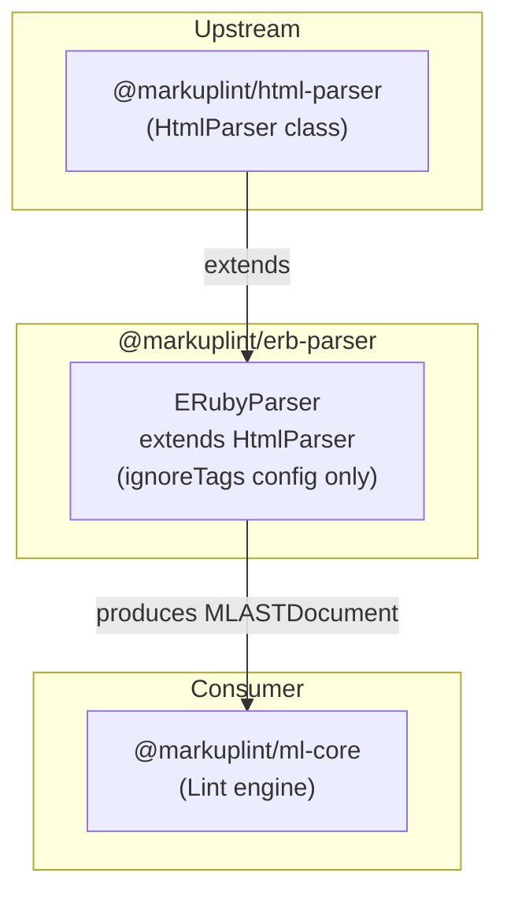

# @markuplint/erb-parser

## Overview

`@markuplint/erb-parser` is a template engine parser for markuplint that extends `HtmlParser` to lint HTML containing ERB (Embedded Ruby) template expressions. It uses the `ignoreTags` mechanism to treat ERB tags (`<%= %>`, `<%# %>`, `<% %>`) as opaque blocks, allowing markuplint to validate the surrounding HTML structure without interpreting the Ruby code.

## How It Works

The parser extends `HtmlParser` (from `@markuplint/html-parser`) and passes an `ignoreTags` configuration to the parent constructor. This tells the HTML parser to recognize ERB tag patterns and replace them with placeholder nodes (`#ps:*`) in the AST instead of attempting to parse them as HTML. The ERB expressions are preserved as-is in the node's raw content for source mapping purposes.

The `ignoreTags` patterns are matched in order, so more specific patterns (e.g., `<%=` for expressions) are checked before the general `<%` pattern for Ruby code blocks. The negative lookahead `(?!%)` in the `erb-ruby-code` pattern prevents `<%%` (escaped ERB delimiters) from being matched.

## ignoreTags Configuration

| Type                  | Start Pattern | End Pattern | AST Node Name             | Description                |
| --------------------- | ------------- | ----------- | ------------------------- | -------------------------- |
| `erb-ruby-expression` | `<%=`         | `%>`        | `#ps:erb-ruby-expression` | Ruby expression output     |
| `erb-comment`         | `<%#`         | `%>`        | `#ps:erb-comment`         | ERB comments               |
| `erb-ruby-code`       | `/<%(?!%)/`   | `%>`        | `#ps:erb-ruby-code`       | Ruby code execution blocks |

**Note:** trim_mode (`%`-prefixed lines) is not currently supported. There is a commented-out entry for future implementation.

## Unsupported Syntaxes

Template expressions inside **unquoted attribute values** are not supported. This is a known limitation shared by all template engine parsers ([#240](https://github.com/markuplint/markuplint/issues/240)). See also the [website documentation](https://markuplint.dev/docs/guides/besides-html).

Available:

```html
<div attr="<%= value %>"></div>
<div attr="<%= value %>"></div>
<div attr="<%= value %>-<%= value2 %>-<%= value3 %>"></div>
```

Unavailable (unquoted):

```html
<div attr=<%= value %>></div>
```

## Directory Structure

```
src/
├── index.ts        — Re-exports parser instance
├── parser.ts       — ERubyParser class extending HtmlParser
└── index.spec.ts   — Tests for ERB tag parsing
```

## Key Source Files

| File            | Purpose                                                                    |
| --------------- | -------------------------------------------------------------------------- |
| `parser.ts`     | Defines `ERubyParser` class; configures `ignoreTags` and exports singleton |
| `index.ts`      | Module entry point; re-exports `parser`                                    |
| `index.spec.ts` | Tests covering all ERB tag types and mixed HTML/ERB content                |

## Integration Points



### Upstream

- **`@markuplint/html-parser`** -- Provides the `HtmlParser` base class that handles all HTML parsing logic and the `ignoreTags` mechanism

### Downstream

This package has no downstream parser dependencies. It is a leaf parser consumed directly by the markuplint engine.

## Documentation Map

- [Maintenance Guide](docs/maintenance.md) -- Commands, recipes, and troubleshooting
