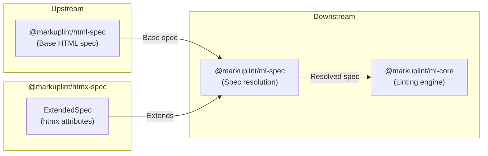

# @markuplint/htmx-spec

## Overview

`@markuplint/htmx-spec` is a spec extension package that provides htmx-specific attribute definitions for markuplint. It exports a single `ExtendedSpec` object that registers global htmx attributes (such as `hx-get`, `hx-post`, `hx-trigger`, `hx-target`, `hx-swap`, and many more) available on every HTML element.

This package contains no parsing logic -- it is purely a data definition consumed by `@markuplint/ml-spec` to extend the base HTML specification with htmx-specific attributes.

## ExtendedSpec Content

### Global Attributes

Global attributes are defined under `def['#globalAttrs']['#extends']` and are available on every HTML element:

#### HTTP Request Attributes

| Attribute   | Type  | Description                              |
| ----------- | ----- | ---------------------------------------- |
| `hx-get`    | `Any` | Issues a GET request to the given URL    |
| `hx-post`   | `Any` | Issues a POST request to the given URL   |
| `hx-put`    | `Any` | Issues a PUT request to the given URL    |
| `hx-patch`  | `Any` | Issues a PATCH request to the given URL  |
| `hx-delete` | `Any` | Issues a DELETE request to the given URL |

#### Core Behavior Attributes

| Attribute       | Type      | Description                                            |
| --------------- | --------- | ------------------------------------------------------ |
| `hx-trigger`    | `Any`     | Specifies what triggers the AJAX request               |
| `hx-target`     | `Any`     | Specifies the target element for content swapping      |
| `hx-swap`       | `Any`     | Controls how the response content is swapped in        |
| `hx-swap-oob`   | `Any`     | Marks content for out-of-band swap                     |
| `hx-select`     | `Any`     | Selects a subset of the response HTML                  |
| `hx-select-oob` | `Any`     | Selects content from the response for out-of-band swap |
| `hx-boost`      | `Boolean` | Progressively enhances anchors and forms to use AJAX   |

#### Request Configuration Attributes

| Attribute        | Type  | Description                                       |
| ---------------- | ----- | ------------------------------------------------- |
| `hx-push-url`    | `Any` | Pushes the request URL into the browser location  |
| `hx-replace-url` | `Any` | Replaces the current URL in the browser location  |
| `hx-include`     | `Any` | Includes additional element values in the request |
| `hx-params`      | `Any` | Filters which parameters are submitted            |
| `hx-vals`        | `Any` | Adds additional values to request parameters      |
| `hx-headers`     | `Any` | Adds custom headers to the AJAX request           |
| `hx-encoding`    | `Any` | Changes the request encoding type                 |
| `hx-request`     | `Any` | Configures various aspects of the AJAX request    |

#### UI Feedback Attributes

| Attribute         | Type  | Description                                       |
| ----------------- | ----- | ------------------------------------------------- |
| `hx-indicator`    | `Any` | Specifies the loading indicator element           |
| `hx-disabled-elt` | `Any` | Specifies elements to disable during the request  |
| `hx-confirm`      | `Any` | Shows a confirm dialog before issuing the request |
| `hx-prompt`       | `Any` | Shows a prompt dialog before issuing the request  |

#### Inheritance & Processing Attributes

| Attribute       | Type      | Description                                             |
| --------------- | --------- | ------------------------------------------------------- |
| `hx-disinherit` | `Any`     | Disables attribute inheritance for specified attributes |
| `hx-inherit`    | `Any`     | Explicitly enables attribute inheritance                |
| `hx-ext`        | `Any`     | Enables htmx extensions                                 |
| `hx-disable`    | `Boolean` | Disables htmx processing for the element                |

#### History & Preservation Attributes

| Attribute        | Type      | Description                                           |
| ---------------- | --------- | ----------------------------------------------------- |
| `hx-history`     | `Any`     | Prevents sensitive data from being saved to history   |
| `hx-history-elt` | `Boolean` | Designates the element as the history snapshot target |
| `hx-preserve`    | `Boolean` | Preserves an element unchanged across requests        |

#### Synchronization & Validation Attributes

| Attribute     | Type      | Description                                          |
| ------------- | --------- | ---------------------------------------------------- |
| `hx-sync`     | `Any`     | Synchronizes AJAX requests between multiple elements |
| `hx-validate` | `Boolean` | Forces elements to validate before a request is made |

## Directory Structure

```
src/
└── index.ts    — Exports the ExtendedSpec object with htmx-specific attributes
```

## Key Source Files

| File       | Purpose                                                             |
| ---------- | ------------------------------------------------------------------- |
| `index.ts` | Defines and exports the `ExtendedSpec` object as the default export |

## Integration Points



### Upstream

- **`@markuplint/ml-spec`** -- Provides the `ExtendedSpec` type that this package implements

### Downstream

- **`@markuplint/ml-spec`** -- Consumes the `ExtendedSpec` object to merge htmx-specific attributes into the resolved specification
- **`@markuplint/ml-core`** -- Uses the resolved spec (including htmx extensions) during linting

## Documentation Map

- [Maintenance Guide](docs/maintenance.md) -- Commands, recipes, and ExtendedSpec type reference
