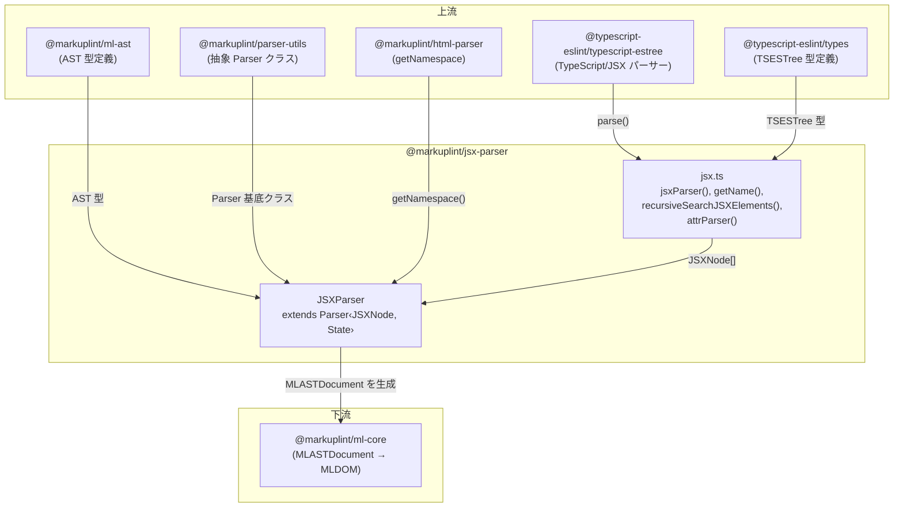
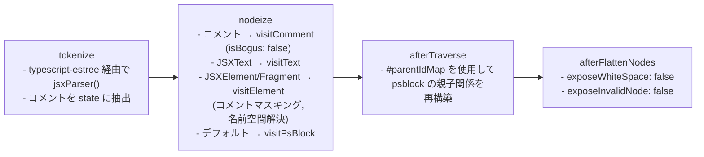
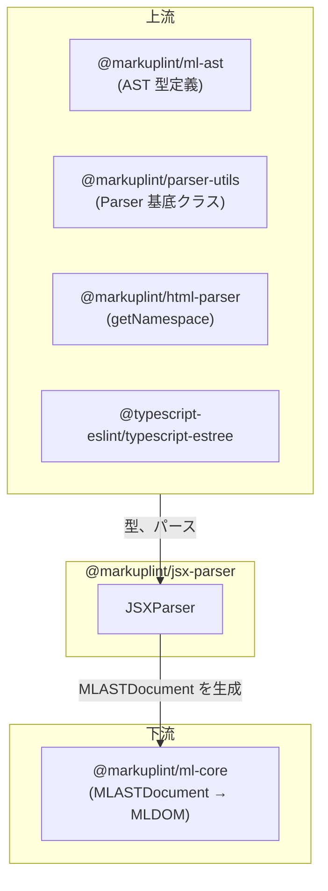

# @markuplint/jsx-parser

## 概要

`@markuplint/jsx-parser` は markuplint のフルフレームワークパーサーで、JSX および TSX 構文を処理します。`@typescript-eslint/typescript-estree` を使用して JavaScript/TypeScript ソースコードを ESTree 互換の AST にパースし、AST ツリーからすべての JSX 要素とフラグメントを再帰的に抽出します。抽出されたノードは統一された markuplint AST 形式（`MLASTDocument`）に変換されます。JSX 固有の機能として、式コンテナ、フラグメント、スプレッド属性、IDL-コンテンツ属性マッピング、JSX タグ内のコメントマスキングを処理します。

## ディレクトリ構成

```
src/
├── index.ts              — parser インスタンスを再エクスポート
├── parser.ts             — Parser<JSXNode, State> を拡張する JSXParser クラス
├── jsx.ts                — JSX AST 抽出ユーティリティ（jsxParser, getName, recursiveSearchJSXElements, attrParser）
├── index.spec.ts         — JSXParser 統合テスト
└── jsx.spec.ts           — JSX 抽出ユーティリティテスト
```

## アーキテクチャ図



## JSXParser クラス

### 継承関係

```
Parser<JSXNode, State>  (@markuplint/parser-utils)
    └── JSXParser        (このパッケージ)
```

多くのフレームワークパーサーが `HtmlParser` を継承するのとは異なり、`JSXParser` は基底の `Parser` クラスを直接継承しています。これは JSX が parse5 ではなく完全に異なるトークナイザ（`@typescript-eslint/typescript-estree`）を使用するため、`HtmlParser` の HTML 固有の動作（ゴースト要素、head/body 最適化、フラグメント検出）が不要なためです。

### コンストラクタ

コンストラクタは JSX 固有のオプションでパーサーを構成し、状態を初期化します:

```ts
super(
  {
    endTagType: 'xml',
    booleanish: true,
    tagNameCaseSensitive: true,
  },
  {
    comments: [],
  },
);
```

| オプション             | 値      | 意味                                                                         |
| ---------------------- | ------- | ---------------------------------------------------------------------------- |
| `endTagType`           | `'xml'` | JSX は HTML のvoid タグではなく XML スタイルの自己閉じタグ（`<br />`）を使用 |
| `booleanish`           | `true`  | 値なしの JSX 属性はブーリアンとして扱う（`disabled` = `true`）               |
| `tagNameCaseSensitive` | `true`  | JSX はタグ名の大文字小文字を保持する（`<MyComponent>` は小文字化されない）   |

### State 型

```ts
type State = {
  comments: readonly JSXComment[];
};
```

| フィールド | 型                      | 用途                                                                         |
| ---------- | ----------------------- | ---------------------------------------------------------------------------- |
| `comments` | `readonly JSXComment[]` | トークン化時に抽出された全コメントを保存し、タグ内のコメントマスキングに使用 |

### #parentIdMap WeakMap

```ts
#parentIdMap = new WeakMap<MLASTNodeTreeItem, number | null>();
```

JSX 式とその包含要素間の親子関係を追跡するプライベート `WeakMap`。各 markuplint ノードは、その親 JSX 要素の ID（トップレベルノードの場合は `null`）にマッピングされます。このマップは `afterTraverse()` メソッドで不可欠であり、`JSXExpressionContainer` などの psblock（プリプロセッサ固有ブロック）ノードの親子関係を再構築するために使用されます。

### オーバーライドメソッド

| メソッド              | 用途                                                                                                     |
| --------------------- | -------------------------------------------------------------------------------------------------------- | ------------------------------------------------ |
| `tokenize()`          | `jsxParser()` を呼び出して TypeScript ESTree 経由でソースをパースし、コメントを state に抽出             |
| `parseError()`        | TypeScript ESTree のパースエラーを `error.location.start` を使って `ParserError` に変換（下記注記参照）  |
| `nodeize()`           | JSX AST ノードを markuplint ノードに変換。コメント、テキスト、要素、フラグメント、psblock を処理         |
| `afterTraverse()`     | `#parentIdMap` を使用して psblock ノードの親子関係を再構築                                               |
| `afterFlattenNodes()` | `exposeWhiteSpace: false` と `exposeInvalidNode: false` で親メソッドを呼び出す                           |
| `visitComment()`      | 全コメントノードを `isBogus: false` にマーク（JSX は HTML bogus コメントではなく JS コメント構文を使用） |
| `visitAttr()`         | JSX 固有のクォート（`{}`）と動的値検出を処理                                                             |
| `parseCodeFragment()` | `namelessFragment: true` で親メソッドに委譲                                                              |
| `detectElementType()` | `/^[A-Z]                                                                                                 | \./` 正規表現でコンポーネント vs HTML 要素を検出 |

### 注記: `parseError()` と TSError の getter プロパティ

`@typescript-eslint/typescript-estree` の `TSError` は `lineNumber` と `column` を自身のプロパティではなく **prototype の getter プロパティ** として公開しています。一部のランタイム（例: Bun）ではこれらの getter に対する `'lineNumber' in error` チェックが失敗し、`super.parseError()` にフォールバックして `col` がデフォルト値 `0` になってしまいます。

これを回避するため、`parseError()` は `error.location.start` を直接参照しています。これは `TSError` の own property であり、全ランタイムで確実に `{ line, column }` を提供します。

## JSX AST 抽出（jsx.ts）

### jsxParser()

JSX ソースコードパースのメインエントリポイント:

1. `@typescript-eslint/typescript-estree` の `parse()` を以下のオプションで呼び出す:
   - `comment: true` -- AST からコメントを抽出
   - `errorOnUnknownASTType: false` -- 不明な AST 型でエラーを投げない
   - `jsx: true` -- JSX パースを有効化
   - `loc: true` -- 位置情報を含める
   - `range: true` -- レンジ（オフセット）情報を含める
   - `tokens: false` -- トークン配列を含めない
   - `useJSXTextNode: true` -- テキストコンテンツに `JSXText` ノードを生成
2. プログラム本体に対して `recursiveSearchJSXElements()` を呼び出し、すべての JSX 要素とフラグメントを収集
3. `ast.comments` の全コメントを追加し、それぞれに `__parentId: null` を付与
4. 結合されたフラットな `JSXNode[]` 配列を返す

### getName()

JSX タグ名式の完全修飾名を解決します。3つのパターンを処理:

| AST ノード型          | 例              | 解決方法                                         |
| --------------------- | --------------- | ------------------------------------------------ |
| `JSXIdentifier`       | `<div>`         | `tagName.name` を直接返す（例: `"div"`）         |
| `JSXMemberExpression` | `<Foo.Bar.Baz>` | 再帰的に解決し `.` で結合（例: `"Foo.Bar.Baz"`） |
| `JSXNamespacedName`   | `<ns:tag>`      | `"namespace:name"` 形式を返す（例: `"ns:tag"`）  |

`JSXMemberExpression` の解決は再帰的で、`object` プロパティ自体が別の `JSXMemberExpression` になり得るため、`A.B.C.D` のような任意の深さのチェーンに対応します。

### recursiveSearchJSXElements()

TypeScript ESTree AST 全体を走査して JSX 要素とフラグメントを収集するコアの再帰走査関数です。AST ノードの配列と `parentId`（どの JSX 要素が現在のノードを含むかを追跡）を受け取ります。

#### ID 追跡

各 JSX 要素とフラグメントには `idCounter()`（単調増加する整数カウンタ）経由でユニークな ID が割り当てられます。この ID は子ノードへの再帰時に `parentId` として渡され、後の `afterTraverse()` で必要な親子関係を確立します。

#### ノード型の処理

この関数はすべての `AST_NODE_TYPES` 値を処理する大きな `switch` 文を使用します。処理はいくつかのカテゴリに分類されます:

**スキップされる型（60+ 型）** -- これらのノード型は JSX を含み得ないため `continue` でスキップ:

- リーフノード: `Literal`、`Identifier`、`ThisExpression`、`Super`、`MetaProperty`
- パターンノード: `ArrayPattern`、`ObjectPattern`、`AssignmentPattern`
- 文ノード: `EmptyStatement`、`BreakStatement`、`ContinueStatement`、`DebuggerStatement`
- インポート/エクスポート指定子: `ExportAllDeclaration`、`ExportSpecifier`、`ImportDefaultSpecifier`、`ImportExpression`、`ImportNamespaceSpecifier`、`ImportSpecifier`
- JSX 内部ノード: `JSXIdentifier`、`JSXText`、`JSXOpeningElement`、`JSXClosingElement`、`JSXOpeningFragment`、`JSXClosingFragment`、`JSXNamespacedName`、`JSXEmptyExpression`、`JSXMemberExpression`
- TypeScript 型ノード: `TSInterfaceBody`、`TSInterfaceDeclaration`、その他多数
- TypeScript キーワード型: `TSAbstractKeyword`、`TSAnyKeyword`、その他多数
- その他: `TemplateElement`、`PrivateIdentifier`

**JSX 要素/フラグメントの収集**:

- `JSXElement` -- ノード自身をプッシュし、新しいユニーク `id` で `children` に再帰。`openingElement.attributes` 内の `JSXSpreadAttribute` をチェック（存在すれば `__hasSpreadAttribute` フラグを設定）し、属性にも再帰
- `JSXFragment` -- ノード自身をプッシュし、新しいユニーク `id` で `children` に再帰

**本体ベースの再帰**（`.body` に再帰）:

- `Program`、`BlockStatement`、`ClassBody`、`StaticBlock`、`TSModuleBlock` -- `null` の parentId で `node.body` に再帰
- `FunctionDeclaration`、`FunctionExpression`、`ArrowFunctionExpression`、`ClassDeclaration`、`ClassExpression`、`CatchClause`、`LabeledStatement` -- 現在の parentId で `[node.body]` に再帰

**式の再帰**:

- `CallExpression` -- `node.arguments` に再帰
- `ConditionalExpression`、`IfStatement` -- `[node.test, node.consequent, node.alternate]` に再帰
- その他、各ノード型に応じた適切なプロパティに再帰

**フォールバック**: いずれの case にも該当しないノード型が来た場合、`new Error('Unsupported node')` をスローします。

### attrParser()

`@typescript-eslint/typescript-estree` 経由でコードをパースし、JSX 属性式の構文を検証します。パース失敗時にはエラー位置を抽出し、エラーオフセットを示す `index` プロパティを持つ `SyntaxError` を作成します。この関数は `visitAttr()` の `{ start: '{', end: '}', type: 'script' }` クォートセットの `parser` コールバックとして使用されます。

## nodeize() の詳細

`nodeize()` メソッドは JSX AST ノードを markuplint ノードツリーアイテムに変換する中心的なディスパッチです。まず `originNode.__alreadyNodeized` をチェックして重複処理を防止し、`originNode.type` に基づいてディスパッチします:

### Block / Line（コメント）

ソースフラグメントを `originNode.range` で切り出し、`this.visitComment()` を呼び出します。JSXParser でオーバーライドされた `visitComment()` は、JSX コメント（`// ...` と `/* ... */`）が HTML bogus コメントではなく JavaScript 構文であるため、すべてのコメントノードに `isBogus: false` を設定します。

### JSXText

ソースフラグメントを切り出し、`this.visitText()` を呼び出します。テキストノード作成後、各ノードを `originNode.__parentId` の値で `#parentIdMap` に登録します。この親 ID の追跡は、後の `afterTraverse()` での psblock 親子関係の再構築に不可欠です。

### JSXElement / JSXFragment

最も複雑な分岐です:

1. **タグ識別**: フラグメントの場合、開始タグは `originNode.openingFragment` で `nodeName` は `#jsx-fragment`。要素の場合、開始タグは `originNode.openingElement` で `nodeName` は `getName()` で解決
2. **コメントマスキング**: `this.state.comments` に保存された全コメントを走査。開始タグの範囲内にあるコメントのテキストをスペースに置換（改行は保持）し、`commentToken.raw.replaceAll(/[^\n]/g, ' ')` を使用。これにより JSX 開始タグ内のコメント構文によるタグ属性パーサーの混乱を防止
3. **名前空間解決**: `@markuplint/html-parser` の `getNamespace(nodeName, parentNamespace)` を呼び出して正しい名前空間 URI（HTML、SVG、MathML）を決定
4. **要素訪問**: マスクされたトークン、深さ、親ノード、ノード名、名前空間で `this.visitElement()` を呼び出し。閉じタグフラグメントを切り出す `createEndTagToken` コールバックを提供
5. **親 ID 追跡**: ノード作成後、各ノードを親 ID で `#parentIdMap` に登録

### デフォルト（式コンテナ等）

その他すべてのノード型（主に `JSXExpressionContainer`、`JSXSpreadChild`）は `this.visitPsBlock()` 経由でプリプロセッサ固有ブロック（psblock）として処理されます。`nodeName` は `originNode.type`（例: `JSXExpressionContainer`）に設定され、AST 内では `#ps:JSXExpressionContainer` となります。

JSX を返す `.map()` 呼び出し（例: `{items.map(item => <li>{item}</li>)}`）では、`extractJSXFromCall()` ユーティリティがパターンを検出し、`blockBehavior: { type: 'each', expression }` を設定します。返された JSX 要素またはフラグメントは子ノードとして渡され、コアエンジンがループ本体を走査できるようになります。各結果ノードは `#parentIdMap` に登録されます。

## afterTraverse()

`afterTraverse()` メソッドは psblock ノードの親子関係を再構築します。これは JSX 式コンテナ（`{items.map(item => <li>{item}</li>)}` のような）が再帰走査中に個別に収集された子要素を「養子」にする必要があるためです。

アルゴリズム:

1. まず `super.afterTraverse(nodeTree)` を呼び出す
2. ノードツリーを走査して `psblock` 型のノードを探す
3. 各 psblock ノードについて、`#parentIdMap` から `nParentId` を取得
4. ノードツリーを再度走査して以下の条件を満たす候補子ノードを探す:
   - 候補が同じ psblock ノードではない
   - 候補の `dParentId` が psblock の `nParentId` と同じ
   - 候補にまだ `parentNode` がない
   - 候補が `doctype` ノードではない
5. マッチする候補について:
   - 候補の深さを `psBlockNode.depth + 1` に更新
   - `this.appendChild()` 経由で候補を psblock の子として追加

## 属性処理

### クォートセット

`visitAttr()` メソッドは JSX 属性用に3つのクォートタイプを設定します:

| 開始 | 終了 | タイプ   | パーサー     | 例                      |
| ---- | ---- | -------- | ------------ | ----------------------- |
| `"`  | `"`  | `string` | （なし）     | `className="foo"`       |
| `'`  | `'`  | `string` | （なし）     | `className='foo'`       |
| `{`  | `}`  | `script` | `attrParser` | `onClick={handleClick}` |

### IDL 属性マッピング

IDL-コンテンツ属性マッピング（例: `className` -> `class`、`htmlFor` -> `for`）はパーサーでは**行いません**。代わりに、ペアとなる spec（`@markuplint/react-spec`）が `useIDLAttributeNames: true` を設定している場合に、`@markuplint/ml-core` の `MLAttr` コンストラクタでコアレベルで宣言的に処理されます。詳細は [MLAttr ドキュメント](../../ml-core/docs/ml-dom/attr.ja.md)を参照してください。

### 動的値フラグ

属性が波括弧（`{` / `}`）を使用する場合、`this.updateAttr()` 経由で `isDynamicValue: true` が設定されます。これは値が静的文字列ではなく JavaScript 式であることを下流の消費者に伝えます。

### スプレッド属性

`visitAttr()` がスプレッド属性（`{...props}`）を受け取ると、`super.visitAttr()` は `type: 'spread'` で返し、メソッドはさらなる処理なしに直接返します（IDL マッピングや動的値検出は不要）。

## 要素型の検出

`detectElementType()` メソッドは正規表現 `/^[A-Z]|\./` を使用して JSX 要素型を分類します:

| パターン                    | 要素型          | 例                     |
| --------------------------- | --------------- | ---------------------- |
| 大文字で始まる              | `authored`      | `<MyComponent />`      |
| ドットを含む                | `authored`      | `<Foo.Bar />`          |
| `x-` で始まる（または類似） | `web-component` | `<x-custom-element />` |
| その他すべての小文字        | `html`          | `<div>`、`<span>`      |

これは React の規約に一致しており、ユーザー定義コンポーネントは大文字で始める必要があり、メンバー式（ドット記法）はコンポーネントプロパティを参照します。

## パースパイプライン



## バージョン互換性

パーサーは TypeScript/JSX パースに `@typescript-eslint/typescript-estree` と `@typescript-eslint/types` に依存しています。これらのパッケージは幅広い TypeScript および JSX 構文バージョンをサポートしています。パーサーオプションでは `errorOnUnknownASTType: false` を設定し、将来の TypeScript バージョンで追加される可能性のある新しい AST ノード型を穏やかに処理します。

`recursiveSearchJSXElements()` 関数はすべての既知の `AST_NODE_TYPES` を網羅的に処理し、認識されない型には `'Unsupported node'` をスローします。これにより `@typescript-eslint` が新しいノード型を導入した際の明確なシグナルとなります。

## 主要ソースファイル

| ファイル    | 用途                                                                                       |
| ----------- | ------------------------------------------------------------------------------------------ |
| `parser.ts` | `JSXParser` クラス -- コンストラクタ、nodeize、afterTraverse、visitAttr、detectElementType |
| `jsx.ts`    | `jsxParser()`、`getName()`、`recursiveSearchJSXElements()`、`attrParser()`、型定義         |
| `index.ts`  | `parser` インスタンスを再エクスポート                                                      |

## 外部依存

| 依存パッケージ                         | 用途                                                       |
| -------------------------------------- | ---------------------------------------------------------- |
| `@markuplint/ml-ast`                   | AST 型定義（`MLASTNodeTreeItem`、`MLASTParentNode`）       |
| `@markuplint/parser-utils`             | 抽象 `Parser` クラス、`ParserError`、`ChildToken`、`Token` |
| `@markuplint/html-parser`              | 名前空間解決用 `getNamespace()`                            |
| `@typescript-eslint/typescript-estree` | `parse()` による TypeScript/JSX パース                     |
| `@typescript-eslint/types`             | AST ノードの `TSESTree` 型定義                             |

## 統合ポイント



### 上流

- **`@markuplint/ml-ast`** -- パーサー全体で使用される AST 型定義
- **`@markuplint/parser-utils`** -- `JSXParser` が拡張する抽象 `Parser` クラス、エラー処理用の `ParserError`
- **`@markuplint/html-parser`** -- 要素の名前空間解決（HTML、SVG、MathML）用の `getNamespace()` を提供
- **`@typescript-eslint/typescript-estree`** -- AST 生成を行う基盤 TypeScript/JSX パーサー
- **`@typescript-eslint/types`** -- すべての AST ノード型の TSESTree 型定義

### 下流

- **`@markuplint/ml-core`** -- このパーサーが生成する `MLASTDocument` を消費し、リンティング用の MLDOM を構築

## ドキュメントマップ

- [メンテナンスガイド](docs/maintenance.ja.md) -- コマンド、レシピ、トラブルシューティング
