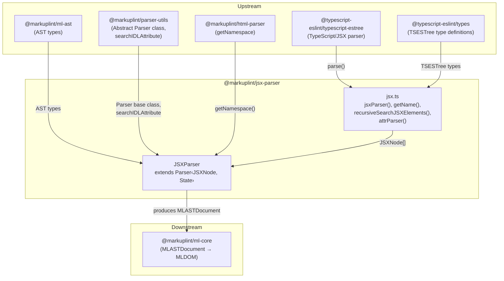
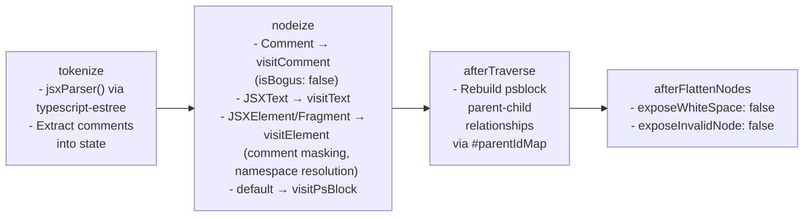
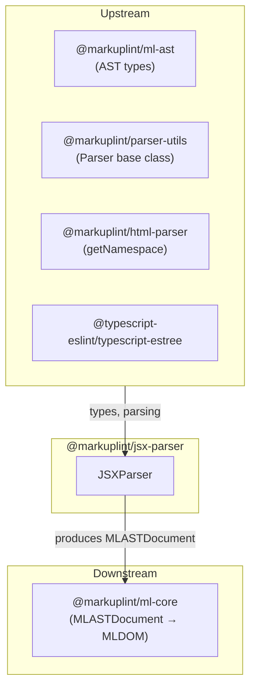

# @markuplint/jsx-parser

## Overview

`@markuplint/jsx-parser` is a full framework parser for markuplint that handles JSX and TSX syntax. It uses `@typescript-eslint/typescript-estree` to parse JavaScript/TypeScript source code into an ESTree-compatible AST, then recursively extracts all JSX elements and fragments from the AST tree. The extracted nodes are converted into the unified markuplint AST format (`MLASTDocument`). The package handles JSX-specific features including expression containers, fragments, spread attributes, IDL-to-content attribute mapping, and comment masking within JSX tags.

## Directory Structure

```
src/
├── index.ts              — Re-exports parser instance
├── parser.ts             — JSXParser class extending Parser<JSXNode, State>
├── jsx.ts                — JSX AST extraction utilities (jsxParser, getName, recursiveSearchJSXElements, attrParser)
├── index.spec.ts         — JSXParser integration tests
└── jsx.spec.ts           — JSX extraction utility tests
```

## Architecture Diagram



## JSXParser Class

### Inheritance

```
Parser<JSXNode, State>  (from @markuplint/parser-utils)
    └── JSXParser        (this package)
```

Unlike most framework parsers that extend `HtmlParser`, `JSXParser` extends the base `Parser` class directly. This is because JSX uses an entirely different tokenizer (`@typescript-eslint/typescript-estree`) rather than parse5, so the HTML-specific behaviors of `HtmlParser` (ghost elements, head/body optimization, fragment detection) are not needed.

### Constructor

The constructor configures the parser with JSX-specific options and initializes state:

```ts
super(
  {
    endTagType: 'xml',
    booleanish: true,
    tagNameCaseSensitive: true,
  },
  {
    comments: [],
  },
);
```

| Option                 | Value   | Meaning                                                                    |
| ---------------------- | ------- | -------------------------------------------------------------------------- |
| `endTagType`           | `'xml'` | JSX uses XML-style self-closing tags (`<br />`) rather than HTML void tags |
| `booleanish`           | `true`  | JSX attributes without values are treated as boolean (`disabled` = `true`) |
| `tagNameCaseSensitive` | `true`  | JSX preserves tag name casing (`<MyComponent>` is not lowercased)          |

### State Type

```ts
type State = {
  comments: readonly JSXComment[];
};
```

| Field      | Type                    | Purpose                                                                                   |
| ---------- | ----------------------- | ----------------------------------------------------------------------------------------- |
| `comments` | `readonly JSXComment[]` | Stores all comments extracted during tokenization, used later for comment masking in tags |

### #parentIdMap WeakMap

```ts
#parentIdMap = new WeakMap<MLASTNodeTreeItem, number | null>();
```

A private `WeakMap` that tracks the parent-child relationships between JSX expressions and their containing elements. Each markuplint node is mapped to the ID of its parent JSX element (or `null` for top-level nodes). This map is essential for the `afterTraverse()` method, which uses it to rebuild parent-child relationships for psblock (preprocessor-specific block) nodes such as `JSXExpressionContainer`.

### Override Methods

| Method                | Purpose                                                                                                     |
| --------------------- | ----------------------------------------------------------------------------------------------------------- | ---------------------------------------------- |
| `tokenize()`          | Invokes `jsxParser()` to parse source via TypeScript ESTree, extracts comments into state                   |
| `parseError()`        | Converts TypeScript ESTree parse errors (with `lineNumber`/`column`) to `ParserError`                       |
| `nodeize()`           | Converts JSX AST nodes to markuplint nodes, handling comments, text, elements, fragments, and psblock nodes |
| `afterTraverse()`     | Rebuilds parent-child relationships for psblock nodes using `#parentIdMap`                                  |
| `afterFlattenNodes()` | Calls parent with `exposeWhiteSpace: false` and `exposeInvalidNode: false`                                  |
| `visitComment()`      | Marks all comment nodes as `isBogus: false` (JSX uses JS comment syntax, not HTML bogus comments)           |
| `visitAttr()`         | Handles JSX-specific quoting (`{}`), IDL attribute mapping, and dynamic value detection                     |
| `parseCodeFragment()` | Delegates to parent with `namelessFragment: true`                                                           |
| `detectElementType()` | Uses `/^[A-Z]                                                                                               | \./` regex to detect component vs HTML element |

## JSX AST Extraction (jsx.ts)

### jsxParser()

The main entry point for JSX source code parsing:

1. Calls `@typescript-eslint/typescript-estree`'s `parse()` with the following options:
   - `comment: true` -- Extract comments from the AST
   - `errorOnUnknownASTType: false` -- Do not throw on unknown AST types
   - `jsx: true` -- Enable JSX parsing
   - `loc: true` -- Include location information
   - `range: true` -- Include range (offset) information
   - `tokens: false` -- Do not include token array
   - `useJSXTextNode: true` -- Produce `JSXText` nodes for text content
2. Calls `recursiveSearchJSXElements()` on the program body to collect all JSX elements and fragments
3. Appends all comments from `ast.comments`, annotating each with `__parentId: null`
4. Returns the combined flat array of `JSXNode[]`

### getName()

Resolves the fully qualified name of a JSX tag name expression. Handles three patterns:

| AST Node Type         | Example         | Resolution                                                     |
| --------------------- | --------------- | -------------------------------------------------------------- |
| `JSXIdentifier`       | `<div>`         | Returns `tagName.name` directly (e.g., `"div"`)                |
| `JSXMemberExpression` | `<Foo.Bar.Baz>` | Recursively resolves, joining with `.` (e.g., `"Foo.Bar.Baz"`) |
| `JSXNamespacedName`   | `<ns:tag>`      | Returns `"namespace:name"` format (e.g., `"ns:tag"`)           |

`JSXMemberExpression` resolution is recursive -- the `object` property can itself be another `JSXMemberExpression`, allowing arbitrarily deep chains like `A.B.C.D`.

### recursiveSearchJSXElements()

The core recursive traversal function that walks the entire TypeScript ESTree AST to collect JSX elements and fragments. It receives an array of AST nodes and a `parentId` (tracking which JSX element contains the current nodes).

#### ID Tracking

Each JSX element and fragment is assigned a unique ID via `idCounter()` (a monotonically increasing integer counter). This ID is passed as `parentId` when recursing into child nodes, establishing the parent-child relationship needed later by `afterTraverse()`.

#### Node Type Handling

The function uses a large `switch` statement that handles every `AST_NODE_TYPES` value. The handling falls into several categories:

**Skipped types (60+ types)** -- These node types cannot contain JSX and are skipped via `continue`:

- Leaf nodes: `Literal`, `Identifier`, `ThisExpression`, `Super`, `MetaProperty`
- Pattern nodes: `ArrayPattern`, `ObjectPattern`, `AssignmentPattern`
- Statement nodes: `EmptyStatement`, `BreakStatement`, `ContinueStatement`, `DebuggerStatement`
- Import/export specifiers: `ExportAllDeclaration`, `ExportSpecifier`, `ImportDefaultSpecifier`, `ImportExpression`, `ImportNamespaceSpecifier`, `ImportSpecifier`
- JSX internal nodes: `JSXIdentifier`, `JSXText`, `JSXOpeningElement`, `JSXClosingElement`, `JSXOpeningFragment`, `JSXClosingFragment`, `JSXNamespacedName`, `JSXEmptyExpression`, `JSXMemberExpression`
- TypeScript type nodes: `TSInterfaceBody`, `TSInterfaceDeclaration`, `TSInterfaceHeritage`, `TSTypeAliasDeclaration`, `TSTypeAnnotation`, `TSTypeOperator`, `TSTypeParameter`, `TSTypePredicate`, `TSTypeQuery`, `TSTypeReference`, `TSArrayType`, `TSIndexedAccessType`, `TSInferType`, `TSConditionalType`, `TSTemplateLiteralType`, `TSThisType`, `TSTupleType`, `TSRestType`, `TSImportType`, `TSLiteralType`, `TSMappedType`, `TSIntersectionType`, `TSOptionalType`, `TSUnionType`, `TSNamedTupleMember`, `TSNamespaceExportDeclaration`
- TypeScript keyword types: `TSAbstractKeyword`, `TSAnyKeyword`, `TSAsyncKeyword`, `TSBigIntKeyword`, `TSBooleanKeyword`, `TSDeclareKeyword`, `TSExportKeyword`, `TSIntrinsicKeyword`, `TSPrivateKeyword`, `TSNullKeyword`, `TSNumberKeyword`, `TSObjectKeyword`, `TSProtectedKeyword`, `TSPublicKeyword`, `TSReadonlyKeyword`, `TSStaticKeyword`, `TSUnknownKeyword`, `TSStringKeyword`, `TSSymbolKeyword`, `TSUndefinedKeyword`, `TSVoidKeyword`, `TSNeverKeyword`
- Other: `TemplateElement`, `PrivateIdentifier`

**JSX element/fragment collection**:

- `JSXElement` -- Pushes the node itself, recurses into `children` with a new unique `id`, checks for `JSXSpreadAttribute` in `openingElement.attributes` (flagging the element with `__hasSpreadAttribute` if present), and recurses into attributes
- `JSXFragment` -- Pushes the node itself, recurses into `children` with a new unique `id`

**Body-based recursion** (recurses into `.body`):

- `Program`, `BlockStatement`, `ClassBody`, `StaticBlock`, `TSModuleBlock` -- Recurse into `node.body` with `null` parentId
- `FunctionDeclaration`, `FunctionExpression`, `ArrowFunctionExpression`, `ClassDeclaration`, `ClassExpression`, `CatchClause`, `LabeledStatement` -- Recurse into `[node.body]` with current parentId

**Declaration/export recursion**:

- `VariableDeclaration` -- Recurses into `node.declarations`
- `VariableDeclarator` -- Recurses into `[node.init]`
- `ExportDefaultDeclaration`, `ExportNamedDeclaration` -- Recurse into `[node.declaration]`

**Expression recursion**:

- `ArrayExpression` -- Recurses into `node.elements`
- `ObjectExpression` -- Recurses into `node.properties`
- `CallExpression` -- Recurses into `node.arguments`
- `NewExpression` -- Recurses into `[node.callee, ...node.arguments]`
- `SequenceExpression` -- Recurses into `node.expressions`
- `TemplateLiteral` -- Recurses into both `node.expressions` and `node.quasis`
- `TaggedTemplateExpression` -- Recurses into `[node.tag, node.quasi]`
- `MemberExpression` -- Recurses into `[node.object, node.property]`
- `ConditionalExpression`, `IfStatement` -- Recurse into `[node.test, node.consequent, node.alternate]`
- `AssignmentExpression`, `BinaryExpression`, `LogicalExpression`, `TSQualifiedName` -- Recurse into `[node.left, node.right]`

**Unary-like recursion** (recurses into single `argument`):

- `UpdateExpression`, `UnaryExpression`, `ReturnStatement`, `AwaitExpression`, `JSXSpreadAttribute`, `SpreadElement`, `ThrowStatement`, `YieldExpression` -- Recurse into `[node.argument ?? null]`

**Expression wrapper recursion** (recurses into `.expression`):

- `ExpressionStatement`, `ChainExpression`, `Decorator`, `JSXExpressionContainer`, `JSXSpreadChild`, `TSAsExpression`, `TSClassImplements`, `TSExportAssignment`, `TSExternalModuleReference`, `TSNonNullExpression`, `TSTypeAssertion`, `TSInstantiationExpression`, `TSSatisfiesExpression`

**Control flow recursion**:

- `ForStatement` -- Recurses into `[node.init, node.test, node.update, node.body]`
- `ForInStatement`, `ForOfStatement` -- Recurse into `[node.right, node.body]`
- `WhileStatement` -- Recurses into `[node.test, node.body]`
- `DoWhileStatement` -- Recurses into `[node.body, node.test]`
- `SwitchStatement` -- Recurses into `node.cases` and `[node.discriminant]`
- `SwitchCase` -- Recurses into `[node.test, ...node.consequent]`
- `TryStatement` -- Recurses into `[node.block, node.handler, node.finalizer]`
- `WithStatement` -- Recurses into `[node.object, node.body]`

**Property/method recursion**:

- `Property`, `JSXAttribute` -- Recurse into `[node.value]`
- `MethodDefinition`, `TSAbstractMethodDefinition`, `PropertyDefinition`, `TSAbstractPropertyDefinition`, `AccessorProperty`, `TSAbstractAccessorProperty` -- Recurse into decorators (if present) and `[node.key, node.value]`
- `RestElement` -- Recurses into `[node.argument]`, decorators (if present), and `node.value` (if present)

**TypeScript-specific recursion**:

- `TSEnumDeclaration` -- Recurses into `node.members`
- `TSEnumMember` -- Recurses into `[node.id, node.initializer ?? null]`
- `TSCallSignatureDeclaration`, `TSConstructorType`, `TSConstructSignatureDeclaration`, `TSEmptyBodyFunctionExpression`, `TSFunctionType`, `TSTypeParameterDeclaration`, `TSTypeParameterInstantiation` -- Recurse into `node.params`
- `TSIndexSignature` -- Recurses into `node.parameters`
- `TSDeclareFunction` -- Recurses into `node.params` and `[node.body ?? null]`
- `TSImportEqualsDeclaration` -- Recurses into `[node.moduleReference]`
- `TSMethodSignature` -- Recurses into `[node.key]` and `node.params`
- `TSModuleDeclaration` -- Recurses into `[node.body ?? null]`
- `TSParameterProperty` -- Recurses into decorators (if present) and `[node.parameter]`
- `TSPropertySignature` -- Recurses into `[node.key]`
- `TSTypeLiteral` -- Recurses into `node.members`
- `ImportDeclaration` -- Recurses into `node.specifiers`
- `ImportAttribute` -- Recurses into `[node.value, node.key]`

**Fallback**: If a node type is not handled by any case, the function throws `new Error('Unsupported node')`.

### attrParser()

Validates JSX attribute expression syntax by parsing the code through `@typescript-eslint/typescript-estree`. On parse failure, it extracts the error location and creates a `SyntaxError` with an `index` property indicating the error offset. This function is used as the `parser` callback for the `{ start: '{', end: '}', type: 'script' }` quote set in `visitAttr()`.

## nodeize() Details

The `nodeize()` method is the central dispatch for converting JSX AST nodes into markuplint node tree items. It first checks `originNode.__alreadyNodeized` to prevent duplicate processing, then dispatches based on `originNode.type`:

### Block / Line (Comments)

```ts
case 'Block':
case 'Line':
```

Slices the source fragment using `originNode.range`, then calls `this.visitComment()`. The overridden `visitComment()` in JSXParser sets `isBogus: false` on all resulting comment nodes, since JSX comments (`// ...` and `/* ... */`) are JavaScript syntax, not HTML bogus comments.

### JSXText

```ts
case 'JSXText':
```

Slices the source fragment and calls `this.visitText()`. After the text nodes are created, each node is registered in `#parentIdMap` with the `originNode.__parentId` value. This parent ID tracking is essential for later psblock parent-child relationship rebuilding in `afterTraverse()`.

### JSXElement / JSXFragment

```ts
case 'JSXElement':
case 'JSXFragment':
```

This is the most complex branch:

1. **Tag identification**: For fragments, the opening tag is `originNode.openingFragment` and `nodeName` is `#jsx-fragment`. For elements, the opening tag is `originNode.openingElement` and `nodeName` is resolved via `getName()`.

2. **Comment masking**: Iterates through all comments stored in `this.state.comments`. For any comment whose range falls within the opening tag's range, the comment text is replaced with spaces (preserving newlines) using `commentToken.raw.replaceAll(/[^\n]/g, ' ')`. This prevents the tag attribute parser from being confused by comment syntax inside JSX opening tags.

3. **Namespace resolution**: Calls `getNamespace(nodeName, parentNamespace)` from `@markuplint/html-parser` to determine the correct namespace URI (HTML, SVG, or MathML).

4. **Element visit**: Calls `this.visitElement()` with:
   - The masked token, depth, parentNode, nodeName, and namespace
   - `originNode.children` as child nodes
   - Options: `namelessFragment: true`
   - A `createEndTagToken` callback that slices the closing tag fragment (from `closingFragment` or `closingElement`), returning `null` for self-closing elements without a closing tag

5. **Parent ID tracking**: After the nodes are created, each node is registered in `#parentIdMap` with the parent ID.

### Default (Expression Containers etc.)

```ts
default:
```

All other node types (primarily `JSXExpressionContainer`, `JSXSpreadChild`) are handled as preprocessor-specific blocks via `this.visitPsBlock()`. The `nodeName` is set to `originNode.type` (e.g., `JSXExpressionContainer`), resulting in `#ps:JSXExpressionContainer` in the AST. Empty child arrays and `null` conditional type are passed. Each resulting node is registered in `#parentIdMap`.

## afterTraverse()

The `afterTraverse()` method rebuilds parent-child relationships for psblock nodes. This is necessary because JSX expression containers (like `{items.map(item => <li>{item}</li>)}`) need to "adopt" their child elements that were collected separately during the recursive traversal.

The algorithm:

1. Calls `super.afterTraverse(nodeTree)` first
2. Walks the node tree looking for `psblock` type nodes
3. For each psblock node, retrieves its `nParentId` from `#parentIdMap`
4. Walks the node tree again looking for candidate child nodes where:
   - The candidate is not the same psblock node
   - The candidate has the same `dParentId` as the psblock's `nParentId`
   - The candidate has no `parentNode` yet
   - The candidate is not a `doctype` node
5. For matching candidates:
   - Updates the candidate's depth to `psBlockNode.depth + 1`
   - Appends the candidate as a child of the psblock via `this.appendChild()`

## Attribute Processing

### Quote Set

The `visitAttr()` method configures three quote types for JSX attributes:

| Start | End | Type     | Parser       | Example                 |
| ----- | --- | -------- | ------------ | ----------------------- |
| `"`   | `"` | `string` | (none)       | `className="foo"`       |
| `'`   | `'` | `string` | (none)       | `className='foo'`       |
| `{`   | `}` | `script` | `attrParser` | `onClick={handleClick}` |

When the attribute value is wrapped in `{}`, the `attrParser` function is invoked to validate the expression syntax.

### IDL Attribute Mapping

After parsing the attribute, `visitAttr()` calls `searchIDLAttribute(rawName)` from `@markuplint/parser-utils` to resolve IDL-to-content attribute mappings. Key mappings include:

| JSX (IDL) Attribute | HTML Content Attribute |
| ------------------- | ---------------------- |
| `className`         | `class`                |
| `htmlFor`           | `for`                  |
| `httpEquiv`         | `http-equiv`           |
| `tabIndex`          | `tabindex`             |
| `charSet`           | `charset`              |
| `autoComplete`      | `autocomplete`         |
| `crossOrigin`       | `crossorigin`          |

The resolved mapping is applied via `this.updateAttr()`:

- `potentialName` is set to the content attribute name (e.g., `class` for `className`)
- `candidate` is set to the IDL property name if it differs from the raw name (e.g., `tabIndex` when `tabindex` is written)

### Dynamic Value Flag

When the attribute uses curly braces (`{` / `}`), the attribute is marked with `isDynamicValue: true` via `this.updateAttr()`. This signals to downstream consumers that the value is a JavaScript expression rather than a static string.

### Spread Attributes

When `visitAttr()` receives a spread attribute (`{...props}`), the `super.visitAttr()` returns it with `type: 'spread'` and the method returns it directly without further processing (no IDL mapping or dynamic value detection is needed).

## Element Type Detection

The `detectElementType()` method uses the regex `/^[A-Z]|\./` to classify JSX element types:

| Pattern                       | Element Type    | Example                |
| ----------------------------- | --------------- | ---------------------- |
| Starts with uppercase         | `authored`      | `<MyComponent />`      |
| Contains a dot                | `authored`      | `<Foo.Bar />`          |
| Starts with `x-` (or similar) | `web-component` | `<x-custom-element />` |
| All other lowercase           | `html`          | `<div>`, `<span>`      |

This matches React's convention where user-defined components must be capitalized and member expressions (dot notation) reference component properties.

## Parse Pipeline



## Version Compatibility

The parser depends on `@typescript-eslint/typescript-estree` and `@typescript-eslint/types` for TypeScript/JSX parsing. These packages support a wide range of TypeScript and JSX syntax versions. The parser options set `errorOnUnknownASTType: false` to gracefully handle newer AST node types that may be added in future TypeScript versions.

The `recursiveSearchJSXElements()` function exhaustively handles all known `AST_NODE_TYPES` and throws `'Unsupported node'` for any unrecognized type, which provides a clear signal when `@typescript-eslint` introduces new node types that need handling.

## Key Source Files

| File        | Purpose                                                                                |
| ----------- | -------------------------------------------------------------------------------------- |
| `parser.ts` | `JSXParser` class -- constructor, nodeize, afterTraverse, visitAttr, detectElementType |
| `jsx.ts`    | `jsxParser()`, `getName()`, `recursiveSearchJSXElements()`, `attrParser()`, types      |
| `index.ts`  | Re-exports `parser` instance                                                           |

## External Dependencies

| Dependency                             | Purpose                                                                             |
| -------------------------------------- | ----------------------------------------------------------------------------------- |
| `@markuplint/ml-ast`                   | AST type definitions (`MLASTNodeTreeItem`, `MLASTParentNode`)                       |
| `@markuplint/parser-utils`             | Abstract `Parser` class, `ParserError`, `searchIDLAttribute`, `ChildToken`, `Token` |
| `@markuplint/html-parser`              | `getNamespace()` for namespace resolution                                           |
| `@typescript-eslint/typescript-estree` | TypeScript/JSX parsing via `parse()`                                                |
| `@typescript-eslint/types`             | `TSESTree` type definitions for AST nodes                                           |

## Integration Points



### Upstream

- **`@markuplint/ml-ast`** -- AST type definitions used throughout the parser
- **`@markuplint/parser-utils`** -- Abstract `Parser` class that `JSXParser` extends, plus `searchIDLAttribute` for IDL attribute mapping and `ParserError` for error handling
- **`@markuplint/html-parser`** -- Provides `getNamespace()` for resolving element namespaces (HTML, SVG, MathML)
- **`@typescript-eslint/typescript-estree`** -- The underlying TypeScript/JSX parser that performs AST generation
- **`@typescript-eslint/types`** -- TSESTree type definitions for all AST node types

### Downstream

- **`@markuplint/ml-core`** -- Consumes the `MLASTDocument` produced by this parser to build the MLDOM for linting

## Documentation Map

- [Maintenance Guide](docs/maintenance.md) -- Commands, recipes, and troubleshooting
