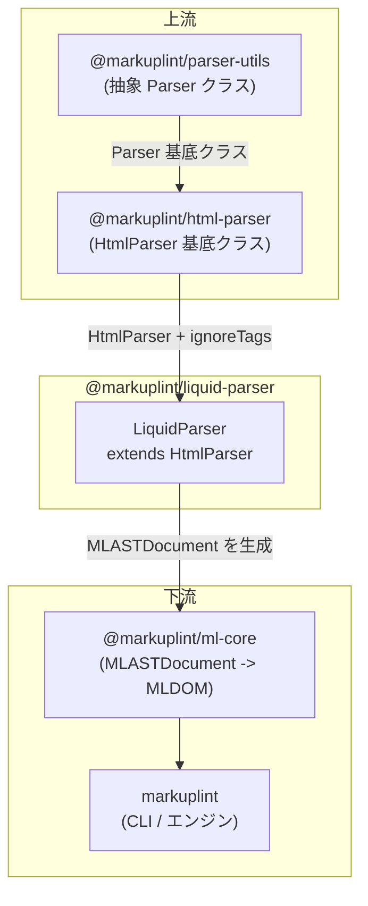

# @markuplint/liquid-parser

## 概要

`@markuplint/liquid-parser` は Liquid テンプレート用の markuplint パーサープラグインです。`@markuplint/html-parser` の `HtmlParser` を拡張し、Liquid のブロックタグ（``）と出力式（`{{ ... }}`）を不透明ブロックとして扱います。これにより、テンプレート構文に影響されることなく、周囲の HTML 構造を markuplint でリントできます。

## 動作の仕組み

パーサーは基底クラス `HtmlParser` が提供する **ignoreTags** メカニズムを使用します。`HtmlParser` は `ignoreTags` エントリに遭遇すると、`start` と `end` のデリミタ間のコンテンツを AST 内の不透明な疑似要素ノード（`#ps:` プレフィックス付き）として扱います。これにより、Liquid 式は AST に保持されますが HTML としてはパースされないため、HTML リントルールに干渉しません。

`LiquidParser` クラスは適切な `ignoreTags` 設定を `HtmlParser` のコンストラクタに渡すだけで、追加のパースロジックは不要です。

## ignoreTags 設定

| タイプ          | 開始 | 終了 | 説明                                        |
| --------------- | ---- | ---- | ------------------------------------------- |
| `liquid-block`  | `` | ブロックタグ（if, for, assign, capture 等） |
| `liquid-output` | `{{` | `}}` | 出力 / 変数展開式                           |

パースされたノードは AST 内でそれぞれ `#ps:liquid-block` および `#ps:liquid-output` というノード名で表示されます。

## サポートされない構文

**引用符なしの属性値**内のテンプレート式はサポートされていません。これはすべてのテンプレートエンジンパーサーに共通する既知の制限です（[#240](https://github.com/markuplint/markuplint/issues/240)）。[ウェブサイトのドキュメント](https://markuplint.dev/docs/guides/besides-html)も参照してください。

使用可能:

```html
<div attr="{{ value }}"></div>
<div attr="{{ value }}"></div>
<div attr="{{ value }}-{{ value2 }}-{{ value3 }}"></div>
```

使用不可（引用符なし）:

```html
<div attr="{{" value }}></div>
```

## ディレクトリ構成

```
src/
├── index.ts        — parser.ts から parser を再エクスポート
├── parser.ts       — HtmlParser を継承する LiquidParser クラス
└── index.spec.ts   — ignoreTags の動作を検証するテスト
```

## 主要ソースファイル

| ファイル    | 用途                                                                                            |
| ----------- | ----------------------------------------------------------------------------------------------- |
| `parser.ts` | `LiquidParser`（`HtmlParser` を継承）を定義し、シングルトン `parser` インスタンスをエクスポート |
| `index.ts`  | パッケージエントリポイント; `parser` を再エクスポート                                           |

## 統合ポイント



### 上流

- **`@markuplint/html-parser`** -- `LiquidParser` が継承する `HtmlParser` を提供。`ignoreTags` コンストラクタオプションが中核メカニズム
- **`@markuplint/parser-utils`** -- `HtmlParser` 経由の間接依存; 抽象 `Parser` クラスと `ignoreTags` 処理を提供

### 下流

- **`@markuplint/ml-core`** -- このパーサーが生成する `MLASTDocument` を消費して MLDOM を構築
- **`markuplint`** -- CLI/エンジンが Liquid ファイル用に設定された場合にこのパーサーをロード

## ドキュメントマップ

- [メンテナンスガイド](docs/maintenance.ja.md) -- コマンド、レシピ、トラブルシューティング
