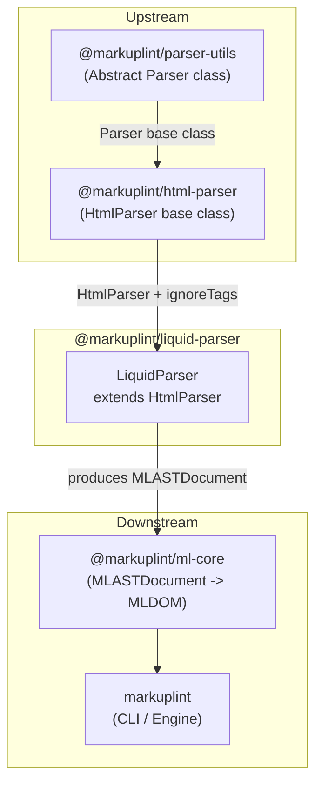

# @markuplint/liquid-parser

## Overview

`@markuplint/liquid-parser` is a markuplint parser plugin for Liquid templates. It extends `HtmlParser` from `@markuplint/html-parser` to treat Liquid block tags (``) and output expressions (`{{ ... }}`) as opaque blocks, allowing markuplint to lint the surrounding HTML structure without being confused by template syntax.

## How It Works

The parser uses the **ignoreTags** mechanism provided by the base `HtmlParser` class. When `HtmlParser` encounters an `ignoreTags` entry, it treats the content between the `start` and `end` delimiters as an opaque pseudo-element node in the AST (prefixed with `#ps:`). This means the Liquid expressions are preserved in the AST but are not parsed as HTML, so they do not interfere with HTML linting rules.

The `LiquidParser` class simply passes the appropriate `ignoreTags` configuration to the `HtmlParser` constructor -- no additional parsing logic is needed.

## ignoreTags Configuration

| Type            | Start | End  | Description                                 |
| --------------- | ----- | ---- | ------------------------------------------- |
| `liquid-block`  | `` | Block tags (if, for, assign, capture, etc.) |
| `liquid-output` | `{{`  | `}}` | Output / variable interpolation expressions |

Parsed nodes appear in the AST with node names `#ps:liquid-block` and `#ps:liquid-output` respectively.

## Unsupported Syntaxes

Template expressions inside **unquoted attribute values** are not supported. This is a known limitation shared by all template engine parsers ([#240](https://github.com/markuplint/markuplint/issues/240)). See also the [website documentation](https://markuplint.dev/docs/guides/besides-html).

Available:

```html
<div attr="{{ value }}"></div>
<div attr="{{ value }}"></div>
<div attr="{{ value }}-{{ value2 }}-{{ value3 }}"></div>
```

Unavailable (unquoted):

```html
<div attr="{{" value }}></div>
```

## Directory Structure

```
src/
├── index.ts        — Re-exports parser from parser.ts
├── parser.ts       — LiquidParser class extending HtmlParser
└── index.spec.ts   — Tests verifying ignoreTags behavior
```

## Key Source Files

| File        | Purpose                                                                                   |
| ----------- | ----------------------------------------------------------------------------------------- |
| `parser.ts` | Defines `LiquidParser` (extends `HtmlParser`) and exports the singleton `parser` instance |
| `index.ts`  | Package entry point; re-exports `parser`                                                  |

## Integration Points



### Upstream

- **`@markuplint/html-parser`** -- Provides `HtmlParser` which `LiquidParser` extends. The `ignoreTags` constructor option is the core mechanism
- **`@markuplint/parser-utils`** -- Indirect dependency via `HtmlParser`; provides the abstract `Parser` class and `ignoreTags` processing

### Downstream

- **`@markuplint/ml-core`** -- Consumes the `MLASTDocument` produced by this parser to build the MLDOM
- **`markuplint`** -- The CLI/engine loads this parser when configured for Liquid files

## Documentation Map

- [Maintenance Guide](docs/maintenance.md) -- Commands, recipes, and troubleshooting
