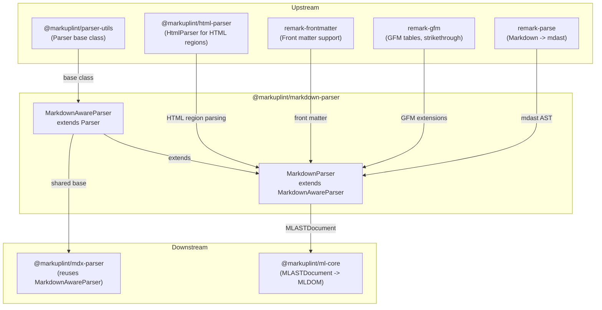

# @markuplint/markdown-parser

## Overview

`@markuplint/markdown-parser` parses Markdown (`.md`) files for markuplint. It converts both Markdown-native syntax and embedded HTML into markuplint's AST. Markdown constructs (headings, links, images, lists, emphasis, tables, etc.) are mapped to their equivalent HTML elements, enabling lint rules like `heading-levels`, `required-attr`, and `wai-aria` to work on Markdown content. Raw HTML regions are delegated to `HtmlParser`.

## Design Decisions

### Why `remark-parse` (unified ecosystem)?

| Approach                     | Pros                                                                    | Cons                                                              | Verdict    |
| ---------------------------- | ----------------------------------------------------------------------- | ----------------------------------------------------------------- | ---------- |
| **`remark-parse`** (unified) | De facto standard; mdast AST with position info; extensible via plugins | Adds unified ecosystem as dependency                              | **Chosen** |
| **`@mdx-js/mdx`**            | Official MDX package                                                    | Wraps `remark-parse` internally; adds 24 unnecessary dependencies | Rejected   |
| **`micromark`** (direct)     | Maximum control; lowest level                                           | Must build mdast conversion manually; no practical benefit        | Rejected   |

### Why extend `Parser` via `MarkdownAwareParser` (not `HtmlParser`)?

Earlier designs extended `HtmlParser` and treated Markdown as opaque psblock nodes. The current design extends `Parser<MdastNode>` through `MarkdownAwareParser` because:

1. **Markdown elements are now lintable** -- headings, links, images, etc. are converted to their HTML equivalents, enabling rule coverage
2. **Synthetic attributes** -- Markdown's `` produces `` with synthesized attributes
3. **Shared base class** -- `MarkdownAwareParser` provides common Markdown-to-HTML conversion logic reused by `@markuplint/mdx-parser`

Raw HTML regions (CommonMark HTML blocks and inline HTML) are still parsed via a cached `HtmlParser` instance for full HTML support.

### Markdown elements as HTML equivalents

| Markdown Syntax     | HTML Element               | Attributes                       |
| ------------------- | -------------------------- | -------------------------------- |
| `# Heading`         | `h1`-`h6`                  | --                               |
| `[text](url)`       | `a`                        | `href`, optionally `title`       |
| ``       | `img`                      | `src`, `alt`, optionally `title` |
| `*text*` / `_text_` | `em`                       | --                               |
| `**text**`          | `strong`                   | --                               |
| `- item`            | `ul` > `li`                | --                               |
| `1. item`           | `ol` > `li`                | `start` when != 1                |
| `> quote`           | `blockquote`               | --                               |
| `` `code` ``        | `code`                     | --                               |
| ` ```lang ... ``` ` | `pre` > `code`             | `class="language-{lang}"`        |
| `---`               | `hr`                       | --                               |
| GFM `\| table \|`   | `table` > `tr` > `th`/`td` | --                               |
| GFM `~~text~~`      | `del`                      | --                               |
| `[text][ref]`       | `a`                        | resolved from definitions        |
| `![alt][ref]`       | `img`                      | resolved from definitions        |

### Synthetic attribute positions

Markdown syntax does not have discrete source positions for attributes. Synthesized attributes (e.g., `href` from `[text](url)`) point to the element's own token range. This is an intentional trade-off: markuplint can check attribute existence and values, but attribute-level source positions are approximate.

### blockquote and cite

The HTML `<blockquote>` element supports a `cite` attribute for source URLs, but Markdown's `> quote` syntax has no equivalent. The parser does not synthesize a `cite` attribute.

## How It Works

```
.md source file
    |
    v
[remark-parse + remark-gfm + remark-frontmatter]
    |                       Parse Markdown into mdast AST
    v
[collectDefinitions()]     Extract [id]: url definitions
    |
    v
[nodeize() per mdast node]
    |
    +-- heading         -->  h1-h6 element with text children
    +-- paragraph       -->  p element with inline children
    +-- emphasis/strong -->  em/strong elements
    +-- link            -->  a element with href, title attrs
    +-- image           -->  img element with src, alt, title attrs
    +-- list/listItem   -->  ul/ol > li elements
    +-- blockquote      -->  blockquote element
    +-- inlineCode      -->  code element with text child
    +-- code (fenced)   -->  pre > code elements
    +-- table/row/cell  -->  table > tr > th/td elements
    +-- delete (GFM)    -->  del element
    +-- linkReference   -->  a element (resolved) or psblock
    +-- imageReference  -->  img element (resolved) or psblock
    +-- html            -->  HtmlParser.parse() with offset mapping
    +-- text            -->  MLASTText
    +-- yaml            -->  psblock (#ps:yaml)
    +-- definition      -->  psblock
    v
MLASTDocument             Positions reference the original .md file
```

### Class Hierarchy

```
Parser<MdastNode>               (from @markuplint/parser-utils)
  |
  MarkdownAwareParser           (shared Markdown-to-HTML conversion)
    |                            - createSyntheticAttr()
    |                            - visitMarkdownElement()
    |                            - visitLinkElement() / visitImageElement()
    |                            - visitListElement() / visitCodeBlock()
    |                            - visitTableElement()
    |                            - nodeizeMarkdownNode()
    |                            - collectDefinitions()
    |
    MarkdownParser              (this package)
      |                          - tokenize(): remark-parse + remark-gfm
      |                          - nodeize(): delegates then handles html/text/yaml
      |                          - #htmlParser: cached HtmlParser for HTML regions
```

### Embedded HTML regions and parse errors

Every inline HTML block (mdast `html` node) is re-parsed by the cached `#htmlParser`. The embedded call hard-sets `parserOptions.documentMode: 'fragment'` for two reasons:

1. Markdown's HTML blocks are partials by definition — the host Markdown file owns the document boundary, so the embedded HTML can never legitimately be a full document.
2. Without forcing fragment mode, parse5 would emit `missing-doctype` / `misplaced-doctype` on every inline HTML block (bare `<head>`, `<meta charset>`, etc.), spamming users who opt in to `severity.parseError`.

The embedded `HtmlParser` may still emit **tokenizer-level** parse errors (e.g. `duplicate-attribute`, `nested-comment`). These are surfaced through `Parser.accumulateParseErrors()` (provided by `@markuplint/parser-utils`) into the outer `MLASTDocument.parseErrors` array, so users see them with correct offsets relative to the Markdown source.

### GFM Table Header Detection

GFM tables use the first row as the header row. The parser tracks this via:

1. `visitTableElement()` records the first row's source offset in `#headerRowOffsets`
2. `nodeizeMarkdownNode()` for `tableRow` checks the offset set to decide `th` vs `td`
3. The set is consumed (deleted) after use, so subsequent rows produce `td` cells

### Link/Image Reference Resolution

1. `tokenize()` calls `collectDefinitions()` to build a `Map<identifier, Definition>`
2. `nodeizeMarkdownNode()` dispatches `linkReference`/`imageReference` to resolution methods
3. Resolved references produce `<a>` or `` elements; unresolved ones become psblock nodes
4. Note: remark-parse resolves references at parse time when definitions exist, so unresolved references typically appear as plain text rather than `linkReference` nodes

## Architecture Diagram



## External Dependencies

| Dependency                 | Purpose                                |
| -------------------------- | -------------------------------------- |
| `@markuplint/html-parser`  | Parses raw HTML regions in Markdown    |
| `@markuplint/ml-ast`       | AST type definitions                   |
| `@markuplint/parser-utils` | Parser base class, token utilities     |
| `unified`                  | Processor pipeline for remark          |
| `remark-parse`             | Markdown -> mdast parser               |
| `remark-gfm`               | GFM extensions (tables, strikethrough) |
| `remark-frontmatter`       | Front matter (YAML) support in mdast   |

## Directory Structure

```
src/
+-- index.ts                 -- Re-exports parser instance and MarkdownAwareParser
+-- parser.ts                -- MarkdownParser class
+-- markdown-aware-parser.ts -- MarkdownAwareParser shared base class
+-- index.spec.ts            -- Unit and integration tests
```

## Relationship to @markuplint/mdx-parser

Both parsers share `MarkdownAwareParser` as a common base class. The key differences:

| Aspect          | markdown-parser (.md)      | mdx-parser (.mdx)                  |
| --------------- | -------------------------- | ---------------------------------- |
| Base class      | MarkdownAwareParser        | MarkdownAwareParser                |
| HTML regions    | HtmlParser re-parse        | parseCodeFragment (XML-style)      |
| JSX support     | No                         | Yes (components, expressions, ESM) |
| Attribute style | HTML (`class`, `for`)      | JSX (`className`, `htmlFor`)       |
| Tag closing     | HTML rules (void elements) | XML rules (self-closing required)  |
| Spec package    | None needed                | `@markuplint/react-spec`           |
