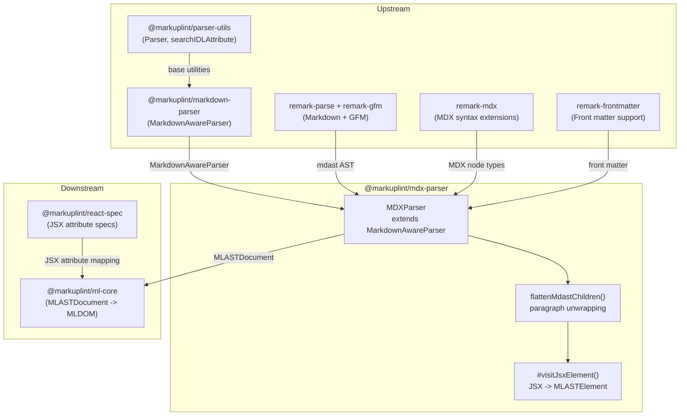

# @markuplint/mdx-parser

## Overview

`@markuplint/mdx-parser` parses MDX (`.mdx`) files for markuplint. MDX combines Markdown with JSX, allowing React components, JavaScript expressions, and ES module imports/exports alongside Markdown content. This parser converts both JSX elements and Markdown constructs into markuplint's AST, enabling lint rules to work on MDX documents.

## Design Decisions

### Why extend `MarkdownAwareParser`?

Both plain Markdown and MDX share the same Markdown constructs (headings, links, images, lists, emphasis, etc.). The `MarkdownAwareParser` base class (from `@markuplint/markdown-parser`) provides shared conversion logic for these constructs. The MDX parser adds:

1. **JSX element handling** -- `mdxJsxFlowElement`/`mdxJsxTextElement` mapped to `MLASTElement`
2. **Expression handling** -- `{expr}` mapped to psblock nodes
3. **ESM handling** -- `import`/`export` mapped to psblock nodes
4. **JSX-specific options** -- XML-style end tags, booleanish attributes, case-sensitive tag names

### MDX JSX vs HTML

| Aspect            | Markdown HTML             | MDX JSX                             |
| ----------------- | ------------------------- | ----------------------------------- |
| Self-closing tags | Optional (`<br>`)         | Required (`<br />`)                 |
| Comments          | `<!-- comment -->`        | `{/* comment */}`                   |
| Attribute names   | HTML (`class`, `for`)     | JSX (`className`, `htmlFor`)        |
| Attribute values  | Strings only (`data="x"`) | Strings or expressions (`data={x}`) |
| Components        | Not supported             | `<MyComponent />`                   |

### Why `remark-parse` + `remark-mdx` (not `@mdx-js/mdx`)?

`@mdx-js/mdx` internally wraps `remark-parse` + `remark-mdx` and adds ~24 unnecessary dependencies for JS compilation that markuplint doesn't need. The parse-stage mdast is identical either way.

### MDX v2/v3 only (not v1)

MDX v1 uses a fundamentally different parser architecture with no shared code. Since v1 is deprecated and the ecosystem has migrated, we target v2/v3 only.

### No `@markuplint/mdx-spec` package needed

MDX uses React JSX syntax. The existing `@markuplint/react-spec` provides JSX attribute mappings:

```json
{
  "parser": { "\\.mdx$": "@markuplint/mdx-parser" },
  "specs": { "\\.mdx$": "@markuplint/react-spec" }
}
```

## How It Works

```
.mdx source file
    |
    v
[remark-parse + remark-gfm + remark-mdx + remark-frontmatter]
    |
    v
[collectDefinitions()]       Extract [id]: url definitions
    |
    v
[flattenMdastChildren()]     Unwrap JSX elements from paragraph wrappers
    |
    v
[nodeize() per mdast node]
    |
    +-- mdxJsxFlowElement   -->  MLASTElement via parseCodeFragment
    +-- mdxJsxTextElement   -->  MLASTElement via parseCodeFragment
    +-- mdxFlowExpression   -->  psblock
    +-- mdxTextExpression   -->  psblock
    +-- mdxjsEsm            -->  psblock (import/export)
    +-- heading             -->  h1-h6 element (via MarkdownAwareParser)
    +-- paragraph           -->  p element
    +-- emphasis/strong     -->  em/strong elements
    +-- link/image          -->  a/img elements with attributes
    +-- list/listItem       -->  ul/ol > li elements
    +-- blockquote          -->  blockquote element
    +-- inlineCode/code     -->  code / pre>code elements
    +-- table/row/cell      -->  table > tr > th/td elements
    +-- delete (GFM)        -->  del element
    +-- linkReference       -->  a element (resolved) or psblock
    +-- imageReference      -->  img element (resolved) or psblock
    +-- text                -->  MLASTText
    +-- yaml                -->  psblock (#ps:yaml)
    +-- html (rare in MDX)  -->  parseCodeFragment
    v
MLASTDocument
```

### Class Hierarchy

```
Parser<MdastNode>               (from @markuplint/parser-utils)
  |
  MarkdownAwareParser           (from @markuplint/markdown-parser)
    |                            - Shared Markdown-to-HTML conversion
    |
    MDXParser                   (this package)
      |                          - tokenize(): remark-parse + remark-gfm + remark-mdx
      |                          - nodeize(): MDX types first, then Markdown delegation
      |                          - #visitJsxElement(): JSX -> MLASTElement
      |                          - visitAttr(): JSX attribute handling (quoteSet, IDL mapping)
      |                          - detectElementType(): uppercase/dot = authored
```

### Paragraph Flattening

MDX's remark-mdx wraps inline JSX elements in `paragraph` nodes:

```mdx
Text with <Badge>inline</Badge> component.
```

produces a `paragraph` containing `text`, `mdxJsxTextElement`, `text`. The `flattenMdastChildren()` function detects paragraphs containing JSX and unwraps their children to the top level, ensuring JSX elements are directly accessible.

Pure Markdown paragraphs (no JSX) are kept as-is and converted to `<p>` elements.

### JSX Element Handling

JSX elements are parsed via `parseCodeFragment()` with `namelessFragment: true`:

1. **Self-closing** (`<Component prop="val" />`): entire token is the start tag
2. **With children** (`<Card>...</Card>`): split into start tag token + children + end tag token
3. **Fragments** (`<>...</>`): produce `#jsx-fragment` nodes

The start tag is parsed by `parseCodeFragment` to extract attributes, then `visitElement()` wires up children.

### JSX Attribute Handling

| Attribute Form     | Example                    | Mapping                  |
| ------------------ | -------------------------- | ------------------------ |
| String value       | `name="email"`             | Standard attribute       |
| Expression value   | `data={value}`             | `isDynamicValue: true`   |
| Object expression  | `style={{ color: "red" }}` | `isDynamicValue: true`   |
| Boolean (no value) | `disabled`                 | Empty value (booleanish) |
| Spread             | `{...props}`               | `type: 'spread'`         |

IDL attribute mapping (`className` -> `class`, `htmlFor` -> `for`) via `searchIDLAttribute()`.

### Component Detection

| Tag               | `detectElementType()` | Example                     |
| ----------------- | --------------------- | --------------------------- |
| `<div>`           | `html`                | Native HTML element         |
| `<MyComponent>`   | `authored`            | React component             |
| `<Layout.Header>` | `authored`            | Member expression component |
| `<x-widget>`      | `web-component`       | Custom element              |

## Architecture Diagram



## External Dependencies

| Dependency                    | Purpose                                       |
| ----------------------------- | --------------------------------------------- |
| `@markuplint/markdown-parser` | MarkdownAwareParser base class                |
| `@markuplint/ml-ast`          | AST type definitions                          |
| `@markuplint/parser-utils`    | Parser utilities, `searchIDLAttribute`        |
| `unified`                     | Processor pipeline for remark                 |
| `remark-parse`                | Markdown -> mdast parser                      |
| `remark-gfm`                  | GFM extensions (tables, strikethrough)        |
| `remark-mdx`                  | MDX syntax extensions (JSX, expressions, ESM) |
| `remark-frontmatter`          | Front matter (YAML) support                   |

## Directory Structure

```
src/
+-- index.ts              -- Re-exports parser instance
+-- parser.ts             -- MDXParser class, flattenMdastChildren helper
+-- index.spec.ts         -- Unit and integration tests
```

## Relationship to @markuplint/markdown-parser

Both parsers share `MarkdownAwareParser` as a common base class:

| Aspect          | markdown-parser (.md)      | mdx-parser (.mdx)                  |
| --------------- | -------------------------- | ---------------------------------- |
| Base class      | MarkdownAwareParser        | MarkdownAwareParser                |
| HTML regions    | HtmlParser re-parse        | parseCodeFragment (XML-style)      |
| JSX support     | No                         | Yes (components, expressions, ESM) |
| Attribute style | HTML (`class`, `for`)      | JSX (`className`, `htmlFor`)       |
| Tag closing     | HTML rules (void elements) | XML rules (self-closing required)  |
| Spec package    | None needed                | `@markuplint/react-spec`           |
