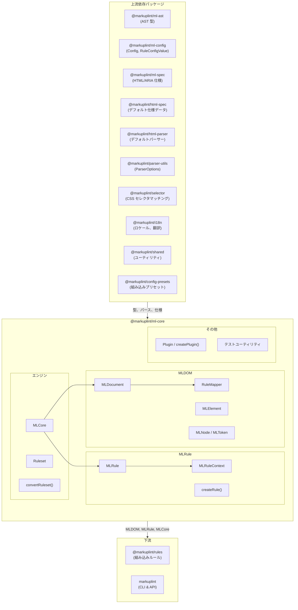
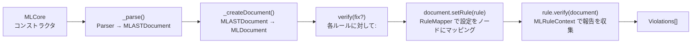
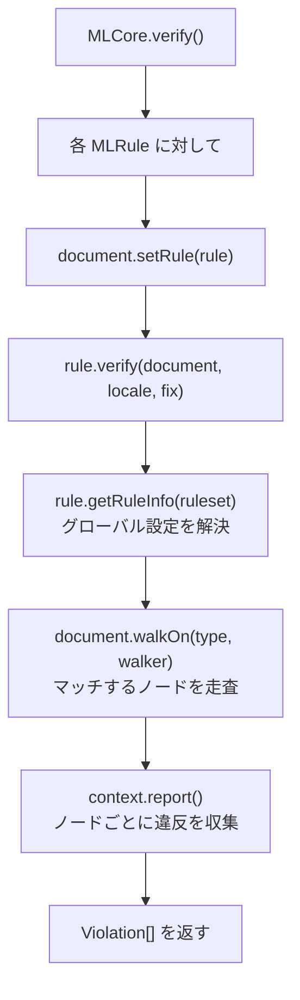
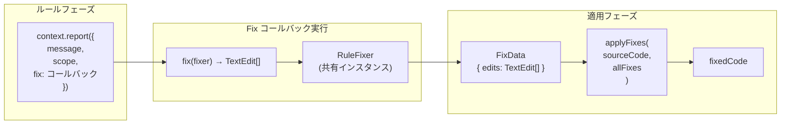
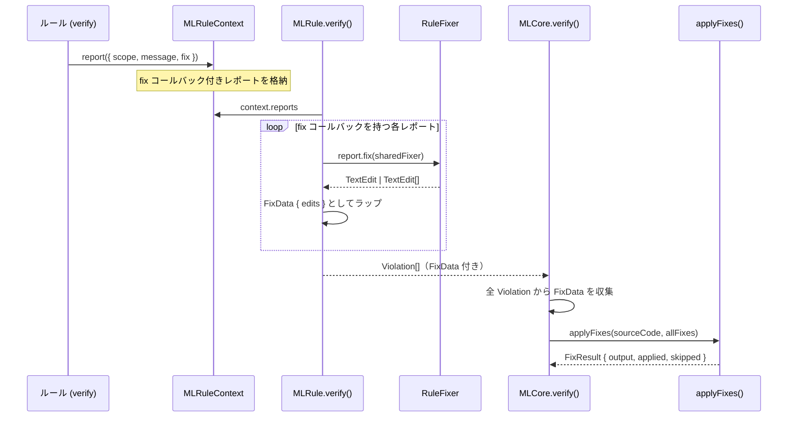
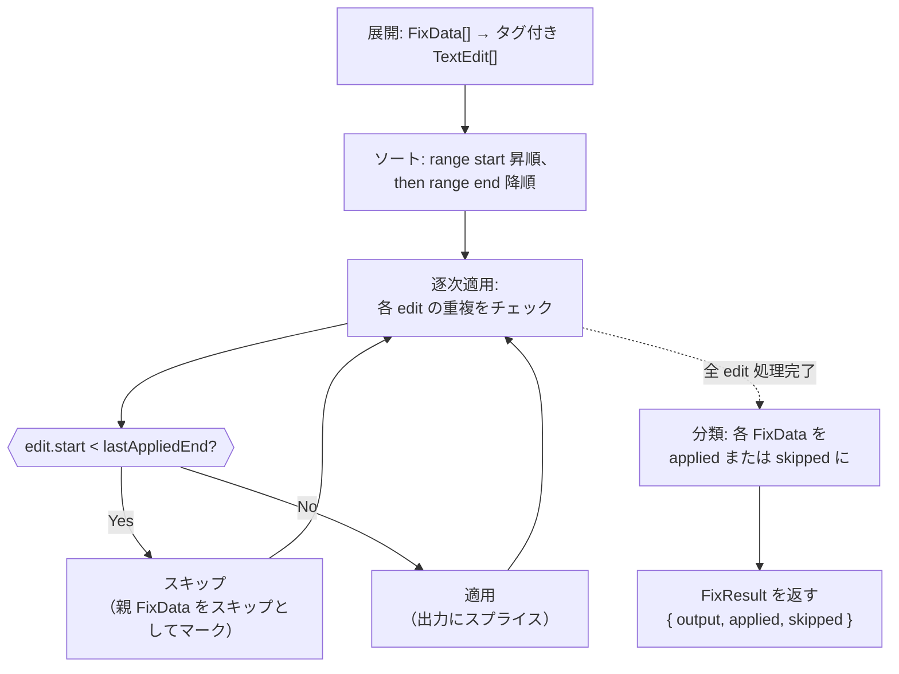
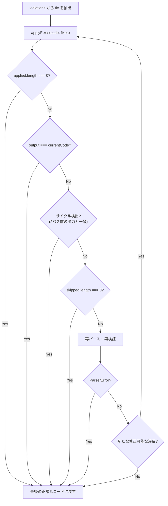
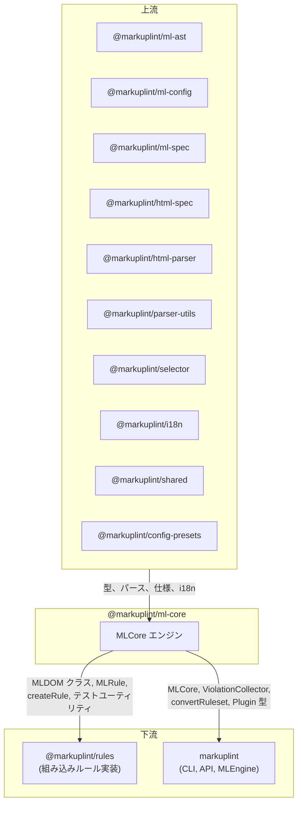

# @markuplint/ml-core

## 概要

`@markuplint/ml-core` は markuplint のコアリンティングエンジンです。パースされた AST（`MLASTDocument`）を DOM ツリー（`MLDOM`）に変換し、設定されたルールをノードに適用して違反を収集します。パッケージは 3 つのサブシステムで構成されます：**MLDOM**（DOM 抽象化レイヤー）、**MLRule**（ルール実行フレームワーク）、**MLCore**（オーケストレーションエンジン）。

## ディレクトリ構造

```
src/
├── index.ts                          — 公開 API の再エクスポート
├── ml-core.ts                        — MLCore エンジンクラス
├── types.ts                          — MLFabric, MLSchema 型定義
├── convert-ruleset.ts                — Config → Ruleset 変換
├── debug.ts                          — デバッグログユーティリティ
├── violation-collector.ts            — 複数ファイルの違反集約
├── ml-dom/
│   ├── index.ts                      — MLDOM 公開エクスポート
│   ├── node/
│   │   ├── document.ts               — MLDocument（ルートノード、ルールマッピング、pretender 初期化）
│   │   ├── element.ts                — MLElement（属性、セレクタ、名前空間）
│   │   ├── node.ts                   — MLNode（全ノードの抽象基底クラス）
│   │   ├── parent-node.ts            — MLParentNode（querySelector, children）
│   │   ├── character-data.ts         — MLCharacterData（テキスト系の抽象基底）
│   │   ├── text.ts                   — MLText
│   │   ├── comment.ts                — MLComment
│   │   ├── attr.ts                   — MLAttr（属性トークン）
│   │   ├── block.ts                  — MLBlock（プリプロセッサブロック）
│   │   ├── document-fragment.ts      — MLDocumentFragment
│   │   ├── document-type.ts          — MLDocumentType
│   │   ├── element-close-tag.ts      — MLElementCloseTag
│   │   ├── rule-mapper.ts            — RuleMapper（ルールセット → ノードマッピング）
│   │   ├── types.ts                  — ノード型定数、AccessibilityProperties
│   │   └── node-list.ts              — NodeList/HTMLCollection ユーティリティ
│   ├── token/
│   │   └── token.ts                  — MLToken（位置情報付き基底トークン）
│   ├── helper/
│   │   ├── accname.ts                — アクセシブル名の計算
│   │   ├── create-node.ts            — AST → MLDOM ノードファクトリ
│   │   ├── walkers.ts                — ツリー走査（同期/非同期ウォーカー）
│   │   ├── get-indent.ts             — インデント解析
│   │   └── debug.ts                  — デバッグマップ生成
│   └── manipulations/
│       ├── child-node-methods.ts     — ChildNode インターフェーススタブ
│       └── get-children.ts           — 要素の子要素抽出
├── virtual-rule.ts                   — Named nodeRule の展開（expandNamedNodeRules）
├── virtual-rule.spec.ts              — 仮想ルールのユニットテスト
├── ml-rule/
│   ├── ml-rule.ts                    — MLRule クラス（ルール実行）
│   ├── ml-rule-context.ts            — MLRuleContext（レポート収集）
│   ├── rule-fixer.ts                 — RuleFixer（fix コールバック用の TextEdit ビルダー）
│   ├── create-rule.ts                — createRule ファクトリ
│   ├── create-test-rule.ts           — テスト用ルールファクトリ
│   └── types.ts                      — RuleSeed, Checker 型
├── fix-applier.ts                    — applyFixes（重複検出付き TextEdit 適用エンジン）
├── ruleset/
│   └── index.ts                      — Ruleset クラス（rules + nodeRules + childNodeRules）
├── plugin/
│   ├── plugin.ts                     — createPlugin ファクトリ
│   ├── types.ts                      — Plugin, PluginCreator 型
│   └── index.ts                      — Plugin エクスポート
├── test/
│   └── index.ts                      — createTestDocument, createTestElement, dummySchemas
└── utils/
    ├── index.ts                      — ユーティリティエクスポート
    ├── get-location-from-chars.ts    — 文字位置解決
    └── string-splice.ts             — 文字列スプライスヘルパー
```

## アーキテクチャ図



## リンティングパイプライン

`MLCore.verify()` メソッドがリンティング全体を制御します：



### ステップごとの説明

1. **パース**: `MLCore` は設定されたパーサー（`MLParser`）を呼び出し、`MLASTDocument` を生成
2. **ドキュメント作成**: AST を `MLDocument` でラップし、`createNode()` ファクトリで MLDOM ツリー全体を構築。`RuleMapper` が各ノードのルール設定を解決
3. **検証**: 各 `MLRule` に対して、`document.setRule(rule)` を呼び出した後 `rule.verify(document)` を実行。ルールは `document.walkOn()` で対象ノードを走査し、`MLRuleContext` を通じて違反を報告。ルールは report にインライン `fix` コールバックを付与して `TextEdit` オブジェクトを返す。

   **組み込み `parse-error` チャネル**: rule 反復の **前** に、`verify()` は `MLASTDocument.parseErrors` (パーサが収集した非致命的な適合エラー — 例えば parse5 の `onParseError` イベント) を `#pushNonFatalParseErrors()` で消費し、各エントリに対して `ruleId: 'parse-error'` 違反を 1 件生成します。本チャネルは致命的兄弟である `ParserError` (ステップ 1 で発生) と同じ `severity.parseError` 設定キーを共有します。順序契約: parse-error 違反は出力上必ず rule 違反より前に並びます。rule spec はこの順序に依存しています。

   **mirror ルールに対する dedupe**: `meta.mirrorsParseErrorCodes` で parse5 code を列挙している ml ルールは自動 dedupe に参加します。そのルールが ruleset で有効 (設定値が `false` でない) な場合、`#pushNonFatalParseErrors()` は有効ルール群の mirror list の和集合に含まれる code を skip します — ml ルール自身の violation が既にそのイベントをカバーしているためです。判定は **フック式**: ml-core は hardcode な code→rule 対応表を持たず、各ルールが自分の list を `RuleSeed.meta.mirrorsParseErrorCodes` で宣言するだけです。検出範囲が parse5 より広いルール (例えば `attr-duplication` は parse5 が動かない JSX / SVG / authored component もカバー) も mirror して安全です。parse5 はそもそも HTML 内でしか発火しないため、dedupe で抑制される対象は元々 ml ルールが拾うイベントだけになります。**active 判定は ruleset レベル (トップレベル `rules`) で行われ、ノード単位ではありません** — `nodeRules` で局所的に mirror ルールを無効化しても、その要素で parse-error event は再 surface しません。ユーザーが特定ノードでルールを opt-out した意図は、parse-error チャネルにおいても一貫させる前提です。

4. **修正**（オプション）: `fix=true` の場合、report の fix コールバックが `RuleFixer` を使って `TextEdit[]` を生成。`FixApplier.applyFixes(sourceCode, fixes)` が全編集をソーステキストに一括適用（重複検出付き）

## MLDOM クラス階層

```
MLToken<A extends MLASTToken>
  └── MLNode<T, O, A extends MLASTNode>
        ├── MLAttr<T, O>
        ├── MLCharacterData<T, O, A>  (abstract)
        │     ├── MLText<T, O>
        │     └── MLComment<T, O>
        ├── MLDocumentType<T, O>
        ├── MLBlock<T, O>
        ├── MLElementCloseTag<T, O>
        └── MLParentNode<T, O, A>  (abstract)
              ├── MLElement<T, O>
              ├── MLDocumentFragment<T, O>
              └── MLDocument<T, O>
```

### クラスの責務

| クラス               | DOM インターフェース | 主な責務                                                                             |
| -------------------- | -------------------- | ------------------------------------------------------------------------------------ |
| `MLToken`            | —                    | 位置情報付き基底トークン（`startLine`, `endCol`, `raw`, `fixed`）、`fix()` メソッド  |
| `MLNode`             | `Node`               | ツリー構造（`parentNode`, `childNodes`, `nextSibling`）、ルール格納、`is()` 型ガード |
| `MLAttr`             | `Attr`               | 属性名・値トークン、`isDynamicValue`, `isDirective`, `valueType`, `tokenList`        |
| `MLCharacterData`    | `CharacterData`      | テキスト内容ノードの抽象基底（`data`, `nodeValue`）                                  |
| `MLText`             | `Text`               | テキストノード、`isWhitespace()`, `isRawTextElementContent()`                        |
| `MLComment`          | `Comment`            | コメントノード（`textContent`）                                                      |
| `MLDocumentType`     | `DocumentType`       | `<!DOCTYPE>`（`name`, `publicId`, `systemId`）                                       |
| `MLBlock`            | —                    | プリプロセッサ固有ブロック（if/each/switch）、`blockBehavior`, `isTransparent`       |
| `MLElementCloseTag`  | —                    | 開始タグ要素とペアになる閉じタグ                                                     |
| `MLParentNode`       | `ParentNode`         | `querySelector()`, `querySelectorAll()`, `children`, `childElementCount`             |
| `MLElement`          | `Element`            | 属性、セレクタ、名前空間、pretender コンテキスト、`elementType`, `closeTag`          |
| `MLDocumentFragment` | `DocumentFragment`   | フラグメントルートノード                                                             |
| `MLDocument`         | `Document`           | ルートノード、`nodeList`, `walkOn()`, `setRule()`, ルールマッピング、仕様アクセス    |

## MLDocument

`MLDocument` は MLDOM ツリーのルートであり、ルール実行の主要インターフェースです。

### コンストラクション

コンストラクタは `MLASTDocument`、`Ruleset`、`MLSchema` タプルを受け取ります。処理内容：

1. AST を走査し、各 AST ノードに対して `createNode()` を呼び出してフラットな `nodeList` を構築
2. `RuleMapper` を初期化して各ノードにルール設定を配布
3. pretender 定義が提供されている場合、pretender コンテキストをセットアップ

### 主要プロパティ

| プロパティ    | 型                      | 説明                                                    |
| ------------- | ----------------------- | ------------------------------------------------------- |
| `nodeList`    | `ReadonlyArray<MLNode>` | ドキュメント順の全ノードのフラットリスト                |
| `specs`       | `MLMLSpec`              | HTML/ARIA 仕様データ                                    |
| `isFragment`  | `boolean`               | ドキュメントがフラグメントかどうか                      |
| `currentRule` | `MLRule \| null`        | 現在評価中のルール                                      |
| `endTag`      | `EndTagType`            | 終了タグ処理モード（`'xml'`, `'omittable'`, `'never'`） |

### 主要メソッド

| メソッド                          | 説明                                                                                                                |
| --------------------------------- | ------------------------------------------------------------------------------------------------------------------- |
| `walkOn(type, walker)`            | 指定した型（`'Element'`, `'Text'`, `'Comment'`, `'Attr'`, `'ElementCloseTag'`）のノードを走査                       |
| `setRule(rule)`                   | 現在のルールを設定（検証時に `MLCore` が使用）                                                                      |
| `searchNodeByLocation(line, col)` | 指定したソース位置のノードを検索                                                                                    |
| `getAccessibilityProp(node)`      | ARIA アクセシビリティプロパティを計算（`MLElement.getAccessibleName()` のキャッシュ経由でアクセシブルネームを取得） |
| `toString()`                      | ドキュメントの生のソースコードを返す                                                                                |

## MLElement

`MLElement` は HTML/SVG/MathML 要素を表し、属性アクセスとセレクタマッチングを完全にサポートします。

### 主要プロパティ

| プロパティ         | 型                          | 説明                                             |
| ------------------ | --------------------------- | ------------------------------------------------ |
| `localName`        | `string`                    | 小文字のタグ名（HTML の場合）                    |
| `namespaceURI`     | `NamespaceURI`              | 要素の名前空間（HTML, SVG, MathML）              |
| `attributes`       | `MLNamedNodeMap`            | 名前付き属性コレクション                         |
| `elementType`      | `ElementType`               | `'html'`, `'web-component'`, または `'authored'` |
| `closeTag`         | `MLElementCloseTag \| null` | ペアの閉じタグ                                   |
| `pretenderContext` | `PretenderContext \| null`  | pretender マッピングコンテキスト                 |
| `isForeignElement` | `boolean`                   | SVG/MathML 要素の場合 `true`                     |
| `isOmitted`        | `boolean`                   | 暗黙的に挿入された要素の場合 `true`              |

### 主要メソッド

| メソッド                     | 説明                                                                |
| ---------------------------- | ------------------------------------------------------------------- |
| `getAttribute(name)`         | 属性値または `null` を返す                                          |
| `getAttributeToken(name)`    | 名前付き属性の `MLAttr[]` を返す                                    |
| `hasAttribute(name)`         | 属性の存在を確認                                                    |
| `getAccessibleName(version)` | キャッシュ付きアクセシブルネーム計算（ARIA バージョンごとにメモ化） |
| `matches(selector)`          | CSS セレクタマッチング                                              |
| `matchMLSelector(selector)`  | 拡張 markuplint セレクタマッチング（`RegexSelector` サポート）      |
| `querySelector(selector)`    | 最初にマッチする子孫を検索                                          |
| `querySelectorAll(selector)` | マッチするすべての子孫を検索                                        |

## ルールシステム

### MLRule

`MLRule<T, O>` はリンティングルールを検証およびオプションの修正ロジックとともにカプセル化します。

| プロパティ/メソッド               | 説明                                                                            |
| --------------------------------- | ------------------------------------------------------------------------------- |
| `name`                            | ルール識別子（例：`"attr-duplication"`）                                        |
| `defaultSeverity`                 | デフォルトの重大度レベル                                                        |
| `defaultValue` / `defaultOptions` | デフォルト設定                                                                  |
| `baseRuleId`                      | 仮想ルールの場合: ベースルール名（例：`"required-attr"`）                       |
| `groupName`                       | 複数エントリ仮想ルールの場合: 一括無効化用のグループ名                          |
| `specConformance`                 | 仮想ルールの場合: `'normative'` または `'non-normative'`（named nodeRule 由来） |
| `verify(document, locale, fix)`   | ルールを実行して違反を返す                                                      |
| `createAlias(name, options?)`     | このルールの verify/fix ロジックを再利用する仮想ルールを作成                    |
| `optimizeOption(settings)`        | 生のルール設定を `RuleInfo` に正規化                                            |

### RuleSeed

`RuleSeed<T, O>` 型はルールの実装を定義します：

```typescript
type RuleSeed<T, O> = {
  meta?: {
    category?: 'validation' | 'style' | 'naming-convention' | 'a11y' | 'maintainability';
  };
  defaultSeverity?: Severity;
  defaultValue?: T;
  defaultOptions?: O;
  verify(context): void | Promise<void>;
  fix?(context): void | Promise<void>;
};
```

### createRule

`createRule(seed)` は型安全なルールシード作成のためのファクトリ関数です。シードをそのまま返し、主に型ヘルパーとして機能します。

### MLRuleContext

`MLRuleContext<T, O>` はルールの実行コンテキストを提供します：

- `document` — 現在の `MLDocument`
- `translate` / `t` — ロケール対応のメッセージ翻訳
- `report(report)` — ノード、メッセージ、オプションの修正とともに違反を報告

`provide()` メソッドは `RuleSeed.verify()` に渡されるコンテキストオブジェクトを返します。自動修正ロジックは、個々の `report()` 呼び出しのインライン `fix` コールバックとして提供され、独立したライフサイクルメソッドではありません。

### ルール設定の解決

ルールは `RuleMapper` によって 3 つのレベルで設定されます：

1. **グローバルルール**（`rules`）— すべてのノードに適用。最低優先度
2. **ノードルール**（`nodeRules`）— セレクタにマッチするノードに適用。中優先度
3. **子ノードルール**（`childNodeRules`）— セレクタにマッチするノードの子に適用。最高優先度

複数のルールがマッチする場合、`RuleMapper` は CSS セレクタの詳細度を使って競合を解決します。マッピングは `MLDocument` の構築時に一度計算され、各 `MLNode.rules` に格納されます。

### ルール実行フロー



### 仮想ルールシステム

ソース: `src/virtual-rule.ts`

> **用語ポリシー**: 「仮想ルール (virtual rule)」は**コントリビューター向けの内部実装用語**です。ユーザー向けドキュメント（ウェブサイト、移行ガイド、README）では**「named rule」**を使用すること。設定ユーザーの視点では、**ベースルール**（例: `required-attr`）と **named rule**（例: `a11y/html-lang`）の2つの概念だけで十分です。`MLRule` のエイリアス機構という内部メカニズムを公開してはなりません。

仮想ルールは、**名前付き nodeRules** — `/` を含む `name` プロパティを持つ nodeRule エントリ（例: `"a11y/html-lang"`）— から作成される独立した `MLRule` インスタンスです。これによりチェック単位の制御が可能になります: 各仮想ルールは `rules["alias/name"]: false` で個別に有効/無効化できます。

#### Named NodeRule の展開

`expandNamedNodeRules()` は `MLCore` の構築時に named nodeRules（および childNodeRules）を仮想ルールに変換します:

```
Named nodeRule（設定）                  仮想 MLRule（ランタイム）
┌─────────────────────────┐           ┌──────────────────────────┐
│ name: "a11y/html-lang"  │           │ name: "a11y/html-lang"   │
│ specConformance: "norm."│  ──────►  │ baseRuleId: "required-attr" │
│ selector: ":where(html)"│           │ specConformance: メタデータ│
│ rules:                  │           │ verify/fix: ベースから   │
│   required-attr: [lang] │           └──────────────────────────┘
└─────────────────────────┘
```

主要な動作:

- **false エントリの分離**: `rules` 内の `false` エントリは自動的に無名 nodeRule に分離され、ベースルールの specificity override としてのセマンティクスが維持される
- **複数エントリサポート**: 非 false エントリが 2 つ以上の named nodeRule は派生名（`name/baseRuleName`）と `groupName` で作成され、グループ一括無効化が可能
- **メタデータ**: `specConformance` は下流ツールやレポート向けのメタデータとして仮想ルールに付与される
- **ホットリロード**: 展開前の nodeRules は `#originalNodeRules` / `#originalChildNodeRules` に保持され、`update()` で再展開可能

#### なぜ `specConformance` は Named NodeRule 専用なのか

`specConformance` は意図的に **named nodeRule（プリセット内）でのみ**使用可能であり、通常の組み込みルールでは使用できません。設計根拠は以下の通りです：

1. **組み込みルールは既に正しいデフォルト重大度を持っている。** `permitted-contents` や `required-attr` のようなルールは本質的に normative（WHATWG の MUST 要件を強制する）であり、`defaultSeverity` は既に `'error'` に設定されています。別途 `specConformance` フラグは不要です — 重大度は組み込み済みです。

2. **Named nodeRules はプリセット作成者による仕様解釈である。** `preset.html-standard.jsonc` のようなプリセットが `"html-standard/head-charset-utf8"` という named nodeRule を作成する場合、プリセット作成者は特定の仕様要件をチェックとして表現しています。`specConformance` により、その要件の RFC 2119 キーワード強度を宣言でき、下流のツールやレポートが違反の仕様由来の分類を識別できます。

3. **ユーザーは自分のルールに `specConformance` を設定すべきではない。** カスタムコンポーネント（例: `<MyComponent>` の props 検証）に対するユーザー定義の nodeRule は仕様準拠チェックではなく、プロジェクトの規約です。任意のユーザー設定で `specConformance` を許可すると、「HTML 仕様がこれを要求している」と「チームがこれを好む」の区別が曖昧になります。`name` プロパティ（`/` を含む必要あり）がゲートキーパーとして機能します：named nodeRule のみが `specConformance` を持てる設計であり、named nodeRule は仕様を理解するプリセット作成者向けに設計されています。

まとめ: `specConformance` は仕様由来のチェックを識別するメタデータを提供する**プリセットレベルのアノテーション**です。組み込みルールは `defaultSeverity` で独自に重大度を管理します。ユーザー定義ルールはルール設定の `severity` フィールドで直接重大度を表現します。

#### 仮想ルールの無効化

仮想ルールは `rules` 設定で3つのレベルで無効化できます:

1. **完全一致**: `rules["a11y/html-lang"]: false`
2. **グループ無効化**: `rules["custom/multi"]: false`（複数エントリの named nodeRule 用）
3. **名前空間ワイルドカード**: `rules["a11y/*"]: false`（`a11y/` で始まるすべての仮想ルールを無効化）

## 自動修正（Autofix）システム

自動修正システムは、ルールが違反に対する自動修正を提供する仕組みです。**RuleFixer**（TextEdit ビルダー）、**fix コールバック**（ルール作者が記述するロジック）、**FixApplier**（編集適用エンジン）の 3 つのコンポーネントで構成されます。

### 自動修正のデータフロー



### Fix コールバックの動作

ルールは各 `report()` 呼び出しにオプションの `fix` コールバックを付与します。このコールバックはルール検証中には**実行されず**、保存されるだけです。`MLCore.verify()` に `fix=true` が渡された場合にのみ呼び出されます。



### RuleFixer API

`RuleFixer` は `IRuleFixer`（`@markuplint/ml-config` で定義）を実装します。**ステートレス**なヘルパーであり、全ルールで 1 つのインスタンスを共有します。各メソッドはソースコードのレンジ置換を記述する `TextEdit` オブジェクトを生成します。

| メソッド                    | 入力                                 | 生成される TextEdit                     |
| --------------------------- | ------------------------------------ | --------------------------------------- |
| `replaceText(token, text)`  | `startOffset` + `raw` を持つトークン | `range: [start, start+len], text`       |
| `replaceRange(range, text)` | 明示的な `[start, end)` レンジ       | `range: [start, end], text`             |
| `insertBefore(token, text)` | `startOffset` を持つトークン         | `range: [start, start], text`（ゼロ幅） |
| `insertAfter(token, text)`  | `startOffset` + `raw` を持つトークン | `range: [end, end], text`（ゼロ幅）     |
| `remove(token)`             | `startOffset` + `raw` を持つトークン | `range: [start, start+len], text: ""`   |
| `removeRange(range)`        | 明示的な `[start, end)` レンジ       | `range: [start, end], text: ""`         |

`token` パラメータは `FixToken` 型（`@markuplint/ml-config` で定義）を満たす任意のオブジェクト — つまり `{ startOffset: number; raw: string }` — を受け付けます。MLDOM トークン（`MLToken`, `MLAttr` 等）は自然にこの要件を満たします。

### FixApplier アルゴリズム

`applyFixes()`（`fix-applier.ts`）は全ルールの `FixData` をマージし、1 パスで適用します：



主要な制約:

- 1 つの `FixData` 内の edit は互いに重複してはならない
- `FixData` 間の重複はスキップ機構で処理される
- `FixData` 内のいずれかの edit がスキップされると、その `FixData` 全体がスキップとして分類される

### マルチパス Fix ループ

`applyFixes()` がレンジの重複により一部の fix をスキップした場合、エンジンはマルチパスループ（`_multiPassFix()`）に入り、再パース・再検証を繰り返して修正可能な違反をすべて解決します:



主な設計ポイント:

- **ゼロコストパス**: fix を持つ violation がなければ、マルチパスループは完全にスキップされる
- **シングルパス高速パス**: `skipped.length === 0` のとき即座にループを抜ける（Phase 1 と同等の動作）
- **サイクル検出**: 2パス前の出力と比較し、A→B→A の振動パターンを検出
- **安全上限**: 最大10パス（ESLint の `SourceCodeFixer` と同じ）
- **状態復元**: `verify()` は `try/finally` で `#sourceCode`、`#ast`、`#document` を保存・復元

**重要**: `VerifyResult` の `violations` 配列は初回パスの結果のみを反映し、`fixedCode` は複数パスの結果である場合があります。修正後コードの正確な違反リストが必要な場合は、出力を再検証してください。

### 実例: ルールの Fix 実装

```typescript
// ルールの verify 関数内:
context.report({
  scope: node,
  message: '属性値にはダブルクォートを使用してください',
  fix: fixer => fixer.replaceText(node.attrValueToken, `"${value}"`),
});
```

これにより以下の処理が行われます:

1. **レポート** → `MLRuleContext` に格納
2. **Fix コールバック** → `(fixer) => fixer.replaceText(token, text)`（まだ呼び出されない）
3. **`fix=true` の場合** → 共有 `RuleFixer` でコールバック実行 → `TextEdit` を返す
4. **TextEdit** → `FixData { edits: [{ range: [12, 17], text: '"hello"' }] }` としてラップ
5. **applyFixes** → ソースコードに置換を適用

## Pretender システム

pretender システムにより、コンポーネントをリンティング時にセマンティック HTML 要素として扱うことができます。これにより、ルールがカスタムコンポーネント（例：`<MyButton>`）を標準要素（例：`<button>`）として検証できます。

### 設定

pretender は markuplint 設定で `Pretender` オブジェクトの配列として定義されます：

```typescript
type Pretender = {
  selector: string; // コンポーネントにマッチする CSS セレクタ
  as: string; // 偽装する HTML 要素
  aria?: PretenderARIA; // オプションの ARIA オーバーライド
};
```

### 動作の仕組み

1. `MLDocument` の構築時に pretender 定義が処理される
2. pretender セレクタにマッチする各 `MLElement` は `type: 'pretender'` の `pretenderContext` を取得
3. 対象の HTML 要素は `type: 'origin'` の `pretenderContext` を取得
4. ルールは `element.pretenderContext` にアクセスしてセマンティックマッピングを確認可能
5. アクセシビリティ計算はロール/名前の解決に pretender コンテキストを使用

## 条件付き子ノード

テンプレートエンジン（Pug, EJS, Nunjucks など）はプリプロセッサ固有のブロックを生成し、`MLBlock` ノードで表現されます。これらのブロックは子ノードを条件付きでラップできます：

| `blockBehavior.type` | テンプレート構文  | 説明               |
| -------------------- | ----------------- | ------------------ |
| `'if'`               | ``        | 条件ブロックの開始 |
| `'if:else'`          | ``      | 代替分岐           |
| `'end'`              | ``     | 条件ブロックの終了 |
| `'each'`             | ``       | ループの開始       |
| `'end'`              | ``    | ループの終了       |
| `'switch:case'`      | ``    | switch の開始      |
| `'switch:default'`   | ``      | switch ケース      |
| `'end'`              | `` | switch の終了      |

`MLNode.conditionalChildNodes()` は `NodeListOf` 配列の配列を返します（条件分岐ごとに 1 つ）。これにより、ルールは各分岐を独立して分析できます。

## プラグインシステム

プラグインはカスタムルールと共有設定で markuplint を拡張します。

### Plugin 型

```typescript
type Plugin = {
  readonly name: string;
  readonly rules?: Record<string, RuleSeed<any, any>>;
  readonly configs?: Record<string, Config>;
};
```

### PluginCreator

設定を受け付けるプラグイン用：

```typescript
type PluginCreator<S> = {
  readonly name: string;
  create(setting: S): Omit<Plugin, 'name'>;
};
```

`createPlugin(creator)` は型安全なプラグインクリエーター定義のためのファクトリ関数です。

## テストユーティリティ

`test/` モジュールはルールテスト用のヘルパーを提供します：

| 関数                                        | 説明                                             |
| ------------------------------------------- | ------------------------------------------------ |
| `createTestDocument(sourceCode, options?)`  | ソースをテスト用 `MLDocument` にパース           |
| `createTestElement(sourceCode, options?)`   | ソースをパースして最初の `MLElement` を返す      |
| `createTestNodeList(sourceCode, options?)`  | パースされたソースのフラットノードリストを返す   |
| `createTestTokenList(sourceCode, options?)` | パースされたソースのフラットトークンリストを返す |
| `dummySchemas()`                            | デフォルト HTML 仕様をスキーマタプルとして返す   |

`CreateTestOptions` は `config`, `parser`, `specs`, `pretenders` のオーバーライドを受け付けます。

## 外部依存パッケージ

| 依存パッケージ               | 用途                                                   |
| ---------------------------- | ------------------------------------------------------ |
| `@markuplint/ml-ast`         | AST 型定義（`MLASTDocument`, `MLASTNode` など）        |
| `@markuplint/ml-config`      | 設定型（`Config`, `RuleConfigValue`, `Pretender`）     |
| `@markuplint/ml-spec`        | HTML/ARIA 仕様アクセス（`MLMLSpec`, ロール/属性仕様）  |
| `@markuplint/html-spec`      | デフォルト HTML 仕様データ                             |
| `@markuplint/html-parser`    | デフォルト HTML パーサー（テストユーティリティで使用） |
| `@markuplint/parser-utils`   | パーサーオプションと型                                 |
| `@markuplint/selector`       | CSS および拡張セレクタマッチング                       |
| `@markuplint/i18n`           | 国際化（`LocaleSet`, `Translator`）                    |
| `@markuplint/shared`         | 共有ユーティリティ                                     |
| `@markuplint/config-presets` | 組み込み設定プリセット                                 |
| `debug`                      | デバッグログ                                           |
| `is-plain-object`            | プレーンオブジェクト型チェック                         |
| `type-fest`                  | TypeScript ユーティリティ型                            |

## 統合ポイント



### 上流

- **`@markuplint/ml-ast`** — MLDOM ツリー構築に使用される AST 型
- **`@markuplint/ml-config`** — 設定およびルール設定型
- **`@markuplint/ml-spec`** — 要素検証、ロール計算用の HTML/ARIA 仕様
- **`@markuplint/html-spec`** — デフォルト仕様データバンドル
- **`@markuplint/html-parser`** — テストユーティリティで使用されるデフォルトパーサー
- **`@markuplint/parser-utils`** — パーサーオプション型
- **`@markuplint/selector`** — `querySelector`, `matches`, `RegexSelector` 用の CSS セレクタエンジン
- **`@markuplint/i18n`** — ルールメッセージ用のロケールセットと翻訳
- **`@markuplint/shared`** — 共有ユーティリティ関数
- **`@markuplint/config-presets`** — 組み込み設定プリセット

### 下流

- **`@markuplint/rules`** — 組み込みルール実装のために MLDOM クラス、`createRule`, `MLRuleContext`, テストユーティリティをインポート
- **`markuplint`** — CLI と API を提供するために `MLCore`, `ViolationCollector`, `convertRuleset`, プラグイン型をインポート

## ドキュメントマップ

- [MLDOM リファレンス](docs/ml-dom.ja.md) ([English](docs/ml-dom.md)) — クラス階層、ノードプロパティ、ツリー走査
- [ルールシステム](docs/rule-system.ja.md) ([English](docs/rule-system.md)) — MLRule、RuleSeed、MLRuleContext、設定解決
- [リンティングパイプライン](docs/linting-pipeline.ja.md) ([English](docs/linting-pipeline.md)) — MLCore エンジン、verify フロー、pretender、プラグインシステム
- [メンテナンスガイド](docs/maintenance.ja.md) ([English](docs/maintenance.md)) — コマンド、レシピ、トラブルシューティング
