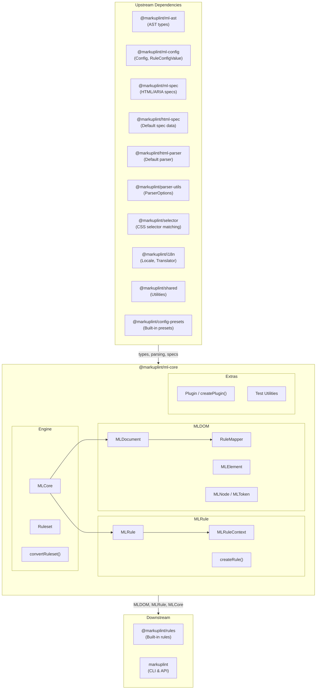
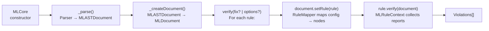
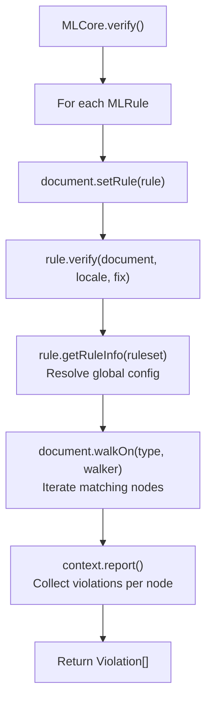
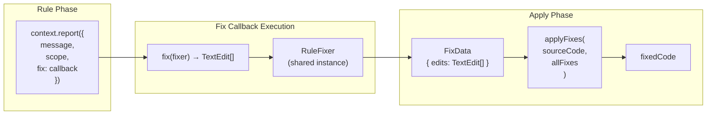
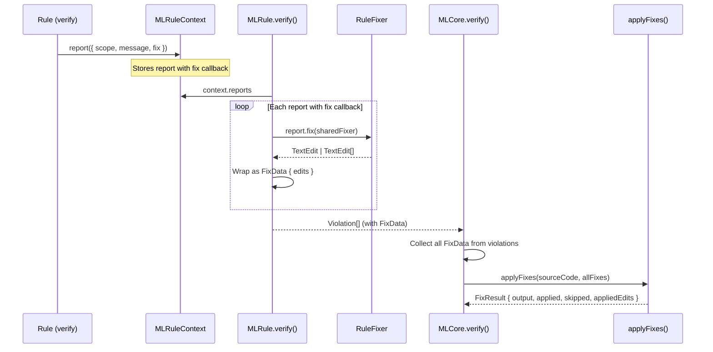
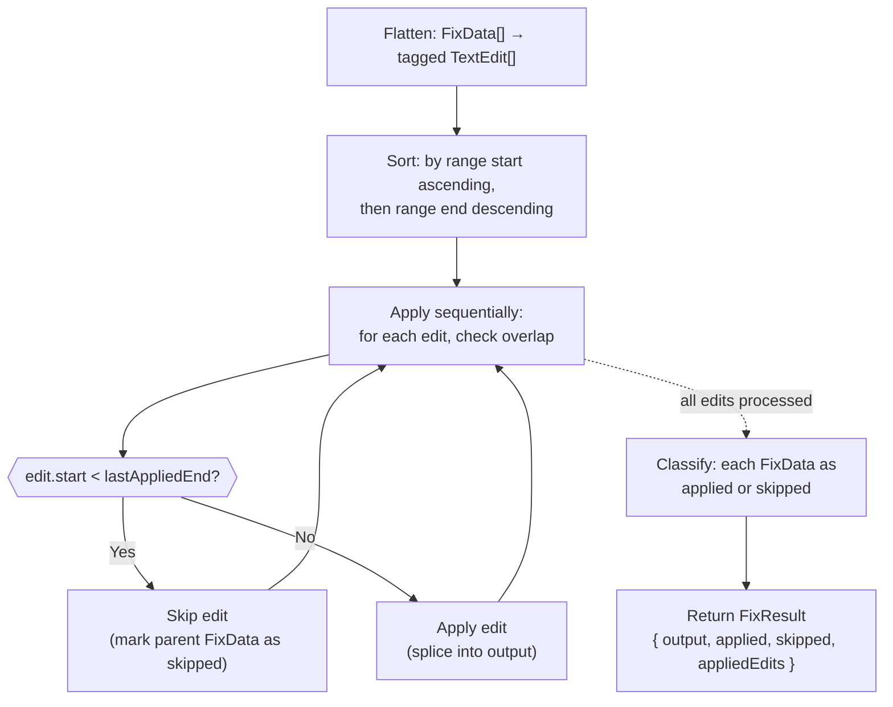
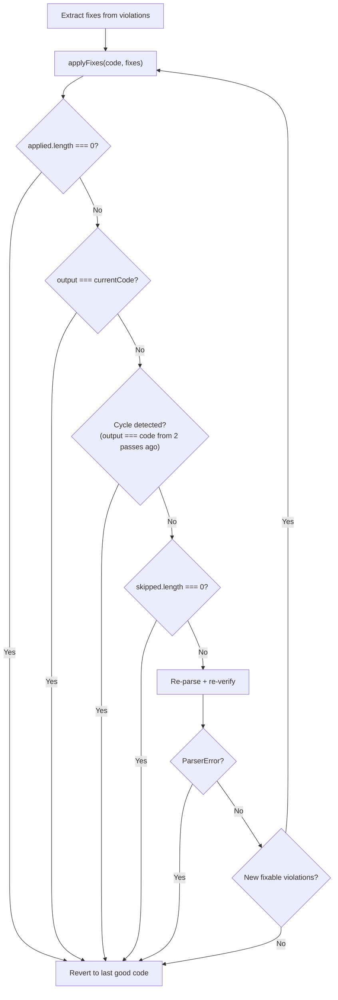
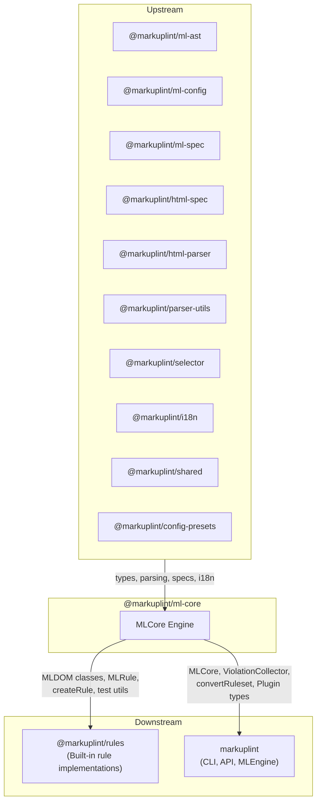

# @markuplint/ml-core

## Overview

`@markuplint/ml-core` is the core linting engine of markuplint. It converts a parsed AST (`MLASTDocument`) into a DOM tree (`MLDOM`), applies configured rules against nodes, and collects violations. The package comprises three subsystems: **MLDOM** (DOM abstraction layer), **MLRule** (rule execution framework), and **MLCore** (orchestration engine).

## Directory Structure

```
src/
├── index.ts                          — Public API re-exports
├── ml-core.ts                        — MLCore engine class
├── types.ts                          — MLFabric, MLSchema type definitions
├── convert-ruleset.ts                — Config → Ruleset converter
├── debug.ts                          — Debug logging utilities
├── violation-collector.ts            — Multi-file violation aggregator
├── ml-dom/
│   ├── index.ts                      — MLDOM public exports
│   ├── node/
│   │   ├── document.ts               — MLDocument (root node, rule mapping, pretender init)
│   │   ├── element.ts                — MLElement (attributes, selectors, namespaces)
│   │   ├── node.ts                   — MLNode (abstract base for all nodes)
│   │   ├── parent-node.ts            — MLParentNode (querySelector, children)
│   │   ├── character-data.ts         — MLCharacterData (abstract text base)
│   │   ├── text.ts                   — MLText
│   │   ├── comment.ts                — MLComment
│   │   ├── attr.ts                   — MLAttr (attribute tokens)
│   │   ├── block.ts                  — MLBlock (preprocessor blocks)
│   │   ├── document-fragment.ts      — MLDocumentFragment
│   │   ├── document-type.ts          — MLDocumentType
│   │   ├── element-close-tag.ts      — MLElementCloseTag
│   │   ├── rule-mapper.ts            — RuleMapper (ruleset → node mapping)
│   │   ├── types.ts                  — Node type constants, AccessibilityProperties
│   │   └── node-list.ts              — NodeList/HTMLCollection utilities
│   ├── token/
│   │   └── token.ts                  — MLToken (base positional token)
│   ├── helper/
│   │   ├── accname.ts                — Accessible name computation
│   │   ├── create-node.ts            — AST → MLDOM node factory
│   │   ├── walkers.ts                — Tree traversal (sync/async walkers)
│   │   ├── get-indent.ts             — Indentation analysis
│   │   └── debug.ts                  — Debug map generation
│   └── manipulations/
│       ├── child-node-methods.ts     — ChildNode interface stubs
│       └── get-children.ts           — Element children extraction
├── virtual-rule.ts                   — Named nodeRule expansion (expandNamedNodeRules)
├── virtual-rule.spec.ts              — Virtual rule unit tests
├── ml-rule/
│   ├── ml-rule.ts                    — MLRule class (rule execution)
│   ├── ml-rule-context.ts            — MLRuleContext (report collection)
│   ├── rule-fixer.ts                 — RuleFixer (TextEdit builder for fix callbacks)
│   ├── create-rule.ts                — createRule factory
│   ├── create-test-rule.ts           — Test rule factory
│   └── types.ts                      — RuleSeed, Checker types
├── cursor-offset.ts                  — computeCursorOffset (cursor remapping after edits)
├── fix-applier.ts                    — applyFixes (overlap-aware TextEdit applicator)
├── ruleset/
│   └── index.ts                      — Ruleset class (rules + nodeRules + childNodeRules)
├── plugin/
│   ├── plugin.ts                     — createPlugin factory
│   ├── types.ts                      — Plugin, PluginCreator types
│   └── index.ts                      — Plugin exports
├── test/
│   └── index.ts                      — createTestDocument, createTestElement, dummySchemas
└── utils/
    ├── index.ts                      — Utility exports
    ├── get-location-from-chars.ts    — Character location resolver
    └── string-splice.ts             — String splice helper
```

## Architecture Diagram



## Linting Pipeline

The `MLCore.verify()` method orchestrates the full linting flow:



### Step-by-step

1. **Parse**: `MLCore` invokes the configured parser (`MLParser`) to produce an `MLASTDocument`
2. **Create Document**: The AST is wrapped in an `MLDocument`, which builds the full MLDOM tree via `createNode()` factory. `RuleMapper` resolves rule configuration for every node
3. **Verify**: For each `MLRule`, the engine calls `document.setRule(rule)` then `rule.verify(document)`. The rule walks relevant nodes via `document.walkOn()` and reports violations through `MLRuleContext`. Rules may attach inline `fix` callbacks to reports that return `TextEdit` objects.

   **Built-in `parse-error` channel**: before iterating rules, `verify()` consumes `MLASTDocument.parseErrors` (non-fatal parser conformance errors collected by the underlying parser — e.g., parse5's `onParseError` events) via `#pushNonFatalParseErrors()` and produces one `ruleId: 'parse-error'` violation per entry. The channel shares the same `severity.parseError` knob as its fatal sibling (`ParserError` raised in step 1). Order contract: parse-error violations always precede rule violations in the output; rule specs depend on this ordering.

   **Mirroring rules own their parse5 codes**: an ml rule whose `meta.mirrorsParseErrorCodes` lists a parse5 code claims static responsibility for that detection. The user's ruleset decides whether the claim is in force:
   - Rule **mentioned** in the ruleset (`rules.<name>` is set to anything: `true`, `false`, severity, object) — the user has expressed intent about this check. ml-core honours the mirror, suppressing the matching parse5 events on the `parse-error` channel. If the rule is enabled, it produces the violation itself (often by reading `document.parseErrors` — see `character-reference` for the canonical hook example). If the rule is `false`, both layers stay silent — the user opted out.
   - Rule **not mentioned** — pure default. ml-core does not suppress; `severity.parseError` (if opted in) is the channel of record for those codes.

   The lookup is **hook-based**: ml-core has no hard-coded code→rule map. Each rule declares its own list via `RuleSeed.meta.mirrorsParseErrorCodes`. Rules whose detection is _wider_ than parse5 (e.g. `attr-duplication` covers JSX / SVG / authored components where parse5 never runs) are safe to mirror — parse5 only fires inside HTML anyway. **The active check is performed at the ruleset (top-level `rules`) level, not per node** — `nodeRules` that locally disable a mirroring rule do not change the dedupe decision (the rule is still "mentioned" at the ruleset level).

4. **Fix** (optional): When `fix=true`, fix callbacks on reports are executed via `RuleFixer` to produce `TextEdit[]`. `FixApplier.applyFixes(sourceCode, fixes)` applies all edits to the source text with overlap detection. When fixes require multiple passes, `_multiPassFix()` orchestrates re-parsing and re-verification, returning a `FixSummary` with pass count, applied/skipped totals, and first-pass edits for cursor offset computation

## MLDOM Class Hierarchy

```
MLToken<A extends MLASTToken>
  └── MLNode<T, O, A extends MLASTNode>
        ├── MLAttr<T, O>
        ├── MLCharacterData<T, O, A>  (abstract)
        │     ├── MLText<T, O>
        │     └── MLComment<T, O>
        ├── MLDocumentType<T, O>
        ├── MLBlock<T, O>
        ├── MLElementCloseTag<T, O>
        └── MLParentNode<T, O, A>  (abstract)
              ├── MLElement<T, O>
              ├── MLDocumentFragment<T, O>
              └── MLDocument<T, O>
```

### Class Responsibilities

| Class                | DOM Interface      | Key Responsibility                                                                          |
| -------------------- | ------------------ | ------------------------------------------------------------------------------------------- |
| `MLToken`            | —                  | Base token with position tracking (`startLine`, `endCol`, `raw`, `fixed`), `fix()` method   |
| `MLNode`             | `Node`             | Tree structure (`parentNode`, `childNodes`, `nextSibling`), rule storage, `is()` type guard |
| `MLAttr`             | `Attr`             | Attribute name/value tokens, `isDynamicValue`, `isDirective`, `valueType`, `tokenList`      |
| `MLCharacterData`    | `CharacterData`    | Abstract base for text content nodes (`data`, `nodeValue`)                                  |
| `MLText`             | `Text`             | Text nodes, `isWhitespace()`, `isRawTextElementContent()`                                   |
| `MLComment`          | `Comment`          | Comment nodes with `textContent`                                                            |
| `MLDocumentType`     | `DocumentType`     | `<!DOCTYPE>` with `name`, `publicId`, `systemId`                                            |
| `MLBlock`            | —                  | Preprocessor-specific blocks (if/each/switch), `blockBehavior`, `isTransparent`             |
| `MLElementCloseTag`  | —                  | Close tag paired with its open tag element                                                  |
| `MLParentNode`       | `ParentNode`       | `querySelector()`, `querySelectorAll()`, `children`, `childElementCount`                    |
| `MLElement`          | `Element`          | Attributes, selectors, namespaces, pretender context, `elementType`, `closeTag`             |
| `MLDocumentFragment` | `DocumentFragment` | Fragment root node                                                                          |
| `MLDocument`         | `Document`         | Root node, `nodeList`, `walkOn()`, `setRule()`, rule mapping, spec access                   |

## MLDocument

`MLDocument` is the root of the MLDOM tree and the primary interface for rule execution.

### Construction

The constructor receives an `MLASTDocument`, a `Ruleset`, and an `MLSchema` tuple. It:

1. Builds the flat `nodeList` by traversing the AST and calling `createNode()` for each AST node
2. Initializes `RuleMapper` to distribute rule configuration across nodes
3. Sets up pretender contexts when pretender definitions are provided

### Key Properties

| Property      | Type                    | Description                                               |
| ------------- | ----------------------- | --------------------------------------------------------- |
| `nodeList`    | `ReadonlyArray<MLNode>` | Flat list of all nodes in document order                  |
| `specs`       | `MLMLSpec`              | HTML/ARIA specification data                              |
| `isFragment`  | `boolean`               | Whether the document is a fragment                        |
| `currentRule` | `MLRule \| null`        | The rule currently being evaluated                        |
| `endTag`      | `EndTagType`            | End tag handling mode (`'xml'`, `'omittable'`, `'never'`) |

### Key Methods

| Method                            | Description                                                                                                      |
| --------------------------------- | ---------------------------------------------------------------------------------------------------------------- |
| `walkOn(type, walker)`            | Walks nodes of a given type (`'Element'`, `'Text'`, `'Comment'`, `'Attr'`, `'ElementCloseTag'`)                  |
| `setRule(rule)`                   | Sets the current rule, used by `MLCore` during verification                                                      |
| `searchNodeByLocation(line, col)` | Finds the node at a given source position                                                                        |
| `getAccessibilityProp(node)`      | Computes ARIA accessibility properties (delegates to `MLElement.getAccessibleName()` for cached accessible name) |
| `toString()`                      | Returns the raw source code of the document                                                                      |

## MLElement

`MLElement` represents an HTML/SVG/MathML element with full attribute access and selector matching.

### Key Properties

| Property           | Type                        | Description                                  |
| ------------------ | --------------------------- | -------------------------------------------- |
| `localName`        | `string`                    | Lowercase tag name (for HTML)                |
| `namespaceURI`     | `NamespaceURI`              | Element namespace (HTML, SVG, MathML)        |
| `attributes`       | `MLNamedNodeMap`            | Named attribute collection                   |
| `elementType`      | `ElementType`               | `'html'`, `'web-component'`, or `'authored'` |
| `closeTag`         | `MLElementCloseTag \| null` | Paired close tag                             |
| `pretenderContext` | `PretenderContext \| null`  | Pretender mapping context                    |
| `isForeignElement` | `boolean`                   | `true` for SVG/MathML elements               |
| `isOmitted`        | `boolean`                   | `true` for implicitly inserted elements      |

### Key Methods

| Method                       | Description                                                      |
| ---------------------------- | ---------------------------------------------------------------- |
| `getAttribute(name)`         | Returns attribute value or `null`                                |
| `getAttributeToken(name)`    | Returns `MLAttr[]` for the named attribute                       |
| `hasAttribute(name)`         | Checks attribute existence                                       |
| `getAccessibleName(version)` | Cached accessible name computation (memoized per ARIA version)   |
| `matches(selector)`          | CSS selector matching                                            |
| `matchMLSelector(selector)`  | Extended markuplint selector matching (supports `RegexSelector`) |
| `querySelector(selector)`    | Finds first matching descendant                                  |
| `querySelectorAll(selector)` | Finds all matching descendants                                   |

## Rule System

### MLRule

`MLRule<T, O>` encapsulates a linting rule with verification and optional fix logic.

| Property/Method                   | Description                                                                 |
| --------------------------------- | --------------------------------------------------------------------------- |
| `name`                            | Rule identifier (e.g., `"attr-duplication"`)                                |
| `defaultSeverity`                 | Default severity level                                                      |
| `defaultValue` / `defaultOptions` | Default configuration                                                       |
| `baseRuleId`                      | For virtual rules: the base rule's name (e.g., `"required-attr"`)           |
| `groupName`                       | For multi-entry virtual rules: group name for batch disable                 |
| `specConformance`                 | For virtual rules: `'normative'` or `'non-normative'` (from named nodeRule) |
| `verify(document, locale, fix)`   | Executes the rule and returns violations                                    |
| `createAlias(name, options?)`     | Creates a virtual rule that reuses this rule's verify/fix logic             |
| `optimizeOption(settings)`        | Normalizes raw rule configuration into `RuleInfo`                           |

### RuleSeed

The `RuleSeed<T, O>` type defines the rule implementation:

```typescript
type RuleSeed<T, O> = {
  meta?: {
    category?: 'validation' | 'style' | 'naming-convention' | 'a11y' | 'maintainability';
  };
  defaultSeverity?: Severity;
  defaultValue?: T;
  defaultOptions?: O;
  verify(context): void | Promise<void>;
  fix?(context): void | Promise<void>;
};
```

### createRule

`createRule(seed)` is a factory function for type-safe rule seed creation. It returns the seed as-is, serving primarily as a type helper.

### MLRuleContext

`MLRuleContext<T, O>` provides the execution context for rules:

- `document` — The current `MLDocument`
- `translate` / `t` — Locale-aware message translator
- `report(report)` — Reports a violation with node, message, and optional fix

The `provide()` method returns the context object passed to `RuleSeed.verify()`. Auto-fix logic is provided as an inline `fix` callback on individual `report()` calls, not as a separate lifecycle method.

### Rule Configuration Resolution

Rules are configured at three levels, resolved by `RuleMapper`:

1. **Global rules** (`rules`) — Apply to all nodes; lowest priority
2. **Node rules** (`nodeRules`) — Apply to nodes matching a selector; medium priority
3. **Child node rules** (`childNodeRules`) — Apply to children of nodes matching a selector; highest priority

When multiple rules match, `RuleMapper` resolves conflicts using CSS selector specificity. The mapping is computed once during `MLDocument` construction and stored on each `MLNode.rules`.

### Rule Execution Flow



### Virtual Rule System

Source: `src/virtual-rule.ts`

> **Terminology policy**: "Virtual rule" is an **internal implementation term** for contributors only. User-facing documentation (website, migration guides, README) must use **"named rule"** instead. From a config user's perspective, there are only two concepts: a **base rule** (e.g., `required-attr`) and a **named rule** (e.g., `a11y/html-lang`). The internal mechanics of `MLRule` aliasing should not be exposed.

Virtual rules are independent `MLRule` instances created from **named nodeRules** — nodeRule entries with a `name` property containing `/` (e.g., `"a11y/html-lang"`). This enables per-check control: each virtual rule can be independently enabled/disabled via `rules["alias/name"]: false`.

#### Named NodeRule Expansion

`expandNamedNodeRules()` converts named nodeRules (and childNodeRules) into virtual rules during `MLCore` construction:

```
Named nodeRule (config)                Virtual MLRule (runtime)
┌─────────────────────────┐           ┌──────────────────────────┐
│ name: "a11y/html-lang"  │           │ name: "a11y/html-lang"   │
│ specConformance: "norm."│  ──────►  │ baseRuleId: "required-attr" │
│ selector: ":where(html)"│           │ specConformance: metadata│
│ rules:                  │           │ verify/fix: from base    │
│   required-attr: [lang] │           └──────────────────────────┘
└─────────────────────────┘
```

Key behaviors:

- **False entry separation**: `false` entries in `rules` are automatically separated into unnamed nodeRules, preserving their semantics as base-rule specificity overrides
- **Multi-entry support**: Named nodeRules with 2+ non-false entries create derived names (`name/baseRuleName`) with a `groupName` for group disable
- **Metadata**: `specConformance` is attached to the virtual rule as metadata for downstream tools and reporting
- **Hot-reload**: Pre-expansion nodeRules are preserved in `#originalNodeRules` / `#originalChildNodeRules` so `update()` can re-expand them

#### Why `specConformance` Is Restricted to Named NodeRules

`specConformance` is intentionally available **only on named nodeRules** (in presets), not on regular built-in rules. The design rationale:

1. **Built-in rules already have correct default severity.** Rules like `permitted-contents` or `required-attr` are inherently normative (they enforce WHATWG MUST requirements), and their `defaultSeverity` is already set to `'error'`. There is no need for a separate `specConformance` flag — the severity is baked in.

2. **Named nodeRules are preset-authored spec interpretations.** When a preset like `preset.html-standard.jsonc` creates a named nodeRule `"html-standard/head-charset-utf8"`, the preset author is expressing a specific spec requirement as a check. `specConformance` lets the author declare the RFC 2119 keyword strength of that requirement, so downstream tools and reports can identify which violations originate from spec requirements and at what normative level.

3. **Users should not set `specConformance` on their own rules.** A user-defined nodeRule for a custom component (e.g., validating `<MyComponent>` props) is not a spec conformance check — it is a project convention. Allowing `specConformance` on arbitrary user config would blur the distinction between "the HTML spec requires this" and "our team prefers this". The `name` property (which requires `/`) serves as a gatekeeper: only named nodeRules can carry `specConformance`, and named nodeRules are designed for preset authors who understand the spec.

In summary: `specConformance` is a **preset-level annotation** that provides metadata about which spec requirements a check enforces. Built-in rules handle their own severity via `defaultSeverity`. User-defined rules express severity directly via the `severity` field in rule config.

#### Virtual Rule Disable

Virtual rules can be disabled at three levels in the `rules` config:

1. **Exact name**: `rules["a11y/html-lang"]: false`
2. **Group disable**: `rules["custom/multi"]: false` (for multi-entry named nodeRules)
3. **Namespace wildcard**: `rules["a11y/*"]: false` (disables all virtual rules starting with `a11y/`)

## Autofix System

The autofix system allows rules to provide automatic fixes for violations. It operates through three components: **RuleFixer** (TextEdit builder), **fix callbacks** (rule-authored logic), and **FixApplier** (edit application engine).

### Autofix Data Flow



### How Fix Callbacks Work

Rules attach an optional `fix` callback to each `report()` call. The callback is **not** executed during rule verification — it is stored and only invoked when `fix=true` is passed to `MLCore.verify()`.



### RuleFixer API

`RuleFixer` implements `IRuleFixer` (defined in `@markuplint/ml-config`). It is a **stateless** helper — a single instance is shared across all rules. Each method builds a `TextEdit` object describing a range replacement on the source code.

| Method                      | Input                            | TextEdit Produced                          |
| --------------------------- | -------------------------------- | ------------------------------------------ |
| `replaceText(token, text)`  | Token with `startOffset` + `raw` | `range: [start, start+len], text`          |
| `replaceRange(range, text)` | Explicit `[start, end)` range    | `range: [start, end], text`                |
| `insertBefore(token, text)` | Token with `startOffset`         | `range: [start, start], text` (zero-width) |
| `insertAfter(token, text)`  | Token with `startOffset` + `raw` | `range: [end, end], text` (zero-width)     |
| `remove(token)`             | Token with `startOffset` + `raw` | `range: [start, start+len], text: ""`      |
| `removeRange(range)`        | Explicit `[start, end)` range    | `range: [start, end], text: ""`            |

The `token` parameter accepts any object satisfying the `FixToken` type (defined in `@markuplint/ml-config`) — i.e., `{ startOffset: number; raw: string }`. MLDOM tokens (`MLToken`, `MLAttr`, etc.) satisfy this naturally.

### FixApplier Algorithm

`applyFixes()` (in `fix-applier.ts`) merges all `FixData` from all rules and applies them in a single pass:



Key constraints:

- Edits within a single `FixData` must not overlap each other
- Inter-`FixData` overlap is handled by the skip mechanism
- If any edit in a `FixData` is skipped, the entire `FixData` is classified as skipped
- `appliedEdits` is a flat list of all successfully applied `TextEdit` objects, sorted by `range[0]` ascending — used for cursor offset computation

### Multi-Pass Fix Loop

When `applyFixes()` skips some fixes due to range overlap, the engine enters a multi-pass loop (`_multiPassFix()`) that re-parses and re-verifies until all fixable violations are resolved:



Key design points:

- **Zero-cost path**: If no violations have fixes, the multi-pass loop is skipped entirely
- **Single-pass fast path**: When `skipped.length === 0`, the loop exits immediately — equivalent to Phase 1 behavior
- **Cycle detection**: Compares current output against the output from two passes ago to detect A→B→A oscillation
- **Safety cap**: Maximum 10 passes (same as ESLint's `SourceCodeFixer`)
- **State restoration**: `verify()` saves and restores `#sourceCode`, `#ast`, and `#document` via `try/finally`

**Important**: The `violations` array in `VerifyResult` reflects the first pass only, while `fixedCode` may be the result of multiple passes. Callers needing an accurate violation list for the fixed code should re-verify the output.

### VerifyResult and FixSummary

`MLCore.verify()` accepts either a `boolean` or a `VerifyOptions` object:

```typescript
verify(fix?: boolean): Promise<VerifyResult>;
verify(options?: VerifyOptions): Promise<VerifyResult>;
```

`VerifyResult` contains:

| Field        | Type                      | Description                                                   |
| ------------ | ------------------------- | ------------------------------------------------------------- |
| `violations` | `readonly Violation[]`    | Violations from the first verification pass                   |
| `fixedCode`  | `string \| undefined`     | Source after all fix passes; `undefined` when fix is disabled |
| `fixSummary` | `FixSummary \| undefined` | Fix process summary; present when `fix=true`                  |

`FixSummary` provides diagnostics about the multi-pass fix process:

| Field              | Type                  | Description                                                      |
| ------------------ | --------------------- | ---------------------------------------------------------------- |
| `passCount`        | `number`              | Number of fix passes executed                                    |
| `totalApplied`     | `number`              | Total fixes applied across all passes                            |
| `totalSkipped`     | `number`              | Total fixes skipped (overlap) across all passes                  |
| `reachedMaxPasses` | `boolean`             | Whether the 10-pass safety cap was reached                       |
| `firstPassEdits`   | `readonly TextEdit[]` | Applied edits from the first pass only (original source offsets) |

`firstPassEdits` references the original source code offsets, making them suitable for cursor remapping via `computeCursorOffset()`.

### Cursor Offset Computation

`computeCursorOffset()` (in `cursor-offset.ts`) maps a cursor position from the original source to the fixed source using the first-pass applied edits:

```typescript
import { computeCursorOffset } from '@markuplint/ml-core';

const newOffset = computeCursorOffset(fixSummary.firstPassEdits, originalCursorOffset);
```

Algorithm:

1. Walk through edits sorted by `range[0]` ascending
2. For each edit before the cursor: accumulate `delta = text.length - (end - start)`
3. For edits after the cursor: stop (no effect)
4. If the cursor falls inside a replaced range `[start, end)`: place at `start + text.length`

Ranges use half-open intervals: a cursor at position `end` is considered **outside** the edit.

### Example: Rule Fix in Practice

```typescript
// In a rule's verify function:
context.report({
  scope: node,
  message: 'Attribute value must use double quotes',
  fix: fixer => fixer.replaceText(node.attrValueToken, `"${value}"`),
});
```

This produces:

1. **Report** → stored in `MLRuleContext`
2. **Fix callback** → `(fixer) => fixer.replaceText(token, text)` (not yet called)
3. **When `fix=true`** → callback invoked with shared `RuleFixer` → returns `TextEdit`
4. **TextEdit** → wrapped as `FixData { edits: [{ range: [12, 17], text: '"hello"' }] }`
5. **applyFixes** → splices the replacement into source code

## Pretender System

The pretender system allows components to be treated as semantic HTML elements during linting. This enables rules to validate custom components (e.g., `<MyButton>`) as if they were standard elements (e.g., `<button>`).

### Configuration

Pretenders are defined in the markuplint config as an array of `Pretender` objects:

```typescript
type Pretender = {
  selector: string; // CSS selector matching the component
  as: string; // HTML element to pretend as
  aria?: PretenderARIA; // Optional ARIA overrides
};
```

### How It Works

1. During `MLDocument` construction, pretender definitions are processed
2. Each `MLElement` matching a pretender selector gets a `pretenderContext` with `type: 'pretender'`
3. The target HTML element gets a `pretenderContext` with `type: 'origin'`
4. Rules can access `element.pretenderContext` to check the semantic mapping
5. Accessibility computations use pretender context for role/name resolution

## Conditional Child Nodes

Template engines (Pug, EJS, Nunjucks, etc.) produce preprocessor-specific blocks represented by `MLBlock` nodes. These blocks can wrap child nodes conditionally:

| `blockBehavior.type` | Template Construct | Description                |
| -------------------- | ------------------ | -------------------------- |
| `'if'`               | ``         | Start of conditional block |
| `'if:else'`          | ``       | Alternative branch         |
| `'end'`              | ``      | End of conditional block   |
| `'each'`             | ``        | Start of loop              |
| `'end'`              | ``     | End of loop                |
| `'switch:case'`      | ``     | Start of switch            |
| `'switch:default'`   | ``       | Switch case                |
| `'end'`              | ``  | End of switch              |

`MLNode.conditionalChildNodes()` returns an array of `NodeListOf` arrays — one per conditional branch — so rules can analyze each branch independently. Note that `'each'` blocks do not start a new conditional mode (`'if'` or `'switch'`); they are flattened into `childNodes` and their content is treated as always-present rather than as an alternative branch. Only `'if'`/`'if:elseif'` and `'switch:case'` start new modes that generate null sentinels for the "empty branch" case.

## Plugin System

Plugins extend markuplint with custom rules and shared configurations.

### Plugin Type

```typescript
type Plugin = {
  readonly name: string;
  readonly rules?: Record<string, RuleSeed<any, any>>;
  readonly configs?: Record<string, Config>;
};
```

### PluginCreator

For plugins that accept settings:

```typescript
type PluginCreator<S> = {
  readonly name: string;
  create(setting: S): Omit<Plugin, 'name'>;
};
```

`createPlugin(creator)` is a factory function for type-safe plugin creator definitions.

## Test Utilities

The `test/` module provides helpers for rule testing:

| Function                                    | Description                                     |
| ------------------------------------------- | ----------------------------------------------- |
| `createTestDocument(sourceCode, options?)`  | Parses source into an `MLDocument` for testing  |
| `createTestElement(sourceCode, options?)`   | Parses source and returns the first `MLElement` |
| `createTestNodeList(sourceCode, options?)`  | Returns the flat node list from parsed source   |
| `createTestTokenList(sourceCode, options?)` | Returns the flat token list from parsed source  |
| `dummySchemas()`                            | Returns the default HTML spec as a schema tuple |

`CreateTestOptions` accepts `config`, `parser`, `specs`, and `pretenders` overrides.

## External Dependencies

| Dependency                   | Purpose                                                           |
| ---------------------------- | ----------------------------------------------------------------- |
| `@markuplint/ml-ast`         | AST type definitions (`MLASTDocument`, `MLASTNode`, etc.)         |
| `@markuplint/ml-config`      | Configuration types (`Config`, `RuleConfigValue`, `Pretender`)    |
| `@markuplint/ml-spec`        | HTML/ARIA specification access (`MLMLSpec`, role/attribute specs) |
| `@markuplint/html-spec`      | Default HTML specification data                                   |
| `@markuplint/html-parser`    | Default HTML parser (used in test utilities)                      |
| `@markuplint/parser-utils`   | Parser options and types                                          |
| `@markuplint/selector`       | CSS and extended selector matching                                |
| `@markuplint/i18n`           | Internationalization (`LocaleSet`, `Translator`)                  |
| `@markuplint/shared`         | Shared utilities                                                  |
| `@markuplint/config-presets` | Built-in configuration presets                                    |
| `debug`                      | Debug logging                                                     |
| `is-plain-object`            | Plain object type checking                                        |
| `type-fest`                  | TypeScript utility types                                          |

## Integration Points



### Upstream

- **`@markuplint/ml-ast`** — AST types used to construct the MLDOM tree
- **`@markuplint/ml-config`** — Config and rule configuration types
- **`@markuplint/ml-spec`** — HTML/ARIA specification for element validation, role computation
- **`@markuplint/html-spec`** — Default spec data bundle
- **`@markuplint/html-parser`** — Default parser used in test utilities
- **`@markuplint/parser-utils`** — Parser option types
- **`@markuplint/selector`** — CSS selector engine for `querySelector`, `matches`, and `RegexSelector`
- **`@markuplint/i18n`** — Locale sets and translation for rule messages
- **`@markuplint/shared`** — Shared utility functions
- **`@markuplint/config-presets`** — Built-in configuration presets

### Downstream

- **`@markuplint/rules`** — Imports MLDOM classes, `createRule`, `MLRuleContext`, and test utilities to implement built-in rules
- **`markuplint`** — Imports `MLCore`, `ViolationCollector`, `convertRuleset`, and plugin types to provide the CLI and API

## Documentation Map

- [MLDOM Reference](docs/ml-dom.md) ([日本語](docs/ml-dom.ja.md)) — Class hierarchy, node properties, tree traversal
- [Rule System](docs/rule-system.md) ([日本語](docs/rule-system.ja.md)) — MLRule, RuleSeed, MLRuleContext, configuration resolution
- [Linting Pipeline](docs/linting-pipeline.md) ([日本語](docs/linting-pipeline.ja.md)) — MLCore engine, verify flow, pretender, plugin system
- [Maintenance Guide](docs/maintenance.md) ([日本語](docs/maintenance.ja.md)) — Commands, recipes, and troubleshooting
