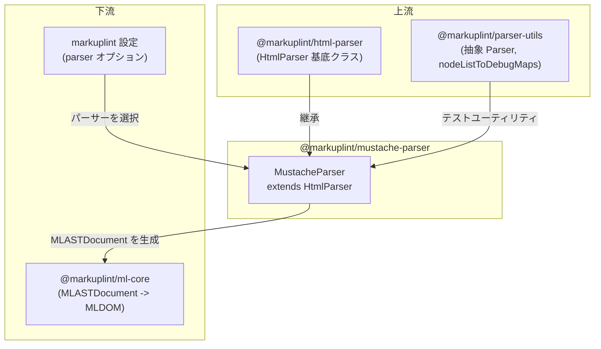

# @markuplint/mustache-parser

## 概要

`@markuplint/mustache-parser` は `HtmlParser` を拡張し、Mustache および Handlebars テンプレート式を含む HTML ファイルのリントを可能にします。完全なテンプレートパーサーを実装するのではなく、`HtmlParser` の `ignoreTags` メカニズムを設定して Mustache/Handlebars 構文を不透明なブロックとして扱います。これにより、markuplint はテンプレート式をスキップしながら周囲の HTML 構造を検証できます。

Handlebars は Mustache のスーパーセットであり、同じデリミタ構文を使用するため、このパッケージは Handlebars とも互換性があります。

## 動作原理

パーサーは `HtmlParser` のコンストラクタで3つの `ignoreTags` エントリを宣言することで動作します。トークン化の際、基底 `Parser` クラスがソース内でこれらのデリミタペアを検索し、`#ps:*`（PreprocessorSpecific）ノードとして抽出し、残りの HTML を通常通りパースします。

`ignoreTags` エントリの順序は重要です。より具体的なパターンを、より一般的なパターンの前に配置する必要があります。例えば、`{{{`（トリプルスタッシュ）は `{{`（ダブルスタッシュ）の前にマッチする必要があり、`{{!`（コメント）も `{{` の前にマッチする必要があります。

## ignoreTags 設定

| タイプ               | 開始  | 終了  | 説明                                                     |
| -------------------- | ----- | ----- | -------------------------------------------------------- |
| `mustache-comment`   | `{{!` | `}}`  | Mustache コメント（`{{! comment }}`）                    |
| `mustache-unescaped` | `{{{` | `}}}` | エスケープなし / トリプルスタッシュ出力（`{{{ raw }}}`） |
| `mustache-tag`       | `{{`  | `}}`  | 標準的な補間とブロックヘルパー                           |

マッチした式は `#ps:mustache-tag`、`#ps:mustache-unescaped`、`#ps:mustache-comment` のような名前を持つ AST ノードになります。

## サポートされない構文

**引用符なしの属性値**内のテンプレート式はサポートされていません。これはすべてのテンプレートエンジンパーサーに共通する既知の制限です（[#240](https://github.com/markuplint/markuplint/issues/240)）。[ウェブサイトのドキュメント](https://markuplint.dev/docs/guides/besides-html)も参照してください。

使用可能:

```html
<div attr="{{ value }}"></div>
<div attr="{{ value }}"></div>
<div attr="{{ value }}-{{ value2 }}-{{ value3 }}"></div>
```

使用不可（引用符なし）:

```html
<div attr="{{" value }}></div>
```

## ディレクトリ構成

```
src/
├── index.ts        — parser シングルトンを再エクスポート
├── parser.ts       — HtmlParser を拡張する MustacheParser クラス
└── index.spec.ts   — タグ認識とノードリスト構造のテスト
```

## 主要ソースファイル

### `parser.ts`

上記3つの `ignoreTags` エントリを持つ `MustacheParser`（`HtmlParser` を拡張）を定義します。シングルトンインスタンスが `parser` としてエクスポートされます。

### `index.ts`

`parser.ts` から `parser` をパブリック API として再エクスポートします。

### `index.spec.ts`

テストカバレッジ:

- テキストや HTML 要素に挟まれた単一・複数の `{{ }}` タグ
- ネストされた HTML を含むブロックヘルパー（`{{#user}}...{{/user}}`）
- ベアテキスト（HTML 要素でラップされていない場合）
- 各タグタイプの正しい `nodeName`（`#ps:mustache-tag`、`#ps:mustache-unescaped`、`#ps:mustache-comment`）

## 統合ポイント



### 上流

- **`@markuplint/html-parser`** -- `MustacheParser` が拡張する基底クラス `HtmlParser` を提供。HTML パースロジック（parse5 統合、ゴースト要素、名前空間解決）はすべて継承される。

### 下流

- **`@markuplint/ml-core`** -- このパーサーが生成する `MLASTDocument` を消費
- **markuplint 設定** -- ユーザーが markuplint 設定の `parser` オプションでこのパーサーを選択

## ドキュメントマップ

- [メンテナンスガイド](docs/maintenance.ja.md) -- コマンド、レシピ、トラブルシューティング
