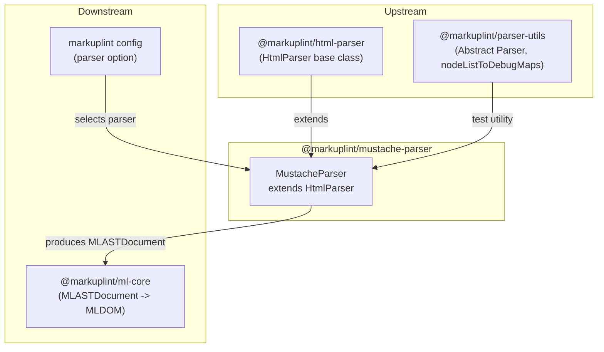

# @markuplint/mustache-parser

## Overview

`@markuplint/mustache-parser` extends `HtmlParser` to lint HTML files containing Mustache and Handlebars template expressions. Instead of implementing a full template parser, it configures `HtmlParser`'s `ignoreTags` mechanism to treat Mustache/Handlebars syntax as opaque blocks. This lets markuplint validate the surrounding HTML structure while skipping over template expressions.

The package is also compatible with Handlebars, since Handlebars is a superset of Mustache and uses the same delimiter syntax.

## How It Works

The parser works by declaring three `ignoreTags` entries in the `HtmlParser` constructor. During tokenization, the base `Parser` class scans the source for these delimiter pairs, extracts them as `#ps:*` (PreprocessorSpecific) nodes, and parses the remaining HTML normally.

The order of `ignoreTags` entries matters: more specific patterns must appear before less specific ones. For example, `{{{` (triple-stache) must be matched before `{{` (double-stache), and `{{!` (comment) must be matched before `{{` as well.

## ignoreTags Configuration

| Type                 | Start | End   | Description                                      |
| -------------------- | ----- | ----- | ------------------------------------------------ |
| `mustache-comment`   | `{{!` | `}}`  | Mustache comments (`{{! comment }}`)             |
| `mustache-unescaped` | `{{{` | `}}}` | Unescaped / triple-stache output (`{{{ raw }}}`) |
| `mustache-tag`       | `{{`  | `}}`  | Standard interpolation and block helpers         |

Matched expressions become AST nodes with names like `#ps:mustache-tag`, `#ps:mustache-unescaped`, and `#ps:mustache-comment`.

## Unsupported Syntaxes

Template expressions inside **unquoted attribute values** are not supported. This is a known limitation shared by all template engine parsers ([#240](https://github.com/markuplint/markuplint/issues/240)). See also the [website documentation](https://markuplint.dev/docs/guides/besides-html).

Available:

```html
<div attr="{{ value }}"></div>
<div attr="{{ value }}"></div>
<div attr="{{ value }}-{{ value2 }}-{{ value3 }}"></div>
```

Unavailable (unquoted):

```html
<div attr="{{" value }}></div>
```

## Directory Structure

```
src/
├── index.ts        — Re-exports the parser singleton
├── parser.ts       — MustacheParser class extending HtmlParser
└── index.spec.ts   — Tests for tag recognition and node list structure
```

## Key Source Files

### `parser.ts`

Defines `MustacheParser` which extends `HtmlParser` with the three `ignoreTags` entries listed above. A singleton instance is exported as `parser`.

### `index.ts`

Re-exports `parser` from `parser.ts` as the public API.

### `index.spec.ts`

Tests cover:

- Single and multiple `{{ }}` tags interleaved with text and HTML elements
- Block helpers (`{{#user}}...{{/user}}`) with nested HTML
- Bare text (no wrapping HTML element)
- Correct `nodeName` for each tag type (`#ps:mustache-tag`, `#ps:mustache-unescaped`, `#ps:mustache-comment`)

## Integration Points



### Upstream

- **`@markuplint/html-parser`** -- Provides `HtmlParser`, the base class that `MustacheParser` extends. All HTML parsing logic (parse5 integration, ghost elements, namespace resolution) is inherited.

### Downstream

- **`@markuplint/ml-core`** -- Consumes the `MLASTDocument` produced by this parser
- **markuplint config** -- Users select this parser via the `parser` option in their markuplint configuration

## Documentation Map

- [Maintenance Guide](docs/maintenance.md) -- Commands, recipes, and troubleshooting
