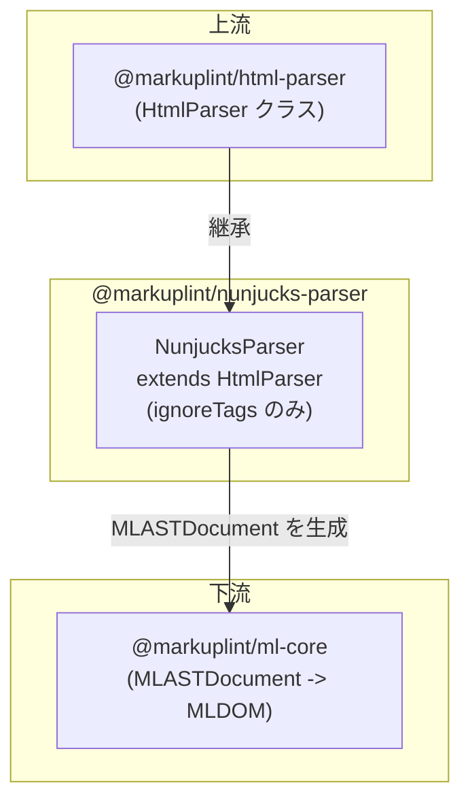

# @markuplint/nunjucks-parser

## 概要

`@markuplint/nunjucks-parser` は `HtmlParser` を拡張し、Nunjucks テンプレート式を含む HTML をリントします。Nunjucks 構文に対する3つの無視パターンを宣言することで、テンプレート式を不透明なブロックとして扱いながら、周囲の HTML 構造を markuplint が解析できるようにします。

## 動作の仕組み

このパーサーは基底 `HtmlParser` が提供する `ignoreTags` メカニズムを使用します:

1. **マスク** -- パース前に、すべての Nunjucks テンプレート式が開始/終了デリミタで識別され、プレースホルダーテキストに置換される
2. **パース** -- マスクされた HTML が標準 HTML パーサー（parse5）によって、テンプレート式が存在しないかのようにパースされる
3. **保持** -- 元の Nunjucks 式は AST 内で `#ps:*`（PreprocessorSpecificBlock）ノードとして保持され、ソース位置が維持される

このアプローチにより、markuplint は Nunjucks 構文に混乱することなく HTML 構造をリントできます。

## ignoreTags 設定

`NunjucksParser` コンストラクタは3つの無視パターンを定義します:

| タイプ             | 開始 | 終了 | 説明                                             |
| ------------------ | ---- | ---- | ------------------------------------------------ |
| `nunjucks-block`   | `` | ブロックタグ（if, for, macro, block, extends等） |
| `nunjucks-output`  | `{{` | `}}` | 出力 / 変数展開                                  |
| `nunjucks-comment` | `{#` | `#}` | コメント（レンダリングされない）                 |

## サポートされない構文

**引用符なしの属性値**内のテンプレート式はサポートされていません。これはすべてのテンプレートエンジンパーサーに共通する既知の制限です（[#240](https://github.com/markuplint/markuplint/issues/240)）。[ウェブサイトのドキュメント](https://markuplint.dev/docs/guides/besides-html)も参照してください。

使用可能:

```html
<div attr="{{ value }}"></div>
<div attr="{{ value }}"></div>
<div attr="{{ value }}-{{ value2 }}-{{ value3 }}"></div>
```

使用不可（引用符なし）:

```html
<div attr="{{" value }}></div>
```

## ディレクトリ構成

```
src/
├── index.ts        -- parser を再エクスポート
├── parser.ts       -- HtmlParser を拡張する NunjucksParser クラス
└── index.spec.ts   -- パーサー統合テスト
```

## 主要ソースファイル

| ファイル        | 用途                                                                              |
| --------------- | --------------------------------------------------------------------------------- |
| `src/parser.ts` | `NunjucksParser` クラスを定義し、シングルトン `parser` インスタンスをエクスポート |
| `src/index.ts`  | パッケージエントリポイント; `parser` を再エクスポート                             |

## 統合ポイント



### 上流

- **`@markuplint/html-parser`** -- `ignoreTags` サポートを備えた `HtmlParser` 基底クラスを提供

### 下流

- **`@markuplint/ml-core`** -- このパーサーが生成する `MLASTDocument` を消費し、ルール評価用の MLDOM を構築

## ドキュメントマップ

- [メンテナンスガイド](docs/maintenance.ja.md) -- コマンド、レシピ、テスト
