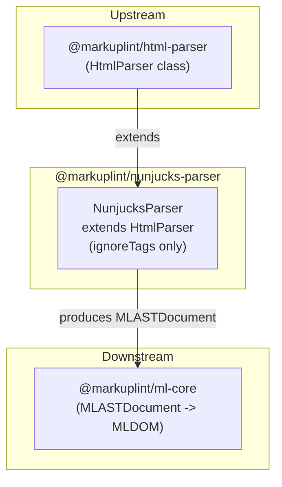

# @markuplint/nunjucks-parser

## Overview

`@markuplint/nunjucks-parser` extends `HtmlParser` to lint HTML containing Nunjucks template expressions. By declaring three ignore patterns for Nunjucks syntax, the parser lets markuplint analyze the surrounding HTML structure while treating template expressions as opaque blocks.

## How It Works

The parser uses the `ignoreTags` mechanism provided by the base `HtmlParser`:

1. **Mask** -- Before parsing, all Nunjucks template expressions are identified by their start/end delimiters and replaced with placeholder text
2. **Parse** -- The masked HTML is parsed by the standard HTML parser (parse5) as if the template expressions did not exist
3. **Preserve** -- The original Nunjucks expressions are preserved in the AST as `#ps:*` (PreprocessorSpecificBlock) nodes, maintaining their source positions

This approach allows markuplint to lint the HTML structure without being confused by Nunjucks syntax.

## ignoreTags Configuration

The `NunjucksParser` constructor defines three ignore patterns:

| Type               | Start | End  | Description                                    |
| ------------------ | ----- | ---- | ---------------------------------------------- |
| `nunjucks-block`   | `` | Block tags (if, for, macro, block, extends...) |
| `nunjucks-output`  | `{{`  | `}}` | Output / variable interpolation                |
| `nunjucks-comment` | `{#`  | `#}` | Comments (not rendered)                        |

## Unsupported Syntaxes

Template expressions inside **unquoted attribute values** are not supported. This is a known limitation shared by all template engine parsers ([#240](https://github.com/markuplint/markuplint/issues/240)). See also the [website documentation](https://markuplint.dev/docs/guides/besides-html).

Available:

```html
<div attr="{{ value }}"></div>
<div attr="{{ value }}"></div>
<div attr="{{ value }}-{{ value2 }}-{{ value3 }}"></div>
```

Unavailable (unquoted):

```html
<div attr="{{" value }}></div>
```

## Directory Structure

```
src/
├── index.ts        -- Re-exports parser
├── parser.ts       -- NunjucksParser class extending HtmlParser
└── index.spec.ts   -- Parser integration tests
```

## Key Source Files

| File            | Purpose                                                                |
| --------------- | ---------------------------------------------------------------------- |
| `src/parser.ts` | Defines `NunjucksParser` class and exports singleton `parser` instance |
| `src/index.ts`  | Package entry point; re-exports `parser`                               |

## Integration Points



### Upstream

- **`@markuplint/html-parser`** -- Provides the `HtmlParser` base class with `ignoreTags` support

### Downstream

- **`@markuplint/ml-core`** -- Consumes the `MLASTDocument` produced by this parser to build the MLDOM for rule evaluation

## Documentation Map

- [Maintenance Guide](docs/maintenance.md) -- Commands, recipes, and testing
