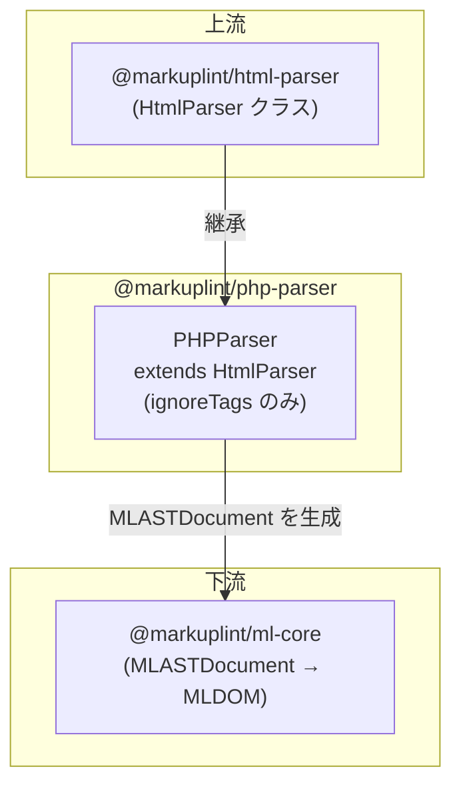

# @markuplint/php-parser

## 概要

`@markuplint/php-parser` は `HtmlParser` を拡張し、PHP コードブロックを含む HTML のリントを可能にします。すべての PHP タグバリアントを不透明ブロックとして扱い、markuplint が PHP 構文に影響されることなく周囲の HTML 構造をリントできるようにします。

## 動作の仕組み

このパーサーは基底の `HtmlParser` が提供する `ignoreTags` メカニズムを使用します:

1. **マスク** — パース前に、すべての PHP タグ式（`<?php ... ?>`、`<?= ... ?>`、`<? ... ?>`）が開始/終了デリミタにより識別され、プレースホルダーテキストに置換される
2. **パース** — マスクされた HTML は、PHP 式が存在しないかのように標準 HTML パーサー（parse5）によってパースされる
3. **保持** — 元の PHP 式は AST 内に `#ps:*`（PreprocessorSpecificBlock）ノードとして保持され、ソース位置も維持される

このアプローチにより、markuplint は PHP 構文に影響されることなく HTML 構造をリントできます。

## ignoreTags 設定

`PHPParser` コンストラクタは、正しいマッチングを保証するために、最も具体的なものから順に3つのパターンを定義しています:

| タイプ          | 開始    | 終了  | 説明                      |
| --------------- | ------- | ----- | ------------------------- | ----------------------------------------------------- |
| `php-tag`       | `<?php` | `/\?> | $/`                       | 標準 PHP コードブロック（EOF で未閉鎖のタグにも対応） |
| `php-echo`      | `<?=`   | `?>`  | ショートエコー / 出力タグ |
| `php-short-tag` | `<?`    | `/\?> | $/`                       | ショートオープンタグ（EOF で未閉鎖のタグにも対応）    |

**EOF 未閉鎖タグの処理:** `php-tag` と `php-short-tag` パターンは終了デリミタに正規表現 `/\?>|$/` を使用しています。`$` はソースの末尾にマッチし、閉じられていない PHP ブロック（例: ファイル末尾の `<?php include("path/to")`）を単一の `#ps:*` ノードとして正しくキャプチャします。

`php-echo` パターンはプレーン文字列 `?>` を使用しています。エコータグはテンプレート内で常に閉じられることが想定されているためです。

## サポートされない構文

**引用符なしの属性値**内のテンプレート式はサポートされていません。これはすべてのテンプレートエンジンパーサーに共通する既知の制限です（[#240](https://github.com/markuplint/markuplint/issues/240)）。[ウェブサイトのドキュメント](https://markuplint.dev/docs/guides/besides-html)も参照してください。

使用可能:

```html
<div attr="<?php echo value; ?>"></div>
<div attr="<?php echo value; ?>"></div>
<div attr="<?php echo value; ?>-<?php echo value2; ?>-<?php echo value3; ?>"></div>
```

使用不可（引用符なし）:

```html
<div attr=<?php echo value; ?>></div>
```

## ディレクトリ構成

```
src/
├── index.ts        — parser を再エクスポート
├── parser.ts       — HtmlParser を拡張する PHPParser クラス
└── index.spec.ts   — パーサー統合テスト
```

## 主要ソースファイル

| ファイル        | 用途                                                             |
| --------------- | ---------------------------------------------------------------- |
| `src/parser.ts` | `PHPParser` クラスを定義し、シングルトン `parser` をエクスポート |
| `src/index.ts`  | パッケージエントリーポイント。`parser` を再エクスポート          |

## 統合ポイント



## ドキュメントマップ

- [メンテナンスガイド](docs/maintenance.ja.md) — コマンド、レシピ、テスト
