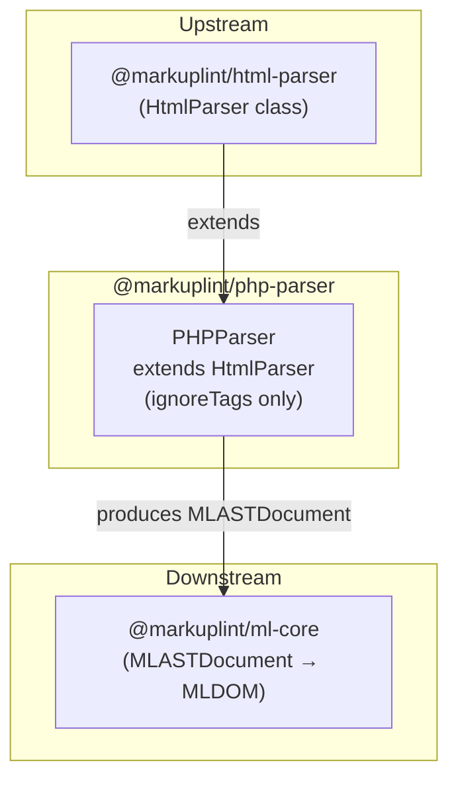

# @markuplint/php-parser

## Overview

`@markuplint/php-parser` extends `HtmlParser` to lint HTML containing PHP code blocks. It treats all PHP tag variants as opaque blocks, allowing markuplint to lint the surrounding HTML structure without being confused by PHP syntax.

## How It Works

The parser uses the `ignoreTags` mechanism provided by the base `HtmlParser`:

1. **Mask** — Before parsing, all PHP tag expressions (`<?php ... ?>`, `<?= ... ?>`, `<? ... ?>`) are identified by their start/end delimiters and replaced with placeholder text
2. **Parse** — The masked HTML is parsed by the standard HTML parser (parse5) as if the PHP expressions did not exist
3. **Preserve** — The original PHP expressions are preserved in the AST as `#ps:*` (PreprocessorSpecificBlock) nodes, maintaining their source positions

This approach allows markuplint to lint the HTML structure without being confused by PHP syntax.

## ignoreTags Configuration

The `PHPParser` constructor defines three ignore patterns, ordered from most specific to least specific to ensure correct matching:

| Type            | Start   | End   | Description              |
| --------------- | ------- | ----- | ------------------------ | ------------------------------------------------------- |
| `php-tag`       | `<?php` | `/\?> | $/`                      | Standard PHP code blocks (also matches unclosed at EOF) |
| `php-echo`      | `<?=`   | `?>`  | Short echo / output tags |
| `php-short-tag` | `<?`    | `/\?> | $/`                      | Short open tags (also matches unclosed at EOF)          |

**EOF-unclosed tag handling:** The `php-tag` and `php-short-tag` patterns use a regex `/\?>|$/` for the end delimiter. The `$` alternative matches the end of the source, allowing PHP blocks that are never closed (e.g., `<?php include("path/to")` at the end of a file) to be correctly captured as a single `#ps:*` node rather than leaving unparsed content.

The `php-echo` pattern uses a plain string `?>` because echo tags are always expected to be closed within the template.

## Unsupported Syntaxes

Template expressions inside **unquoted attribute values** are not supported. This is a known limitation shared by all template engine parsers ([#240](https://github.com/markuplint/markuplint/issues/240)). See also the [website documentation](https://markuplint.dev/docs/guides/besides-html).

Available:

```html
<div attr="<?php echo value; ?>"></div>
<div attr="<?php echo value; ?>"></div>
<div attr="<?php echo value; ?>-<?php echo value2; ?>-<?php echo value3; ?>"></div>
```

Unavailable (unquoted):

```html
<div attr=<?php echo value; ?>></div>
```

## Directory Structure

```
src/
├── index.ts        — Re-exports parser
├── parser.ts       — PHPParser class extending HtmlParser
└── index.spec.ts   — Parser integration tests
```

## Key Source Files

| File            | Purpose                                                           |
| --------------- | ----------------------------------------------------------------- |
| `src/parser.ts` | Defines `PHPParser` class and exports singleton `parser` instance |
| `src/index.ts`  | Package entry point; re-exports `parser`                          |

## Integration Points



## Documentation Map

- [Maintenance Guide](docs/maintenance.md) — Commands, recipes, and testing
