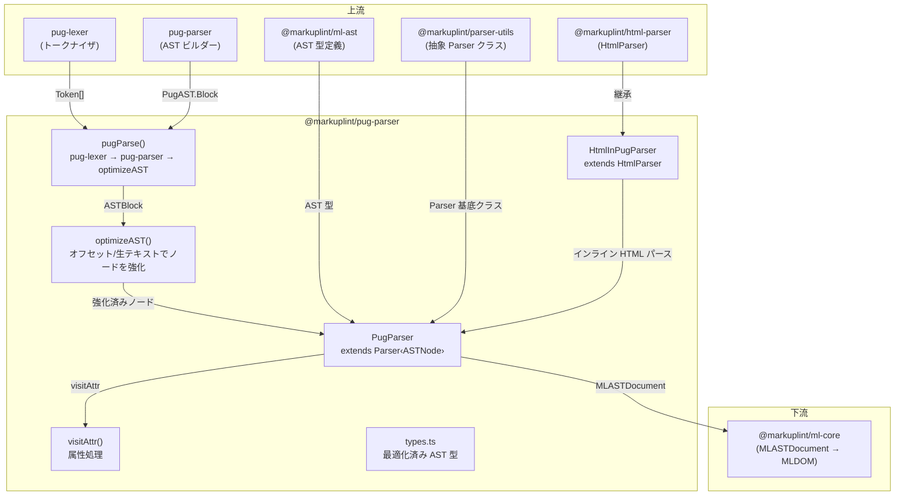
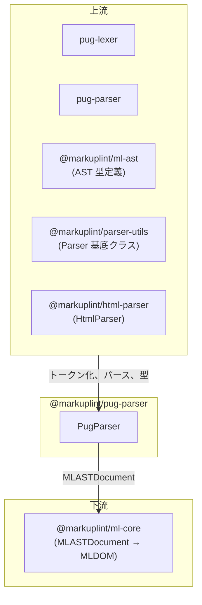

# @markuplint/pug-parser

## 概要

`@markuplint/pug-parser` は markuplint の Pug テンプレートパーサーです。Pug（旧 Jade）のインデントベースのテンプレート構文を統一された markuplint AST 形式（`MLASTDocument`）に変換します。上流のトークナイザ/パーサーとして `pug-lexer` と `pug-parser` を使用し、カスタム AST 最適化パス（`optimizeAST`）を実行して各ノードに正確なソースオフセット、生テキストスライス、終了位置を付与した後、メインの `PugParser` クラスが各ノードを markuplint AST アイテムに変換します。インライン HTML、タグ補間（`#[...]`）、ショートハンド属性（`#id` / `.class`）、`&attributes` スプレッド構文、ミックスイン、条件分岐、each ループ、インクルード、extends、フィルター、その他すべての Pug 固有の構文を処理します。

## ディレクトリ構成

```
src/
├── index.ts                              — parser インスタンスを再エクスポート
├── parser.ts                             — HtmlInPugParser、PugParser クラス、visitAttr、visitElement
├── types.ts                              — 最適化済み AST 型（ASTNode、ASTBlock 等）と PugAST 名前空間
├── pug-parser/
│   └── index.ts                          — pugParse()、optimizeAST()、ヘルパー関数群
└── utils/
    └── get-offset-from-line-and-col.ts   — マルチバイト対応オフセット計算
```

## アーキテクチャ図



## HtmlInPugParser

`HtmlInPugParser` は `@markuplint/html-parser` の `HtmlParser` を拡張する内部クラスです。Pug テンプレート内に埋め込まれた**インライン HTML コンテンツ**（`<` や `#[` を含むテキストノード）をパースする目的でのみ使用されます。

### コンストラクタ

```ts
class HtmlInPugParser extends HtmlParser {
  constructor() {
    super({
      ignoreTags: [
        {
          type: 'tag-interpolation',
          start: '#[',
          end: ']',
        },
      ],
    });
  }
}
```

`ignoreTags` オプションは `#[...]` タグ補間シーケンスをマスクし、HTML パーサーがこれらを HTML としてパースしようとする代わりにプリプロセッサ固有ブロック（`#ps:tag-interpolation`）として扱うようにします。これらのブロックは後で新しい `PugParser` インスタンスによって再帰的にパースされます。

### 埋め込み HTML モードとパースエラー

`new HtmlInPugParser().parse(...)` の呼び出しは毎回 `parserOptions.documentMode: 'fragment'` を強制します。Pug は document boundary（`doctype html`、`html(...)`）を所有しているため、Pug の 1 行で出力されるインライン HTML は定義上 partial です。fragment モードを強制することで、parse5 が document レベルのエラー（`missing-doctype`、`misplaced-doctype` 等）を Pug ソースファイルごとに発火させないようにします。

埋め込み `HtmlInPugParser` は **tokenizer レベル** のパースエラー（`duplicate-attribute`、`nested-comment` 等）は引き続き emit します。これらは `@markuplint/parser-utils` が提供する `Parser.accumulateParseErrors()` を経由して外側の `MLASTDocument.parseErrors` に surface されます。`severity.parseError` でオプトインしたユーザーは、Pug ソースを指す正しいオフセットでこれらを確認できます。

## PugParser クラス

### 継承関係

```
Parser<ASTNode>      (@markuplint/parser-utils)
    └── PugParser    (このパッケージ)
```

### コンストラクタ

```ts
class PugParser extends Parser<ASTNode> {
  constructor() {
    super({
      endTagType: 'never',
    });
  }
}
```

`endTagType: 'never'` は、Pug が明示的な閉じタグを生成しないことを基底パーサーに伝えます — Pug はインデントベースのネストを使用します。

### オーバーライドメソッド

| メソッド              | 用途                                                                                                                   |
| --------------------- | ---------------------------------------------------------------------------------------------------------------------- |
| `tokenize()`          | `pugParse()` を呼び出して最適化済み Pug AST を生成                                                                     |
| `parseError()`        | pug-lexer/pug-parser のエラー（`msg`、`line`、`column`、`src`）を `ParserError` に変換                                 |
| `nodeize()`           | 各 Pug AST ノードタイプを適切なビジターメソッドに振り分け                                                              |
| `afterFlattenNodes()` | `exposeInvalidNode: false` と `exposeWhiteSpace: false` で `super.afterFlattenNodes()` を呼び出す                      |
| `visitElement()`      | パース済み属性を持つ `MLASTElement` 開始タグを構築し、子ノードを訪問                                                   |
| `visitSpreadAttr()`   | `null` を返す（スプレッド属性は `Tag` ケース内でインラインで処理され、基底クラスのスプレッド属性ビジターは使用しない） |
| `visitAttr()`         | Pug 固有の属性構文を処理（ショートハンド、クォート名、非エスケープ、スクリプト値）                                     |

## tokenize()

```ts
tokenize(options?: ParseOptions) {
  const offsetOffset = options?.offsetOffset ?? 0;
  const ast = pugParse(this.rawCode, offsetOffset >= 1).nodes;
  return {
    ast: [...ast],
    isFragment: true,
  };
}
```

- 生の Pug ソースコードで `pugParse()` を呼び出す
- `useOffset` パラメータ（`offsetOffset >= 1` の場合 `true`）はレキサー出力から `indent` と `outdent` トークンをフィルタリング — これはゼロ以外のオフセットでサブテンプレート（例: タグ補間コンテンツ）をパースする際に必要（インデントコンテキストは親から継承されるため）
- Pug テンプレートは常にフラグメントとして扱われるため、常に `isFragment: true` を返す

## nodeize() 詳細

`nodeize()` メソッドは、各最適化済み Pug AST ノードを markuplint AST アイテムに変換する中央のディスパッチです。まず親の名前空間を決定し、ノードの計算済みオフセットを使用してソースフラグメントをスライスします。

### Doctype

```ts
case 'Doctype':
  return this.visitDoctype({ ...token, depth, parentNode, name: originNode.raw ?? '', publicId: '', systemId: '' });
```

生の doctype 文字列で `visitDoctype()` に委譲。Pug の doctype はショートハンド構文（`doctype html`）を使用するため、public ID と system ID は空です。

### Text

テキストノードには3つの処理パスがあります:

1. **空テキスト**（`raw.trim() === ''`）: 空配列を返す（無視）
2. **単純テキスト**（`<` や `#[` を含まない）: `visitText()` に直接委譲
3. **HTML やタグ補間を含むテキスト**: `HtmlInPugParser` でパース:
   - 新しい `HtmlInPugParser` インスタンスを作成し、オフセット/行/列コンテキストでテキストコンテンツをパース
   - 結果のノードリストを反復処理
   - `#ps:tag-interpolation` という名前のノードは `#[` プレフィックスと `]` サフィックスが除去され、内部コンテンツが新しい `PugParser` インスタンスで再帰的にパースされる
   - その他のノードはそのまま通過

この再帰的なパースチェーンにより、Pug のタグ補間（`#[strong 太字テキスト]`）が markuplint ノードに完全に解決されます。

### Comment / BlockComment

- **Comment**: 単一行 Pug コメント（`//- comment` または `// comment`）。`isBogus: false` で `visitComment()` に委譲
- **BlockComment**: 複数行ブロックコメント。最後の子ブロックノードから終了オフセットを計算し、`visitComment()` に委譲

### Tag

タグ処理は最も複雑なパスです:

1. **名前空間解決**: `@markuplint/html-parser` の `getNamespace()` をタグ名と親名前空間で呼び出す
2. **通常属性**: `originNode.attrs` の各属性を処理:
   - `this.getOffsetsFromCode()` でオフセット/終了オフセットを計算
   - ショートハンド属性（`#id` / `.class`）の場合、Pug AST では `offset === endOffset` となるため、`endOffset` を `attr.offset + attr.val.length - 1` として再計算
   - 各属性トークンを `this.visitAttr()` に渡す
3. **`&attributes` スプレッド構文**: 各 `attributeBlock` を処理:
   - `&attributes(` プレフィックス長を列に加算してスキップ
   - 内部式からトークンを作成
   - 結果は `{ type: 'spread', nodeName: '#spread' }` として型付け
4. **要素作成**: タグトークン、子ブロックノード、結合された属性配列（通常 + スプレッド）で `this.visitElement()` を呼び出す

### Default（Pug 固有の構文）

その他すべてのノードタイプ — `Conditional`、`Code`、`Each`、`Mixin`、`MixinBlock`、`Include`、`RawInclude`、`Extends`、`NamedBlock`、`Case`、`When`、`While`、`Filter`、`YieldBlock`、`InterpolatedTag`、`FileReference` — は `visitPsBlock()` を通じてプリプロセッサ固有ブロックにマッピングされます。

`Each` ノードでは、`blockBehavior` に `{ type: 'each', expression }` が設定されます。`expression` はイテレーション式（例: `i in obj`）です。これによりコアエンジンが Pug のループを認識できるようになります。

`file` プロパティを持つノード（例: `Include`、`Extends`）では、ノードの終了位置からファイル参照オフセットを計算して、生ソースにファイルパスを含むようトークンが拡張されます。

子ノードはノードタイプに応じて `block.nodes` または `nodes` から抽出されます。

## 属性処理 (visitAttr)

`visitAttr()` は Pug 属性構文の全範囲を処理します:

### ショートハンド属性

生の属性が `#` または `.` で始まる場合:

```ts
if (token.raw[0] === '#' || token.raw[0] === '.') {
  // 値のみとしてパース（AttrState.BeforeValue）
  // potentialName を設定: '#' → 'id'、'.' → 'class'
  // isDuplicatable: class の場合 true（複数クラスを許可）
}
```

- `#id-value` は `potentialName: 'id'`、`potentialValue: 'id-value'` としてパース
- `.class-name` は `potentialName: 'class'`、`potentialValue: 'class-name'`、`isDuplicatable: true` としてパース
- `startState: AttrState.BeforeValue` はトークン全体が値であることをパーサーに伝える（name=value 構造ではない）
- `quoteSet: []` と `endOfUnquotedValueChars: []` でクォート検出を無効化

### 通常属性

ショートハンド以外の属性:

- `quoteSet: []` — Pug 属性は属性自体に HTML スタイルのクォートを使用しない
- `noQuoteValueType: 'script'` — クォートなしの値は JavaScript 式として扱う
- `endOfUnquotedValueChars: []` — 特定の値終了区切り文字なし
- 属性名が `class` の場合、`isDuplicatable` を `true` に設定

### クォート付き属性名

```ts
if (attr.name.raw.startsWith("'") && attr.name.raw.endsWith("'")) {
  this.updateAttr(attr, { potentialName: attr.name.raw.slice(1, -1) });
}
```

Pug では属性名をシングルクォートで囲むことができます（例: `'data-value'="foo"`）。クォートを除去して実際の属性名を取得します。

### 非エスケープ属性

```ts
if (attr.name.raw.endsWith('!')) {
  this.updateAttr(attr, { potentialName: attr.name.raw.slice(0, -1) });
}
```

Pug の属性名の `!` サフィックス（例: `href!="/url"`）は、値が HTML エスケープされるべきでないことを示します。`!` は potential name から除去されます。

### 値の型パース

属性値は `@markuplint/parser-utils` の `scriptParser()` を使用して分析されます:

| scriptParser トークン型 | 結果                                                                                             |
| ----------------------- | ------------------------------------------------------------------------------------------------ |
| `Numeric`               | `valueType: 'number'`                                                                            |
| `Boolean`               | `valueType: 'boolean'`                                                                           |
| `String` / `Template`   | `super.visitAttr()` で再パースしてクォートと値を抽出。`!` サフィックスの場合 `valueType: 'code'` |
| 複数トークン            | `isDynamicValue: true`、`valueType: 'code'`（複雑な JavaScript 式）                              |

## Pug AST 最適化 (pug-parser/index.ts)

### pugParse()

Pug テンプレートパースのエントリーポイント:

```
Pug ソース → pug-lexer → [オプションの indent/outdent フィルタ] → pug-parser → optimizeAST → ASTBlock
```

1. **レキシング**: `lexer(pug)` が `Token[]` 配列を生成
2. **インデントフィルタリング**: `useOffset` が `true` の場合、サブテンプレートのパース時のインデントエラーを防ぐため `indent` と `outdent` トークンを除去
3. **クローン**: パーサーと最適化パスの両方が独立したトークン参照を必要とするため、`structuredClone()` でトークンをクローン
4. **パース**: `parser(lexOrigin)` が生の `PugAST.Block` を生成
5. **最適化**: `optimizeAST(originAst, lex, pug)` がすべてのノードに計算済みオフセットと生ソースを付与

### optimizeAST()

生の pug-parser AST を最適化済み AST に再帰的に変換します。各ノードに対して:

1. **オフセット計算**: `getOffsetsFromLines()` を使用して行/列から文字オフセットを計算
2. **終了位置**: `getLocationFromToken()` でマッチするレキサートークンを見つけ、終了行/列/オフセットを決定
3. **生ソース**: 元のソースをスライス: `pug.slice(offset, endOffset)`
4. **タイプ別処理**:

| ノードタイプ      | 処理                                                                                        |
| ----------------- | ------------------------------------------------------------------------------------------- |
| `Block`           | 再帰的に最適化し、親にフラット化                                                            |
| `Tag`             | 属性に `getAttrs()`、タグ終了に `getEndAttributeLocation()`、ブロックの再帰的最適化         |
| `Conditional`     | consequent ブロックを最適化、次に else-if/else チェーンに `optimizeASTOfConditionalNode()`  |
| `Each`            | 子ブロックを最適化                                                                          |
| `Include`         | 子ブロックを最適化                                                                          |
| `RawInclude`      | フィルターを保持                                                                            |
| `Mixin`           | `['mixin', 'call']` タイプフィルターで `getLocationFromToken()`、オプションのブロック最適化 |
| `MixinBlock`      | 単純な強化                                                                                  |
| `NamedBlock`      | 再帰的最適化のために `Block` として再ラップ                                                 |
| `Comment`         | 単純な強化                                                                                  |
| `BlockComment`    | 子ブロックを最適化                                                                          |
| `Code`            | 子ブロックを最適化                                                                          |
| `Text`            | `getPipelessText()` チェック、次にマルチテキスト処理に `getRawTextAndLocationEnd()`         |
| `Doctype`         | 単純な強化                                                                                  |
| `Case` / `When`   | 子ブロックを最適化                                                                          |
| `Filter`          | フィルターオプションに `getAttrs()`、終了に `getEndAttributeLocation()`、ブロック最適化     |
| `Extends`         | 単純な強化                                                                                  |
| `FileReference`   | 単純な強化                                                                                  |
| `IncludeFilter`   | 単純な強化                                                                                  |
| `InterpolatedTag` | 子ブロックを最適化                                                                          |
| `While`           | 単純な強化                                                                                  |
| `YieldBlock`      | 単純な強化                                                                                  |

5. **テキストマージ**: すべてのノードの処理後、`mergeTextNode()` が連続する `Text` ノードを単一ノードに結合

### getOffsetsFromLines()

ソース文字列から累積オフセットルックアップテーブルを構築します:

```ts
function getOffsetsFromLines(pug: string): number[] {
  const lines = pug.split(/\n/);
  let chars = 0;
  return lines.map(line => {
    chars += line.length + 1; // +1 は改行文字
    return chars;
  });
}
```

各エントリ `offsets[i]` は `i+1` 行目までの累積文字数（改行を含む）を保持。使用方法: `lineOffset = offsets[line - 2]` で対象行の開始オフセットを取得。

### mergeTextNode()

最初のノードの `raw`、`endColumn`、`endLine`、`endOffset` を拡張して、連続する `Text` ノードを結合します:

```ts
if (prevNode.type === 'Text' && node.type === 'Text') {
  prevNode.raw = pug.slice(prevNode.offset, node.endOffset);
  prevNode.endColumn = node.endColumn;
  prevNode.endLine = node.endLine;
  prevNode.endOffset = node.endOffset;
}
```

### getAttrs()

Pug AST の各属性を対応するレキサートークンと照合して属性データを強化します:

1. `offsets[attr.line - 2] + attr.column - 1` から属性のオフセットを計算
2. 行/列でマッチするレキサートークンを検索
3. トークンの位置範囲から属性の長さを計算
4. 生ソースをスライスして強化済み `ASTAttr` を作成

### getPipelessText()

`Text` ノードが**パイプレステキストブロック** — パイプ文字なしでタグの下にインデントされたテキストコンテンツ — の一部であるかを検出します:

```pug
p.
  これはパイプレステキストです。
  複数行にわたります。
```

レキサー出力で `start-pipeless-text` と `end-pipeless-text` トークンを検索。テキストノードがそのような範囲内にある場合、パイプレステキストブロックの全体範囲を返します。

### getEndAttributeLocation()

タグの位置以降のレキサートークンをスキャンして、すべての属性を含むタグの終了位置を決定します。`attribute`、`start-attributes`、`end-attributes`、`id`、`class` 以外のトークンに遭遇するまでトラッキングし、最後の属性関連トークンの終了位置を返します。

### getRawTextAndLocationEnd()

複数行テキストとパイプテキストの複雑なテキストノード処理を行います:

1. テキストノードの開始位置からレキサートークンを走査
2. `text` と `text-html` トークンで終了位置をトラッキング
3. `indent` / `outdent` トークンで深さをモニタリング
4. パイプテキスト（`|` で始まる行）を検出して処理を停止
5. 計算済み位置データを持つ `ASTText` ノードの配列を返す

### optimizeASTOfConditionalNode()

条件分岐ノードの `else if` / `else` チェーンを再帰的に処理します:

1. `else-if` 分岐の場合: レキサー出力で `else-if` トークンを検索し、位置を計算して `Conditional` ノードを作成
2. `else` 分岐（`Block` タイプの `alternate`）の場合: `else` トークンを検索し、位置を計算して `Conditional` ノードを作成
3. 連鎖条件分岐（`Conditional` タイプの `alternate`）の場合: 深さを増加させて再帰的に呼び出し

## バージョン互換性

このパッケージは Pug 3 構文仕様をサポートする `pug-lexer` と `pug-parser` を使用しています。`types.ts` の Pug AST 型は [pug-ast-spec](https://github.com/pugjs/pug-ast-spec/blob/master/parser.md) をモデルにしており、属性ブロックと追加位置データの拡張が加えられています。

## 主要ソースファイル

| ファイル                                    | 用途                                                                  |
| ------------------------------------------- | --------------------------------------------------------------------- |
| `src/parser.ts`                             | `HtmlInPugParser` と `PugParser` クラス、全ビジターメソッド           |
| `src/pug-parser/index.ts`                   | `pugParse()`、`optimizeAST()`、全 AST 強化ヘルパー関数                |
| `src/types.ts`                              | `ASTNode` 共用体、`ASTBlock`、最適化済みノード型、`PugAST` 名前空間型 |
| `src/utils/get-offset-from-line-and-col.ts` | `getOffsetFromLineAndCol()` マルチバイト対応オフセット計算            |
| `src/index.ts`                              | `parser` インスタンスの再エクスポート                                 |

## 外部依存

| 依存パッケージ             | 用途                                                                             |
| -------------------------- | -------------------------------------------------------------------------------- |
| `@markuplint/html-parser`  | `HtmlParser` クラス（`HtmlInPugParser` が拡張）と `getNamespace()` 関数          |
| `@markuplint/ml-ast`       | AST 型定義（`MLASTElement`、`MLASTAttr`、`MLASTParentNode` 等）                  |
| `@markuplint/parser-utils` | 抽象 `Parser` クラス、`ParserError`、`AttrState`、`scriptParser`、ユーティリティ |
| `pug-lexer`                | Pug テンプレートのトークン化                                                     |
| `pug-parser`               | Pug トークンストリームから AST への変換                                          |

## 統合ポイント



### 上流

- **`pug-lexer`** -- Pug ソースをトークンストリームにトークン化
- **`pug-parser`** -- トークンストリームを生の Pug AST に変換
- **`@markuplint/html-parser`** -- `HtmlParser`（`HtmlInPugParser` が拡張）と名前空間解決用の `getNamespace()` を提供
- **`@markuplint/ml-ast`** -- パーサー全体で使用される AST 型定義
- **`@markuplint/parser-utils`** -- `PugParser` が拡張する抽象 `Parser` クラス、`ParserError`、`AttrState`、`scriptParser`、位置ユーティリティ

### 下流

- **`@markuplint/ml-core`** -- `PugParser` が生成する `MLASTDocument` を消費して MLDOM を構築

## ドキュメントマップ

- [メンテナンスガイド](docs/maintenance.ja.md) -- コマンド、レシピ、トラブルシューティング
