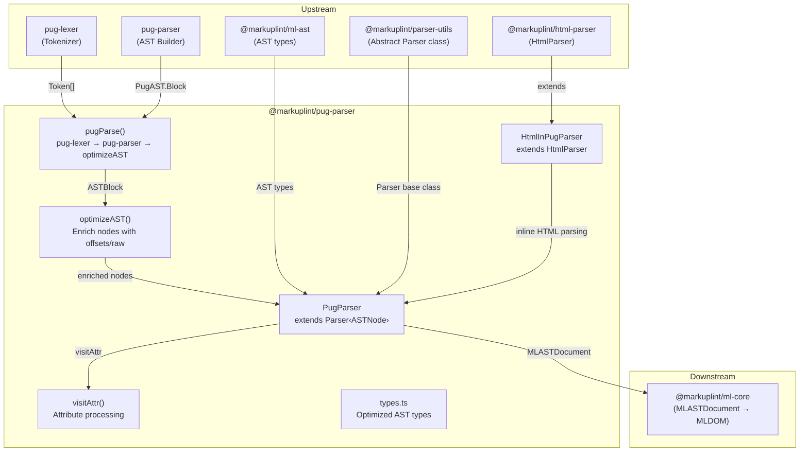
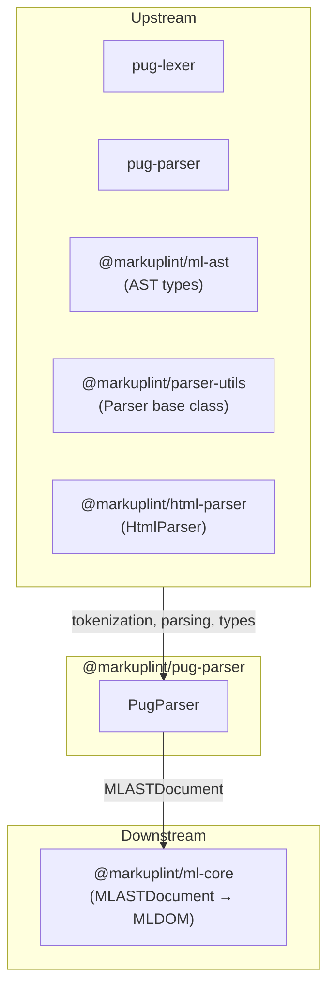

# @markuplint/pug-parser

## Overview

`@markuplint/pug-parser` is the Pug template parser for markuplint. It transforms Pug (formerly Jade) indentation-based template syntax into the unified markuplint AST format (`MLASTDocument`). The package uses `pug-lexer` and `pug-parser` as upstream tokenizer/parser, then runs a custom AST optimization pass (`optimizeAST`) to enrich every node with accurate source offsets, raw text slices, and end positions before the main `PugParser` class converts each node into markuplint AST items. It handles inline HTML, tag interpolation (`#[...]`), shorthand attributes (`#id` / `.class`), `&attributes` spread syntax, mixins, conditionals, each loops, includes, extends, filters, and all other Pug-specific constructs.

## Directory Structure

```
src/
├── index.ts                              — Re-exports parser instance
├── parser.ts                             — HtmlInPugParser, PugParser class, visitAttr, visitElement
├── types.ts                              — Optimized AST types (ASTNode, ASTBlock, etc.) and PugAST namespace
├── pug-parser/
│   └── index.ts                          — pugParse(), optimizeAST(), helper functions
└── utils/
    └── get-offset-from-line-and-col.ts   — Multi-byte-safe offset calculator
```

## Architecture Diagram



## HtmlInPugParser

`HtmlInPugParser` is an internal class that extends `HtmlParser` from `@markuplint/html-parser`. It is used exclusively to parse **inline HTML content** embedded within Pug templates (text nodes containing `<` or `#[`).

### Constructor

```ts
class HtmlInPugParser extends HtmlParser {
  constructor() {
    super({
      ignoreTags: [
        {
          type: 'tag-interpolation',
          start: '#[',
          end: ']',
        },
      ],
    });
  }
}
```

The `ignoreTags` option masks `#[...]` tag interpolation sequences so that the HTML parser treats them as preprocessor-specific blocks (`#ps:tag-interpolation`) rather than attempting to parse them as HTML. These blocks are later recursively parsed by a new `PugParser` instance.

### Embedded HTML mode and parse errors

Every invocation of `new HtmlInPugParser().parse(...)` hard-sets `parserOptions.documentMode: 'fragment'`. Pug owns the document boundary (`doctype html`, `html(...)`), so any inline HTML emitted by a single Pug line is a partial by definition. Forcing fragment mode keeps parse5 from firing document-level errors (`missing-doctype`, `misplaced-doctype`, etc.) on every Pug source file.

The embedded `HtmlInPugParser` may still emit **tokenizer-level** parse errors (e.g. `duplicate-attribute`, `nested-comment`). These are surfaced through `Parser.accumulateParseErrors()` (provided by `@markuplint/parser-utils`) into the outer `MLASTDocument.parseErrors`, so users who opt in via `severity.parseError` see them with offsets that point back into the Pug source.

## PugParser Class

### Inheritance

```
Parser<ASTNode>      (from @markuplint/parser-utils)
    └── PugParser    (this package)
```

### Constructor

```ts
class PugParser extends Parser<ASTNode> {
  constructor() {
    super({
      endTagType: 'never',
    });
  }
}
```

`endTagType: 'never'` tells the base parser that Pug never produces explicit closing tags — Pug uses indentation-based nesting instead.

### Override Methods

| Method                | Purpose                                                                                                                 |
| --------------------- | ----------------------------------------------------------------------------------------------------------------------- |
| `tokenize()`          | Calls `pugParse()` to produce an optimized Pug AST                                                                      |
| `parseError()`        | Converts pug-lexer/pug-parser errors (with `msg`, `line`, `column`, `src`) into `ParserError`                           |
| `nodeize()`           | Dispatches each Pug AST node type to the appropriate visitor method                                                     |
| `afterFlattenNodes()` | Calls `super.afterFlattenNodes()` with `exposeInvalidNode: false` and `exposeWhiteSpace: false`                         |
| `visitElement()`      | Constructs an `MLASTElement` start tag with pre-parsed attributes and visits child nodes                                |
| `visitSpreadAttr()`   | Returns `null` (spread attributes are handled inline in the `Tag` case, not through the base class spread attr visitor) |
| `visitAttr()`         | Handles Pug-specific attribute syntax (shorthand, quoted names, unescaped, script values)                               |

## tokenize()

```ts
tokenize(options?: ParseOptions) {
  const offsetOffset = options?.offsetOffset ?? 0;
  const ast = pugParse(this.rawCode, offsetOffset >= 1).nodes;
  return {
    ast: [...ast],
    isFragment: true,
  };
}
```

- Calls `pugParse()` with the raw Pug source code
- The `useOffset` parameter (set to `true` when `offsetOffset >= 1`) filters out `indent` and `outdent` tokens from the lexer output — this is necessary when parsing sub-templates (e.g., tag interpolation content) at a non-zero offset, because the indentation context is inherited from the parent
- Always returns `isFragment: true` since Pug templates are always treated as fragments

## nodeize() Details

The `nodeize()` method is the central dispatch that converts each optimized Pug AST node into markuplint AST items. It first determines the parent namespace, then slices the source fragment using the node's computed offsets.

### Doctype

```ts
case 'Doctype':
  return this.visitDoctype({ ...token, depth, parentNode, name: originNode.raw ?? '', publicId: '', systemId: '' });
```

Delegates to `visitDoctype()` with the raw doctype string. Public and system IDs are empty since Pug doctypes use shorthand syntax (`doctype html`).

### Text

Text nodes have three processing paths:

1. **Empty text** (`raw.trim() === ''`): Returns empty array (ignored)
2. **Simple text** (no `<` or `#[`): Delegates to `visitText()` directly
3. **Text containing HTML or tag interpolation**: Parsed through `HtmlInPugParser`:
   - Creates a new `HtmlInPugParser` instance and parses the text content with offset/line/column context
   - Iterates over the resulting node list
   - Nodes named `#ps:tag-interpolation` have their `#[` prefix and `]` suffix stripped, then the inner content is recursively parsed by a new `PugParser` instance
   - All other nodes are passed through as-is

This recursive parsing chain allows Pug tag interpolation (`#[strong bold text]`) to be fully resolved into markuplint nodes.

### Comment / BlockComment

- **Comment**: Single-line Pug comments (`//- comment` or `// comment`). Delegates to `visitComment()` with `isBogus: false`
- **BlockComment**: Multi-line block comments. Computes the end offset from the last child block node, then delegates to `visitComment()`

### Tag

Tag processing is the most complex path:

1. **Namespace resolution**: Calls `getNamespace()` from `@markuplint/html-parser` with the tag name and parent namespace
2. **Regular attributes**: Each attribute from `originNode.attrs` is processed:
   - Offset/endOffset are computed via `this.getOffsetsFromCode()`
   - For shorthand attributes (`#id` / `.class`), the attribute has `offset === endOffset` in the Pug AST, so `endOffset` is recalculated as `attr.offset + attr.val.length - 1`
   - Each attribute token is passed to `this.visitAttr()`
3. **`&attributes` spread syntax**: Each `attributeBlock` is processed:
   - The `&attributes(` prefix length is added to the column to skip it
   - A token is created from the inner expression
   - The result is typed as `{ type: 'spread', nodeName: '#spread' }`
4. **Element creation**: Calls `this.visitElement()` with the tag token, child block nodes, and the combined attributes array (regular + spread)

### Default (Pug-specific constructs)

All other node types — `Conditional`, `Code`, `Each`, `Mixin`, `MixinBlock`, `Include`, `RawInclude`, `Extends`, `NamedBlock`, `Case`, `When`, `While`, `Filter`, `YieldBlock`, `InterpolatedTag`, `FileReference` — are mapped to preprocessor-specific blocks via `visitPsBlock()`.

For `Each` nodes, a `blockBehavior` of `{ type: 'each', expression }` is set, where `expression` is the iteration expression (e.g., `i in obj`). This enables the core engine to recognize Pug loops.

For nodes with a `file` property (e.g., `Include`, `Extends`), the token is extended to include the file path in the raw source by computing the file reference offset from the node's end position.

Child nodes are extracted from either `block.nodes` or `nodes`, depending on the node type.

## Attribute Processing (visitAttr)

`visitAttr()` handles the full range of Pug attribute syntax:

### Shorthand Attributes

When the raw attribute starts with `#` or `.`:

```ts
if (token.raw[0] === '#' || token.raw[0] === '.') {
  // Parse as value-only (AttrState.BeforeValue)
  // Set potentialName: '#' → 'id', '.' → 'class'
  // isDuplicatable: true for class (multiple classes allowed)
}
```

- `#id-value` is parsed as: `potentialName: 'id'`, `potentialValue: 'id-value'`
- `.class-name` is parsed as: `potentialName: 'class'`, `potentialValue: 'class-name'`, `isDuplicatable: true`
- The `startState: AttrState.BeforeValue` tells the parser that the entire token is a value (no name=value structure)
- `quoteSet: []` and `endOfUnquotedValueChars: []` disable quote detection

### Regular Attributes

For non-shorthand attributes:

- `quoteSet: []` — Pug attributes don't use HTML-style quotes for the attribute itself
- `noQuoteValueType: 'script'` — unquoted values are treated as JavaScript expressions
- `endOfUnquotedValueChars: []` — no specific end-of-value delimiter characters
- If the attribute name is `class`, `isDuplicatable` is set to `true`

### Quoted Attribute Names

```ts
if (attr.name.raw.startsWith("'") && attr.name.raw.endsWith("'")) {
  this.updateAttr(attr, { potentialName: attr.name.raw.slice(1, -1) });
}
```

Pug allows attribute names to be wrapped in single quotes (e.g., `'data-value'="foo"`). The quotes are stripped to get the actual attribute name.

### Unescaped Attributes

```ts
if (attr.name.raw.endsWith('!')) {
  this.updateAttr(attr, { potentialName: attr.name.raw.slice(0, -1) });
}
```

Pug's `!` suffix on attribute names (e.g., `href!="/url"`) indicates the value should not be HTML-escaped. The `!` is removed from the potential name.

### Value Type Parsing

The attribute value is analyzed using `scriptParser()` from `@markuplint/parser-utils`:

| scriptParser Token Type | Result                                                                                            |
| ----------------------- | ------------------------------------------------------------------------------------------------- |
| `Numeric`               | `valueType: 'number'`                                                                             |
| `Boolean`               | `valueType: 'boolean'`                                                                            |
| `String` / `Template`   | Re-parsed with `super.visitAttr()` to extract quotes and value; `valueType: 'code'` if `!` suffix |
| Multiple tokens         | `isDynamicValue: true`, `valueType: 'code'` (complex JavaScript expression)                       |

## Pug AST Optimization (pug-parser/index.ts)

### pugParse()

The entry point for Pug template parsing:

```
Pug source → pug-lexer → [optional indent/outdent filter] → pug-parser → optimizeAST → ASTBlock
```

1. **Lexing**: `lexer(pug)` produces a `Token[]` array
2. **Indent filtering**: When `useOffset` is `true`, `indent` and `outdent` tokens are removed to prevent indentation errors when parsing sub-templates
3. **Cloning**: Tokens are cloned via `structuredClone()` because both the parser and optimization pass need independent token references
4. **Parsing**: `parser(lexOrigin)` produces a raw `PugAST.Block`
5. **Optimization**: `optimizeAST(originAst, lex, pug)` enriches every node with computed offsets and raw source

### optimizeAST()

Recursively transforms the raw pug-parser AST into an optimized AST. For each node:

1. **Offset computation**: Computes the character offset from line/column using `getOffsetsFromLines()`
2. **End location**: Finds the matching lexer token via `getLocationFromToken()` to determine end line/column/offset
3. **Raw source**: Slices the original source: `pug.slice(offset, endOffset)`
4. **Type-specific processing**:

| Node Type         | Processing                                                                                         |
| ----------------- | -------------------------------------------------------------------------------------------------- |
| `Block`           | Recursively optimizes and flattens into parent                                                     |
| `Tag`             | `getAttrs()` for attributes, `getEndAttributeLocation()` for tag end, recursive block optimization |
| `Conditional`     | Optimizes consequent block, then `optimizeASTOfConditionalNode()` for else-if/else chains          |
| `Each`            | Optimizes child block                                                                              |
| `Include`         | Optimizes child block                                                                              |
| `RawInclude`      | Preserves filters                                                                                  |
| `Mixin`           | `getLocationFromToken()` with `['mixin', 'call']` type filter, optional block optimization         |
| `MixinBlock`      | Simple enrichment                                                                                  |
| `NamedBlock`      | Re-wraps as `Block` for recursive optimization                                                     |
| `Comment`         | Simple enrichment                                                                                  |
| `BlockComment`    | Optimizes child block                                                                              |
| `Code`            | Optimizes child block                                                                              |
| `Text`            | `getPipelessText()` check, then `getRawTextAndLocationEnd()` for multi-text handling               |
| `Doctype`         | Simple enrichment                                                                                  |
| `Case` / `When`   | Optimizes child block                                                                              |
| `Filter`          | `getAttrs()` for filter options, `getEndAttributeLocation()` for end, block optimization           |
| `Extends`         | Simple enrichment                                                                                  |
| `FileReference`   | Simple enrichment                                                                                  |
| `IncludeFilter`   | Simple enrichment                                                                                  |
| `InterpolatedTag` | Optimizes child block                                                                              |
| `While`           | Simple enrichment                                                                                  |
| `YieldBlock`      | Simple enrichment                                                                                  |

5. **Text merging**: After processing all nodes, `mergeTextNode()` combines consecutive `Text` nodes into single nodes

### getOffsetsFromLines()

Builds a cumulative offset lookup table from the source string:

```ts
function getOffsetsFromLines(pug: string): number[] {
  const lines = pug.split(/\n/);
  let chars = 0;
  return lines.map(line => {
    chars += line.length + 1; // +1 for newline character
    return chars;
  });
}
```

Each entry `offsets[i]` contains the cumulative character count through line `i+1` (including the newline). Used as: `lineOffset = offsets[line - 2]` to get the offset of the start of the target line.

### mergeTextNode()

Combines consecutive `Text` nodes by extending the first node's `raw`, `endColumn`, `endLine`, and `endOffset` to cover all merged nodes:

```ts
if (prevNode.type === 'Text' && node.type === 'Text') {
  prevNode.raw = pug.slice(prevNode.offset, node.endOffset);
  prevNode.endColumn = node.endColumn;
  prevNode.endLine = node.endLine;
  prevNode.endOffset = node.endOffset;
}
```

### getAttrs()

Enriches attribute data by correlating each attribute from the Pug AST with its corresponding lexer token:

1. Computes the attribute's offset from `offsets[attr.line - 2] + attr.column - 1`
2. Finds the matching lexer token by line/column
3. Computes the attribute's length from the token's location span
4. Slices the raw source and creates the enriched `ASTAttr`

### getPipelessText()

Detects whether a `Text` node is part of a **pipeless text block** — indented text content below a tag without pipe characters:

```pug
p.
  This is pipeless text.
  It spans multiple lines.
```

Searches for `start-pipeless-text` and `end-pipeless-text` tokens in the lexer output. If the text node falls within such a range, returns the full span of the pipeless text block.

### getEndAttributeLocation()

Determines the end position of a tag including all its attributes by scanning lexer tokens after the tag's position. It tracks tokens until it encounters one that is not `attribute`, `start-attributes`, `end-attributes`, `id`, or `class`, then returns the end position of the last attribute-related token.

### getRawTextAndLocationEnd()

Handles complex text node processing for multi-line text and piped text:

1. Walks through lexer tokens from the text node's start position
2. Tracks `text` and `text-html` tokens for end position
3. Monitors `indent` / `outdent` tokens for depth tracking
4. Detects piped text (lines starting with `|`) and stops processing
5. Returns an array of `ASTText` nodes with computed location data

### optimizeASTOfConditionalNode()

Recursively processes `else if` / `else` chains in conditional nodes:

1. For `else-if` branches: Finds the `else-if` token in the lexer output, computes its location, and creates a `Conditional` node
2. For `else` branches (`alternate` of type `Block`): Finds the `else` token, computes location, creates a `Conditional` node
3. For chained conditionals (`alternate` of type `Conditional`): Recursively calls itself with increased depth

## Version Compatibility

The package uses `pug-lexer` and `pug-parser` which support the Pug 3 syntax specification. The Pug AST types in `types.ts` are modeled after the [pug-ast-spec](https://github.com/pugjs/pug-ast-spec/blob/master/parser.md) with extensions for attribute blocks and additional location data.

## Key Source Files

| File                                        | Purpose                                                                         |
| ------------------------------------------- | ------------------------------------------------------------------------------- |
| `src/parser.ts`                             | `HtmlInPugParser` and `PugParser` classes with all visitor methods              |
| `src/pug-parser/index.ts`                   | `pugParse()`, `optimizeAST()`, and all AST enrichment helper functions          |
| `src/types.ts`                              | `ASTNode` union, `ASTBlock`, optimized node types, and `PugAST` namespace types |
| `src/utils/get-offset-from-line-and-col.ts` | `getOffsetFromLineAndCol()` multi-byte-safe offset calculator                   |
| `src/index.ts`                              | Re-exports the `parser` instance                                                |

## External Dependencies

| Dependency                 | Purpose                                                                          |
| -------------------------- | -------------------------------------------------------------------------------- |
| `@markuplint/html-parser`  | `HtmlParser` class (extended by `HtmlInPugParser`) and `getNamespace()` function |
| `@markuplint/ml-ast`       | AST type definitions (`MLASTElement`, `MLASTAttr`, `MLASTParentNode`, etc.)      |
| `@markuplint/parser-utils` | Abstract `Parser` class, `ParserError`, `AttrState`, `scriptParser`, utilities   |
| `pug-lexer`                | Pug template tokenization                                                        |
| `pug-parser`               | Pug token stream to AST conversion                                               |

## Integration Points



### Upstream

- **`pug-lexer`** -- Tokenizes Pug source into a token stream
- **`pug-parser`** -- Converts the token stream into a raw Pug AST
- **`@markuplint/html-parser`** -- Provides `HtmlParser` (extended by `HtmlInPugParser`) and `getNamespace()` for namespace resolution
- **`@markuplint/ml-ast`** -- AST type definitions used throughout the parser
- **`@markuplint/parser-utils`** -- Abstract `Parser` class that `PugParser` extends, plus `ParserError`, `AttrState`, `scriptParser`, and location utilities

### Downstream

- **`@markuplint/ml-core`** -- Consumes the `MLASTDocument` produced by `PugParser` to build the MLDOM

## Documentation Map

- [Maintenance Guide](docs/maintenance.md) -- Commands, recipes, and troubleshooting
