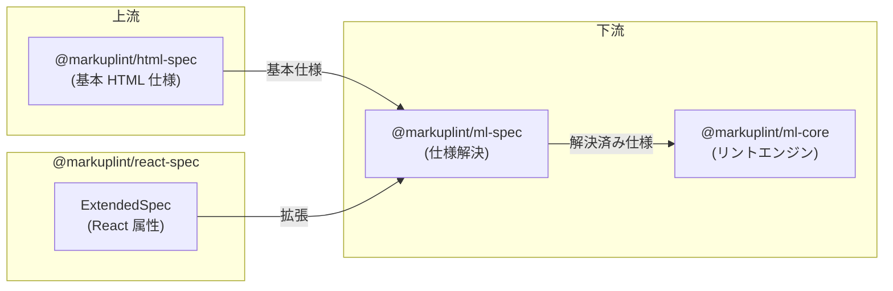

# @markuplint/react-spec

## 概要

`@markuplint/react-spec` は、markuplint に React 固有の JSX 属性定義を提供する仕様拡張パッケージです。グローバル JSX 属性（`key`、`ref`、`dangerouslySetInnerHTML`、ハイドレーション/contentEditable 警告抑制フラグなど）と、React の制御/非制御フォームコンポーネント（`input`、`select`、`textarea`）の要素レベル属性オーバーライドを登録する単一の `ExtendedSpec` オブジェクトをエクスポートします。

このパッケージにはパースロジックは含まれません。純粋なデータ定義であり、`@markuplint/ml-spec` が基本 HTML 仕様を React 固有の属性で拡張するために使用されます。

## ExtendedSpec の内容

### `acceptedAttrNames`

この spec は `acceptedAttrNames: 'idl'` を設定しており、`@markuplint/ml-core` の `MLAttr` コンストラクタに IDL 属性名を HTML コンテンツ属性名に解決するよう指示します（例: `className` -> `class`、`htmlFor` -> `for`）。`'idl'` モードでは IDL 名のみが受け入れられ、コンテンツ属性名を使うと候補として IDL 名が提示されます。この解決はパーサーではなくコアレベルで行われます。

### `contenteditable` オーバーライド

React は `contentEditable` 属性の値として `"inherit"` を受け付けます（ContentEditable インターフェースの IDL 状態値）。この仕様はグローバル属性 `contenteditable` の型を拡張し、`"inherit"` を有効な列挙値として追加します。

### グローバル属性

グローバル属性は `def['#globalAttrs']['#extends']` の下に定義され、すべての JSX 要素で利用可能です:

| 属性名                           | 型        | 説明                                                                     |
| -------------------------------- | --------- | ------------------------------------------------------------------------ |
| `key`                            | `Any`     | リストレンダリング用の特殊属性。React が変更された項目を識別するのに使用 |
| `ref`                            | `Any`     | 子コンポーネントのインスタンスや DOM 要素にアクセスするための属性        |
| `dangerouslySetInnerHTML`        | `Any`     | ブラウザ DOM で `innerHTML` を使用する代わりの React の手段              |
| `suppressContentEditableWarning` | `Boolean` | 子要素を持つ要素が `contentEditable` の場合の警告を抑制                  |
| `suppressHydrationWarning`       | `Boolean` | React のハイドレーションミスマッチ警告を抑制                             |

### 要素固有のオーバーライド

要素固有の属性は `specs[]` 配列に定義されます。各エントリは特定の HTML 要素を名前で指定します:

| 要素       | 属性名           | 型        | 条件                              | 説明                                     |
| ---------- | ---------------- | --------- | --------------------------------- | ---------------------------------------- |
| `input`    | `defaultChecked` | `Boolean` | `[type=checkbox]`, `[type=radio]` | 初期チェック状態の非制御コンポーネント版 |
| `input`    | `defaultValue`   | `Any`     | --                                | 初期値の非制御コンポーネント版           |
| `select`   | `value`          | `Any`     | --                                | 制御コンポーネントの値                   |
| `select`   | `defaultValue`   | `Any`     | --                                | 初期値の非制御コンポーネント版           |
| `textarea` | `value`          | `Any`     | --                                | 制御コンポーネントの値                   |
| `textarea` | `defaultValue`   | `Any`     | --                                | 初期値の非制御コンポーネント版           |

`caseSensitive: true` を持つ属性は大文字小文字の完全一致が必要です（例: `defaultchecked` ではなく `defaultChecked`）。`condition` フィールドは CSS セレクタ構文を使用して、属性が有効な場合を制限します。

## ディレクトリ構成

```
src/
└── index.ts    — React 固有の属性を持つ ExtendedSpec オブジェクトをエクスポート
```

## 主要ソースファイル

| ファイル   | 用途                                                          |
| ---------- | ------------------------------------------------------------- |
| `index.ts` | `ExtendedSpec` オブジェクトをデフォルトエクスポートとして定義 |

## 統合ポイント



### 上流

- **`@markuplint/ml-spec`** -- このパッケージが実装する `ExtendedSpec` 型を提供

### 下流

- **`@markuplint/ml-spec`** -- `ExtendedSpec` オブジェクトを使用して、React 固有の属性を解決済み仕様にマージ
- **`@markuplint/ml-core`** -- リント時に解決済み仕様（React 拡張を含む）を使用

## ドキュメントマップ

- [メンテナンスガイド](docs/maintenance.ja.md) -- コマンド、レシピ、ExtendedSpec 型リファレンス
