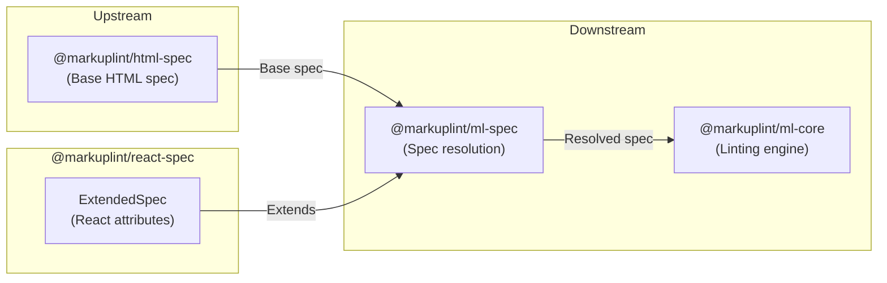

# @markuplint/react-spec

## Overview

`@markuplint/react-spec` is a spec extension package that provides React-specific JSX attribute definitions for markuplint. It exports a single `ExtendedSpec` object that registers global JSX attributes (such as `key`, `ref`, `dangerouslySetInnerHTML`, and hydration/contentEditable warning suppression flags) and element-level attribute overrides for React's controlled and uncontrolled form components (`input`, `select`, `textarea`).

This package contains no parsing logic -- it is purely a data definition consumed by `@markuplint/ml-spec` to extend the base HTML specification with React-specific attributes.

## ExtendedSpec Content

### Global Attributes

Global attributes are defined under `def['#globalAttrs']['#extends']` and are available on every JSX element:

| Attribute                        | Type      | Description                                                               |
| -------------------------------- | --------- | ------------------------------------------------------------------------- |
| `key`                            | `Any`     | Special attribute for list rendering to help React identify changed items |
| `ref`                            | `Any`     | Attribute for accessing child component instances and DOM elements        |
| `dangerouslySetInnerHTML`        | `Any`     | React's replacement for using `innerHTML` in the browser DOM              |
| `suppressContentEditableWarning` | `Boolean` | Suppresses the warning when an element with children is `contentEditable` |
| `suppressHydrationWarning`       | `Boolean` | Suppresses React hydration mismatch warnings for attributes and content   |

### Element-Specific Overrides

Element-specific attributes are defined in the `specs[]` array. Each entry targets a specific HTML element by name:

| Element    | Attribute        | Type      | Condition                         | Description                                       |
| ---------- | ---------------- | --------- | --------------------------------- | ------------------------------------------------- |
| `input`    | `defaultChecked` | `Boolean` | `[type=checkbox]`, `[type=radio]` | Uncontrolled equivalent for initial checked state |
| `input`    | `defaultValue`   | `Any`     | --                                | Uncontrolled equivalent for initial value         |
| `select`   | `value`          | `Any`     | --                                | Controlled component value                        |
| `select`   | `defaultValue`   | `Any`     | --                                | Uncontrolled equivalent for initial value         |
| `textarea` | `value`          | `Any`     | --                                | Controlled component value                        |
| `textarea` | `defaultValue`   | `Any`     | --                                | Uncontrolled equivalent for initial value         |

Attributes with `caseSensitive: true` require exact case matching (e.g., `defaultChecked` not `defaultchecked`). The `condition` field uses CSS selector syntax to restrict when the attribute is valid.

## Directory Structure

```
src/
└── index.ts    — Exports the ExtendedSpec object with React-specific attributes
```

## Key Source Files

| File       | Purpose                                                             |
| ---------- | ------------------------------------------------------------------- |
| `index.ts` | Defines and exports the `ExtendedSpec` object as the default export |

## Integration Points



### Upstream

- **`@markuplint/ml-spec`** -- Provides the `ExtendedSpec` type that this package implements

### Downstream

- **`@markuplint/ml-spec`** -- Consumes the `ExtendedSpec` object to merge React-specific attributes into the resolved specification
- **`@markuplint/ml-core`** -- Uses the resolved spec (including React extensions) during linting

## Documentation Map

- [Maintenance Guide](docs/maintenance.md) -- Commands, recipes, and ExtendedSpec type reference
