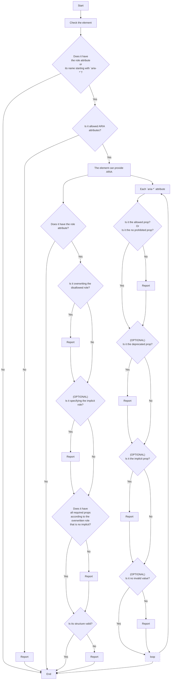

# WAI-ARIA

Warn if the `role` attribute and/or `aria-*` attributes don't set in accordance with specs that are WAI-ARIA and/or "ARIA in HTML".

Warn if:

- Clear-cut violation.
  - Use the role that doesn't exist in the spec.
  - Use the abstract role.
  - Use the property/state that doesn't belong to a set role (or an implicit role).
  - Use an invalid value of the property/state .
  - Use the not permitted role according to ARIA in HTML.
  - Don't set the required property/state.
- Unrecommended.
  - Set the deprecated property/state.
  - Set the implicit role explicitly according to ARIA in HTML.
  - Set the property/state explicitly when its element has semantic HTML attribute equivalent to it according to ARIA in HTML.
- Preference
  - Set the default value of the property/state explicitly.

There are settings about **ARIA in HTML** on [`@markuplint/html-spec`](https://github.com/markuplint/markuplint/tree/main/packages/%40markuplint/html-spec/src/aria-in-html). And you can disable them because that is draft yet.

## Flowchart



## Rule Details

👎 Examples of **incorrect** code for this rule

```html
<div role="landmark" aria-busy="busy">
  <ul>
    <li role="button">an item</li>
  </ul>
  <button aria-checked="true">Click me!</button>
</div>
```

👍 Examples of **correct** code for this rule

```html
<div role="banner" aria-busy="true">
  <ul>
    <li role="menuitemcheckbox">an item</li>
  </ul>
  <button aria-pressed="true">Click me!</button>
</div>
```

### Setting value

Type: `boolean`

### Options

#### `checkingValue`

Warn if use an invalid value of the property/state. You can temporarily disable this option if the WAI-ARIA spec update rather than markuplint add new value to the allowed list ahead. Don't recommend disabling basically.

- Type: `boolean`
- Optional
- Default: `true`

#### `checkingDeprecatedProps`

Warn if use deprecated property/state. You can temporarily disable this not to evaluate WAI-ARIA old version. Don't recommend disabling basically.

- Type: `boolean`
- Optional
- Default: `true`

##### `permittedAriaRoles`

Warn if use the not permitted role according to ARIA in HTML. This is based on the spec ARIA in HTML and is not strictly the spec WAI-ARIA, so it is an option.

- Type: `boolean`
- Optional
- Default: `true`

##### `disallowSetImplicitRole`

Disallow set the implicit role explicitly. This is based on the spec ARIA in HTML and is not strictly the spec WAI-ARIA, so it is an option.

- Type: `boolean`
- Optional
- Default: `true`

##### `disallowSetImplicitProps`

Disallow set the implicit property/state explicitly. This is based on the spec ARIA in HTML and is not strictly the spec WAI-ARIA, so it is an option.

- Type: `boolean`
- Optional
- Default: `true`

##### `disallowDefaultValue`

Disallow set the default value of the property/state explicitly.

- Type: `boolean`
- Optional
- Default: `false`

##### `version`

Choose the version of WAI-ARIA to evaluate.

- Type: `"1.1" | "1.2"`
- Optional
- Default: `1.2`

- ### Default severity

`error`

## Configuration Example

Explains an example of when changes configs are necessary due to browser support status or the behavior of assistive technologies.

Below is an example of disabling `disallowSetImplicitRole` when the `img` element loading SVG requires `role="img"` in Safari and VoiceOver environments.
(This matter is based on [the issue](https://bugs.webkit.org/show_bug.cgi?id=145263).)

```json
{
  "rules": {
    "wai-aria": true
  },
  "nodeRules": [
    {
      "selector": "img[src$=.svg]",
      "rules": {
        // Allows the implicit role:
        "wai-aria": {
          "option": {
            "disallowSetImplicitRole": false
          }
        },
        // Change to require to specify role attributes:
        "required-attr": "role",
        // Allow only img value for the role attribute:
        "invalid-attr": {
          "option": {
            "attrs": {
              "role": {
                "enum": ["img"]
              }
            }
          }
        }
      }
    }
  ]
}
```

The selector `img[src$=.svg]` **limits** the rule to the element that is loading an SVG image.
Then, disabling the `disallowSetImplicitRole` option **allows** setting `role="img"` which is the implicit role of the `img` element.
Furthermore, Change to require to specify the `role` attribute through the `required-attr` rule, and allows only the `img` value for the `role` attribute through the `invalid-attr` rule.
Doing this will urge add `role="img"` to the `img[src$=.svg]` element.
