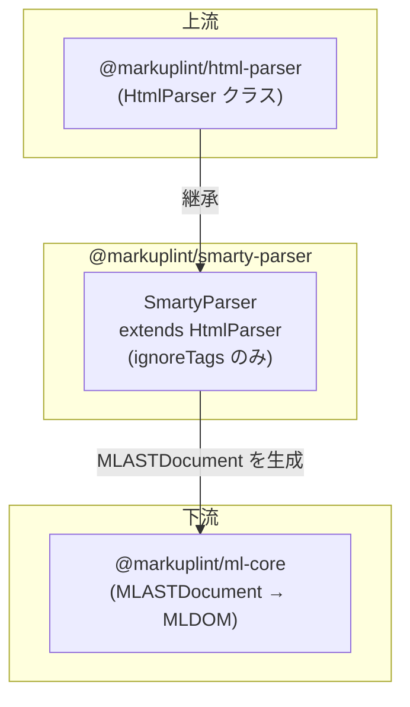

# @markuplint/smarty-parser

## 概要

`@markuplint/smarty-parser` は `HtmlParser` を拡張し、Smarty テンプレート式を含む HTML のリントを可能にします。Smarty 固有の `ignoreTags` パターンを定義する薄い設定レイヤーであり、すべてのパースロジックは基底の HTML パーサーに委譲されます。

## 動作の仕組み

このパーサーは基底の `HtmlParser` が提供する `ignoreTags` メカニズムを使用します:

1. **マスク** -- パース前に、すべての Smarty テンプレート式（`{ ... }`、`{* ... *}`、`{literal} ... {/literal}`）が開始/終了デリミタにより識別され、プレースホルダーテキストに置換される
2. **パース** -- マスクされた HTML は、テンプレート式が存在しないかのように標準 HTML パーサー（parse5）によってパースされる
3. **保持** -- 元の Smarty 式は AST 内に `#ps:*`（PreprocessorSpecificBlock）ノードとして保持され、ソース位置も維持される

このアプローチにより、markuplint は Smarty 構文に影響されることなく HTML 構造をリントできます。

## ignoreTags 設定

`SmartyParser` コンストラクタは、正しいマッチングを保証するために、最も具体的なものから順に3つのパターンを定義しています:

| タイプ             | 開始        | 終了         | 説明                                               |
| ------------------ | ----------- | ------------ | -------------------------------------------------- |
| `smarty-literal`   | `{literal}` | `{/literal}` | Smarty パースを経由しないリテラルブロック          |
| `smarty-comment`   | `{*`        | `*}`         | Smarty コメント（出力にレンダリングされない）      |
| `smarty-scriptlet` | `{`         | `}`          | 一般的な Smarty タグ（変数、関数、モディファイア） |

順序が重要です: `{literal}` と `{*` は汎用的な `{` パターンより先にマッチさせる必要があり、誤マッチを防止します。

## サポートされない構文

**引用符なしの属性値**内のテンプレート式はサポートされていません。これはすべてのテンプレートエンジンパーサーに共通する既知の制限です（[#240](https://github.com/markuplint/markuplint/issues/240)）。[ウェブサイトのドキュメント](https://markuplint.dev/docs/guides/besides-html)も参照してください。

使用可能:

```html
<div attr="{ $value }"></div>
<div attr="{ $value }"></div>
<div attr="{ $value }-{ $value2 }-{ $value3 }"></div>
```

使用不可（引用符なし）:

```html
<div attr="{" $value }></div>
```

## ディレクトリ構成

```
src/
├── index.ts        -- parser を再エクスポート
├── parser.ts       -- HtmlParser を拡張する SmartyParser クラス
└── index.spec.ts   -- パーサー統合テスト
```

## 主要ソースファイル

| ファイル        | 用途                                                                |
| --------------- | ------------------------------------------------------------------- |
| `src/parser.ts` | `SmartyParser` クラスを定義し、シングルトン `parser` をエクスポート |
| `src/index.ts`  | パッケージエントリーポイント。`parser` を再エクスポート             |

## 統合ポイント



## ドキュメントマップ

- [メンテナンスガイド](docs/maintenance.ja.md) -- コマンド、レシピ、テスト
