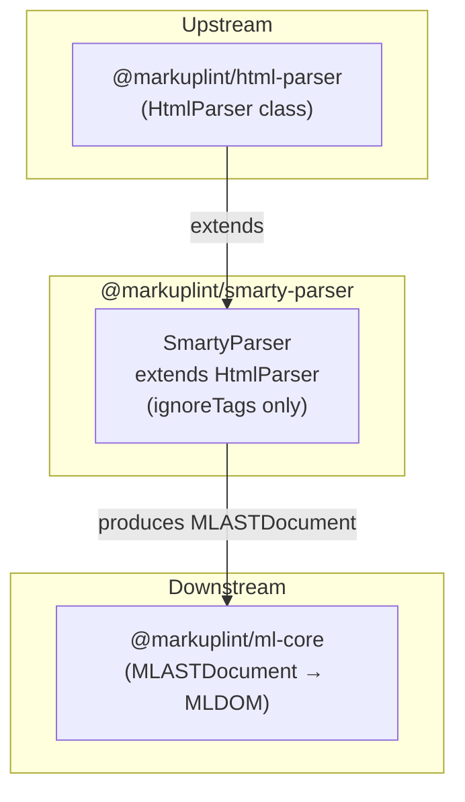

# @markuplint/smarty-parser

## Overview

`@markuplint/smarty-parser` extends `HtmlParser` to lint HTML containing Smarty template expressions. It is a thin configuration layer that defines Smarty-specific `ignoreTags` patterns, delegating all parsing logic to the base HTML parser.

## How It Works

The parser uses the `ignoreTags` mechanism provided by the base `HtmlParser`:

1. **Mask** -- Before parsing, all Smarty template expressions (`{ ... }`, `{* ... *}`, `{literal} ... {/literal}`) are identified by their start/end delimiters and replaced with placeholder text
2. **Parse** -- The masked HTML is parsed by the standard HTML parser (parse5) as if the template expressions did not exist
3. **Preserve** -- The original Smarty expressions are preserved in the AST as `#ps:*` (PreprocessorSpecificBlock) nodes, maintaining their source positions

This approach allows markuplint to lint the HTML structure without being confused by Smarty syntax.

## ignoreTags Configuration

The `SmartyParser` constructor defines three ignore patterns, ordered from most specific to least specific to ensure correct matching:

| Type               | Start       | End          | Description                                           |
| ------------------ | ----------- | ------------ | ----------------------------------------------------- |
| `smarty-literal`   | `{literal}` | `{/literal}` | Literal blocks passed through without Smarty parsing  |
| `smarty-comment`   | `{*`        | `*}`         | Smarty comments (not rendered in output)              |
| `smarty-scriptlet` | `{`         | `}`          | General Smarty tags (variables, functions, modifiers) |

The ordering matters: `{literal}` and `{*` must be matched before the generic `{` pattern to prevent false matches.

## Unsupported Syntaxes

Template expressions inside **unquoted attribute values** are not supported. This is a known limitation shared by all template engine parsers ([#240](https://github.com/markuplint/markuplint/issues/240)). See also the [website documentation](https://markuplint.dev/docs/guides/besides-html).

Available:

```html
<div attr="{ $value }"></div>
<div attr="{ $value }"></div>
<div attr="{ $value }-{ $value2 }-{ $value3 }"></div>
```

Unavailable (unquoted):

```html
<div attr="{" $value }></div>
```

## Directory Structure

```
src/
├── index.ts        -- Re-exports parser
├── parser.ts       -- SmartyParser class extending HtmlParser
└── index.spec.ts   -- Parser integration tests
```

## Key Source Files

| File            | Purpose                                                              |
| --------------- | -------------------------------------------------------------------- |
| `src/parser.ts` | Defines `SmartyParser` class and exports singleton `parser` instance |
| `src/index.ts`  | Package entry point; re-exports `parser`                             |

## Integration Points



## Documentation Map

- [Maintenance Guide](docs/maintenance.md) -- Commands, recipes, and testing
