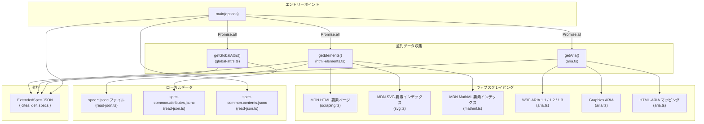
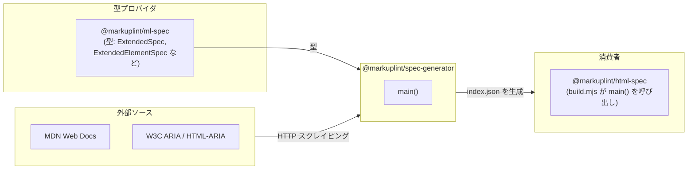

# @markuplint/spec-generator

## 概要

`@markuplint/spec-generator` は、markuplint の拡張仕様 JSON を生成するビルドツールです。W3C および MDN のウェブ標準ドキュメントをスクレイピングし、HTML/SVG/MathML 要素仕様、グローバル属性、ARIA ロール・プロパティ、コンテンツモデル定義を集約して、`@markuplint/html-spec` が消費する単一の `index.json` ファイルに出力します。

このパッケージは直接利用するために公開されるものではありません。`@markuplint/html-spec/build.mjs` からのみ呼び出されます。

## ディレクトリ構成

```
src/
├── index.ts          — main() オーケストレータおよび公開 API
├── html-elements.ts  — 要素仕様のアセンブリ、非推奨要素リスト
├── scraping.ts       — MDN 要素ページのスクレイピング（説明、カテゴリ、属性）
├── aria.ts           — W3C ARIA 仕様のスクレイピング（ロール、プロパティ、ステート）
├── global-attrs.ts   — グローバル属性定義の読み込み
├── svg.ts            — MDN から SVG 非推奨要素名を取得
├── mathml.ts         — MDN から MathML 非推奨要素名を取得
├── fetch.ts          — HTTP フェッチ（プロセス内キャッシュ＋プログレスバー付き）
├── read-json.ts      — コメント除去付き JSON ファイル読み込み＋ glob 対応
└── utils.ts          — 共有ヘルパー関数（ソート、重複排除、名前解析）

lib/                  — コンパイル出力（`yarn build` で生成）
```

## アーキテクチャ図



## モジュール一覧

| モジュール         | 主要エクスポート                                                                                                      | 役割                                                                 |
| ------------------ | --------------------------------------------------------------------------------------------------------------------- | -------------------------------------------------------------------- |
| `index.ts`         | `main()`, `Options`                                                                                                   | 全データ収集のオーケストレーション、出力の組み立て、ファイル書き込み |
| `html-elements.ts` | `getElements()`                                                                                                       | 要素仕様ファイルの読み込み、MDN データでの補完、非推奨要素の追加     |
| `scraping.ts`      | `fetchHTMLElement()`, `fetchObsoleteElements()`                                                                       | MDN 要素ページからメタデータと属性をスクレイピング                   |
| `aria.ts`          | `getAria()`                                                                                                           | W3C ARIA 仕様からロール、プロパティ、ステートをスクレイピング        |
| `global-attrs.ts`  | `getGlobalAttrs()`                                                                                                    | JSON からグローバル属性定義を読み込み                                |
| `svg.ts`           | `getSVGElementList()`                                                                                                 | MDN から非推奨 SVG 要素名を取得                                      |
| `mathml.ts`        | `getMathMLElementList()`                                                                                              | MDN から非推奨 MathML 要素名を取得                                   |
| `fetch.ts`         | `fetch()`, `fetchText()`, `getReferences()`                                                                           | 2層キャッシュとプログレスバー付き HTTP フェッチ                      |
| `read-json.ts`     | `readJson()`, `readJsons()`                                                                                           | コメント除去と glob マッチング付き JSON 読み込み                     |
| `utils.ts`         | `nameCompare()`, `sortObjectByKey()`, `arrayUnique()`, `getName()`, `getThisOutline()`, `mergeAttributes()`, `keys()` | 共有ユーティリティ                                                   |

## 公開 API

パッケージは単一のエントリーポイントをエクスポートします:

```typescript
export type Options = {
  readonly outputFilePath: string; // 生成 JSON の出力先パス
  readonly htmlFilePattern: string; // 要素仕様ファイルの glob パターン
  readonly commonAttrsFilePath: string; // グローバル属性 JSON のパス
  readonly commonContentsFilePath: string; // コンテンツモデル JSON のパス
};

export async function main(options: Options): Promise<void>;
```

## データフロー

1. **並列データ収集** -- `main()` は `Promise.all` で3つのタスクを同時実行:
   - `getElements(htmlFilePattern)` -- ローカル仕様ファイルを読み込み、各要素について MDN をスクレイピングし、非推奨要素を追加
   - `getGlobalAttrs(commonAttrsFilePath)` -- グローバル属性定義を読み込み
   - `getAria()` -- W3C ARIA 仕様（1.1, 1.2, 1.3）および Graphics ARIA、HTML-ARIA をスクレイピング

2. **組み立て** -- 結果を `ExtendedSpec` オブジェクトに統合:
   - `cites` -- フェッチした全 URL のソート済みリスト（`getReferences()` から）
   - `def["#globalAttrs"]` -- グローバル属性カテゴリ
   - `def["#aria"]` -- バージョンごとの ARIA ロール、プロパティ、グラフィックスロール
   - `def["#contentModels"]` -- コンテンツモデルカテゴリ（`readJson()` から）
   - `specs` -- 要素仕様の配列

3. **出力** -- 組み立てた JSON を `outputFilePath` に書き込み

## 外部依存

| パッケージ        | 用途                                                      |
| ----------------- | --------------------------------------------------------- |
| `cheerio`         | スクレイピングしたウェブページの HTML 解析と DOM クエリ   |
| `cli-progress`    | フェッチ操作のターミナルプログレスバー                    |
| `ajv`             | JSON スキーマバリデーション（利用可能だが実行時は未使用） |
| `fast-xml-parser` | XML パース（利用可能だが現在のモジュールでは未使用）      |
| `glob`            | `readJsons()` 用のファイル glob パターンマッチング        |
| `jsonc-parser`    | JSONC ファイル（コメント付き JSON）のパース               |

**開発依存:**

| パッケージ            | 用途                                                                     |
| --------------------- | ------------------------------------------------------------------------ |
| `@markuplint/ml-spec` | 型定義（`ExtendedSpec`, `ExtendedElementSpec`, `ARIARoleInSchema` など） |
| `type-fest`           | `WritableDeep` ユーティリティ型                                          |

## 統合ポイント



### 上流

- **`@markuplint/ml-spec`** はこのパッケージで使用される全 TypeScript 型を提供: `ExtendedSpec`, `ExtendedElementSpec`, `ARIARoleInSchema`, `ARIAProperty`, `Category`, `Attribute` など

### 下流

- **`@markuplint/html-spec`** が唯一の消費者。`build.mjs` がこのパッケージから `main()` をインポートし、仕様ソースと出力先のファイルパスを渡す

## ドキュメントマップ

- [モジュールリファレンス](docs/modules.ja.md) -- 各ソースモジュールの詳細ドキュメント
- [スクレイピング詳細](docs/scraping.ja.md) -- スクレイピング対象、セレクタ、エラー処理
- [メンテナンスガイド](docs/maintenance.ja.md) -- トラブルシューティング、レシピ、デバッグ
