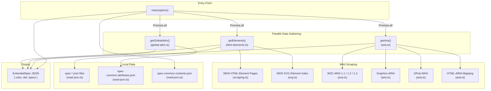
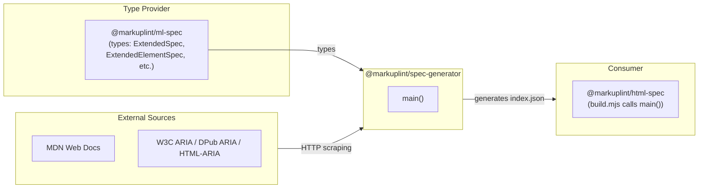

# @markuplint/spec-generator

## Overview

`@markuplint/spec-generator` is a build tool that generates the markuplint extended specification JSON. It scrapes W3C and MDN web standards documentation, aggregates HTML/SVG element specs, global attributes, ARIA roles and properties, and content model definitions into a single `index.json` file consumed by `@markuplint/html-spec`.

This package is not published for direct use. It is invoked exclusively from `@markuplint/html-spec/build.mjs`.

## Directory Structure

```
src/
├── index.ts          — main() orchestrator and public API
├── html-elements.ts  — Element specification assembly, obsolete element list
├── scraping.ts       — MDN element page scraping (descriptions, categories, attributes)
├── aria.ts           — W3C ARIA specification scraping (roles, properties, states)
├── global-attrs.ts   — Global attribute definition loader
├── svg.ts            — SVG deprecated element list fetcher
├── fetch.ts          — HTTP fetch with in-process caching and progress bar
├── read-json.ts      — JSON file reader with comment stripping and glob support
└── utils.ts          — Shared helper functions (sorting, deduplication, name parsing)

lib/                  — Compiled output (generated by `yarn build`)
```

## Architecture Diagram



## Module Overview

| Module             | Primary Export(s)                                                                                                     | Role                                                             |
| ------------------ | --------------------------------------------------------------------------------------------------------------------- | ---------------------------------------------------------------- |
| `index.ts`         | `main()`, `Options`                                                                                                   | Orchestrates all data gathering, assembles output, writes file   |
| `html-elements.ts` | `getElements()`                                                                                                       | Reads element spec files, enriches with MDN data, adds obsoletes |
| `scraping.ts`      | `fetchHTMLElement()`, `fetchObsoleteElements()`                                                                       | Scrapes MDN element pages for metadata and attributes            |
| `aria.ts`          | `getAria()`                                                                                                           | Scrapes W3C ARIA specs for roles, properties, states             |
| `global-attrs.ts`  | `getGlobalAttrs()`                                                                                                    | Reads global attribute definitions from JSON                     |
| `svg.ts`           | `getSVGElementList()`                                                                                                 | Fetches deprecated SVG element names from MDN                    |
| `fetch.ts`         | `fetch()`, `fetchText()`, `getReferences()`                                                                           | HTTP fetching with dual-layer cache and progress bar             |
| `read-json.ts`     | `readJson()`, `readJsons()`                                                                                           | JSON reading with comment stripping and glob matching            |
| `utils.ts`         | `nameCompare()`, `sortObjectByKey()`, `arrayUnique()`, `getName()`, `getThisOutline()`, `mergeAttributes()`, `keys()` | Shared utilities                                                 |

## Public API

The package exports a single entry point:

```typescript
export type Options = {
  readonly outputFilePath: string; // Where to write the generated JSON
  readonly htmlFilePattern: string; // Glob pattern for element spec files
  readonly commonAttrsFilePath: string; // Path to global attributes JSON
  readonly commonContentsFilePath: string; // Path to content models JSON
};

export async function main(options: Options): Promise<void>;
```

## Data Flow

1. **Parallel data gathering** -- `main()` launches three tasks concurrently via `Promise.all`:
   - `getElements(htmlFilePattern)` -- reads local spec files, scrapes MDN for each element, appends obsolete elements
   - `getGlobalAttrs(commonAttrsFilePath)` -- reads global attribute definitions
   - `getAria()` -- scrapes W3C ARIA specs (1.1, 1.2, 1.3) plus Graphics ARIA, DPub ARIA, and HTML-ARIA

2. **Assembly** -- The results are combined into an `ExtendedSpec` object:
   - `cites` -- sorted list of all fetched URLs (from `getReferences()`)
   - `def["#globalAttrs"]` -- global attribute categories
   - `def["#aria"]` -- ARIA roles, properties, graphics roles, and DPub roles per version
   - `def["#contentModels"]` -- content model categories (from `readJson()`)
   - `specs` -- element specification array

3. **Output** -- The assembled JSON is written to `outputFilePath`

## External Dependencies

| Package           | Purpose                                                  |
| ----------------- | -------------------------------------------------------- |
| `cheerio`         | HTML parsing and DOM querying of scraped web pages       |
| `cli-progress`    | Terminal progress bar for fetch operations               |
| `ajv`             | JSON Schema validation (available but unused in runtime) |
| `fast-xml-parser` | XML parsing (available but unused in current modules)    |
| `glob`            | File glob pattern matching for `readJsons()`             |
| `jsonc-parser`    | Parse JSONC files (JSON with comments) for spec data     |

**Dev dependencies:**

| Package               | Purpose                                                                            |
| --------------------- | ---------------------------------------------------------------------------------- |
| `@markuplint/ml-spec` | Type definitions (`ExtendedSpec`, `ExtendedElementSpec`, `ARIARoleInSchema`, etc.) |
| `type-fest`           | `WritableDeep` utility type                                                        |

## Integration Points



### Upstream

- **`@markuplint/ml-spec`** provides all TypeScript types used in this package: `ExtendedSpec`, `ExtendedElementSpec`, `ARIARoleInSchema`, `ARIAProperty`, `Category`, `Attribute`, etc.

### Downstream

- **`@markuplint/html-spec`** is the sole consumer. Its `build.mjs` imports `main()` from this package and passes file paths for the spec sources and output destination.

## Documentation Map

- [Module Reference](docs/modules.md) -- Detailed documentation for each source module
- [Scraping Details](docs/scraping.md) -- Web scraping targets, selectors, and error handling
- [Maintenance Guide](docs/maintenance.md) -- Troubleshooting, common recipes, and debugging
