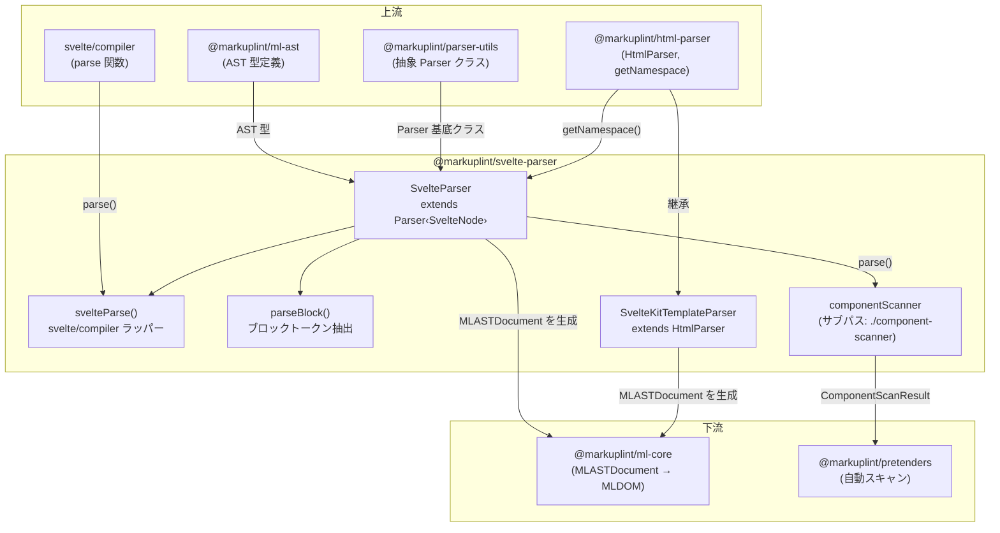

# @markuplint/svelte-parser

## 概要

`@markuplint/svelte-parser` は markuplint 用の Svelte テンプレートパーサーです。`svelte/compiler`（モダンモード）を使用して Svelte コンポーネントのソースコードをトークン化し、Svelte AST を markuplint の統一 `MLASTDocument` 形式に変換します。Svelte の要素、テキスト、コメント、式タグ（`{expression}`）、制御フローブロック（`{#if}`、`{#each}`、`{#await}`、`{#key}`、`{#snippet}`）、ディレクティブ（`bind:`、`class:`、`on:`、`use:`、`transition:`、`in:`、`out:`、`animate:`、`style:`、`let:`）、省略形属性（`{name}`）、スプレッド属性（`{...obj}`）を処理します。別途 `SvelteKitTemplateParser` が SvelteKit アプリテンプレートファイルのプレースホルダータグ（`%sveltekit.head%` 等）を処理します。

## ディレクトリ構成

```
src/
├── index.ts                    — parser.ts から parser を再エクスポート
├── parser.ts                   — Parser<SvelteNode> を拡張する SvelteParser クラス
├── parse-block.ts              — ユーティリティ: ブロック構文から open/close トークンを抽出
├── component-scanner.ts        — pretenders 自動スキャン用コンポーネントスキャナー（サブパスエクスポート）
├── svelte-parser/
│   ├── index.ts                — svelteParse(): svelte/compiler のラッパー、型エクスポート
│   └── index.spec.ts           — svelte/compiler 統合テスト
├── sveltekit-parser.ts         — HtmlParser を拡張する SvelteKitTemplateParser
├── sveltekit-parser.spec.ts    — SvelteKit テンプレートパースのテスト
├── index.spec.ts               — メインの SvelteParser 統合テスト
└── component-scanner.spec.ts   — コンポーネントスキャナーのテスト
```

## アーキテクチャ図



## SvelteParser クラス

### 継承関係

```
Parser<SvelteNode>  (@markuplint/parser-utils)
    └── SvelteParser  (このパッケージ)
```

### コンストラクタオプション

| オプション             | 値                                                      | 用途                                                                              |
| ---------------------- | ------------------------------------------------------- | --------------------------------------------------------------------------------- |
| `endTagType`           | `'xml'`                                                 | 終了タグは XML 形式の閉じルールに従う                                             |
| `tagNameCaseSensitive` | `true`                                                  | Svelte コンポーネントは PascalCase を使用（`<Widget>` vs `<div>`）                |
| `ignoreTags`           | `[{ type: 'Style', start: '<style', end: '</style>' }]` | `<style>` ブロックをマスク。`<script>` は `visitText()` で psblock として別途処理 |
| `maskChar`             | `'-'`                                                   | 無視されたコンテンツをマスクする文字                                              |

### インスタンスプロパティ

| プロパティ              | 型                    | 用途                                                              |
| ----------------------- | --------------------- | ----------------------------------------------------------------- |
| `specificBindDirective` | `ReadonlySet<string>` | 真のディレクティブとして扱う bind ディレクティブ: `group`、`this` |

### オーバーライドメソッド

| メソッド              | 用途                                                                                                                                          |
| --------------------- | --------------------------------------------------------------------------------------------------------------------------------------------- | ----------------------------------------------------------------------------------------- |
| `tokenize()`          | `svelteParse()` を呼び出して Svelte AST を生成                                                                                                |
| `parse()`             | `ignoreFrontMatter: false` で `super.parse()` に委譲                                                                                          |
| `parseError()`        | Svelte コンパイラエラーをエラーフレーム付きの `ParserError` でラップ                                                                          |
| `nodeize()`           | Svelte AST ノードを markuplint ノードに変換（テキスト、コメント、要素、式、制御フローブロック）                                               |
| `visitText()`         | `researchTags: false` で `super.visitText()` を呼び出し、`<script>` テキストを Script psblock に変換                                          |
| `visitPsBlock()`      | `super.visitPsBlock()` に委譲し、結果ノードが正確に1つであることを検証                                                                        |
| `visitChildren()`     | `super.visitChildren()` に委譲し、異なる階層レベルの兄弟ノードがないことを検証                                                                |
| `visitAttr()`         | Svelte 固有の属性構文を処理: 省略形、スプレッド、波括弧式（ディレクティブ処理は `@markuplint/svelte-spec` の `directivePatterns` に移行済み） |
| `detectElementType()` | 正規表現 `/^[A-Z]                                                                                                                             | \./` でコンポーネント vs HTML 要素を判定（PascalCase またはドット付き名はコンポーネント） |

## tokenize()

`tokenize()` メソッドはパースのエントリポイントです:

```ts
tokenize() {
    return {
        ast: svelteParse(this.rawCode),
        isFragment: true,
    };
}
```

`svelteParse()`（`svelte-parser/index.ts`）は `svelte/compiler` の `parse()` を `{ modern: true }` で呼び出します:

```ts
export function svelteParse(template: string): SvelteNode[] {
  const ast = parse(template, { modern: true });
  return ast.fragment.nodes ?? [];
}
```

`{ modern: true }` オプションにより Svelte 5 のモダン AST 形式が有効になり、Snippets、RenderTag、SvelteBoundary などの Svelte 5 新構文がサポートされます。

## nodeize() の詳細

`nodeize()` メソッドは Svelte AST ノードの `type` フィールドに基づいてディスパッチします:

### Text → visitText

テキストノードは `visitText()` に渡されます。`visitText()` 内部で、raw コンテンツが `<script` で始まるテキストノードは `nodeName: 'Script'` のプリプロセッサ固有ブロックに変換されます。`<script>` に対して `ignoreTags` を使用せずこのアプローチを採用した理由は、`lang` 属性を保持してパーサーに渡す必要があるためです（issue #2505 参照）。

### Comment → visitComment

コメントノード（`<!-- ... -->`）はトークンの depth と parent とともに `visitComment()` に直接渡されます。

### ExpressionTag → visitPsBlock

式タグ（`{expression}`）は `nodeName: 'ExpressionTag'`、`isFragment: false` のプリプロセッサ固有ブロックに変換されます。

### Component / RegularElement → visitElement

`Component` と `RegularElement` の両方のノードは `visitElement()` で処理されます:

1. 子ノードは `originNode.fragment.nodes` から抽出
2. 終了タグは正規表現で検出: ``new RegExp(`</${originNode.name}\\s*>$`, 'i')``
3. 開始タグの終了オフセットは最初の子ノードの開始位置から計算。子がない場合は raw コンテンツから終了タグを除去して計算
4. 名前空間は `@markuplint/html-parser` の `getNamespace(originNode.name, parentNamespace)` で解決
5. `createEndTagToken` コールバックが raw コンテンツ内の終了タグ正規表現の最後の出現位置から終了タグの位置を計算

### IfBlock → #traverseIfBlock()

`{#if}` ブロックは 2--4 個の psblock ノードを生成:

| ノード名 | 条件タイプ    | 説明                               |
| -------- | ------------- | ---------------------------------- |
| `if`     | `'if'`        | `{#if condition}` 開始タグ         |
| `elseif` | `'if:elseif'` | 各 `{:else if condition}` ブランチ |
| `else`   | `'if:else'`   | `{:else}` ブランチ                 |
| `/if`    | `'end'`       | `{/if}` 閉じタグ                   |

### EachBlock → #parseEachBlock()

`{#each}` ブロックは 2--3 個の psblock ノードを生成:

| ノード名     | 条件タイプ     | 説明                             |
| ------------ | -------------- | -------------------------------- |
| `each`       | `'each'`       | `{#each list as item}` 開始タグ  |
| `each:empty` | `'each:empty'` | `{:else}` フォールバックブランチ |
| `/each`      | `'end'`        | `{/each}` 閉じタグ               |

### AwaitBlock → #parseAwaitBlock()

`{#await}` ブロックは 2--4 個の psblock ノードを生成:

| ノード名      | 条件タイプ      | 説明                        |
| ------------- | --------------- | --------------------------- |
| `await`       | `'await'`       | `{#await promise}` 開始タグ |
| `await:then`  | `'await:then'`  | `{:then value}` ブランチ    |
| `await:catch` | `'await:catch'` | `{:catch error}` ブランチ   |
| `/await`      | `'end'`         | `{/await}` 閉じタグ         |

### KeyBlock → parseBlock()

`{#key}` ブロックは 2 個の psblock ノードを生成:

| ノード名 | 条件タイプ | 説明                         |
| -------- | ---------- | ---------------------------- |
| `key`    | `null`     | `{#key expression}` 開始タグ |
| `/key`   | `null`     | `{/key}` 閉じタグ            |

`parse-block.ts` の `parseBlock()` を使用して open/close トークンを抽出します。子ノードは `originNode.fragment.nodes` から取得します。

### SnippetBlock → parseBlock()

`{#snippet}` ブロック（Svelte 5）は 2 個の psblock ノードを生成:

| ノード名   | 条件タイプ | 説明                         |
| ---------- | ---------- | ---------------------------- |
| `snippet`  | `null`     | `{#snippet name()}` 開始タグ |
| `/snippet` | `null`     | `{/snippet}` 閉じタグ        |

`parse-block.ts` の `parseBlock()` を使用して open/close トークンを抽出します。子ノードは `originNode.body.nodes`（`fragment.nodes` ではない）から取得します。

### デフォルト（フォールバック）

その他のノードタイプ（例: `RenderTag`、`SvelteBoundary`）はデフォルトケースに到達し、`originNode.fragment.nodes`（`fragment` フィールドが存在する場合）から子ノードを抽出して `isFragment: true` の psblock を作成します。

## 制御フローブロックの詳細

### #traverseIfBlock()

このプライベートメソッドは `{#if}` / `{:else if}` / `{:else}` チェーンを再帰的にトラバースします:

```
#traverseIfBlock(originBlockNode, start, type = 'if')
```

**アルゴリズム:**

1. `start` から最初の子ノードの開始位置（`originBlockNode.consequent.nodes[0].start`）、または子がない場合はブロックの終了位置までのタグトークンを計算
2. `type`（'if'、'elseif'、'else'）と `children`（consequent ノード）とともにタグをプッシュ
3. `originBlockNode.alternate` をチェック:
   - 最初の alternate ノードが別の `IfBlock` の場合 → `type: 'elseif'` で **再帰的に** `#traverseIfBlock()` を呼び出し、最後の consequent 子の終了位置から開始
   - それ以外の場合 → 最後の consequent 子の終了位置から最初の alternate ノードの開始位置までの 'else' セグメントを作成
4. 最後に、最後の子の終了位置から `originBlockNode.end` までの閉じ `{/if}` タグを計算し、`type: '/if'` でプッシュ（raw コンテンツが空でない場合のみ。再帰呼び出しでの重複を回避）

**重要な詳細:** 再帰的なチェーン構造により、`{:else if ...}` ブロックは Svelte AST ではネストされた `IfBlock` ノードとしてモデル化されます。`#traverseIfBlock()` メソッドはこのネストを単一の線形トークン配列にフラット化し、それぞれが `nodeize()` で psblock ノードに変換されます。

### #parseEachBlock()

このプライベートメソッドは `{#each}` ブロックをパースします:

**アルゴリズム:**

1. `parseBlock()` を呼び出して `closeToken`（`{/each}` タグ）を抽出
2. 最初の body ノードの開始位置から `bodyStart` を計算。フォールバックは `closeToken.startOffset`
3. 最初の fallback ノードの開始位置から `fallbackScopeStart` を計算。フォールバックは `closeToken.startOffset`
4. 正規表現 `{\s*:else\s*}$` を使用して、ブロック開始から `fallbackScopeStart` までの raw コンテンツに対して `{:else}` トークンを検出
5. ブロック開始から `bodyStart` までの `each` 開始トークンを作成
6. `{:else}` が見つかった場合、`each:empty` トークンを作成
7. `/each` 閉じトークンを作成

**重要な詳細:** 正規表現 `{\s*:else\s*}$` は `$` アンカーを使用して、フォールバックスコープ前のコンテンツスライスの最後にある `{:else}` タグにマッチします。`?.index` プロパティが else トークンの開始文字オフセットを提供します。

### #parseAwaitBlock()

このプライベートメソッドは `{#await}` ブロック（最も複雑な制御フローブロック）をパースします:

**アルゴリズム:**

1. `parseBlock()` を呼び出して `closeToken` を抽出
2. `originBlockNode.expression.end` から await 式の終了位置を取得
3. `awaitExpEnd` を計算: 式の終了後の最初の `}` を見つけて `{#await expression}` タグを閉じる
4. ブロック開始から `awaitExpEnd` までの await 式トークンを作成
5. `{:then}` を検出: `pendingEnd`（または `awaitExpEnd`）以降のコンテンツが `{\s*:then[\s|}]` で始まるかチェック
   - `originBlockNode.value` が存在する場合（then 識別子）、`value.end` 以降の `}` を検索
   - それ以外の場合、`:then` 開始以降の最初の `}` を検索
6. `{:catch}` を検出: `thenEnd`（または `pendingEnd` または `awaitExpEnd`）以降のコンテンツが `{\s*:catch[\s|}]` で始まるかチェック
   - `originBlockNode.error` が存在する場合（catch 識別子）、`error.end` 以降の `}` を検索
   - それ以外の場合、`:catch` 開始以降の最初の `}` を検索
7. すべてのトークンを組み立て: `await` → （オプション）`await:then` → （オプション）`await:catch` → `/await`

**重要な詳細:** このメソッドは Svelte AST の `expression.end`、`value.end`、`error.end` フィールド（Svelte コンパイラの型がまだこれらのノードに `start`/`end` を公開していないため `@ts-ignore` でアクセス）を使用して、await、then、catch セクション間の境界を正確に特定します。`pending?.nodes`、`then?.nodes`、`catch?.nodes` フィールドが各セクションの子ノード配列を提供します。

### parseBlock()（parse-block.ts）

この共有ユーティリティはブロック構文から `openToken` と `closeToken` を抽出します:

**アルゴリズム:**

1. ブロック全体の raw コンテンツに対して正規表現 `{\s*\/[a-z]+\s*}$` で閉じタグをマッチ
2. マッチしない場合は `SyntaxError` をスロー
3. マッチインデックスからブロックの終了までの `closeToken` を計算
4. ブロックタイプに基づいてフラグメント（子ノード）を決定:
   - `IfBlock` → `consequent.nodes`
   - `AwaitBlock` → `pending?.nodes`
   - `KeyBlock` / `SvelteBoundary` → `fragment.nodes`
   - その他（例: `SnippetBlock`、`EachBlock`）→ `body.nodes`
5. `openToken` を計算:
   - フラグメントに開始位置と終了位置がある場合 → ブロック開始から最初のフラグメントノードの開始位置まで
   - それ以外の場合 → ブロック開始から閉じタグの開始位置まで

**重要な注意:** `openToken` は単独の開始タグを保証しません。`EachBlock` や `AwaitBlock` のようなブロックでは、open トークンに中間タグ（`:then`、`:else`）が含まれる可能性があるため、これらのブロックは `openToken` に頼らず独自のトークン分割ロジックを実装しています。`parseBlock()` ユーティリティは主にシンプルな open/close 構造を持つ `KeyBlock` と `SnippetBlock` で使用されます。

## 属性処理（visitAttr）とディレクティブ処理（@markuplint/svelte-spec の directivePatterns）

> **注記:** Svelte ディレクティブ処理（`bind:`、`on:`、`class:`、`style:`、`use:`、`animate:`、`transition:`、`in:`、`out:`、`let:`）は `@markuplint/svelte-spec` の `directivePatterns` で管理されています。このパーサーの `visitAttr()` メソッドは非ディレクティブの属性構文（省略形、スプレッド、波括弧式）を処理します。

> **二段階解決:** パーサーレベルのテスト（`index.spec.ts`）はパーサー自体が設定する raw AST 値を示します（例: 波括弧式のみ `isDynamicValue: true`）。コアレベルのテスト（`ml-core` や `rules`）は `ml-core` の `MLAttr` コンストラクタが `directivePatterns` を適用した後の最終解決値を示します。例えば、値なしの `on:click` はパーサーレベルでは `isDynamicValue: false` ですが、コアレベルでは `directivePatterns` マッチにより `isDynamicValue: true` に解決されます。

### クォートセット

パーサーは属性値に対して3種類のクォートを認識します:

| 開始 | 終了 | 型         | 例                  |
| ---- | ---- | ---------- | ------------------- |
| `"`  | `"`  | `'string'` | `class="foo"`       |
| `'`  | `'`  | `'string'` | `class='foo'`       |
| `{`  | `}`  | `'script'` | `bind:value={name}` |

### 開始状態の検出

属性の raw テキストが `{` で始まる場合、パーサーは `AttrState.BeforeValue`（省略形属性モード）で開始します。それ以外の場合は `AttrState.BeforeName`（通常属性モード）で開始します。

### ディレクティブテーブル

| プレフィックス | ディレクティブ種別     | 特別な処理                                                                                                            |
| -------------- | ---------------------- | --------------------------------------------------------------------------------------------------------------------- |
| `bind:`        | バインドディレクティブ | サブ名が `specificBindDirective` にない場合 → `isDirective=undefined`、`potentialName=subName`、`isDynamicValue=true` |
| `class:`       | クラスディレクティブ   | `isDuplicatable=true`、`potentialName='class'`、`isDynamicValue=true`                                                 |
| `on:`          | イベントハンドラ       | `isDirective=true`                                                                                                    |
| `use:`         | アクション             | `isDirective=true`                                                                                                    |
| `transition:`  | トランジション         | `isDirective=true`                                                                                                    |
| `in:`          | イントロトランジション | `isDirective=true`                                                                                                    |
| `out:`         | アウトロトランジション | `isDirective=true`                                                                                                    |
| `animate:`     | アニメーション         | `isDirective=true`                                                                                                    |
| `style:`       | スタイルディレクティブ | `isDirective=true`                                                                                                    |
| `let:`         | let バインディング     | `isDirective=true`                                                                                                    |

### bind: の特別処理

`specificBindDirective` セットには `group` と `this` が含まれます。これらは真のディレクティブ（`isDirective=true`）として扱われます。その他の `bind:` ディレクティブ（例: `bind:value`、`bind:checked`）は異なる扱いを受けます:

- `isDirective` は `undefined` に設定（markuplint の観点からはディレクティブではない）
- `potentialName` はサブ名に設定（例: `bind:value` の場合は `'value'`）
- `isDynamicValue` は `true` に強制

つまり `bind:value={name}` は、ディレクティブではなく動的な `value` 属性として扱われ、markuplint のルールが通常の属性として検証できるようになります。

### class: の処理

`class` で始まる属性（大文字小文字を区別しない）はすべて `isDuplicatable: true` を設定し、同じ要素上の複数の `class:` ディレクティブが重複属性警告をトリガーしないようにします。サブ名がある場合（例: `class:active`）、`potentialName` は `'class'` に設定され、`isDynamicValue` は `true` になります。

### 省略形 `{items}`

属性が `{items}` のような省略形式の場合:

- パーサーは `BeforeValue` 状態で開始（`{` プレフィックスにより検出）
- `attr.name.raw` は空（`''`）
- `potentialName` は value の raw コンテンツに設定（例: `'items'`）
- `isDynamicValue` は `true`

### スプレッド `{...attrs}`

基底の `visitAttr()` が `type: 'spread'` の属性を返した場合、追加処理なしでそのまま返されます。

### IDL 属性マッピング

IDL 属性マッピング（例: `tabIndex` → `tabindex`、`contentEditable` → `contenteditable`）は、spec が `acceptedAttrNames`（`'idl'` または `'both'`）を設定している場合に `ml-core` の `MLAttr` コンストラクタで処理されます。`@markuplint/svelte-spec` は `acceptedAttrNames: 'both'` を設定しているため、Svelte ファイルではパーサーレベルではなくコアレベルで IDL 解決が行われ、コンテンツ属性名と IDL 属性名の両方が受け入れられます。

マッピングはコンテンツ属性名がルックアップ名と異なる場合にのみ `potentialName` を更新するため、すでにコンテンツ属性形式と一致している属性（例: `value`、`class`）は影響を受けません。対応するコンテンツ属性を持たない IDL 専用プロパティ（例: `defaultValue`、`indeterminate`）はマッピングに含まれず、対となる `@markuplint/svelte-spec` パッケージで処理されます。

## SvelteKit パーサー

### アーキテクチャ上の区別

`SvelteKitTemplateParser` は `SvelteParser` とは**完全に別のパーサー**です。同じパッケージからエクスポートされますが、継承チェーンが異なり、用途も異なります:

|                          | SvelteParser                | SvelteKitTemplateParser                         |
| ------------------------ | --------------------------- | ----------------------------------------------- |
| **基底クラス**           | `Parser`（抽象）            | `HtmlParser`                                    |
| **パターン**             | フルフレームワークパーサー  | テンプレートエンジンパーサー（ignoreTags のみ） |
| **対象ファイル**         | `.svelte` コンポーネント    | `app.html`（SvelteKit アプリテンプレート）      |
| **外部ライブラリ**       | `svelte/compiler`           | なし                                            |
| **サブパスエクスポート** | `@markuplint/svelte-parser` | `@markuplint/svelte-parser/kit`                 |

SvelteKit アプリテンプレート（`src/app.html`）は特殊な `%sveltekit.*%` プレースホルダーを含む標準 HTML です。基盤構文が埋め込みトークン付きのプレーン HTML であるため、テンプレートエンジンパーサーパターン（`HtmlParser` を `ignoreTags` で拡張）が正しいアーキテクチャ上の選択です — Svelte コンパイラは不要です。

### 設定方法

```json
{
  "parser": {
    ".svelte$": "@markuplint/svelte-parser",
    ".html$": "@markuplint/svelte-parser/kit"
  }
}
```

### 実装

```ts
class SvelteKitTemplateParser extends HtmlParser {
  constructor() {
    super({
      ignoreTags: [
        {
          type: 'sveltekit-placeholder',
          start: '%sveltekit.',
          end: '%',
        },
      ],
    });
  }
}
```

### ignoreTags 設定

| タイプ                  | 開始          | 終了 | AST ノード名                | 説明                                   |
| ----------------------- | ------------- | ---- | --------------------------- | -------------------------------------- |
| `sveltekit-placeholder` | `%sveltekit.` | `%`  | `#ps:sveltekit-placeholder` | SvelteKit テンプレートプレースホルダー |

単一のパターンですべての SvelteKit プレースホルダーにマッチします:

- `%sveltekit.head%` — ビルド時に `<head>` コンテンツに置換
- `%sveltekit.body%` — ビルド時にレンダリングされたページボディに置換
- `%sveltekit.assets%` — ビルド時にアセットのベースパスに置換
- `%sveltekit.nonce%` — ビルド時に CSP nonce に置換（設定されている場合）
- `%sveltekit.env.[NAME]%` — ビルド時に環境変数に置換

これらのプレースホルダーはビルド時に SvelteKit によって置換されるため、リンティング中はマスクする必要があります。このパーサーは `package.json` の `./kit` サブパスエクスポートを通じてエクスポートされます。

## バージョン互換性

パーサーは `svelte/compiler` のモダンモード（`{ modern: true }`）を使用しており、Svelte 5 の AST 形式を生成します。このモダン AST 形式は以下をサポートします:

- **SnippetBlock** — Svelte 5 の `{#snippet}` 再利用可能なテンプレートフラグメント
- **RenderTag** — Svelte 5 の `{@render snippet()}` レンダリング構文
- **SvelteBoundary** — Svelte 5 の `<svelte:boundary>` エラーバウンダリ要素

これらの Svelte 5 構文はパーサーで処理されます: `SnippetBlock` は `nodeize()` で専用処理があり、`RenderTag` と `SvelteBoundary` はデフォルトケースに到達して psblock としてラップされます。

## 主要ソースファイル

| ファイル                     | 用途                                                                                                          |
| ---------------------------- | ------------------------------------------------------------------------------------------------------------- |
| `src/parser.ts`              | `SvelteParser` クラス — 全オーバーライドメソッドと制御フローロジックを含むメインパーサー                      |
| `src/parse-block.ts`         | `parseBlock()` — ブロックから open/close トークンを抽出する共有ユーティリティ                                 |
| `src/svelte-parser/index.ts` | `svelteParse()` — `svelte/compiler` ラッパーと Svelte AST 型エクスポート                                      |
| `src/sveltekit-parser.ts`    | `SvelteKitTemplateParser` — SvelteKit `app.html` 用の HtmlParser 拡張                                         |
| `src/index.ts`               | パッケージエントリポイント — `parser` を再エクスポート                                                        |
| `src/component-scanner.ts`   | `@markuplint/pretenders` 自動スキャン用コンポーネントスキャナー（サブパスエクスポート `./component-scanner`） |

## 外部依存

| 依存パッケージ             | 用途                                                                    |
| -------------------------- | ----------------------------------------------------------------------- |
| `@markuplint/ml-ast`       | AST 型定義（`MLASTPreprocessorSpecificBlock` 等）                       |
| `@markuplint/parser-utils` | 抽象 `Parser` クラス、`ChildToken`、`Token`、`AttrState`、`ParserError` |
| `@markuplint/html-parser`  | `HtmlParser`（SvelteKit パーサーの基底）、`getNamespace()`              |
| `svelte`                   | `svelte/compiler` の `parse()` 関数（トークン化用）                     |

## ドキュメントマップ

- [メンテナンスガイド](docs/maintenance.ja.md) -- コマンド、レシピ、トラブルシューティング
