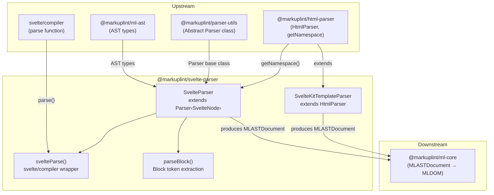

# @markuplint/svelte-parser

## Overview

`@markuplint/svelte-parser` is a Svelte template parser for markuplint. It uses `svelte/compiler` (modern mode) to tokenize Svelte component source code, then converts the Svelte AST into markuplint's unified `MLASTDocument` format. The parser handles Svelte elements, text, comments, expression tags (`{expression}`), control flow blocks (`{#if}`, `{#each}`, `{#await}`, `{#key}`, `{#snippet}`), directives (`bind:`, `class:`, `on:`, `use:`, `transition:`, `in:`, `out:`, `animate:`, `style:`, `let:`), shorthand attributes (`{name}`), and spread attributes (`{...obj}`). A separate `SvelteKitTemplateParser` handles SvelteKit app template files with placeholder tags like `%sveltekit.head%`.

## Directory Structure

```
src/
├── index.ts                  — Re-exports parser from parser.ts
├── parser.ts                 — SvelteParser class extending Parser<SvelteNode>
├── parse-block.ts            — Utility: extracts open/close tokens from block constructs
├── svelte-parser/
│   ├── index.ts              — svelteParse() wrapper around svelte/compiler, type exports
│   └── index.spec.ts         — Tests for svelte/compiler integration
├── sveltekit-parser.ts       — SvelteKitTemplateParser extending HtmlParser
├── sveltekit-parser.spec.ts  — Tests for SvelteKit template parsing
└── index.spec.ts             — Integration tests for the main SvelteParser
```

## Architecture Diagram



## SvelteParser Class

### Inheritance

```
Parser<SvelteNode>  (from @markuplint/parser-utils)
    └── SvelteParser  (this package)
```

### Constructor Options

| Option                 | Value                                                   | Purpose                                                                                |
| ---------------------- | ------------------------------------------------------- | -------------------------------------------------------------------------------------- |
| `endTagType`           | `'xml'`                                                 | End tags follow XML-style closing rules                                                |
| `tagNameCaseSensitive` | `true`                                                  | Svelte components use PascalCase (`<Widget>` vs `<div>`)                               |
| `ignoreTags`           | `[{ type: 'Style', start: '<style', end: '</style>' }]` | Mask `<style>` blocks; `<script>` is handled separately via `visitText()` as a psblock |
| `maskChar`             | `'-'`                                                   | Character used to mask ignored content                                                 |

### Instance Properties

| Property                | Type                  | Purpose                                                     |
| ----------------------- | --------------------- | ----------------------------------------------------------- |
| `specificBindDirective` | `ReadonlySet<string>` | Bind directives treated as true directives: `group`, `this` |

### Override Methods

| Method                | Purpose                                                                                                                                                             |
| --------------------- | ------------------------------------------------------------------------------------------------------------------------------------------------------------------- | ------------------------------------------------ |
| `tokenize()`          | Calls `svelteParse()` to produce the Svelte AST                                                                                                                     |
| `parse()`             | Delegates to `super.parse()` with `ignoreFrontMatter: false`                                                                                                        |
| `parseError()`        | Wraps Svelte compiler errors with `ParserError`, including the error frame                                                                                          |
| `nodeize()`           | Converts Svelte AST nodes to markuplint nodes (text, comment, element, expression, control flow blocks)                                                             |
| `visitText()`         | Calls `super.visitText()` with `researchTags: false`; converts `<script>` text to Script psblock                                                                    |
| `visitPsBlock()`      | Delegates to `super.visitPsBlock()` and enforces exactly one result node                                                                                            |
| `visitChildren()`     | Delegates to `super.visitChildren()` and validates no sibling nodes with differing hierarchy levels                                                                 |
| `visitAttr()`         | Handles Svelte-specific attribute syntax: shorthand, spread, curly-brace expressions (directive handling moved to `directivePatterns` in `@markuplint/svelte-spec`) |
| `detectElementType()` | Detects component vs HTML element using the regex `/^[A-Z]                                                                                                          | \./` (PascalCase or dotted names are components) |

## tokenize()

The `tokenize()` method is the entry point for parsing:

```ts
tokenize() {
    return {
        ast: svelteParse(this.rawCode),
        isFragment: true,
    };
}
```

`svelteParse()` (in `svelte-parser/index.ts`) calls `svelte/compiler`'s `parse()` with `{ modern: true }`:

```ts
export function svelteParse(template: string): SvelteNode[] {
  const ast = parse(template, { modern: true });
  return ast.fragment.nodes ?? [];
}
```

The `{ modern: true }` option enables Svelte 5's modern AST format, which supports new Svelte 5 syntax such as Snippets, RenderTag, and SvelteBoundary.

## nodeize() Details

The `nodeize()` method dispatches on the Svelte AST node's `type` field:

### Text → visitText

Text nodes are passed to `visitText()`. Inside `visitText()`, any text node whose raw content starts with `<script` is converted into a preprocessor-specific block with `nodeName: 'Script'`. This approach was adopted instead of using `ignoreTags` for `<script>` because the `lang` attribute needs to be preserved and passed to the parser (see issue #2505).

### Comment → visitComment

Comment nodes (`<!-- ... -->`) are passed directly to `visitComment()` with the token's depth and parent.

### ExpressionTag → visitPsBlock

Expression tags (`{expression}`) are converted to preprocessor-specific blocks with `nodeName: 'ExpressionTag'` and `isFragment: false`.

### Component / RegularElement → visitElement

Both `Component` and `RegularElement` nodes are handled by `visitElement()`:

1. Child nodes are extracted from `originNode.fragment.nodes`
2. The end tag is detected via regex: ``new RegExp(`</${originNode.name}\\s*>$`, 'i')``
3. The start tag end offset is calculated from the first child's start position, or by stripping the end tag from the raw content
4. Namespace is resolved via `getNamespace(originNode.name, parentNamespace)` from `@markuplint/html-parser`
5. The `createEndTagToken` callback computes the end tag location from the last occurrence of the end tag regex in the raw content

### IfBlock → #traverseIfBlock()

The `{#if}` block produces 2--4 psblock nodes:

| Node Name | Conditional Type | Description                        |
| --------- | ---------------- | ---------------------------------- |
| `if`      | `'if'`           | The `{#if condition}` opener       |
| `elseif`  | `'if:elseif'`    | Each `{:else if condition}` branch |
| `else`    | `'if:else'`      | The `{:else}` branch               |
| `/if`     | `'end'`          | The `{/if}` closer                 |

### EachBlock → #parseEachBlock()

The `{#each}` block produces 2--3 psblock nodes:

| Node Name    | Conditional Type | Description                       |
| ------------ | ---------------- | --------------------------------- |
| `each`       | `'each'`         | The `{#each list as item}` opener |
| `each:empty` | `'each:empty'`   | The `{:else}` fallback branch     |
| `/each`      | `'end'`          | The `{/each}` closer              |

### AwaitBlock → #parseAwaitBlock()

The `{#await}` block produces 2--4 psblock nodes:

| Node Name     | Conditional Type | Description                   |
| ------------- | ---------------- | ----------------------------- |
| `await`       | `'await'`        | The `{#await promise}` opener |
| `await:then`  | `'await:then'`   | The `{:then value}` branch    |
| `await:catch` | `'await:catch'`  | The `{:catch error}` branch   |
| `/await`      | `'end'`          | The `{/await}` closer         |

### KeyBlock → parseBlock()

The `{#key}` block produces 2 psblock nodes:

| Node Name | Conditional Type | Description                    |
| --------- | ---------------- | ------------------------------ |
| `key`     | `null`           | The `{#key expression}` opener |
| `/key`    | `null`           | The `{/key}` closer            |

Uses `parseBlock()` from `parse-block.ts` to extract open and close tokens. Child nodes come from `originNode.fragment.nodes`.

### SnippetBlock → parseBlock()

The `{#snippet}` block (Svelte 5) produces 2 psblock nodes:

| Node Name  | Conditional Type | Description                    |
| ---------- | ---------------- | ------------------------------ |
| `snippet`  | `null`           | The `{#snippet name()}` opener |
| `/snippet` | `null`           | The `{/snippet}` closer        |

Uses `parseBlock()` from `parse-block.ts` to extract open and close tokens. Child nodes come from `originNode.body.nodes` (not `fragment.nodes`).

### Default (fallback)

Any other node type (e.g., `RenderTag`, `SvelteBoundary`) falls through to the default case, which extracts child nodes from `originNode.fragment.nodes` (if the `fragment` field exists) and creates a psblock with `isFragment: true`.

## Control Flow Block Details

### #traverseIfBlock()

This private method recursively traverses the `{#if}` / `{:else if}` / `{:else}` chain:

```
#traverseIfBlock(originBlockNode, start, type = 'if')
```

**Algorithm:**

1. Compute the tag token from `start` to the first child node's start position (`originBlockNode.consequent.nodes[0].start`), or the block's end if there are no children
2. Push the tag with its `type` ('if', 'elseif', or 'else') and `children` (consequent nodes)
3. Check `originBlockNode.alternate`:
   - If the first alternate node is another `IfBlock` → **recursively** call `#traverseIfBlock()` with `type: 'elseif'`, starting from the last consequent child's end
   - Otherwise → create an 'else' segment from the last consequent child's end to the first alternate node's start
4. Finally, compute the closing `{/if}` tag from the last child's end to `originBlockNode.end` and push it with `type: '/if'` (only if the raw content is non-empty, which avoids duplicating closers in recursive calls)

**Key detail:** The recursive chain structure means that `{:else if ...}` blocks are modeled as nested `IfBlock` nodes in the Svelte AST. The `#traverseIfBlock()` method flattens this nesting into a single linear array of tokens, which are then each converted to psblock nodes in `nodeize()`.

### #parseEachBlock()

This private method parses the `{#each}` block:

**Algorithm:**

1. Call `parseBlock()` to extract the `closeToken` (the `{/each}` tag)
2. Compute `bodyStart` from the first body node's start, or fall back to `closeToken.startOffset`
3. Compute `fallbackScopeStart` from the first fallback node's start, or fall back to `closeToken.startOffset`
4. Detect the `{:else}` token using the regex `{\s*:else\s*}$` matched against the raw content from the block start up to `fallbackScopeStart`
5. Create the `each` opening token from block start to `bodyStart`
6. If `{:else}` was found, create the `each:empty` token
7. Create the `/each` closing token

**Key detail:** The regex `{\s*:else\s*}$` uses the `$` anchor to match the `{:else}` tag at the very end of the content slice before the fallback scope. The `?.index` property gives the character offset where the else token begins.

### #parseAwaitBlock()

This private method parses the `{#await}` block, the most complex control flow block:

**Algorithm:**

1. Call `parseBlock()` to extract the `closeToken`
2. Find the await expression end from `originBlockNode.expression.end`
3. Compute `awaitExpEnd`: find the first `}` after the expression end to close the `{#await expression}` tag
4. Create the await expression token from block start to `awaitExpEnd`
5. Detect `{:then}`: check if content after `pendingEnd` (or `awaitExpEnd`) starts with `{\s*:then[\s|}]`
   - If `originBlockNode.value` exists (the `then` identifier), find the `}` after `value.end`
   - Otherwise, find the first `}` after the `:then` start
6. Detect `{:catch}`: check if content after `thenEnd` (or `pendingEnd` or `awaitExpEnd`) starts with `{\s*:catch[\s|}]`
   - If `originBlockNode.error` exists (the `catch` identifier), find the `}` after `error.end`
   - Otherwise, find the first `}` after the `:catch` start
7. Assemble all tokens: `await` → (optional) `await:then` → (optional) `await:catch` → `/await`

**Key detail:** The method uses the Svelte AST's `expression.end`, `value.end`, and `error.end` fields (accessed via `@ts-ignore` because the Svelte compiler types do not yet expose `start`/`end` on these nodes) to precisely locate the boundaries between the await, then, and catch sections. The `pending?.nodes`, `then?.nodes`, and `catch?.nodes` fields provide the child node arrays for each section.

### parseBlock() (parse-block.ts)

This shared utility extracts `openToken` and `closeToken` from block constructs:

**Algorithm:**

1. Match the closing tag using the regex `{\s*\/[a-z]+\s*}$` against the entire block's raw content
2. If no match is found, throw a `SyntaxError`
3. Compute `closeToken` from the match index to the block's end
4. Determine the fragment (child nodes) based on the block type:
   - `IfBlock` → `consequent.nodes`
   - `AwaitBlock` → `pending?.nodes`
   - `KeyBlock` / `SvelteBoundary` → `fragment.nodes`
   - Others (e.g., `SnippetBlock`, `EachBlock`) → `body.nodes`
5. Compute `openToken`:
   - If fragment has both start and end positions → from block start to first fragment node's start
   - Otherwise → from block start to the close tag's start

**Important note:** The `openToken` does not guarantee an isolated opening tag. For blocks like `EachBlock` and `AwaitBlock`, the open token may include intermediate tags (`:then`, `:else`), which is why those blocks implement their own token splitting logic instead of relying on `openToken`. The `parseBlock()` utility is primarily used by `KeyBlock` and `SnippetBlock`, which have simple open/close structures.

## Attribute Processing (visitAttr) and Directive Handling (directivePatterns in @markuplint/svelte-spec)

> **Note:** Svelte directive handling (`bind:`, `on:`, `class:`, `style:`, `use:`, `animate:`, `transition:`, `in:`, `out:`, `let:`) is now managed via `directivePatterns` in `@markuplint/svelte-spec`. The `visitAttr()` method in this parser handles non-directive attribute syntax (shorthand, spread, curly-brace expressions).

> **Two-stage resolution:** Parser-level tests (`index.spec.ts`) show raw AST values where `isDynamicValue` and `isDirective` reflect only what the parser itself sets (e.g., curly-brace expressions). Core-level tests (`ml-core` and `rules`) show the final resolved values after `directivePatterns` are applied by `ml-core`'s `MLAttr` constructor. For example, `on:click` without a value shows `isDynamicValue: false` at the parser level, but resolves to `isDynamicValue: true` at the core level via the `directivePatterns` match.

### Quote Set

The parser recognizes three quote types for attribute values:

| Start | End | Type       | Example             |
| ----- | --- | ---------- | ------------------- |
| `"`   | `"` | `'string'` | `class="foo"`       |
| `'`   | `'` | `'string'` | `class='foo'`       |
| `{`   | `}` | `'script'` | `bind:value={name}` |

### Start State Detection

If the raw attribute text starts with `{`, the parser begins in `AttrState.BeforeValue` (shorthand attribute mode). Otherwise, it starts in `AttrState.BeforeName` (normal attribute mode).

### Directive Table

| Prefix        | Directive Type   | Special Processing                                                                                                      |
| ------------- | ---------------- | ----------------------------------------------------------------------------------------------------------------------- |
| `bind:`       | Bind directive   | If sub-name is NOT in `specificBindDirective` → `isDirective=undefined`, `potentialName=subName`, `isDynamicValue=true` |
| `class:`      | Class directive  | `isDuplicatable=true`, `potentialName='class'`, `isDynamicValue=true`                                                   |
| `on:`         | Event handler    | `isDirective=true`                                                                                                      |
| `use:`        | Action           | `isDirective=true`                                                                                                      |
| `transition:` | Transition       | `isDirective=true`                                                                                                      |
| `in:`         | Intro transition | `isDirective=true`                                                                                                      |
| `out:`        | Outro transition | `isDirective=true`                                                                                                      |
| `animate:`    | Animation        | `isDirective=true`                                                                                                      |
| `style:`      | Style directive  | `isDirective=true`                                                                                                      |
| `let:`        | Let binding      | `isDirective=true`                                                                                                      |

### bind: Special Processing

The `specificBindDirective` set contains `group` and `this`. These are treated as true directives (`isDirective=true`). All other `bind:` directives (e.g., `bind:value`, `bind:checked`) are treated differently:

- `isDirective` is set to `undefined` (not a directive from markuplint's perspective)
- `potentialName` is set to the sub-name (e.g., `'value'` for `bind:value`)
- `isDynamicValue` is forced to `true`

This means `bind:value={name}` is treated as a dynamic `value` attribute rather than a directive, allowing markuplint rules to validate it like a regular attribute.

### class: Processing

Any attribute starting with `class` (case-insensitive) sets `isDuplicatable: true`, allowing multiple `class:` directives on the same element without triggering duplicate attribute warnings. When a sub-name is present (e.g., `class:active`), `potentialName` is set to `'class'` and `isDynamicValue` is `true`.

### Shorthand `{items}`

When an attribute is a shorthand expression like `{items}`:

- The parser starts in `BeforeValue` state (detected by the `{` prefix)
- `attr.name.raw` is empty (`''`)
- `potentialName` is set to the value raw content (e.g., `'items'`)
- `isDynamicValue` is `true`

### Spread `{...attrs}`

When the base `visitAttr()` returns an attribute with `type: 'spread'`, it is returned directly without further processing.

### IDL Attribute Mapping

IDL attribute mapping (e.g., `tabIndex` → `tabindex`, `contentEditable` → `contenteditable`) is handled by `ml-core`'s `MLAttr` constructor when the spec sets `acceptedAttrNames` (either `'idl'` or `'both'`). The `@markuplint/svelte-spec` sets `acceptedAttrNames: 'both'`, so Svelte files get IDL resolution at the core level (not the parser level) while accepting both content and IDL attribute names.

The mapping only updates `potentialName` when the content attribute name differs from the looked-up name, so attributes that already match their content attribute form (e.g., `value`, `class`) are unaffected. IDL-only properties that have no corresponding content attribute (e.g., `defaultValue`, `indeterminate`) are not in the mapping and are instead handled by the paired `@markuplint/svelte-spec` package.

## SvelteKit Parser

### Architectural Distinction

`SvelteKitTemplateParser` is an **entirely separate parser** from `SvelteParser`. While both are exported from the same package, they have different inheritance chains and serve different purposes:

|                      | SvelteParser                | SvelteKitTemplateParser                  |
| -------------------- | --------------------------- | ---------------------------------------- |
| **Base class**       | `Parser` (abstract)         | `HtmlParser`                             |
| **Pattern**          | Full framework parser       | Template engine parser (ignoreTags only) |
| **Target files**     | `.svelte` components        | `app.html` (SvelteKit app template)      |
| **External library** | `svelte/compiler`           | None                                     |
| **Subpath export**   | `@markuplint/svelte-parser` | `@markuplint/svelte-parser/kit`          |

The SvelteKit app template (`src/app.html`) is standard HTML with special `%sveltekit.*%` placeholders. Since the underlying syntax is plain HTML with embedded tokens, the template engine parser pattern (extending `HtmlParser` with `ignoreTags`) is the correct architectural choice — no Svelte compiler is needed.

### Configuration

```json
{
  "parser": {
    ".svelte$": "@markuplint/svelte-parser",
    ".html$": "@markuplint/svelte-parser/kit"
  }
}
```

### Implementation

```ts
class SvelteKitTemplateParser extends HtmlParser {
  constructor() {
    super({
      ignoreTags: [
        {
          type: 'sveltekit-placeholder',
          start: '%sveltekit.',
          end: '%',
        },
      ],
    });
  }
}
```

### ignoreTags Configuration

| Type                    | Start         | End | AST Node Name               | Description                     |
| ----------------------- | ------------- | --- | --------------------------- | ------------------------------- |
| `sveltekit-placeholder` | `%sveltekit.` | `%` | `#ps:sveltekit-placeholder` | SvelteKit template placeholders |

The single pattern matches all SvelteKit placeholders:

- `%sveltekit.head%` — Replaced with the `<head>` content at build time
- `%sveltekit.body%` — Replaced with the rendered page body at build time
- `%sveltekit.assets%` — Replaced with the assets base path at build time
- `%sveltekit.nonce%` — Replaced with a CSP nonce at build time (if configured)
- `%sveltekit.env.[NAME]%` — Replaced with environment variables at build time

These placeholders are replaced by SvelteKit at build time and need to be masked during linting. The parser is exported via the `./kit` subpath export in `package.json`.

## Version Compatibility

The parser uses `svelte/compiler`'s modern mode (`{ modern: true }`) which produces Svelte 5's AST format. This modern AST format includes support for:

- **SnippetBlock** — Svelte 5's `{#snippet}` reusable template fragments
- **RenderTag** — Svelte 5's `{@render snippet()}` rendering syntax
- **SvelteBoundary** — Svelte 5's `<svelte:boundary>` error boundary element

These Svelte 5 constructs are handled by the parser: `SnippetBlock` has dedicated handling in `nodeize()`, while `RenderTag` and `SvelteBoundary` fall through to the default case which wraps them as psblock nodes.

## Key Source Files

| File                         | Purpose                                                                             |
| ---------------------------- | ----------------------------------------------------------------------------------- |
| `src/parser.ts`              | `SvelteParser` class — main parser with all override methods and control flow logic |
| `src/parse-block.ts`         | `parseBlock()` — shared utility for extracting open/close tokens from blocks        |
| `src/svelte-parser/index.ts` | `svelteParse()` — `svelte/compiler` wrapper and Svelte AST type exports             |
| `src/sveltekit-parser.ts`    | `SvelteKitTemplateParser` — HtmlParser extension for SvelteKit `app.html`           |
| `src/index.ts`               | Package entry point — re-exports `parser`                                           |

## External Dependencies

| Dependency                 | Purpose                                                                    |
| -------------------------- | -------------------------------------------------------------------------- |
| `@markuplint/ml-ast`       | AST type definitions (`MLASTPreprocessorSpecificBlock`, etc.)              |
| `@markuplint/parser-utils` | Abstract `Parser` class, `ChildToken`, `Token`, `AttrState`, `ParserError` |
| `@markuplint/html-parser`  | `HtmlParser` (base for SvelteKit parser), `getNamespace()`                 |
| `svelte`                   | `svelte/compiler` `parse()` function for tokenization                      |

## Documentation Map

- [Maintenance Guide](docs/maintenance.md) -- Commands, recipes, and troubleshooting
