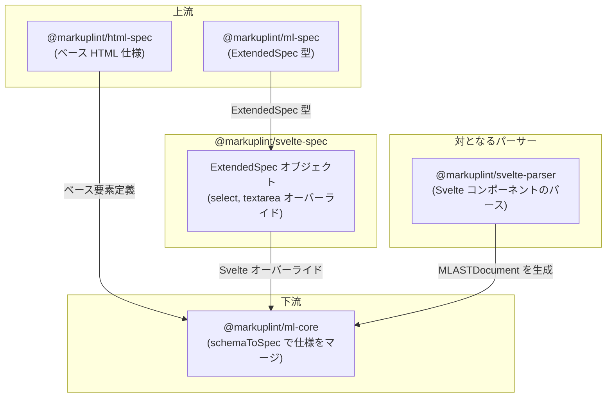

# @markuplint/svelte-spec

## 概要

`@markuplint/svelte-spec` は markuplint 向けの Svelte 固有の拡張仕様を提供します。Svelte のフォーム要素における双方向バインディング動作に対応するため、要素レベルの属性オーバーライドを定義する `ExtendedSpec` オブジェクトをエクスポートします。具体的には、`<select>` と `<textarea>` 要素の `value` 属性の型を `Any` に拡張し、文字列だけでなく任意の型のバインド変数を許容します。

## ExtendedSpec の内容

パッケージは `specs` 配列に要素固有のオーバーライドを含む単一の `ExtendedSpec` オブジェクトをエクスポートします:

### 要素固有のオーバーライド

| 要素         | 属性    | 型オーバーライド | 理由                                                    |
| ------------ | ------- | ---------------- | ------------------------------------------------------- |
| `<select>`   | `value` | `Any`            | Svelte の `bind:value` は文字列だけでなく任意の型を許容 |
| `<textarea>` | `value` | `Any`            | Svelte の `bind:value` は文字列だけでなく任意の型を許容 |

これらのオーバーライドにより、markuplint が Svelte 固有の属性使用を不正としてフラグ付けすることなく、標準 HTML 仕様を拡張します。

## ディレクトリ構成

```
src/
└── index.ts    — Svelte 固有のオーバーライドを含む ExtendedSpec オブジェクトをエクスポート
```

## 主要ソースファイル

| ファイル       | 用途                                                        |
| -------------- | ----------------------------------------------------------- |
| `src/index.ts` | Svelte 用の `ExtendedSpec` オブジェクトを定義・エクスポート |

## 統合ポイント



### 上流

- **`@markuplint/ml-spec`** -- このパッケージが実装する `ExtendedSpec` 型定義を提供

### 下流

- **`@markuplint/ml-core`** -- `schemaToSpec()` を通じてこの仕様を利用し、Svelte のオーバーライドをベース HTML 仕様にマージ

### 対となるパーサー

- **`@markuplint/svelte-parser`** -- Svelte コンポーネント構文を処理するパーサー。パーサーが Svelte テンプレートを markuplint AST に変換する一方、この spec パッケージはリンティングに必要な属性型情報を提供します。

## ドキュメントマップ

- [メンテナンスガイド](docs/maintenance.ja.md) -- コマンド、レシピ、型リファレンス
