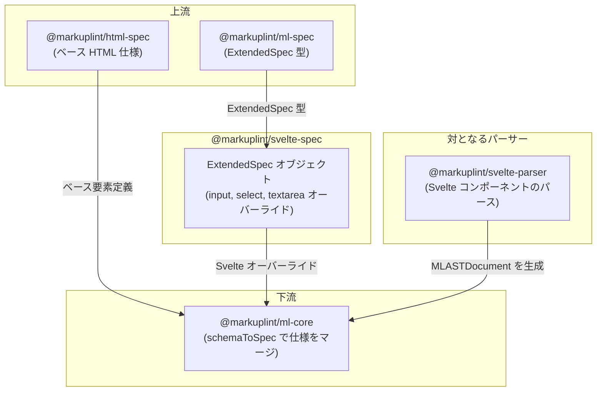

# @markuplint/svelte-spec

## 概要

`@markuplint/svelte-spec` は markuplint 向けの Svelte 固有の拡張仕様を提供します。Svelte のフォーム要素における双方向バインディング動作と IDL プロパティ属性に対応するため、要素レベルの属性オーバーライドを定義する `ExtendedSpec` オブジェクトをエクスポートします。`<select>` と `<textarea>` 要素の `value` 属性の型を `Any` に拡張するほか、`<input>`、`<select>`、`<textarea>` 要素で `defaultValue`、`defaultChecked`、`indeterminate` などの IDL プロパティ属性をサポートします。

## ExtendedSpec の内容

### `useIDLAttributeNames`

この spec は `useIDLAttributeNames: true` を設定しており、`@markuplint/ml-core` の `MLAttr` コンストラクタに IDL 属性名を HTML コンテンツ属性名に解決するよう指示します（例: `defaultValue` → 対応するコンテンツ属性）。この解決はパーサーではなくコアレベルで行われます。

### `directivePatterns`

この spec は Svelte ディレクティブ属性を解決するための `directivePatterns` 配列を宣言します。パターンは順番に評価されます（最初のマッチが優先）:

| パターン                                       | 結果                                                                            |
| ---------------------------------------------- | ------------------------------------------------------------------------------- |
| `^bind:(?:group\|this)$`                       | `bind:group` / `bind:this` → `isDirective`、`isDynamicValue`                    |
| `^bind:(.+)$`                                  | `bind:name` → `potentialName=$1`、`isDynamicValue`                              |
| `^on:.+$`                                      | `on:event`（Svelte 4 レガシー）→ `isDirective`、`isDynamicValue`                |
| `^class:`                                      | `class:name` → `potentialName=class`、`isDuplicatable`、`isDynamicValue`        |
| `^style:`                                      | `style:property` → `potentialName=style`、`isDuplicatable`、`isDynamicValue`    |
| `^(?:animate\|transition\|in\|out\|use\|let):` | アニメーション/トランジション/アクション/スロットディレクティブ → `isDirective` |

### 要素固有のオーバーライド

| 要素         | 属性             | 型オーバーライド | 理由                                                         |
| ------------ | ---------------- | ---------------- | ------------------------------------------------------------ |
| `<input>`    | `defaultChecked` | `Boolean`        | チェックボックス/ラジオの非制御初期状態を表す IDL プロパティ |
| `<input>`    | `defaultValue`   | `Any`            | 入力要素の非制御初期値を表す IDL プロパティ                  |
| `<input>`    | `indeterminate`  | `Boolean`        | チェックボックスの不定状態を表す IDL プロパティ              |
| `<select>`   | `value`          | `Any`            | Svelte の `bind:value` は文字列だけでなく任意の型を許容      |
| `<select>`   | `defaultValue`   | `Any`            | セレクト要素の非制御初期値を表す IDL プロパティ              |
| `<textarea>` | `value`          | `Any`            | Svelte の `bind:value` は文字列だけでなく任意の型を許容      |
| `<textarea>` | `defaultValue`   | `Any`            | テキストエリアの非制御初期値を表す IDL プロパティ            |

これらのオーバーライドにより、markuplint が Svelte 固有の属性使用を不正としてフラグ付けすることなく、標準 HTML 仕様を拡張します。

## ディレクトリ構成

```
src/
└── index.ts    — Svelte 固有のオーバーライドを含む ExtendedSpec オブジェクトをエクスポート
```

## 主要ソースファイル

| ファイル       | 用途                                                        |
| -------------- | ----------------------------------------------------------- |
| `src/index.ts` | Svelte 用の `ExtendedSpec` オブジェクトを定義・エクスポート |

## 統合ポイント



### 上流

- **`@markuplint/ml-spec`** -- このパッケージが実装する `ExtendedSpec` 型定義を提供

### 下流

- **`@markuplint/ml-core`** -- `schemaToSpec()` を通じてこの仕様を利用し、Svelte のオーバーライドをベース HTML 仕様にマージ

### 対となるパーサー

- **`@markuplint/svelte-parser`** -- Svelte コンポーネント構文を処理するパーサー。パーサーが Svelte テンプレートを markuplint AST に変換する一方、この spec パッケージはリンティングに必要な属性型情報を提供します。

## ドキュメントマップ

- [メンテナンスガイド](docs/maintenance.ja.md) -- コマンド、レシピ、型リファレンス
