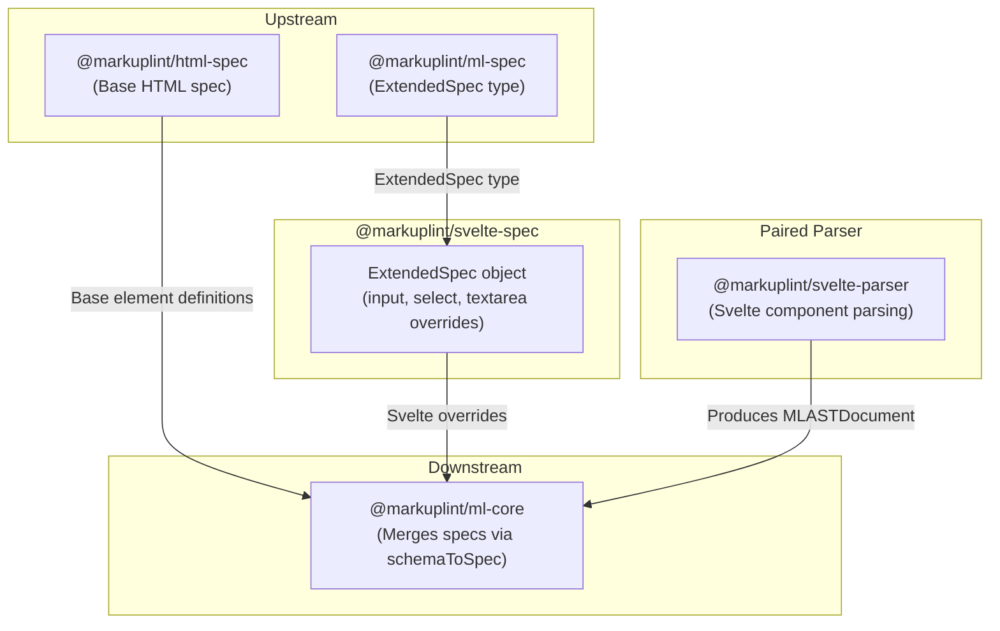

# @markuplint/svelte-spec

## Overview

`@markuplint/svelte-spec` provides Svelte-specific extended specifications for markuplint. It exports an `ExtendedSpec` object that defines element-level attribute overrides to accommodate Svelte's two-way binding behavior and IDL property attributes on form elements. The `<select>` and `<textarea>` elements have their `value` attribute type broadened to `Any`, and the `<input>`, `<select>`, and `<textarea>` elements support IDL property attributes such as `defaultValue`, `defaultChecked`, and `indeterminate`.

## ExtendedSpec Content

### `acceptedAttrNames`

The spec sets `acceptedAttrNames: 'both'`, which instructs `@markuplint/ml-core`'s `MLAttr` constructor to resolve IDL attribute names to their HTML content attribute equivalents (e.g., `defaultValue` -> the corresponding content attribute). In `'both'` mode, both content attribute names and IDL names are accepted without suggesting a rename. This resolution is performed at the core level, not in the parser.

### `contenteditable` Override

Svelte accepts `"inherit"` as a valid `contentEditable` value (IDL state value from the ContentEditable interface). This spec extends the global `contenteditable` attribute type to include `"inherit"` as a valid enum value.

### `directivePatterns`

The spec declares a `directivePatterns` array that the core engine uses to resolve Svelte directive attributes. Patterns are evaluated in order (first match wins):

| Pattern                                        | Result                                                                        |
| ---------------------------------------------- | ----------------------------------------------------------------------------- |
| `^bind:(?:group\|this)$`                       | `bind:group` / `bind:this` -> `isDirective`, `isDynamicValue`                 |
| `^bind:(.+)$`                                  | `bind:name` -> `potentialName=$1`, `isDynamicValue`                           |
| `^on:.+$`                                      | `on:event` (Svelte 4 legacy) -> `isDirective`, `isDynamicValue`               |
| `^class:`                                      | `class:name` -> `potentialName=class`, `isDuplicatable`, `isDynamicValue`     |
| `^style:`                                      | `style:property` -> `potentialName=style`, `isDuplicatable`, `isDynamicValue` |
| `^(?:animate\|transition\|in\|out\|use\|let):` | Animation/transition/action/slot directives -> `isDirective`                  |

### Element-Specific Overrides

| Element      | Attribute        | Type Override | Reason                                                     |
| ------------ | ---------------- | ------------- | ---------------------------------------------------------- |
| `<input>`    | `defaultChecked` | `Boolean`     | IDL property for uncontrolled checkbox/radio initial state |
| `<input>`    | `defaultValue`   | `Any`         | IDL property for uncontrolled input initial value          |
| `<input>`    | `indeterminate`  | `Boolean`     | IDL property for checkbox indeterminate state              |
| `<select>`   | `value`          | `Any`         | Svelte's `bind:value` allows any type, not just strings    |
| `<select>`   | `defaultValue`   | `Any`         | IDL property for uncontrolled select initial value         |
| `<textarea>` | `value`          | `Any`         | Svelte's `bind:value` allows any type, not just strings    |
| `<textarea>` | `defaultValue`   | `Any`         | IDL property for uncontrolled textarea initial value       |

These overrides extend the standard HTML spec so that markuplint does not flag Svelte-specific attribute usage as invalid.

## Directory Structure

```
src/
└── index.ts    — Exports the ExtendedSpec object with Svelte-specific overrides
```

## Key Source Files

| File           | Purpose                                                  |
| -------------- | -------------------------------------------------------- |
| `src/index.ts` | Defines and exports the `ExtendedSpec` object for Svelte |

## Integration Points



### Upstream

- **`@markuplint/ml-spec`** -- Provides the `ExtendedSpec` type definition that this package implements

### Downstream

- **`@markuplint/ml-core`** -- Consumes this spec via `schemaToSpec()`, merging Svelte overrides with the base HTML spec

### Paired Parser

- **`@markuplint/svelte-parser`** -- The parser counterpart that handles Svelte component syntax. While the parser converts Svelte templates into the markuplint AST, this spec package provides the attribute type information needed for linting.

## Documentation Map

- [Maintenance Guide](docs/maintenance.md) -- Commands, recipes, and type reference
