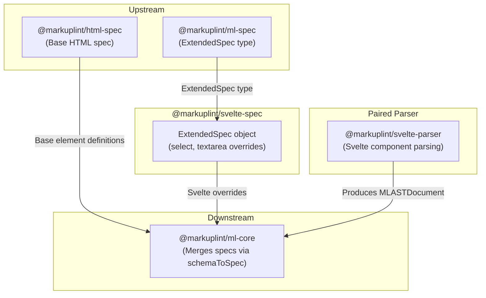

# @markuplint/svelte-spec

## Overview

`@markuplint/svelte-spec` provides Svelte-specific extended specifications for markuplint. It exports an `ExtendedSpec` object that defines element-level attribute overrides to accommodate Svelte's two-way binding behavior on form elements. Specifically, the `<select>` and `<textarea>` elements have their `value` attribute type broadened to `Any`, allowing bound variables of any type rather than only strings.

## ExtendedSpec Content

The package exports a single `ExtendedSpec` object with element-specific overrides in the `specs` array:

### Element-Specific Overrides

| Element      | Attribute | Type Override | Reason                                                  |
| ------------ | --------- | ------------- | ------------------------------------------------------- |
| `<select>`   | `value`   | `Any`         | Svelte's `bind:value` allows any type, not just strings |
| `<textarea>` | `value`   | `Any`         | Svelte's `bind:value` allows any type, not just strings |

These overrides extend the standard HTML spec so that markuplint does not flag Svelte-specific attribute usage as invalid.

## Directory Structure

```
src/
└── index.ts    — Exports the ExtendedSpec object with Svelte-specific overrides
```

## Key Source Files

| File           | Purpose                                                  |
| -------------- | -------------------------------------------------------- |
| `src/index.ts` | Defines and exports the `ExtendedSpec` object for Svelte |

## Integration Points



### Upstream

- **`@markuplint/ml-spec`** -- Provides the `ExtendedSpec` type definition that this package implements

### Downstream

- **`@markuplint/ml-core`** -- Consumes this spec via `schemaToSpec()`, merging Svelte overrides with the base HTML spec

### Paired Parser

- **`@markuplint/svelte-parser`** -- The parser counterpart that handles Svelte component syntax. While the parser converts Svelte templates into the markuplint AST, this spec package provides the attribute type information needed for linting.

## Documentation Map

- [Maintenance Guide](docs/maintenance.md) -- Commands, recipes, and type reference
