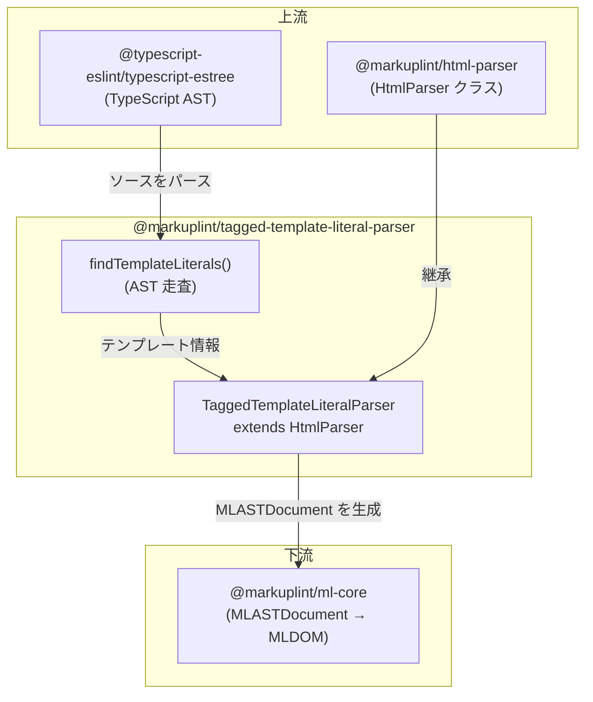

# @markuplint/tagged-template-literal-parser

## 概要

`@markuplint/tagged-template-literal-parser` は、TypeScript/JavaScript ソースファイル内のタグ付きテンプレートリテラル（例: `` html`<div>...</div>` ``）に埋め込まれた HTML をパースします。TypeScript AST 解析と標準 HTML パースパイプラインを組み合わせて、markuplint AST を生成します。

## 動作の仕組み

パーサーは2段階で動作します:

1. **抽出** — `@typescript-eslint/typescript-estree` を使用して TypeScript/JavaScript ソース全体をパースします。AST を走査し、タグ名が設定リスト（デフォルト: `html`）に一致する `TaggedTemplateExpression` ノードを検出します。各マッチに対して、テンプレートリテラルの内容（バッククォート間）と `${...}` 式の位置情報を抽出します。

2. **パース** — 抽出された各 HTML 文字列は、オフセットオプション（`offsetOffset`、`offsetLine`、`offsetColumn`）付きで基底の `HtmlParser` に渡されます。これにより、結果の AST 内のソース位置が元ファイルに正しくマッピングされます。`${...}` 式は `ignoreTags` メカニズム（開始: `${`、終了: `}`）により処理され、HTML パース前にマスクされた後、`#ps:ttl-expression` プリプロセッサ固有ブロックノードとして復元されます。

```
.ts/.js ソースファイル
    |
    v
[findTemplateLiterals] — typescript-estree AST 走査
    |                      TaggedTemplateExpression ノードを検出
    v
[HtmlParser.parse()]   — 位置マッピング用オフセットオプション付き
    |                      ${...} は ignoreTags でマスク
    v
markuplint AST         — 位置情報は元ファイルを参照
```

## タグ名の解決

パーサーは `TaggedTemplateExpression.tag` ノードからタグ名を解決します:

| タグ形式         | 解決される名前 | 例                           |
| ---------------- | -------------- | ---------------------------- |
| Identifier       | `tag.name`     | `` html`...` `` → `html`     |
| MemberExpression | プロパティ名   | `` Lit.html`...` `` → `html` |
| その他の式形式   | `''`（空文字） | マッチしない                 |

## ignoreTags 設定

パーサーは単一の ignore パターンを定義します:

| タイプ           | 開始 | 終了 | 説明                             |
| ---------------- | ---- | ---- | -------------------------------- |
| `ttl-expression` | `${` | `}`  | テンプレートリテラルの式スロット |

これは、テンプレートエンジンパーサー（EJS、Liquid 等）がテンプレート構文に使用するのと同じマスク/復元パイプラインを再利用しています。

## 複数テンプレートリテラル

ソースファイルに複数のタグ付きテンプレートリテラルがある場合、それぞれが独立してパースされ、結果のノードリストがソース順（`contentStart` 順）に連結されます。各テンプレートリテラルのノードは、元ソースファイル内の位置に正しくマッピングされます。

## 制限事項

- **`ignoreBlock` の文字列マッチング**: `${...}` のマスキングは単純な開始/終了デリミタマッチングを使用します。ネストされた `}` 文字を含む式（例: `${{ key: value }}`）は誤って分割される可能性があります。`findTemplateLiterals` 関数は AST から正確な式の位置情報を抽出していますが、この情報はまだ `ignoreBlock` メカニズムの代替として利用されていません。
- **JSX**: TypeScript パーサーは `jsx: false` で設定されています。JSX 構文を含むファイル（`.tsx`）はパースに失敗します。JSX/TSX ファイルには `@markuplint/jsx-parser` を使用してください。

## ディレクトリ構成

```
src/
├── index.ts                        — parser を再エクスポート
├── parser.ts                       — TaggedTemplateLiteralParser クラス
├── find-template-literals.ts       — テンプレート抽出用 TypeScript AST 走査
├── index.spec.ts                   — パーサー統合テスト
└── find-template-literals.spec.ts  — テンプレート抽出ユニットテスト
```

## 主要ソースファイル

| ファイル                        | 用途                                                                         |
| ------------------------------- | ---------------------------------------------------------------------------- |
| `src/parser.ts`                 | `HtmlParser` を拡張する `TaggedTemplateLiteralParser`。シングルトン `parser` |
| `src/find-template-literals.ts` | タグ付きテンプレートリテラルの検出・抽出のための AST 走査                    |
| `src/index.ts`                  | パッケージエントリーポイント。`parser` を再エクスポート                      |

## 統合ポイント



## ドキュメントマップ

- [メンテナンスガイド](docs/maintenance.ja.md) — コマンド、レシピ、テスト
