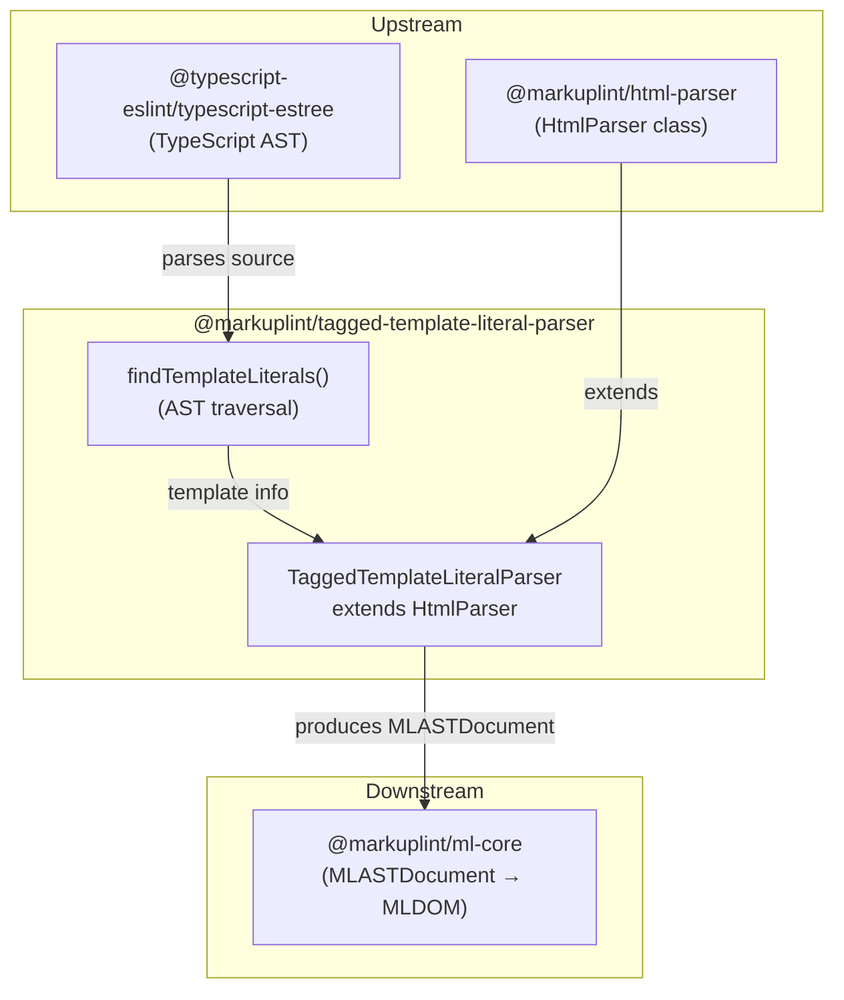

# @markuplint/tagged-template-literal-parser

## Overview

`@markuplint/tagged-template-literal-parser` parses HTML embedded in tagged template literals (e.g., `` html`<div>...</div>` ``) within TypeScript/JavaScript source files. It combines TypeScript AST analysis with the standard HTML parsing pipeline to produce a markuplint AST.

## How It Works

The parser operates in two stages:

1. **Extract** — The full TypeScript/JavaScript source is parsed using `@typescript-eslint/typescript-estree`. The AST is traversed to find `TaggedTemplateExpression` nodes whose tag name matches the configured list (default: `html`). For each match, the template literal's content (between the backticks) and its `${...}` expression positions are extracted.

2. **Parse** — Each extracted HTML string is passed to the base `HtmlParser` with offset options (`offsetOffset`, `offsetLine`, `offsetColumn`) so that source positions in the resulting AST map back to the original file. The `${...}` expressions are handled via the `ignoreTags` mechanism (start: `${`, end: `}`), which masks them before HTML parsing and restores them as `#ps:ttl-expression` preprocessor-specific block nodes.

```
.ts/.js source file
    |
    v
[findTemplateLiterals] — typescript-estree AST traversal
    |                      finds TaggedTemplateExpression nodes
    v
[HtmlParser.parse()]   — with offset options for position mapping
    |                      ${...} masked via ignoreTags
    v
markuplint AST         — positions reference the original file
```

## Tag Name Resolution

The parser resolves tag names from the `TaggedTemplateExpression.tag` node:

| Tag Form               | Resolved Name | Example                      |
| ---------------------- | ------------- | ---------------------------- |
| Identifier             | `tag.name`    | `` html`...` `` → `html`     |
| MemberExpression       | property name | `` Lit.html`...` `` → `html` |
| Other expression forms | `''` (empty)  | Not matched                  |

## ignoreTags Configuration

The parser defines a single ignore pattern:

| Type             | Start | End | Description                      |
| ---------------- | ----- | --- | -------------------------------- |
| `ttl-expression` | `${`  | `}` | Template literal expression slot |

This reuses the same masking/restoration pipeline that template engine parsers (EJS, Liquid, etc.) use for their template syntax.

## Multiple Template Literals

When a source file contains multiple tagged template literals, each is parsed independently and the resulting node lists are concatenated in source order (ordered by `contentStart`). Each template literal's nodes have positions correctly mapped to their location in the original source file.

## Limitations

- **`ignoreBlock` string matching**: The `${...}` masking uses simple start/end delimiter matching. Expressions containing nested `}` characters (e.g., `${{ key: value }}`) may be incorrectly split. The `findTemplateLiterals` function extracts precise expression positions via the AST, but this information is not yet used to replace the `ignoreBlock` mechanism.
- **JSX**: The TypeScript parser is configured with `jsx: false`. Files containing JSX syntax (`.tsx`) will fail to parse. Use `@markuplint/jsx-parser` for JSX/TSX files.

## Directory Structure

```
src/
├── index.ts                        — Re-exports parser and TaggedTemplateLiteralParser class
├── parser.ts                       — TaggedTemplateLiteralParser class
├── find-template-literals.ts       — TypeScript AST traversal for template extraction
├── index.spec.ts                   — Parser integration tests
└── find-template-literals.spec.ts  — Template extraction unit tests
```

## Key Source Files

| File                            | Purpose                                                                    |
| ------------------------------- | -------------------------------------------------------------------------- |
| `src/parser.ts`                 | `TaggedTemplateLiteralParser` extending `HtmlParser`; singleton `parser`   |
| `src/find-template-literals.ts` | AST traversal to locate and extract tagged template literals               |
| `src/index.ts`                  | Package entry point; re-exports `parser` and `TaggedTemplateLiteralParser` |

## Integration Points



## Documentation Map

- [Maintenance Guide](docs/maintenance.md) — Commands, recipes, and testing
