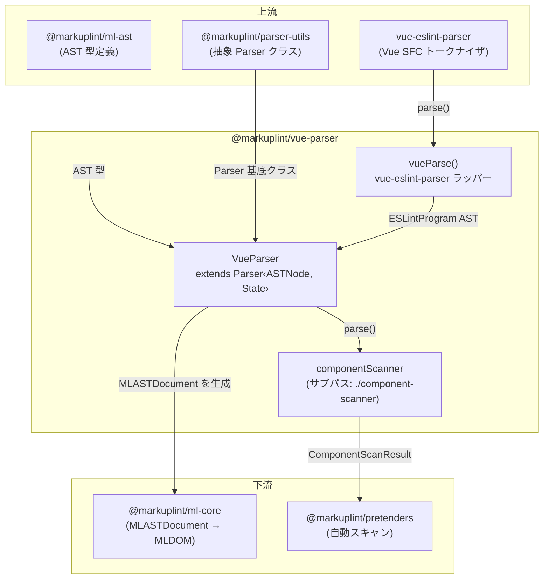
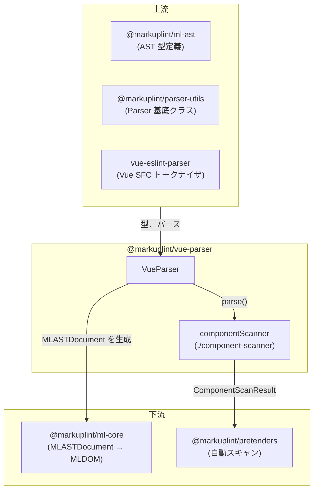

# @markuplint/vue-parser

## 概要

`@markuplint/vue-parser` は markuplint 用の Vue Single File Component（SFC）テンプレートパーサーです。vue-eslint-parser を使用して Vue SFC の `<template>` ブロックを vue-eslint-parser AST にパースし、その後統一された markuplint AST 形式（`MLASTDocument`）に変換します。Vue 固有のディレクティブ（`v-bind`、`v-on`、`v-model`、`v-slot`）、テンプレート式コンテナ（`{{ }}`）、テンプレートコメント、PascalCase コンポーネント検出を処理します。

## ディレクトリ構成

```
src/
├── index.ts                    — parser を再エクスポート
├── parser.ts                   — Parser<ASTNode, State> を拡張する VueParser クラス
├── component-scanner.ts        — pretenders 自動スキャン用コンポーネントスキャナー（サブパスエクスポート）
├── index.spec.ts               — VueParser の統合テスト
├── component-scanner.spec.ts   — コンポーネントスキャナーのテスト
└── vue-parser/
    └── index.ts                — vue-eslint-parser ラッパー、ASTNode/ASTComment 型エクスポート
```

## アーキテクチャ図



## VueParser クラス

### 継承関係

```
Parser<ASTNode, State>  (@markuplint/parser-utils)
    └── VueParser        (このパッケージ)
```

### コンストラクタ

コンストラクタは2つの引数でパーサーを構成します:

| 引数            | 値                      | 用途                                                                               |
| --------------- | ----------------------- | ---------------------------------------------------------------------------------- |
| `ParserOptions` | `{ endTagType: 'xml' }` | Vue テンプレートは明示的な閉じタグを使用（XML スタイル）、HTML void ルールではない |
| 初期 State      | `{ comments: [] }`      | 空のコメント配列。`tokenize()` で設定される                                        |

`tagNameCaseSensitive` の動作は基底クラスから継承され、Vue の `detectElementType` オーバーライドと組み合わせて PascalCase コンポーネント名を正しく処理します。

### State 型

パーサーは `State` 型を通じて内部状態を管理します:

| フィールド | 型                      | 用途                                                                                         |
| ---------- | ----------------------- | -------------------------------------------------------------------------------------------- |
| `comments` | `readonly ASTComment[]` | tokenize 中に vue-eslint-parser から抽出されたテンプレートコメント。後の flattenNodes で注入 |

### オーバーライドメソッド

| メソッド              | 用途                                                                                          |
| --------------------- | --------------------------------------------------------------------------------------------- |
| `tokenize()`          | vue-eslint-parser を呼び出し、`templateBody.children` とコメントを抽出                        |
| `parseError()`        | vue-eslint-parser の `SyntaxError`（`lineNumber`/`column` 付き）を `ParserError` に変換       |
| `nodeize()`           | vue-eslint-parser AST ノード（VText、VElement、VExpressionContainer）を markuplint AST に変換 |
| `flattenNodes()`      | 基底のフラット化を拡張し、兄弟ノード間にテンプレートコメントを注入                            |
| `afterFlattenNodes()` | `exposeWhiteSpace: false`、`exposeInvalidNode: false`、`concatText: false` で基底を呼び出す   |
| `detectElementType()` | PascalCase コンポーネントと Vue 組み込みコンポーネントを検出                                  |

> **注記:** `visitAttr()` オーバーライドは削除されました。Vue ディレクティブ処理（`v-bind`、`v-on`、`v-model`、`v-slot` など）は `@markuplint/vue-spec` の `directivePatterns` で管理されています。

### `duplicatableAttrs`

`'class'` と `'style'` を含む `Set<string>` -- `v-bind:class` と `class` が同一要素に共存できるように、重複可能な属性を定義します。

## tokenize()

`tokenize()` メソッドは vue-eslint-parser AST を取得するエントリーポイントです:

1. `vueParse(this.rawCode)` を呼び出し、内部で `VueESLintParser.parse(vueTemplate, { parser: false })` を実行
2. `ast.templateBody?.comments` が存在する場合、`this.state.comments` に格納して後の注入に備える
3. `{ ast: ast.templateBody?.children ?? [], isFragment: true }` を返す

`parser: false` オプションは vue-eslint-parser に `<script>` のパースをスキップするよう指示します（markuplint にとって関連するのは `<template>` ブロックのみ）。ソースに `<template>` ブロックがないか空の場合、`templateBody?.children` は `undefined` を返し、パーサーは空の配列を受け取ります。

## nodeize() の詳細

`nodeize()` メソッドは `originNode.type` フィールドに基づいてディスパッチします:

### VText -> visitText

テキストノードは `this.sliceFragment(range[0], range[1])` でソースからスライスされ、depth と parentNode と共に基底の `visitText()` メソッドに渡されます。

### VExpressionContainer -> visitPsBlock

`{{ expression }}` のような式コンテナは `visitPsBlock()` で擬似ブロックノードに変換されます:

- `nodeName`: `'vue-expression-container'`
- `isFragment`: `false`

これにより、Vue テンプレート式は JavaScript コンテンツのパースを試みるのではなく、markuplint AST 内で不透明なブロックとして扱われます。

### VElement -> visitElement

要素ノードの場合、メソッドは:

1. `originNode.startTag.range` から**開始タグ**トークンをスライス
2. 要素の `name` と `namespace` と共に `visitElement()` を呼び出す
3. `originNode.children` を子ノードとして渡す -- テンプレートルートを表すノードの場合、これは `templateBody.children`
4. エンドタグトークンファクトリ（`createEndTagToken`）を作成 -- 要素が自己閉じの場合は `null` を返し、そうでなければ `originNode.endTag.range` からスライス

## flattenNodes()

`flattenNodes()` メソッドは基底の `Parser.flattenNodes()` を拡張してテンプレートコメントを注入します:

1. `super.flattenNodes(nodeTree)` を呼び出して初期フラットノードリストを取得
2. ノードリストを走査し、隣接するノードペア間のコメントを確認
3. `prevNode.endOffset`（最初のノードの場合は `parentNode.endOffset`）と `node.startOffset` の間の各ギャップについて、そのギャップ内に範囲が収まるコメントを `this.state.comments` から検索
4. コメントが見つかった場合、`this.visitComment()` で作成し、コメントの type に基づいて `isBogus` を設定（`HTMLBogusComment` の場合は true）
5. `this.appendChild()` でコメントを親ノードに追加

この2パスアプローチが必要な理由は、vue-eslint-parser がコメントをメインノードツリーとは別に提供するため、正しい位置にインターリーブする必要があるからです。

## ディレクティブ処理（@markuplint/vue-spec の directivePatterns）

Vue ディレクティブの解決はパーサー自体ではなく、`@markuplint/vue-spec` で定義された `directivePatterns` によって管理されています。spec がディレクティブを `potentialName`、`isDirective`、`isDynamicValue` メタデータにマッピングするパターンを宣言します。

> **二段階解決:** パーサーレベルのテスト（`index.spec.ts`）はパーサー自体が設定する raw AST 値を示します（例: 波括弧式のみ `isDynamicValue: true`）。コアレベルのテスト（`ml-core` や `rules`）は `ml-core` の `MLAttr` コンストラクタが `directivePatterns` を適用した後の最終解決値を示します。例えば、値なしの `on:click` はパーサーレベルでは `isDynamicValue: false` ですが、コアレベルでは `directivePatterns` マッチにより `isDynamicValue: true` に解決されます。

### クォートセット

基底パーサーは標準 HTML クォート（`"`、`'`）を処理します。Vue テンプレートは式バインディングの暗黙的な値デリミタとして `{}` も使用しますが、属性値自体は標準のクォーティングを使用します。

### Vue ディレクティブ処理

ディレクティブは優先順位に従って処理されます。最初にマッチするパターンが適用されます:

#### `v-on` / `@`（イベントバインディング）

- **パターン**: `/^(v-on:|@)([^.]+)(?:\.([^.]+))?$/i`
- **結果**: `potentialName: 'on' + eventName.toLowerCase()`、`isDynamicValue: true`
- **例**:
  - `@click` -> `potentialName: 'onclick'`
  - `v-on:click.stop` -> `potentialName: 'onclick'`
  - `@keydown.enter` -> `potentialName: 'onkeydown'`

#### `v-bind` / `:`（プロパティバインディング）

- **パターン**: `/^(v-bind:|:)([^.]+)(?:\.([^.]+))?$/i`
- **結果**（修飾子なし）: `potentialName: propName`、`isDynamicValue: true`
- **結果**（`.attr` 修飾子）: `potentialName: propName`、`isDynamicValue: true`
- **結果**（`.prop` / `.camel` / その他修飾子）: `isDirective: true`、`potentialName` が正規化された形式に設定
- **`isDuplicatable`**: バインドされたプロパティが `duplicatableAttrs` に含まれる場合（class、style）、`isDuplicatable` が `true` に設定
- **例**:
  - `:data-attr` -> `potentialName: 'data-attr'`
  - `v-bind:class` -> `potentialName: 'class'`、`isDuplicatable: true`
  - `:title.attr` -> `potentialName: 'title'`
  - `:foo.prop` -> `isDirective: true`

#### `v-model`

- **パターン**: `/^(v-model)(?:\.([^.]+))?$/i`
- **結果**: `isDirective: true`
- **例**:
  - `v-model` -> `isDirective: true`
  - `v-model.lazy` -> `isDirective: true`

#### `v-slot` / `#`（スロット）

- **パターン**: `/^(v-slot:|#)(.+)$/i`
- **結果**: `isDirective: true`、`potentialName: 'v-slot:' + slotName`（raw name と異なる場合）
- **例**:
  - `#header` -> `potentialName: 'v-slot:header'`、`isDirective: true`
  - `v-slot:default` -> `isDirective: true`

#### その他の `v-` ディレクティブ

- **パターン**: `v-` で始まる
- **結果**: `isDirective: true`
- **例**: `v-if`、`v-for`、`v-show`、`v-else`、`v-else-if`、`v-pre`、`v-cloak`、`v-once`、`v-memo`、`v-html`、`v-text`

## 要素タイプ検出

`detectElementType()` メソッドは Vue 固有のコンポーネント検出のためのマッチャー配列を使って `super.detectElementType(nodeName, matchers)` を呼び出します:

| マッチャー          | 型     | マッチ対象                                      |
| ------------------- | ------ | ----------------------------------------------- |
| `'Transition'`      | String | Vue 組み込み `<Transition>` コンポーネント      |
| `'TransitionGroup'` | String | Vue 組み込み `<TransitionGroup>` コンポーネント |
| `'KeepAlive'`       | String | Vue 組み込み `<KeepAlive>` コンポーネント       |
| `'Teleport'`        | String | Vue 組み込み `<Teleport>` コンポーネント        |
| `'Suspense'`        | String | Vue 組み込み `<Suspense>` コンポーネント        |
| `'component'`       | String | Vue 特殊要素 `<component :is="...">`            |
| `'slot'`            | String | Vue 特殊要素 `<slot>`                           |
| `/^[A-Z]/`          | RegExp | PascalCase のタグ名（ユーザーコンポーネント）   |

タグ名がこれらのいずれかにマッチする場合、`detectElementType()` は `'authored'`（コンポーネントを示す）を返します。それ以外は標準の HTML 要素検出が適用されます:

- `div`、`span`、`p` 等 -> `'html'`
- `x-foo`、`my-element` -> `'web-component'`

`<transition>`（小文字）は組み込みリストにマッチ**しない**ため標準 HTML 要素（`'html'`）として扱われますが、`<Transition>`（PascalCase）は `'authored'` として扱われることに注意してください。

## afterFlattenNodes()

`afterFlattenNodes()` メソッドは特定のオプションで基底実装を呼び出します:

| オプション          | 値      | 効果                                                     |
| ------------------- | ------- | -------------------------------------------------------- |
| `exposeWhiteSpace`  | `false` | 空白のみのテキストノードは別の無効ノードとして公開しない |
| `exposeInvalidNode` | `false` | 無効なノードは公開しない                                 |
| `concatText`        | `false` | 隣接するテキストノードは結合しない                       |

これらの設定は、Vue のテンプレートパーサーが空白やノードの妥当性を生の HTML パースとは異なる方法で処理することを反映しています。

## バージョン互換性

vue-eslint-parser 依存は Vue 2 と Vue 3 の両方のテンプレート構文をサポートしています。パーサーは AST レベルで Vue バージョンを区別しません -- どちらも同じ `VElement`、`VText`、`VExpressionContainer` ノードタイプを生成します。Vue 3 固有の機能（`<Teleport>` や `<Suspense>` など）はパーサーレベルの変更ではなく、要素タイプ検出を通じて処理されます。

## 制約事項

### `v-if` / `v-for` の `blockBehavior` 未対応

他のフレームワークパーサー（Svelte、Pug、Alpine、JSX、Astro）は条件分岐/ループ構文に `blockBehavior` を設定し、コアエンジンが `conditionalChildNodes()` を通じて全てのありうる子ノードパターンを列挙できるようにしています。Vue パーサーはこれを**サポートしていません**。そのため、`permitted-contents` などのルールは Vue テンプレートの `v-if`/`v-else` 分岐や `v-for` イテレーション全体のコンテンツモデル検証ができません。

**実装が困難な理由:**

Alpine.js では条件分岐とループに決まったパターン — `<template x-for="...">` / `<template x-if="...">` — を使用しており、`<template>` 要素をそのまま PSBlock に変換できます。Vue のディレクティブは根本的に異なる仕組みで動作します:

1. **ディレクティブは任意の要素に付与可能**: `v-if`、`v-for`、`v-else`、`v-else-if` は任意の要素に配置できます（例: `<div v-if="...">`、`<li v-for="...">`）。要素は属性検証のために有効な HTML 要素として残しつつ、コンテンツモデル解析のためにブロックとしても機能させる必要があります — この二重の役割は現在のパーサーアーキテクチャではサポートされていません。

2. **兄弟要素ベースの分岐**: `v-else` と `v-else-if` はラッパーブロックの子構造ではなく、**兄弟**要素の属性です。条件グループの構築には、現在のノード単位の `nodeize()` モデルを超えた兄弟間解析が必要です。

現在の Vue パーサーはこれらのディレクティブを属性レベルでのみ処理しており（`isDirective: true`）、属性検証エラーは抑制されますが、構造的なブロック情報はコアエンジンに提供されません。

## 主要ソースファイル

| ファイル                   | 用途                                                                                                          |
| -------------------------- | ------------------------------------------------------------------------------------------------------------- |
| `src/parser.ts`            | 全オーバーライドメソッドを持つ VueParser クラス                                                               |
| `src/vue-parser/index.ts`  | vue-eslint-parser ラッパーと型定義（ASTNode、ASTComment）                                                     |
| `src/index.ts`             | モジュールエントリーポイント、parser インスタンスを再エクスポート                                             |
| `src/index.spec.ts`        | パース、ディレクティブ、名前空間をカバーする統合テスト                                                        |
| `src/component-scanner.ts` | `@markuplint/pretenders` 自動スキャン用コンポーネントスキャナー（サブパスエクスポート `./component-scanner`） |

## 外部依存

| 依存パッケージ             | 用途                                                             |
| -------------------------- | ---------------------------------------------------------------- |
| `@markuplint/ml-ast`       | AST 型定義（`MLASTParentNode`、`MLASTNodeTreeItem` 等）          |
| `@markuplint/parser-utils` | 抽象 `Parser` クラス、`ParserError`、`Token`、`ChildToken`       |
| `@markuplint/html-parser`  | ピア依存（直接インポートされないが、パーサーエコシステムの一部） |
| `vue-eslint-parser`        | Vue SFC テンプレートパース（`parse`、AST 型）                    |

## 統合ポイント



### 上流

- **`@markuplint/ml-ast`** -- パーサー全体で使用される AST 型定義
- **`@markuplint/parser-utils`** -- `VueParser` が拡張する抽象 `Parser` クラスと `ParserError` およびユーティリティ型
- **`vue-eslint-parser`** -- テンプレートのトークン化とツリー構築を行う基盤 Vue SFC パーサー

### 下流

- **`@markuplint/ml-core`** -- `VueParser` が生成する `MLASTDocument` を消費し、ルール評価のための MLDOM を構築
- **`@markuplint/pretenders`** -- `./component-scanner` を動的インポートし、ルート要素・属性・スロット情報を抽出して自動スキャンに利用

## ドキュメントマップ

- [メンテナンスガイド](docs/maintenance.ja.md) -- コマンド、レシピ、トラブルシューティング
