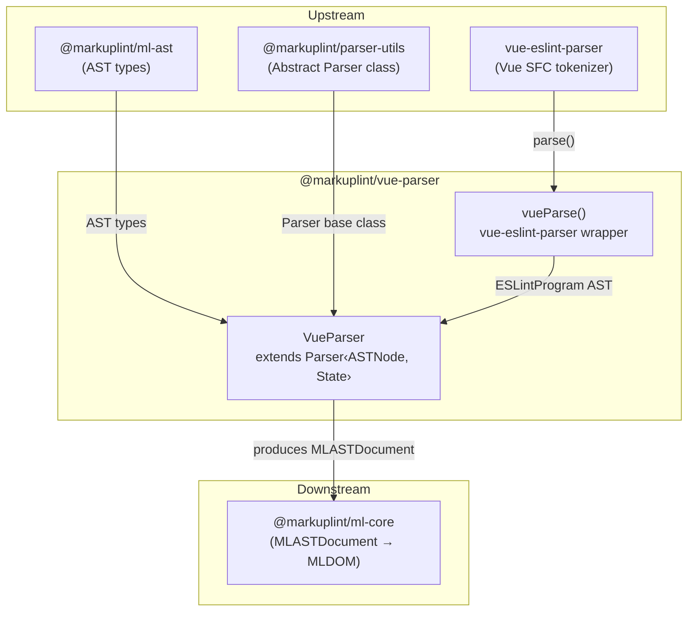
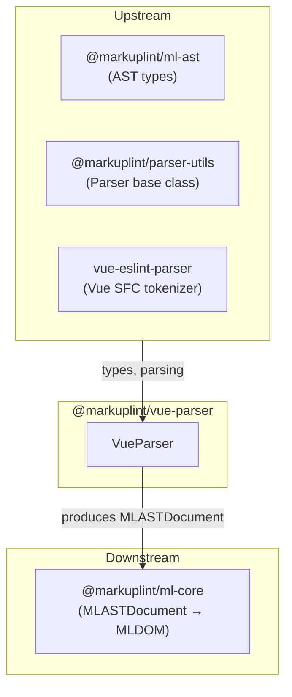

# @markuplint/vue-parser

## Overview

`@markuplint/vue-parser` is a Vue Single File Component (SFC) template parser for markuplint. It uses vue-eslint-parser to parse the `<template>` block of Vue SFCs into a vue-eslint-parser AST, then converts that AST into the unified markuplint AST format (`MLASTDocument`). The package handles Vue-specific directives (`v-bind`, `v-on`, `v-model`, `v-slot`), template expression containers (`{{ }}`), template comments, and PascalCase component detection.

## Directory Structure

```
src/
├── index.ts                — Re-exports parser
├── parser.ts               — VueParser class extending Parser<ASTNode, State>
├── index.spec.ts           — Integration tests for VueParser
└── vue-parser/
    └── index.ts            — vue-eslint-parser wrapper, ASTNode/ASTComment type exports
```

## Architecture Diagram



## VueParser Class

### Inheritance

```
Parser<ASTNode, State>  (from @markuplint/parser-utils)
    └── VueParser        (this package)
```

### Constructor

The constructor configures the parser with two arguments:

| Argument        | Value                   | Purpose                                                                  |
| --------------- | ----------------------- | ------------------------------------------------------------------------ |
| `ParserOptions` | `{ endTagType: 'xml' }` | Vue templates use explicit closing tags (XML-style), not HTML void rules |
| Initial State   | `{ comments: [] }`      | Empty comments array, populated during `tokenize()`                      |

The `tagNameCaseSensitive` behavior is inherited from the base class and combined with Vue's `detectElementType` override to correctly handle PascalCase component names.

### State Type

The parser maintains internal state through the `State` type:

| Field      | Type                    | Purpose                                                                                            |
| ---------- | ----------------------- | -------------------------------------------------------------------------------------------------- |
| `comments` | `readonly ASTComment[]` | Template comments extracted from vue-eslint-parser during tokenize, injected later in flattenNodes |

### Override Methods

| Method                | Purpose                                                                                        |
| --------------------- | ---------------------------------------------------------------------------------------------- |
| `tokenize()`          | Invokes vue-eslint-parser and extracts `templateBody.children` and comments                    |
| `parseError()`        | Converts vue-eslint-parser `SyntaxError` (with `lineNumber`/`column`) into `ParserError`       |
| `nodeize()`           | Converts vue-eslint-parser AST nodes (VText, VElement, VExpressionContainer) to markuplint AST |
| `flattenNodes()`      | Extends base flattening to inject template comments between sibling nodes                      |
| `afterFlattenNodes()` | Calls base with `exposeWhiteSpace: false`, `exposeInvalidNode: false`, `concatText: false`     |
| `detectElementType()` | Detects PascalCase components and Vue built-in components                                      |

> **Note:** The `visitAttr()` override has been removed. Vue directive handling (`v-bind`, `v-on`, `v-model`, `v-slot`, etc.) is now managed via `directivePatterns` in `@markuplint/vue-spec`.

### `duplicatableAttrs`

A `Set<string>` containing `'class'` and `'style'` -- attributes that may appear multiple times on a single element (via `v-bind:class` alongside `class`).

## tokenize()

The `tokenize()` method is the entry point for obtaining the vue-eslint-parser AST:

1. Calls `vueParse(this.rawCode)` which invokes `VueESLintParser.parse(vueTemplate, { parser: false })`
2. If `ast.templateBody?.comments` exists, stores them in `this.state.comments` for later injection
3. Returns `{ ast: ast.templateBody?.children ?? [], isFragment: true }`

The `parser: false` option tells vue-eslint-parser to skip `<script>` parsing (only the `<template>` block is relevant for markuplint). If the source has no `<template>` block or it is empty, `templateBody?.children` returns `undefined` and the parser receives an empty array.

## nodeize() Details

The `nodeize()` method dispatches based on the `originNode.type` field:

### VText -> visitText

Text nodes are sliced from the source using `this.sliceFragment(range[0], range[1])` and passed to the base `visitText()` method with depth and parentNode.

### VExpressionContainer -> visitPsBlock

Expression containers like `{{ expression }}` are converted to pseudo-block nodes via `visitPsBlock()`:

- `nodeName`: `'vue-expression-container'`
- `isFragment`: `false`

This treats Vue template expressions as opaque blocks in the markuplint AST rather than attempting to parse their JavaScript content.

### VElement -> visitElement

For element nodes, the method:

1. Slices the **start tag** token from `originNode.startTag.range`
2. Calls `visitElement()` with the element's `name` and `namespace`
3. Passes `originNode.children` as child nodes -- these are `templateBody.children` when the node represents the template root
4. Creates an end tag token factory (`createEndTagToken`) that returns `null` if the element is self-closing, otherwise slices from `originNode.endTag.range`

## flattenNodes()

The `flattenNodes()` method extends the base `Parser.flattenNodes()` to inject template comments:

1. Calls `super.flattenNodes(nodeTree)` to get the initial flat node list
2. Iterates through the node list, checking for comments between each pair of adjacent nodes
3. For each gap between `prevNode.endOffset` (or `parentNode.endOffset` for the first node) and `node.startOffset`, searches `this.state.comments` for a comment whose range falls within that gap
4. When a comment is found, creates it via `this.visitComment()` with `isBogus` set based on the comment's type (`HTMLBogusComment` vs standard)
5. Appends the comment to the parent node via `this.appendChild()`

This two-pass approach is necessary because vue-eslint-parser provides comments separately from the main node tree, and they must be interleaved at the correct positions.

## Directive Handling (directivePatterns in @markuplint/vue-spec)

Vue directive resolution is managed by `directivePatterns` defined in `@markuplint/vue-spec`, not by the parser itself. The spec declares patterns that the core engine uses to map directives to `potentialName`, `isDirective`, and `isDynamicValue` metadata.

> **Two-stage resolution:** Parser-level tests (`index.spec.ts`) show raw AST values where `isDynamicValue` and `isDirective` reflect only what the parser itself sets (e.g., curly-brace expressions). Core-level tests (`ml-core` and `rules`) show the final resolved values after `directivePatterns` are applied by `ml-core`'s `MLAttr` constructor. For example, `on:click` without a value shows `isDynamicValue: false` at the parser level, but resolves to `isDynamicValue: true` at the core level via the `directivePatterns` match.

### Quote Set

The base parser handles standard HTML quotes (`"`, `'`). Vue templates also use `{}` as implicit value delimiters for expression bindings, though the attribute value itself uses standard quoting.

### Vue Directive Processing

Directives are processed in priority order. The first matching pattern wins:

#### `v-on` / `@` (Event Binding)

- **Pattern**: `/^(v-on:|@)([^.]+)(?:\.([^.]+))?$/i`
- **Result**: `potentialName: 'on' + eventName.toLowerCase()`, `isDynamicValue: true`
- **Examples**:
  - `@click` -> `potentialName: 'onclick'`
  - `v-on:click.stop` -> `potentialName: 'onclick'`
  - `@keydown.enter` -> `potentialName: 'onkeydown'`

#### `v-bind` / `:` (Property Binding)

- **Pattern**: `/^(v-bind:|:)([^.]+)(?:\.([^.]+))?$/i`
- **Result** (no modifier): `potentialName: propName`, `isDynamicValue: true`
- **Result** (`.attr` modifier): `potentialName: propName`, `isDynamicValue: true`
- **Result** (`.prop` / `.camel` / other modifiers): `isDirective: true`, `potentialName` set to normalized form
- **`isDuplicatable`**: If the bound property is in `duplicatableAttrs` (class, style), `isDuplicatable` is set to `true`
- **Examples**:
  - `:data-attr` -> `potentialName: 'data-attr'`
  - `v-bind:class` -> `potentialName: 'class'`, `isDuplicatable: true`
  - `:title.attr` -> `potentialName: 'title'`
  - `:foo.prop` -> `isDirective: true`

#### `v-model`

- **Pattern**: `/^(v-model)(?:\.([^.]+))?$/i`
- **Result**: `isDirective: true`
- **Examples**:
  - `v-model` -> `isDirective: true`
  - `v-model.lazy` -> `isDirective: true`

#### `v-slot` / `#` (Slot)

- **Pattern**: `/^(v-slot:|#)(.+)$/i`
- **Result**: `isDirective: true`, `potentialName: 'v-slot:' + slotName` (if different from raw name)
- **Examples**:
  - `#header` -> `potentialName: 'v-slot:header'`, `isDirective: true`
  - `v-slot:default` -> `isDirective: true`

#### Other `v-` Directives

- **Pattern**: Starts with `v-`
- **Result**: `isDirective: true`
- **Examples**: `v-if`, `v-for`, `v-show`, `v-else`, `v-else-if`, `v-pre`, `v-cloak`, `v-once`, `v-memo`, `v-html`, `v-text`

## Element Type Detection

The `detectElementType()` method calls `super.detectElementType(nodeName, matchers)` with an array of matchers for Vue-specific component detection:

| Matcher             | Type   | Matches                                     |
| ------------------- | ------ | ------------------------------------------- |
| `'Transition'`      | String | Vue built-in `<Transition>` component       |
| `'TransitionGroup'` | String | Vue built-in `<TransitionGroup>` component  |
| `'KeepAlive'`       | String | Vue built-in `<KeepAlive>` component        |
| `'Teleport'`        | String | Vue built-in `<Teleport>` component         |
| `'Suspense'`        | String | Vue built-in `<Suspense>` component         |
| `'component'`       | String | Vue special element `<component :is="...">` |
| `'slot'`            | String | Vue special element `<slot>`                |
| `/^[A-Z]/`          | RegExp | Any PascalCase tag name (user components)   |

When a tag name matches any of these, `detectElementType()` returns `'authored'` (indicating a component). Otherwise, standard HTML element detection applies:

- `div`, `span`, `p` etc. -> `'html'`
- `x-foo`, `my-element` -> `'web-component'`

Note that `<transition>` (lowercase) does **not** match the built-in list and is treated as a standard HTML element (`'html'`), while `<Transition>` (PascalCase) is treated as `'authored'`.

## afterFlattenNodes()

The `afterFlattenNodes()` method calls the base implementation with specific options:

| Option              | Value   | Effect                                                               |
| ------------------- | ------- | -------------------------------------------------------------------- |
| `exposeWhiteSpace`  | `false` | Whitespace-only text nodes are not exposed as separate invalid nodes |
| `exposeInvalidNode` | `false` | Invalid nodes are not exposed                                        |
| `concatText`        | `false` | Adjacent text nodes are not concatenated                             |

These settings reflect that Vue's template parser handles whitespace and node validity differently from raw HTML parsing.

## Version Compatibility

The vue-eslint-parser dependency supports both Vue 2 and Vue 3 template syntax. The parser does not distinguish between Vue versions at the AST level -- both produce the same `VElement`, `VText`, and `VExpressionContainer` node types. Vue 3-specific features like `<Teleport>` and `<Suspense>` are handled through element type detection rather than parser-level changes.

## Limitations

### No `blockBehavior` support for `v-if` / `v-for`

Other framework parsers (Svelte, Pug, Alpine, JSX, Astro) set `blockBehavior` on their conditional/loop constructs so that the core engine can enumerate all possible child node patterns via `conditionalChildNodes()`. The Vue parser does **not** support this. As a result, rules like `permitted-contents` cannot validate content models across `v-if`/`v-else` branches or `v-for` iterations in Vue templates.

**Why this is difficult to implement:**

In Alpine.js, conditionals and loops use a fixed pattern — `<template x-for="...">` / `<template x-if="...">` — where the `<template>` element can be cleanly converted into a PSBlock. Vue's directives work fundamentally differently:

1. **Directives attach to arbitrary elements**: `v-if`, `v-for`, `v-else`, and `v-else-if` can appear on any element (e.g., `<div v-if="...">`, `<li v-for="...">`). The element must remain a valid HTML element for attribute validation while simultaneously acting as a block for content model analysis — a dual role the current parser architecture does not support.

2. **Sibling-based branching**: `v-else` and `v-else-if` are attributes on **sibling** elements, not child constructs of a wrapper block. Building conditional groups requires cross-sibling analysis that goes beyond the current per-node `nodeize()` model.

The current Vue parser handles these directives at the attribute level only (`isDirective: true`), which suppresses attribute validation errors but does not provide structural block information to the core engine.

## Key Source Files

| File                      | Purpose                                                              |
| ------------------------- | -------------------------------------------------------------------- |
| `src/parser.ts`           | VueParser class with all override methods                            |
| `src/vue-parser/index.ts` | vue-eslint-parser wrapper and type definitions (ASTNode, ASTComment) |
| `src/index.ts`            | Module entry point, re-exports parser instance                       |
| `src/index.spec.ts`       | Integration tests covering parsing, directives, namespaces           |

## External Dependencies

| Dependency                 | Purpose                                                              |
| -------------------------- | -------------------------------------------------------------------- |
| `@markuplint/ml-ast`       | AST type definitions (`MLASTParentNode`, `MLASTNodeTreeItem`, etc.)  |
| `@markuplint/parser-utils` | Abstract `Parser` class, `ParserError`, `Token`, `ChildToken`        |
| `@markuplint/html-parser`  | Peer dependency (not directly imported but part of parser ecosystem) |
| `vue-eslint-parser`        | Vue SFC template parsing (`parse`, AST types)                        |

## Integration Points



### Upstream

- **`@markuplint/ml-ast`** -- AST type definitions used throughout the parser
- **`@markuplint/parser-utils`** -- Abstract `Parser` class that `VueParser` extends, plus `ParserError` and utility types
- **`vue-eslint-parser`** -- The underlying Vue SFC parser that performs template tokenization and tree construction

### Downstream

- **`@markuplint/ml-core`** -- Consumes the `MLASTDocument` produced by `VueParser` and constructs the MLDOM for rule evaluation

## Documentation Map

- [Maintenance Guide](docs/maintenance.md) -- Commands, recipes, and troubleshooting
