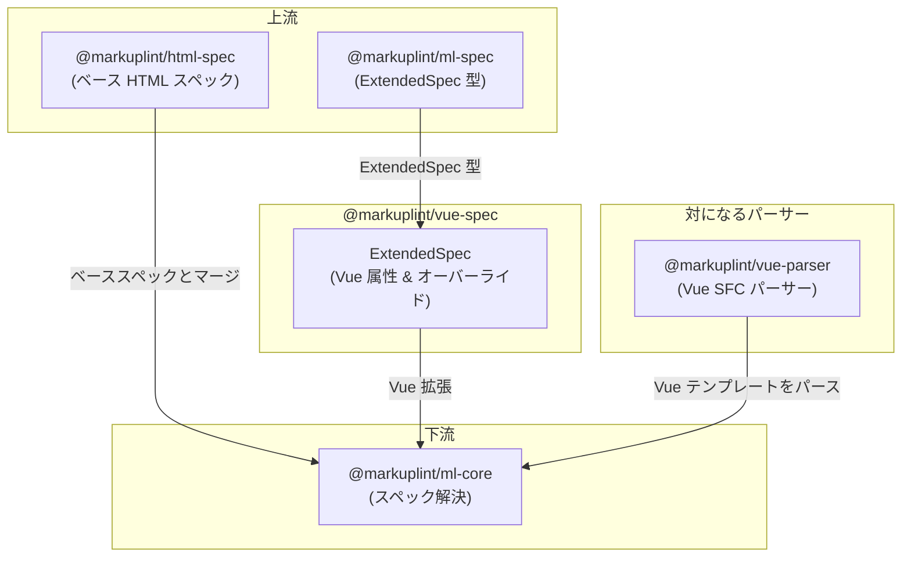

# @markuplint/vue-spec

## 概要

`@markuplint/vue-spec` は、markuplint に Vue 固有の属性定義を提供するスペック拡張パッケージです。Vue の特別なグローバル属性（リストレンダリング用の `key` とテンプレート参照用の `ref`）および要素レベルのオーバーライド（`<slot>` での動的プロパティの許可など）を登録する単一の `ExtendedSpec` オブジェクトをエクスポートします。このパッケージにはパースロジックは含まれず、スペック解決パイプラインで使用されるデータ定義のみです。

## ExtendedSpec の内容

### グローバル属性

以下のグローバル属性が `def['#globalAttrs']['#extends']` 配下に登録されています:

| 属性  | 型           | 条件      | 説明                                                                   |
| ----- | ------------ | --------- | ---------------------------------------------------------------------- |
| `key` | `NoEmptyAny` | `[v-for]` | リストレンダリング用の特別な属性。`v-for` を持つ要素でのみ利用可能     |
| `ref` | `NoEmptyAny` | _(なし)_  | 子コンポーネントインスタンスおよび子要素にアクセスするための特別な属性 |

`condition` フィールドは CSS セレクタ（`[v-for]`）を使用し、`key` を `v-for` ディレクティブも持つ要素に制限します。

### 要素固有のオーバーライド

`specs` 配列には要素ごとのオーバーライドが含まれます:

| 要素   | オーバーライド                  | 用途                                                            |
| ------ | ------------------------------- | --------------------------------------------------------------- |
| `slot` | `possibleToAddProperties: true` | スコープドスロット API 向けに `<slot>` での動的プロパティを許可 |

## ディレクトリ構成

```
src/
└── index.ts       — ExtendedSpec オブジェクトの定義とエクスポート
```

## 主要ソースファイル

| ファイル       | 用途                                                                  |
| -------------- | --------------------------------------------------------------------- |
| `src/index.ts` | グローバル属性と要素オーバーライドを含む Vue の `ExtendedSpec` を定義 |

## 統合ポイント



### 上流

- **`@markuplint/ml-spec`** -- このパッケージが実装する `ExtendedSpec` 型を提供
- **`@markuplint/html-spec`** -- Vue 拡張がマージされるベース HTML 仕様

### 下流

- **`@markuplint/ml-core`** -- スペック解決時に `ExtendedSpec` オブジェクトを利用し、Vue 固有の属性をベース HTML スペックにマージ

### 対になるパーサー

- **`@markuplint/vue-parser`** -- このスペックパッケージと連携する Vue SFC パーサー。パーサーがテンプレート構文を処理し、このパッケージが属性仕様を定義する。

## ドキュメントマップ

- [メンテナンスガイド](docs/maintenance.ja.md) -- コマンド、レシピ、ExtendedSpec リファレンス
