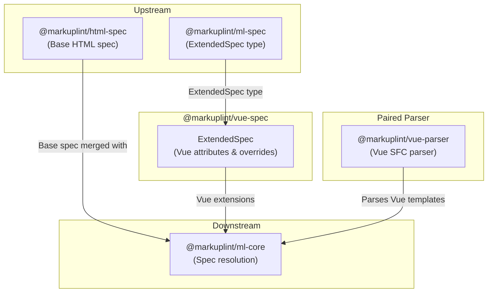

# @markuplint/vue-spec

## Overview

`@markuplint/vue-spec` is a spec extension package that provides Vue-specific attribute definitions for markuplint. It exports a single `ExtendedSpec` object that registers Vue's special global attributes (`key` for list rendering and `ref` for template refs) and element-level overrides (such as allowing dynamic properties on `<slot>`). This package contains no parsing logic -- it is purely a data definition consumed by the spec resolution pipeline.

## ExtendedSpec Content

### `directivePatterns`

The spec declares a `directivePatterns` array that the core engine uses to resolve Vue directive attributes. Patterns are evaluated in order (first match wins):

| Pattern                           | Result                                                                                 |
| --------------------------------- | -------------------------------------------------------------------------------------- |
| `^\\.(.+)$`                       | `.prop` shorthand (Vue 3.2+) -> `isDirective`, `isDynamicValue`                        |
| `^(?:v-bind:\|:)([^.]+)\\..+$`    | `v-bind` with modifier (`.prop`, `.camel`) -> `isDirective`, `isDynamicValue`          |
| `^(?:v-bind:\|:\|v-on:\|@)\\[`    | Dynamic attribute/event name (`:[expr]`, `@[expr]`) -> `isDirective`, `isDynamicValue` |
| `^(?:v-bind:\|:)([^.]+)$`         | `v-bind:attr` / `:attr` -> `potentialName=$1`, `isDynamicValue`                        |
| `^(?:v-on:\|@)([^.]+)(?:\\..+)?$` | `v-on:event` / `@event` -> `potentialName=on$1`, `isDynamicValue`                      |
| `^v-model(?:$\|\\.)`              | `v-model` -> `isDirective`, `isDynamicValue`                                           |
| `^(?:v-slot:\|#)`                 | `v-slot` / `#` shorthand -> `isDirective`, `isDynamicValue`                            |
| `^v-`                             | Other `v-*` directives -> `isDirective`, `isDynamicValue`                              |

The `v-bind:attr` pattern also sets `isDuplicatable: ['class', 'style']`, allowing these attributes to appear alongside their bound equivalents.

### Global Attributes

The following global attributes are registered under `def['#globalAttrs']['#extends']`:

| Attribute | Type         | Condition | Description                                                                    |
| --------- | ------------ | --------- | ------------------------------------------------------------------------------ |
| `key`     | `NoEmptyAny` | `[v-for]` | A special attribute for list rendering; only available on `v-for` elements     |
| `ref`     | `NoEmptyAny` | _(none)_  | A special attribute for accessing child component instances and child elements |

The `condition` field uses a CSS selector (`[v-for]`) to restrict `key` to elements that also have the `v-for` directive.

### Element-Specific Overrides

The `specs` array contains per-element overrides:

| Element | Override                        | Purpose                                                    |
| ------- | ------------------------------- | ---------------------------------------------------------- |
| `slot`  | `possibleToAddProperties: true` | Allows dynamic properties on `<slot>` for scoped slot APIs |

## Directory Structure

```
src/
└── index.ts       — Defines and exports the ExtendedSpec object
```

## Key Source Files

| File           | Purpose                                                                |
| -------------- | ---------------------------------------------------------------------- |
| `src/index.ts` | Defines the Vue `ExtendedSpec` with global attrs and element overrides |

## Integration Points



### Upstream

- **`@markuplint/ml-spec`** -- Provides the `ExtendedSpec` type that this package implements
- **`@markuplint/html-spec`** -- The base HTML specification that Vue extensions are merged into

### Downstream

- **`@markuplint/ml-core`** -- Consumes the `ExtendedSpec` object during spec resolution, merging Vue-specific attributes into the base HTML spec

### Paired Parser

- **`@markuplint/vue-parser`** -- The Vue SFC parser that works alongside this spec package. The parser handles template syntax while this package defines attribute specifications.

## Documentation Map

- [Maintenance Guide](docs/maintenance.md) -- Commands, recipes, and ExtendedSpec reference
