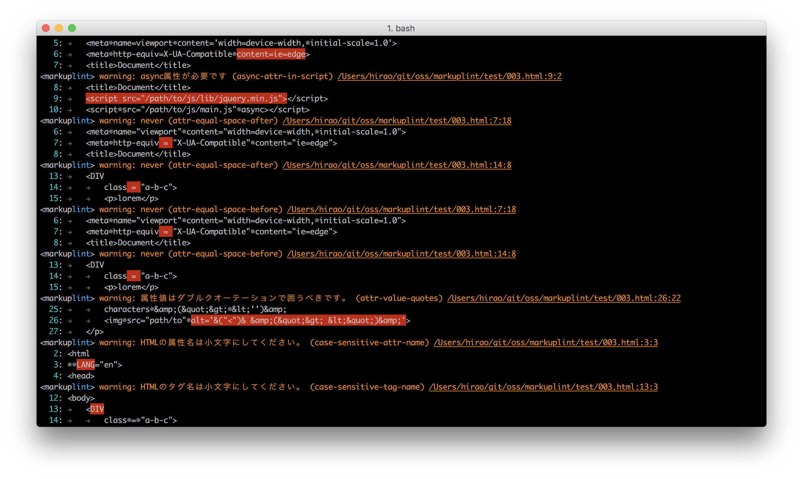

# 

[](https://badge.fury.io/js/markuplint)
[](https://travis-ci.org/markuplint/markuplint) [](https://coveralls.io/github/markuplint/markuplint?branch=master)

A Linter for All Markup Languages (for legacy/modern HTML, Web Components, SVG, MathML, AMP HTML and more).

## Install

```
$ npm install -D markuplint
$ yarn add -D markuplint
```

Supported for _Node.js_ `v12.4.0` or later.

## Usage

### CLI

```
$ npx markuplint verifyee.html
```

```
$ npx markuplint --help

Usage
	$ markuplint <HTML file pathes (glob format)>
	$ <stdout> | markuplint

Options
	--config-file,  -c FILE_PATH  Ruleset file path.
	--fix,                        Fix HTML.
	--format,       -f FORMAT     Output format. Support "JSON", "Simple" and "Standard". Default: "Standard".
	--no-color,                   Output no color.
	--problem-only, -p            Output only problems, without passeds.
	--verbose                     Output with detailed information.

	--help,         -h            Show help.
	--version,      -v            Show version.

Examples
	$ markuplint verifyee.html --ruleset path/to/.markuplintrc
	$ cat verifyee.html | markuplint
```



### API

-   [Functions](https://markuplint.dev/api-docs#Functions)
-   [Interface Document](https://api.markuplint.dev) (genereated by [TypeDoc](https://typedoc.org/))

## Configuration

-   [Configuration](https://markuplint.dev/configuration)

## Rules

-   [Rules](https://markuplint.dev/rules)
-   Customizing your rule **🚧 WIP**

## Thanks

This linter is inspired by:

-   [HTMLHint](http://htmlhint.com/)
-   [ESLint](https://eslint.org/)
-   [stylelint](https://stylelint.io/)
-   [textlint](https://textlint.github.io/)
